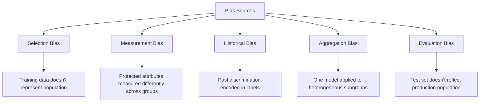

# Bias and Fairness — Fundamentals


## 🎯 Analogy

Think of AI bias like a scale that's been miscalibrated: if training data over-represents certain groups, the model learns to favor them — not from malice but from the data it saw. Fairness metrics measure whether the scale reads correctly for every group.

---
## Types of Bias in ML

Bias in ML is not a single problem — it has multiple sources, each requiring different mitigations.



### Selection Bias

Training data systematically excludes or overrepresents certain groups.

```python
import pandas as pd
import numpy as np

# Example: Hiring model trained only on historical hires
# Historical hires are predominantly one demographic → model learns that pattern
df_hires = pd.read_parquet("historical_hires.parquet")

print("Demographic breakdown of training data:")
print(df_hires["gender"].value_counts(normalize=True))
# gender
# male      0.72
# female    0.28   <- underrepresented!

# The model will learn gender-correlated features and perpetuate the imbalance
```

### Historical Bias

Labels reflect past discriminatory decisions, not true underlying capability.

```python
# Credit scoring example
# Historical approvals were influenced by discriminatory policies
# A model trained on these labels will learn the discrimination

df_credit = pd.read_parquet("historical_credit_decisions.parquet")

# Approval rates differ by race even controlling for income
approval_by_group = df_credit.groupby("race_ethnicity")["approved"].mean()
print("Historical approval rates:")
print(approval_by_group)
# race_ethnicity
# asian         0.68
# black         0.41  <- historical discrimination encoded as "ground truth"
# hispanic      0.45
# white         0.71
```

---

## Protected Attributes

Protected attributes are characteristics that should not be used as the basis for decisions.

| Protected Attribute | Legal Basis |
|---------------------|-------------|
| Race/Ethnicity | Equal Credit Opportunity Act, Fair Housing Act |
| Gender/Sex | Title VII, ECOA |
| Age (40+) | ADEA |
| Disability | ADA |
| National Origin | Title VII |
| Religion | Title VII |
| Pregnancy | PDA |
| Sexual Orientation | Executive Order 13672 |

```python
PROTECTED_ATTRIBUTES = [
    "race", "ethnicity", "race_ethnicity", "color",
    "gender", "sex", "gender_identity",
    "age",
    "disability", "disability_status",
    "national_origin", "country_of_birth",
    "religion", "religious_affiliation",
    "pregnancy_status", "parental_status",
]

def check_protected_attributes_in_features(feature_names: list) -> list:
    """Check if any protected attributes appear directly in model features."""
    lower_features = [f.lower() for f in feature_names]
    found = []
    for protected in PROTECTED_ATTRIBUTES:
        if any(protected in f for f in lower_features):
            found.append(protected)
    return found

features = ["income", "credit_score", "age", "zip_code", "employment_years"]
issues = check_protected_attributes_in_features(features)
print(f"Protected attributes found: {issues}")  # ['age']
```

---

## Fairness Metrics

There is no single "fairness" metric — different metrics capture different notions of fairness, and they often conflict.

### Demographic Parity (Statistical Parity)

The positive prediction rate should be equal across groups.

```python
import numpy as np
from sklearn.metrics import confusion_matrix

def demographic_parity_difference(y_pred, protected_attr):
    """
    Demographic Parity: P(Y_hat=1 | A=0) = P(Y_hat=1 | A=1)
    Positive prediction rates should be equal across groups.
    """
    groups = np.unique(protected_attr)
    approval_rates = {}
    
    for group in groups:
        mask = protected_attr == group
        approval_rates[group] = y_pred[mask].mean()
    
    rates = list(approval_rates.values())
    return {
        "approval_rates": approval_rates,
        "max_difference": max(rates) - min(rates),
        "satisfies_80pct_rule": min(rates) / max(rates) >= 0.8,
        "adverse_impact_ratio": min(rates) / max(rates),
    }

# Example
y_pred = np.array([1, 0, 1, 1, 0, 1, 0, 0, 1, 1])
protected = np.array(["A", "A", "A", "A", "A", "B", "B", "B", "B", "B"])

result = demographic_parity_difference(y_pred, protected)
print(result)
# {'approval_rates': {'A': 0.6, 'B': 0.6}, 'max_difference': 0.0, ...}
```

### Equalized Odds

Both true positive rate AND false positive rate should be equal across groups.

```python
def equalized_odds_difference(y_true, y_pred, protected_attr):
    """
    Equalized Odds: TPR and FPR equal across groups.
    Stricter than demographic parity — requires similar error rates.
    """
    groups = np.unique(protected_attr)
    tpr_by_group = {}
    fpr_by_group = {}
    
    for group in groups:
        mask = protected_attr == group
        y_t = y_true[mask]
        y_p = y_pred[mask]
        
        # True Positive Rate (Recall)
        tpr = y_p[y_t == 1].mean() if (y_t == 1).sum() > 0 else 0
        
        # False Positive Rate
        fpr = y_p[y_t == 0].mean() if (y_t == 0).sum() > 0 else 0
        
        tpr_by_group[group] = tpr
        fpr_by_group[group] = fpr
    
    tpr_rates = list(tpr_by_group.values())
    fpr_rates = list(fpr_by_group.values())
    
    return {
        "tpr_by_group": tpr_by_group,
        "fpr_by_group": fpr_by_group,
        "tpr_difference": max(tpr_rates) - min(tpr_rates),
        "fpr_difference": max(fpr_rates) - min(fpr_rates),
        "satisfies_equalized_odds": (
            max(tpr_rates) - min(tpr_rates) < 0.1 and
            max(fpr_rates) - min(fpr_rates) < 0.1
        ),
    }
```

### Equal Opportunity

Only requires equal TPR (recall) across groups — less strict than equalized odds.

```python
def equal_opportunity_difference(y_true, y_pred, protected_attr):
    """
    Equal Opportunity: TPR equal across groups.
    Ensures similar benefits (true positives) for all groups.
    """
    groups = np.unique(protected_attr)
    tpr_by_group = {}
    
    for group in groups:
        mask = (protected_attr == group) & (y_true == 1)
        if mask.sum() > 0:
            tpr_by_group[group] = y_pred[mask].mean()
    
    rates = list(tpr_by_group.values())
    return {
        "tpr_by_group": tpr_by_group,
        "max_tpr_difference": max(rates) - min(rates),
        "satisfies_equal_opportunity": max(rates) - min(rates) < 0.1,
    }
```

### Predictive Parity (Calibration)

The meaning of a score should be the same across groups.

```python
def predictive_parity(y_true, y_prob, protected_attr, n_bins: int = 5):
    """
    Predictive Parity: P(Y=1 | Y_hat=score, A=0) = P(Y=1 | Y_hat=score, A=1)
    A score of 0.7 should mean 70% chance of positive regardless of group.
    """
    from sklearn.calibration import calibration_curve
    
    groups = np.unique(protected_attr)
    calibration_by_group = {}
    
    for group in groups:
        mask = protected_attr == group
        y_t = y_true[mask]
        y_p = y_prob[mask]
        
        frac_pos, mean_pred = calibration_curve(y_t, y_p, n_bins=n_bins)
        
        # Calibration error: how far are predicted probabilities from actual rates?
        calibration_error = np.mean(np.abs(frac_pos - mean_pred))
        
        calibration_by_group[group] = {
            "calibration_error": round(calibration_error, 4),
        }
    
    return calibration_by_group
```

---

## The Fairness-Accuracy Tradeoff

Different fairness criteria often conflict with each other and with accuracy.

```python
import matplotlib.pyplot as plt
import numpy as np

def plot_fairness_accuracy_tradeoff(thresholds, accuracy_by_threshold, fairness_by_threshold):
    """Visualize the tradeoff between accuracy and fairness."""
    fig, ax1 = plt.subplots(figsize=(10, 6))
    
    ax1.plot(thresholds, accuracy_by_threshold, "b-", label="Accuracy")
    ax1.set_xlabel("Classification Threshold")
    ax1.set_ylabel("Accuracy", color="blue")
    
    ax2 = ax1.twinx()
    ax2.plot(thresholds, fairness_by_threshold, "r-", label="Demographic Parity (lower=better)")
    ax2.set_ylabel("Demographic Parity Difference", color="red")
    
    ax1.set_title("Accuracy vs Fairness Tradeoff by Threshold")
    plt.tight_layout()
    plt.show()

# Key insight: reducing FPR for group A while keeping TPR equal often
# requires REDUCING accuracy for the majority group
```

---


## ▶️ Try It Yourself

```python
import pandas as pd
import numpy as np
from sklearn.metrics import accuracy_score

# Simulated predictions with demographic info
np.random.seed(42)
n = 1000
data = pd.DataFrame({
    "group": np.random.choice(["A", "B"], n, p=[0.7, 0.3]),
    "true_label": np.random.randint(0, 2, n),
})

# Simulate biased model: group B gets worse predictions
data["pred"] = data["true_label"].copy()
biased_idx = data[data["group"] == "B"].sample(frac=0.3).index
data.loc[biased_idx, "pred"] = 1 - data.loc[biased_idx, "pred"]

def fairness_report(df: pd.DataFrame) -> dict:
    report = {}
    for group in df["group"].unique():
        g = df[df["group"] == group]
        acc = accuracy_score(g["true_label"], g["pred"])
        # Demographic parity: P(pred=1 | group=A) == P(pred=1 | group=B)
        pos_rate = g["pred"].mean()
        report[group] = {"accuracy": round(acc, 3), "positive_rate": round(pos_rate, 3)}
    return report

print(fairness_report(data))
# Group B should have similar accuracy to Group A — gaps indicate bias
```

> **Run it:** Copy the snippet into a REPL or file — no external services needed for the basic example.

---
## Interview Tips

> **Tip 1:** "What's the difference between demographic parity and equalized odds?" — "Demographic parity requires equal positive prediction rates across groups — if 70% of Group A is approved, 70% of Group B should be too. Equalized odds additionally requires equal error rates (both TPR and FPR equal). Equalized odds is stricter because equal approval rates could mask very different error patterns — one group might have many false positives while another has many false negatives."

> **Tip 2:** "Can you satisfy demographic parity and equalized odds simultaneously?" — "Rarely, and Impossibility Theorem (Chouldechova 2017) proves they cannot both hold simultaneously when base rates differ between groups — unless the classifier is perfect. This is a fundamental tension: you must choose which notion of fairness is most appropriate for your use case and legal context."

> **Tip 3:** "Why is historical bias particularly dangerous?" — "Because it corrupts the label itself, not just the features. If historical loan approval decisions were discriminatory, a model trained on those approvals as 'ground truth' learns discrimination as the optimal strategy. Even a perfectly calibrated model would perpetuate the discrimination because the labels encode it. The only fix is to either relabel the data or use a fairness constraint during training."

> **Tip 4:** "What is the 80% rule (adverse impact ratio)?" — "The 80% rule (from EEOC guidelines) says: if the selection rate for a protected group is less than 80% of the highest-selected group's rate, there is evidence of adverse impact. Example: if 50% of white applicants are approved and only 35% of Black applicants (35/50 = 70%), this is below 80% and triggers adverse impact scrutiny. It doesn't prove discrimination but requires investigation."
