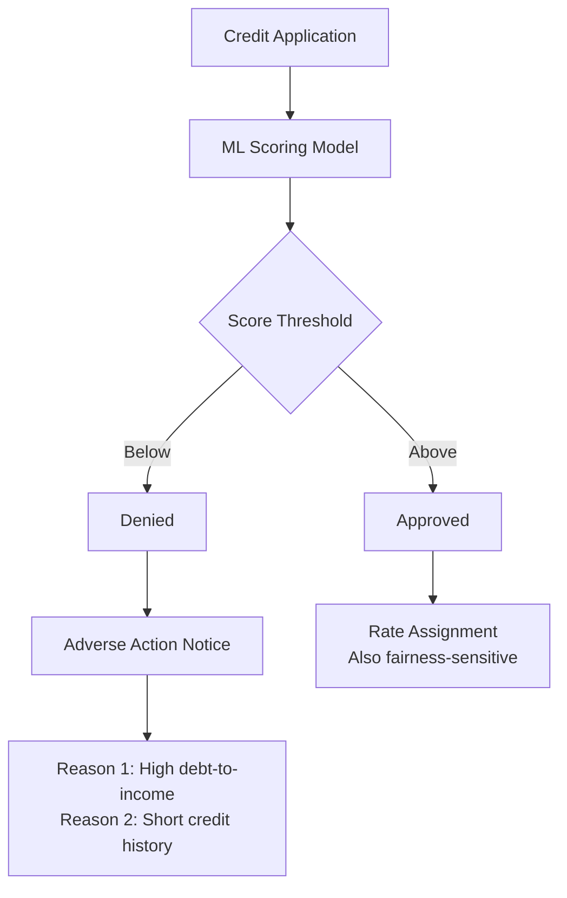

# Bias and Fairness — Real World Patterns

## Credit Scoring Fairness

Credit scoring is one of the most regulated ML applications. Fair lending law (ECOA, Fair Housing Act) prohibits decisions based on protected attributes.



### Proxy Variables in Credit

Even without using protected attributes directly, proxies can encode them.

```python
import pandas as pd
import numpy as np
from sklearn.linear_model import LogisticRegression

# Common credit features that may proxy for protected attributes
PROXY_VARIABLES = {
    "zip_code": "correlates with race (residential segregation)",
    "first_name": "correlates with ethnicity and gender",
    "years_at_current_address": "correlates with age and immigration status",
    "grocery_spending": "may correlate with food culture/ethnicity",
    "language_of_application": "correlates with national origin",
}

def check_proxy_correlation(df: pd.DataFrame, proxy_col: str, protected_col: str) -> float:
    """Measure how much a proxy variable predicts the protected attribute."""
    from sklearn.preprocessing import LabelEncoder
    
    le = LabelEncoder()
    protected_encoded = le.fit_transform(df[protected_col])
    
    # Proxy's ability to predict protected attribute
    proxy_model = LogisticRegression()
    proxy_model.fit(df[[proxy_col]], protected_encoded)
    
    from sklearn.metrics import roc_auc_score
    proxy_auc = roc_auc_score(
        protected_encoded,
        proxy_model.predict_proba(df[[proxy_col]])[:, 1]
    )
    
    return proxy_auc

# A proxy AUC > 0.7 means it strongly predicts the protected attribute
# Consider excluding it from the model
proxy_auc = check_proxy_correlation(train_df, "zip_code", "race_ethnicity")
print(f"zip_code predicts race with AUC: {proxy_auc:.4f}")
```

### Adverse Action Notices (ECOA Requirement)

When denying credit, you must provide specific, legally compliant reasons.

```python
import shap
import numpy as np
from typing import List, Tuple

ADVERSE_ACTION_TEMPLATES = {
    "debt_to_income": "Your debt-to-income ratio of {value:.0%} exceeds our guideline",
    "credit_score": "Your credit score of {value} is below our minimum requirement",
    "delinquency_history": "Your credit history shows {value} delinquency(ies) in the past 2 years",
    "employment_length": "Your employment history of {value:.1f} years is below our minimum",
    "credit_age": "Your average credit account age of {value:.1f} years is below our minimum",
}

def generate_adverse_action_notice(
    model,
    X_instance: pd.Series,
    feature_names: list,
    n_reasons: int = 3,
) -> dict:
    """
    Generate ECOA-compliant adverse action notice with top denial reasons.
    Uses SHAP values to identify the most impactful features.
    """
    
    # Compute SHAP values for this instance
    explainer = shap.TreeExplainer(model)
    shap_values = explainer.shap_values(X_instance.values.reshape(1, -1))
    
    # For binary classification, use class 1 (positive = risky) SHAP values
    if isinstance(shap_values, list):
        instance_shap = shap_values[1][0]
    else:
        instance_shap = shap_values[0]
    
    # Sort features by negative impact (features hurting approval score)
    shap_df = pd.DataFrame({
        "feature": feature_names,
        "shap_value": instance_shap,
        "feature_value": X_instance.values,
    }).sort_values("shap_value", ascending=False)  # Positive SHAP = increases denial risk
    
    # Top denial reasons
    top_reasons = shap_df.head(n_reasons)
    
    reasons = []
    for _, row in top_reasons.iterrows():
        feature = row["feature"]
        value = row["feature_value"]
        
        if feature in ADVERSE_ACTION_TEMPLATES:
            reason = ADVERSE_ACTION_TEMPLATES[feature].format(value=value)
        else:
            reason = f"{feature.replace('_', ' ').title()}: value of {value:.2f} negatively impacted decision"
        
        reasons.append({
            "reason": reason,
            "feature": feature,
            "impact_score": float(row["shap_value"]),
        })
    
    return {
        "decision": "denied",
        "adverse_action_reasons": reasons,
        "regulatory_code": "ECOA",
        "right_to_inquire": "You have the right to request more specific information within 60 days.",
    }
```

---

## Hiring Algorithm Audits

Hiring algorithms face scrutiny under Title VII and NYC Local Law 144 (mandatory bias audits for NYC employers).

```python
class HiringAlgorithmAudit:
    """
    NYC Local Law 144 compliant bias audit for hiring algorithms.
    Required annually for NYC employers using AI in hiring.
    """
    
    def __init__(self, model, X_test, y_test, sensitive_cols: list):
        self.model = model
        self.X = X_test
        self.y = y_test
        self.sensitive_cols = sensitive_cols
    
    def compute_selection_rates(self) -> pd.DataFrame:
        """Compute selection rate for each demographic group."""
        y_pred = self.model.predict(self.X.drop(self.sensitive_cols, axis=1, errors="ignore"))
        
        results = []
        
        for col in self.sensitive_cols:
            for value in self.X[col].unique():
                mask = self.X[col] == value
                n = mask.sum()
                if n < 30:  # Skip tiny groups
                    continue
                
                selection_rate = y_pred[mask].mean()
                
                results.append({
                    "attribute": col,
                    "group": value,
                    "n": n,
                    "n_pct": n / len(y_pred),
                    "selection_rate": selection_rate,
                })
        
        df = pd.DataFrame(results)
        
        # Compute adverse impact ratio vs highest-selected group per attribute
        for attr in df["attribute"].unique():
            attr_mask = df["attribute"] == attr
            max_rate = df.loc[attr_mask, "selection_rate"].max()
            df.loc[attr_mask, "adverse_impact_ratio"] = df.loc[attr_mask, "selection_rate"] / max_rate
            df.loc[attr_mask, "passes_80pct_rule"] = df.loc[attr_mask, "adverse_impact_ratio"] >= 0.8
        
        return df.sort_values(["attribute", "selection_rate"], ascending=[True, False])
    
    def generate_audit_report(self) -> dict:
        """NYC LL 144 compliant audit report."""
        selection_df = self.compute_selection_rates()
        
        failures = selection_df[~selection_df["passes_80pct_rule"]]
        
        return {
            "audit_date": datetime.utcnow().strftime("%Y-%m-%d"),
            "total_applicants_tested": len(self.X),
            "selection_rate_by_group": selection_df.to_dict("records"),
            "adverse_impact_violations": failures[
                ["attribute", "group", "selection_rate", "adverse_impact_ratio"]
            ].to_dict("records"),
            "overall_compliant": len(failures) == 0,
            "nyc_ll144_compliant": len(failures) == 0,
            "required_public_disclosure": True,  # LL 144 requires public posting
        }
```

---

## Healthcare AI Fairness

Healthcare AI has unique fairness concerns — under-treatment of certain groups is literally life-threatening.

```python
class HealthcareModelFairnessAnalysis:
    """
    Fairness analysis for clinical prediction models.
    Key concern: equal sensitivity (TPR) — missing a disease is the highest harm.
    """
    
    FAIRNESS_METRIC = "equal_opportunity"  # Prioritize equal TPR in healthcare
    
    def analyze_diagnostic_model(
        self,
        y_true: np.ndarray,
        y_prob: np.ndarray,
        patient_demographics: pd.DataFrame,
        sensitive_cols: list,
        sensitivity_threshold: float = 0.85,
    ) -> dict:
        """
        For a diagnostic model, analyze if detection rates are equal across groups.
        A model that misses more cancer cases in one group than another is discriminatory.
        """
        
        # Use threshold that achieves target overall sensitivity
        from sklearn.metrics import roc_curve
        fpr, tpr, thresholds = roc_curve(y_true, y_prob)
        
        # Find threshold for target sensitivity
        target_idx = np.argmin(np.abs(tpr - sensitivity_threshold))
        optimal_threshold = thresholds[target_idx]
        
        y_pred = (y_prob >= optimal_threshold).astype(int)
        
        results = {}
        
        for col in sensitive_cols:
            group_results = {}
            
            for group in patient_demographics[col].unique():
                mask = patient_demographics[col] == group
                y_t = y_true[mask]
                y_p = y_pred[mask]
                
                n_positive = (y_t == 1).sum()
                if n_positive < 10:
                    continue
                
                sensitivity = y_p[y_t == 1].mean()  # TPR
                specificity = 1 - y_p[y_t == 0].mean()
                
                group_results[group] = {
                    "n": mask.sum(),
                    "n_positive": int(n_positive),
                    "sensitivity": round(float(sensitivity), 4),
                    "specificity": round(float(specificity), 4),
                    "missed_cases": int((y_t == 1).sum() - (y_p[y_t == 1] == 1).sum()),
                    "below_threshold": sensitivity < sensitivity_threshold,
                }
            
            results[col] = {
                "groups": group_results,
                "min_sensitivity": min(g["sensitivity"] for g in group_results.values()),
                "max_sensitivity": max(g["sensitivity"] for g in group_results.values()),
                "sensitivity_gap": max(g["sensitivity"] for g in group_results.values()) - min(g["sensitivity"] for g in group_results.values()),
                "groups_below_threshold": [g for g, m in group_results.items() if m["below_threshold"]],
            }
        
        return results
```

---

## Interview Tips

> **Tip 1:** "What is NYC Local Law 144 and how does it affect ML practitioners?" — "LL 144 requires NYC employers using automated employment decision tools (AI in hiring) to conduct annual bias audits by an independent third party. The audit must measure selection rate and impact ratio by race/ethnicity and gender. Results must be publicly posted. This is one of the first US laws requiring mandatory AI bias audits — expect similar laws nationwide."

> **Tip 2:** "Why is fairness in healthcare AI particularly critical?" — "In healthcare, false negatives (missed diagnoses) are life-threatening. If a cancer screening model has 90% sensitivity for white patients and 75% for Black patients, that's not just unfair — it's causing preventable deaths. Several real cases: Optum's healthcare risk algorithm underestimated Black patients' complexity (Obermeyer 2019), leading to under-treatment. The model used healthcare costs as a proxy for health needs — a biased proxy because Black patients historically access less care per dollar."

> **Tip 3:** "How do you generate ECOA-compliant adverse action notices?" — "Use SHAP values to identify the top 3-5 features that most negatively influenced the credit decision. Translate each SHAP value to a human-readable reason: instead of 'DTI SHAP=-0.23', say 'Your debt-to-income ratio of 48% exceeds our 40% guideline.' Crucially, these must be model-specific (not generic) and must not reference protected attributes. The reason must be specific enough that the applicant can act on it."

> **Tip 4:** "What happened with Amazon's AI hiring tool, and what was the root cause?" — "Amazon trained a recruiting algorithm on 10 years of resumes. Since tech hiring was historically male-dominated, the training data was mostly male resumes. The model learned to penalize resumes with 'women's' (e.g., from an all-women's college) — selection bias in training data becoming perpetuated discrimination in outputs. Amazon scrapped the tool in 2018. Lesson: if your training labels (past hires) reflect historical discrimination, your model will learn that discrimination."
