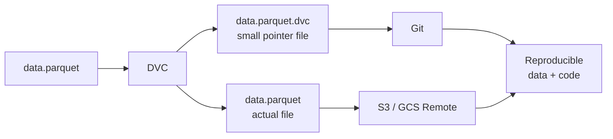
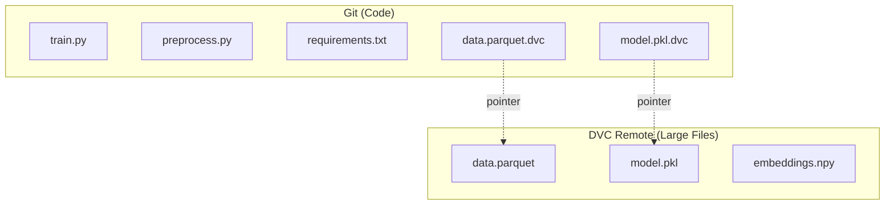

# Data Versioning — Fundamentals

## Why Version Data?

Code versioning (git) is universal. Data versioning is equally important for ML but often overlooked.

| Problem | Without Data Versioning | With Data Versioning |
|---------|------------------------|---------------------|
| Reproduce last month's model | "What data did we use?" — unknown | Checkout data@v1.2 |
| Audit model decision | "Was this user in training?" — unknown | Trace to exact dataset snapshot |
| Debug accuracy drop | "Did the data change?" — unknown | Diff current vs training data |
| Collaborate | Team uses different dataset versions | Everyone pins to same version |

---

## DVC Basics

DVC (Data Version Control) stores data in remote storage (S3, GCS) and tracks it in git via small pointer files.



### Setup

```bash
# In a git repo
pip install dvc dvc-s3

# Initialize DVC
dvc init
git add .dvc .gitignore
git commit -m "Initialize DVC"

# Configure S3 remote
dvc remote add -d s3remote s3://my-bucket/dvc-store
dvc remote modify s3remote region us-east-1
git add .dvc/config
git commit -m "Configure DVC remote"
```

### Tracking Data Files

```bash
# Track a dataset
dvc add data/raw/churn_data.parquet

# This creates:
# - data/raw/churn_data.parquet.dvc  (tracked by git — tiny pointer file)
# - .gitignore entry for data/raw/churn_data.parquet (actual data NOT in git)

cat data/raw/churn_data.parquet.dvc
# outs:
# - md5: a1b2c3d4e5f6...
#   size: 245678901
#   path: churn_data.parquet

# Add the pointer to git
git add data/raw/churn_data.parquet.dvc
git commit -m "Add churn dataset v1"

# Upload actual data to remote
dvc push
```

### Downloading Data

```bash
# On a new machine: pull code from git, then data from DVC
git pull
dvc pull  # Downloads from S3 based on pointer files

# Pull specific file
dvc pull data/raw/churn_data.parquet
```

---

## Data vs Model vs Code Versioning



| What | Tool | Storage |
|------|------|---------|
| Code (scripts, configs) | git | GitHub / GitLab |
| Data (parquet, CSV, images) | DVC | S3 / GCS / Azure Blob |
| Models (pkl, pt, onnx) | DVC or MLflow | S3 or MLflow artifact store |
| Metrics | MLflow / DVC | MLflow DB or metrics.json |

---

## git-lfs vs DVC

Both handle large files in git, but with different philosophies.

| Feature | git-lfs | DVC |
|---------|---------|-----|
| Storage | LFS server (GitHub LFS, Bitbucket LFS) | Any remote: S3, GCS, Azure, SSH |
| Pipeline support | No | Yes — dvc.yaml stages |
| Metrics tracking | No | Yes — metrics.json, dvclive |
| Caching | No | Yes — content-addressed cache |
| Data registry | No | Yes |
| Cost | GitHub LFS: $5/50GB | Remote storage cost only |
| Best for | Binary assets (images, PDFs) | ML datasets, models, pipelines |

```bash
# git-lfs setup (for comparison)
git lfs install
git lfs track "*.parquet" "*.pkl"
git add .gitattributes
git commit -m "Track large files with LFS"
git add data/churn.parquet
git commit -m "Add dataset"
git push  # Uploads to LFS server
```

---

## DVC Data Registry

A DVC data registry is a shared repository of datasets accessible across projects.

```bash
# data-registry repo structure
# data-registry/
#   datasets/
#     churn/
#       v1/churn_2022.parquet.dvc
#       v2/churn_2023.parquet.dvc
#     fraud/
#       v1/transactions.parquet.dvc

# Import dataset into your project
dvc import git@github.com:my-org/data-registry.git \
    datasets/churn/v2/churn_2023.parquet \
    --out data/churn_2023.parquet

# This creates a pointer with origin information
cat data/churn_2023.parquet.dvc
# deps:
# - path: datasets/churn/v2/churn_2023.parquet
#   repo:
#     url: git@github.com:my-org/data-registry.git
#     rev: main
```

---

## Versioning Workflow

```bash
# Typical workflow: update dataset, retrain, compare

# 1. Update dataset
python scripts/collect_data.py --output data/raw/churn_jan2024.parquet
dvc add data/raw/churn_jan2024.parquet
git add data/raw/churn_jan2024.parquet.dvc
git commit -m "Add January 2024 churn data"
dvc push

# 2. Tag the data version
git tag data-v2.0 -m "Add January 2024 data (500K new rows)"
git push --tags

# 3. Checkout older version to reproduce
git checkout data-v1.0
dvc checkout  # Restores data files to match data-v1.0 commit

# 4. Check current data status
dvc status   # Shows which tracked files have changed
```

---

## Interview Tips

> **Tip 1:** "Why can't you just store ML data in git?" — "Git stores file diffs efficiently for text, but ML datasets are binary blobs (parquet, numpy arrays, images) — git can't diff them meaningfully and storing them inflates repo size rapidly. A 10GB dataset committed to git makes every clone download 10GB and grows the repo permanently. DVC stores a hash pointer (200 bytes) in git and the actual file in S3."

> **Tip 2:** "What does DVC store in git vs in the remote?" — "Git stores the .dvc pointer files (~200 bytes each) containing the MD5 hash, file size, and path. The remote (S3/GCS) stores the actual files, named by their content hash. This is content-addressed storage — the same file always has the same name in the remote, enabling deduplication across versions."

> **Tip 3:** "How do you reproduce a model from 3 months ago with DVC?" — "git checkout <tag-from-3-months-ago> to restore all code and .dvc pointer files, then dvc checkout to restore all tracked data files from the remote. If both remote and git are preserved, this gives you an exact replica of the state from 3 months ago."

> **Tip 4:** "When would you prefer MLflow artifact store for models over DVC?" — "MLflow's model registry adds governance features: stage transitions, aliases, approval workflows, and integration with mlflow.pyfunc.load_model. Use MLflow for production models that need lifecycle management. Use DVC for training data, intermediate feature files, and model checkpoints that are part of the pipeline but not production artifacts."
