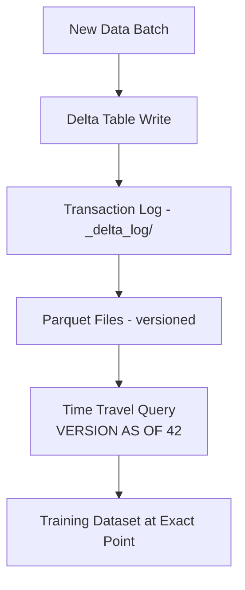

# Data Versioning — Senior Deep Dive

## Delta Lake for ML Data Versioning

Delta Lake provides ACID transactions, time-travel queries, and schema enforcement on top of Parquet files — making it ideal for ML training data.



### Delta Lake Time Travel

```python
from delta import DeltaTable
from pyspark.sql import SparkSession
from pyspark.sql import functions as F

spark = SparkSession.builder \
    .appName("DeltaMLDataVersioning") \
    .config("spark.jars.packages", "io.delta:delta-core_2.12:2.4.0") \
    .config("spark.sql.extensions", "io.delta.sql.DeltaSparkSessionExtension") \
    .config("spark.sql.catalog.spark_catalog", "org.apache.spark.sql.delta.catalog.DeltaCatalog") \
    .getOrCreate()

# Write versioned training data
training_data_path = "s3://ml-data/training/churn/"

def write_training_snapshot(df, version_description: str):
    """Write new data version to Delta table with metadata."""
    (df.write
     .format("delta")
     .mode("append")
     .option("userMetadata", version_description)
     .save(training_data_path))
    
    dt = DeltaTable.forPath(spark, training_data_path)
    history = dt.history(1)
    version = history.select("version").collect()[0][0]
    
    print(f"Wrote version {version}: {version_description}")
    return version

# Write initial dataset
df_v1 = spark.read.parquet("s3://raw-data/churn_2023.parquet")
v1 = write_training_snapshot(df_v1, "Initial 2023 churn dataset")

# Add new data (2024)
df_v2 = spark.read.parquet("s3://raw-data/churn_2024_q1.parquet")
v2 = write_training_snapshot(df_v2, "Added Q1 2024 data (+250K rows)")

# Time travel: read specific version
df_for_training_v1 = spark.read.format("delta") \
    .option("versionAsOf", v1) \
    .load(training_data_path)

df_for_training_latest = spark.read.format("delta") \
    .load(training_data_path)

# Time travel by timestamp (read data AS OF a specific time)
df_as_of = spark.read.format("delta") \
    .option("timestampAsOf", "2024-01-01 00:00:00") \
    .load(training_data_path)

print(f"v1 rows: {df_for_training_v1.count():,}")
print(f"latest rows: {df_for_training_latest.count():,}")
```

### Training Data Lineage with Delta

```python
from delta import DeltaTable
import mlflow

def record_training_data_version(
    model_run_id: str,
    delta_table_path: str,
    spark,
):
    """
    Record exactly which Delta table version was used for training.
    Essential for regulatory compliance and debugging.
    """
    dt = DeltaTable.forPath(spark, delta_table_path)
    
    # Get current table metadata
    latest_version = dt.history(1).select("version", "timestamp", "userMetadata").collect()[0]
    
    version_info = {
        "delta_table_path": delta_table_path,
        "delta_version": latest_version["version"],
        "delta_timestamp": str(latest_version["timestamp"]),
        "delta_description": latest_version["userMetadata"] or "",
        "row_count": str(spark.read.format("delta").load(delta_table_path).count()),
    }
    
    # Log to MLflow run
    with mlflow.start_run(run_id=model_run_id):
        mlflow.log_params({f"data_{k}": v for k, v in version_info.items()})
    
    print(f"Training data recorded: Delta v{latest_version['version']}")
    return version_info


def reproduce_training_data(version_info: dict, spark) -> "DataFrame":
    """
    Given recorded version info, exactly reproduce the training dataset.
    """
    return spark.read.format("delta") \
        .option("versionAsOf", version_info["delta_version"]) \
        .load(version_info["delta_table_path"])
```

---

## Data Contracts for ML

Data contracts define the schema, constraints, and quality expectations between data producers and consumers.

```python
from dataclasses import dataclass, field
from typing import List, Optional, Dict, Any
from enum import Enum
import pandas as pd
import numpy as np

class ColumnType(str, Enum):
    INTEGER = "integer"
    FLOAT = "float"
    STRING = "string"
    BOOLEAN = "boolean"
    TIMESTAMP = "timestamp"
    DATE = "date"

@dataclass
class ColumnContract:
    name: str
    data_type: ColumnType
    nullable: bool = False
    min_value: Optional[float] = None
    max_value: Optional[float] = None
    allowed_values: Optional[List[Any]] = None
    regex_pattern: Optional[str] = None
    max_null_rate: float = 0.0
    unique: bool = False
    description: str = ""

@dataclass
class DataContract:
    """
    Formal contract between data producer and ML model consumer.
    Validated on each pipeline run to catch upstream changes.
    """
    name: str
    version: str
    description: str
    owner_team: str
    
    # Schema
    columns: List[ColumnContract]
    
    # Volume constraints
    min_row_count: int = 1000
    max_row_count: Optional[int] = None
    
    # Freshness
    max_staleness_hours: float = 24.0
    
    # Data quality
    max_duplicate_rate: float = 0.01  # 1% duplicates allowed
    
    # Breaking change policy
    backwards_compatible: bool = True


class DataContractValidator:
    """Validates a DataFrame against a data contract."""
    
    def __init__(self, contract: DataContract):
        self.contract = contract
    
    def validate(self, df: pd.DataFrame, last_updated: pd.Timestamp = None) -> dict:
        violations = []
        warnings = []
        
        # 1. Schema validation
        expected_cols = {c.name for c in self.contract.columns}
        actual_cols = set(df.columns)
        
        missing = expected_cols - actual_cols
        extra = actual_cols - expected_cols
        
        if missing:
            violations.append(f"Missing columns: {missing}")
        if extra and not self.contract.backwards_compatible:
            violations.append(f"Unexpected columns: {extra}")
        elif extra:
            warnings.append(f"New columns (not in contract): {extra}")
        
        # 2. Column-level validation
        for col_contract in self.contract.columns:
            if col_contract.name not in df.columns:
                continue
            
            series = df[col_contract.name]
            
            # Nullable check
            null_rate = series.isna().mean()
            if not col_contract.nullable and null_rate > 0:
                violations.append(f"{col_contract.name}: not nullable but has {null_rate:.1%} nulls")
            elif null_rate > col_contract.max_null_rate:
                violations.append(f"{col_contract.name}: null rate {null_rate:.1%} > max {col_contract.max_null_rate:.1%}")
            
            # Range check
            if col_contract.min_value is not None and series.dropna().min() < col_contract.min_value:
                violations.append(f"{col_contract.name}: min {series.min()} < contract min {col_contract.min_value}")
            if col_contract.max_value is not None and series.dropna().max() > col_contract.max_value:
                violations.append(f"{col_contract.name}: max {series.max()} > contract max {col_contract.max_value}")
            
            # Allowed values
            if col_contract.allowed_values:
                invalid = set(series.dropna()) - set(col_contract.allowed_values)
                if invalid:
                    violations.append(f"{col_contract.name}: invalid values: {list(invalid)[:5]}")
        
        # 3. Volume check
        if len(df) < self.contract.min_row_count:
            violations.append(f"Too few rows: {len(df)} < {self.contract.min_row_count}")
        if self.contract.max_row_count and len(df) > self.contract.max_row_count:
            warnings.append(f"Unusually many rows: {len(df)} > {self.contract.max_row_count}")
        
        # 4. Duplicate check
        dup_rate = df.duplicated().mean()
        if dup_rate > self.contract.max_duplicate_rate:
            violations.append(f"High duplicate rate: {dup_rate:.1%} > {self.contract.max_duplicate_rate:.1%}")
        
        return {
            "contract": self.contract.name,
            "contract_version": self.contract.version,
            "valid": len(violations) == 0,
            "violations": violations,
            "warnings": warnings,
            "rows_checked": len(df),
        }
```

---

## Schema Evolution for ML

Schema changes break ML pipelines. Delta Lake handles this gracefully.

```python
from pyspark.sql.types import StructType, StructField, StringType, FloatType, IntegerType
from delta import DeltaTable

def add_column_to_training_data(
    spark,
    delta_path: str,
    column_name: str,
    column_type,
    default_value=None,
):
    """
    Safely add a new column to training data.
    Uses Delta Lake's schema evolution to avoid breaking existing pipelines.
    """
    dt = DeltaTable.forPath(spark, delta_path)
    
    # Get current schema
    current_schema = spark.read.format("delta").load(delta_path).schema
    
    if column_name in [f.name for f in current_schema.fields]:
        print(f"Column {column_name} already exists")
        return
    
    # Add column with default value for historical rows
    dt.update(
        condition="true",
        set={column_name: f"CAST(NULL AS {column_type.simpleString()})"}
    )
    
    # Or use merge to backfill with computed values
    new_data = spark.sql(f"""
        SELECT *, {default_value} AS {column_name}
        FROM delta.`{delta_path}`
        WHERE {column_name} IS NULL
    """)
    
    (dt.alias("existing")
     .merge(
         new_data.alias("updates"),
         "existing.user_id = updates.user_id"
     )
     .whenMatchedUpdate(set={column_name: f"updates.{column_name}"})
     .execute())
    
    print(f"Added column {column_name} to {delta_path}")


# Backward-compatible model loading with schema drift
def load_features_backward_compatible(
    df,
    expected_features: list,
    default_values: dict = None,
) -> "DataFrame":
    """
    Load a subset of features from DataFrame, filling missing ones with defaults.
    Allows models to handle schema evolution without retraining.
    """
    default_values = default_values or {}
    
    result = df.copy()
    
    for feature in expected_features:
        if feature not in result.columns:
            if feature in default_values:
                result[feature] = default_values[feature]
                print(f"Feature {feature} not found — using default: {default_values[feature]}")
            else:
                result[feature] = 0.0  # Last resort default
                print(f"Feature {feature} not found — defaulting to 0.0")
    
    return result[expected_features]
```

---

## Interview Tips

> **Tip 1:** "How does Delta Lake's time travel work under the hood?" — "Delta Lake maintains a transaction log (_delta_log/) that records every operation as a JSON or Parquet file. Each entry references the Parquet files added or removed. To time-travel to version N, Delta reads only the log entries up to version N and accesses the Parquet files referenced at that point. No data is deleted during the retention period — files are just de-referenced from the active log."

> **Tip 2:** "What's a data contract and how does it relate to ML?" — "A data contract is a formal agreement (code + documentation) between a data producer (e.g., the transactions pipeline) and a data consumer (e.g., the fraud ML model). It specifies: schema (column names and types), constraints (nullability, value ranges), volume expectations, and freshness SLAs. When the producer changes the schema without warning, the ML pipeline breaks. With contracts, changes must be backwards-compatible or go through a breaking-change process."

> **Tip 3:** "How do you handle schema evolution when retraining a model?" — "Two approaches: (1) Strict — fail if schema changes, require explicit version bump and model retraining. (2) Flexible — use backward-compatible feature loading: if a new column appears, ignore it; if an old column disappears, fill with a default. The second approach is more practical but risks silently using incorrect defaults. Delta Lake's mergeSchema option supports non-breaking schema evolution."

> **Tip 4:** "When would you use Delta Lake over DVC for data versioning?" — "Delta Lake: when data is large (100GB+), stored in a data lakehouse (Databricks, AWS EMR), updated continuously (streaming or frequent batch), and needs ACID transactions and time-travel queries. DVC: when data is smaller, stored as files (parquet/CSV), updated infrequently, and you need tight git integration with code versioning. Most ML teams at scale use Delta Lake for training data and DVC for ML-specific assets (model checkpoints, embeddings)."

## ⚡ Cheat Sheet

**Delta Lake Time Travel — Key Syntax**
```python
# By version
spark.read.format("delta").option("versionAsOf", 42).load(path)
# By timestamp
spark.read.format("delta").option("timestampAsOf", "2024-01-01").load(path)
# View history
DeltaTable.forPath(spark, path).history(10).show()
```

**Delta Lake vs DVC — Decision Rule**
| Criterion | Use Delta Lake | Use DVC |
|---|---|---|
| Data size | 100 GB+ | < 100 GB |
| Storage | S3/GCS/ADLS (lakehouse) | Any filesystem |
| Update frequency | Streaming or frequent batch | Infrequent |
| Need ACID | Yes | No |
| Git integration | No | Yes |

**Data Contract Validation — What to Check**
- Schema: missing columns = violation; extra columns = warning (if `backwards_compatible=True`)
- Column-level: nullability, value ranges (`min_value`/`max_value`), allowed values, regex
- Volume: `min_row_count` / `max_row_count` bounds
- Duplicates: `max_duplicate_rate` (default 1%)
- Freshness: `max_staleness_hours` (e.g., 24h)

**Schema Evolution Rules**
- Adding nullable column: **non-breaking** — safe to merge with `mergeSchema=True`
- Removing column: **breaking** — bump contract version, require consumer updates
- Renaming column: **breaking** — treat as delete + add
- Changing type: **breaking** — explicit migration required
- Safe backfill approach: `replaceWhere` to overwrite only the affected partition

**MLflow + Delta Lineage Pattern**
- Log `delta_version`, `delta_timestamp`, `row_count` as MLflow params at training time
- Reproduce training data: `versionAsOf = version_info["delta_version"]`
- Audit trail: Delta transaction log (`_delta_log/`) is immutable; files never deleted within retention period

**Data Contract Lifecycle**
1. Producer publishes contract YAML/code → committed to repo
2. Consumer CI runs `DataContractValidator.validate(df)` on each pipeline run
3. Breaking change → new contract version → coordinated migration
4. `backwards_compatible=True` allows additive changes without version bump
