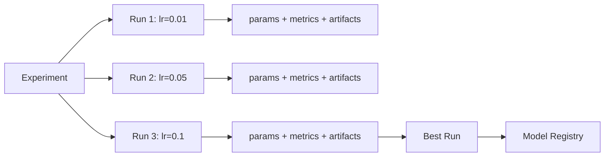
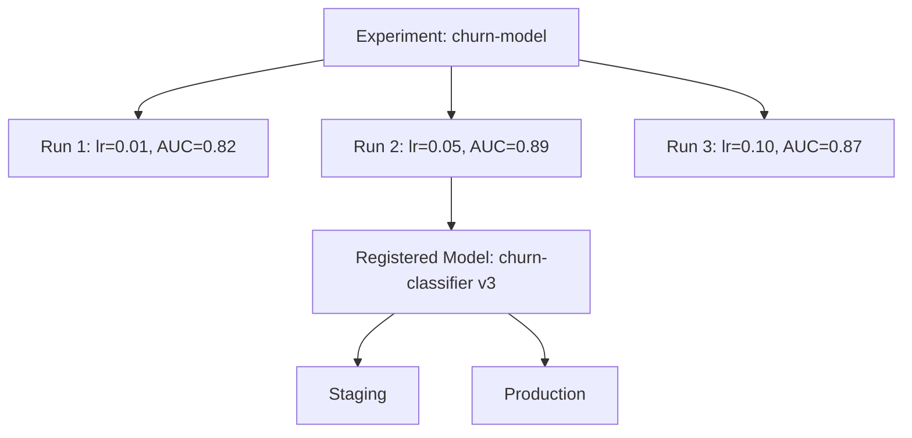

# Experiment Tracking — Fundamentals

## Why Track Experiments?

Without experiment tracking, you face these problems:
- "Which hyperparameters produced our best model?" — no answer
- "Did we already try learning_rate=0.01 last month?" — unknown
- "Can we reproduce the model we deployed 3 weeks ago?" — unlikely

Experiment tracking creates an auditable history of every training run.



---

## Core Concepts

| Concept | Description | Example |
|---------|-------------|---------|
| Experiment | A named group of related runs | "churn-model-q1-2024" |
| Run | A single training execution | Training with lr=0.05 |
| Parameter | Input configuration | n_estimators=200 |
| Metric | Output measurement | test_auc=0.891 |
| Artifact | Files produced by run | model.pkl, confusion_matrix.png |
| Tag | Key-value metadata | team="growth", git_sha="abc123" |

---

## MLflow Basics

### Setup

```bash
# Install
pip install mlflow

# Start local tracking server
mlflow server --backend-store-uri sqlite:///mlflow.db --default-artifact-root ./artifacts

# Set tracking URI
export MLFLOW_TRACKING_URI=http://localhost:5000
```

### Your First Tracked Experiment

```python
import mlflow
import mlflow.sklearn
from sklearn.ensemble import GradientBoostingClassifier
from sklearn.metrics import roc_auc_score
from sklearn.model_selection import train_test_split
import pandas as pd

mlflow.set_tracking_uri("http://localhost:5000")
mlflow.set_experiment("churn-baseline")

# Load data
df = pd.read_parquet("data/churn.parquet")
X = df.drop("churned", axis=1)
y = df["churned"]
X_train, X_test, y_train, y_test = train_test_split(X, y, test_size=0.2, random_state=42)

# Parameters to try
params = {
    "n_estimators": 200,
    "learning_rate": 0.05,
    "max_depth": 4,
    "subsample": 0.8,
}

with mlflow.start_run(run_name="gbt-baseline"):
    # Log parameters
    mlflow.log_params(params)
    
    # Train
    model = GradientBoostingClassifier(**params, random_state=42)
    model.fit(X_train, y_train)
    
    # Log metrics
    y_prob = model.predict_proba(X_test)[:, 1]
    auc = roc_auc_score(y_test, y_prob)
    mlflow.log_metric("test_auc", auc)
    mlflow.log_metric("train_auc", roc_auc_score(y_train, model.predict_proba(X_train)[:, 1]))
    
    # Log model
    mlflow.sklearn.log_model(model, artifact_path="model")
    
    print(f"Test AUC: {auc:.4f}")
    print(f"Run ID: {mlflow.active_run().info.run_id}")
```

---

## What to Track

### Parameters

```python
# ALL configuration that affects the model
mlflow.log_params({
    # Model hyperparameters
    "n_estimators": 200,
    "learning_rate": 0.05,
    "max_depth": 4,
    
    # Data parameters
    "test_size": 0.2,
    "random_seed": 42,
    "class_weight": "balanced",
    
    # Feature engineering choices
    "use_log_transform": True,
    "feature_selection_method": "rfecv",
    "n_features_selected": 25,
    
    # Training choices
    "early_stopping_rounds": 20,
    "n_cv_folds": 5,
})
```

### Metrics

```python
from sklearn.metrics import (
    roc_auc_score, f1_score, precision_score, recall_score,
    average_precision_score, log_loss
)
import numpy as np

y_prob = model.predict_proba(X_test)[:, 1]
y_pred = model.predict(X_test)

# Log multiple metrics
mlflow.log_metrics({
    "test_auc": roc_auc_score(y_test, y_prob),
    "test_ap": average_precision_score(y_test, y_prob),  # Area under PR curve
    "test_f1": f1_score(y_test, y_pred),
    "test_precision": precision_score(y_test, y_pred),
    "test_recall": recall_score(y_test, y_pred),
    "test_logloss": log_loss(y_test, y_prob),
    "train_auc": roc_auc_score(y_train, model.predict_proba(X_train)[:, 1]),
    "overfit_gap": roc_auc_score(y_train, model.predict_proba(X_train)[:, 1]) - roc_auc_score(y_test, y_prob),
})

# Log step-wise metrics (for learning curves)
for epoch, loss in enumerate(model.train_score_):
    mlflow.log_metric("train_deviance", loss, step=epoch)
```

### Artifacts

```python
import matplotlib.pyplot as plt
import tempfile, os

# 1. Log a file
mlflow.log_artifact("configs/churn_model.yaml")  # Log config file

# 2. Log a plot
fig, ax = plt.subplots()
ax.plot(model.train_score_, label="train")
ax.set_title("Training Deviance")
mlflow.log_figure(fig, "training_deviance.png")
plt.close()

# 3. Log a custom file
with tempfile.NamedTemporaryFile(mode="w", suffix=".txt", delete=False) as f:
    f.write(f"Feature names: {X_train.columns.tolist()}\n")
    f.write(f"Training rows: {len(X_train)}\n")
    temp_path = f.name

mlflow.log_artifact(temp_path, artifact_path="metadata")
os.unlink(temp_path)

# 4. Log model with signature
from mlflow.models import infer_signature
signature = infer_signature(X_train, y_prob)
mlflow.sklearn.log_model(
    model,
    artifact_path="model",
    signature=signature,
    input_example=X_train.iloc[:5],
)
```

---

## Experiment vs Run vs Model



```python
# Navigate the hierarchy
import mlflow
from mlflow.tracking import MlflowClient

client = MlflowClient()

# List experiments
experiments = client.search_experiments()
for exp in experiments:
    print(f"Experiment: {exp.name} (ID: {exp.experiment_id})")

# List runs in experiment
runs = client.search_runs(
    experiment_ids=["1"],
    filter_string="metrics.test_auc > 0.85",
    order_by=["metrics.test_auc DESC"],
    max_results=10,
)

for run in runs:
    print(f"Run: {run.info.run_name}")
    print(f"  AUC: {run.data.metrics.get('test_auc', 'N/A'):.4f}")
    print(f"  LR: {run.data.params.get('learning_rate')}")
```

---

## Comparing Runs

```python
import mlflow
import pandas as pd

def compare_runs(experiment_name: str, metric: str = "test_auc") -> pd.DataFrame:
    """Load all runs for an experiment into a DataFrame for comparison."""
    mlflow.set_experiment(experiment_name)
    
    runs = mlflow.search_runs(
        filter_string=f"metrics.{metric} > 0",
        order_by=[f"metrics.{metric} DESC"],
    )
    
    # Select relevant columns
    param_cols = [c for c in runs.columns if c.startswith("params.")]
    metric_cols = [c for c in runs.columns if c.startswith("metrics.")]
    
    display_cols = (
        ["run_id", "start_time", "status"] +
        param_cols[:5] +  # First 5 params
        metric_cols
    )
    
    return runs[display_cols]

# Usage
comparison = compare_runs("churn-model")
print(comparison.head(10).to_string())
```

---

## Tags for Metadata

```python
# Organizational tags
mlflow.set_tags({
    # Ownership
    "team": "growth-ml",
    "author": "alice@company.com",
    
    # Reproducibility
    "git_sha": subprocess.check_output(["git", "rev-parse", "HEAD"]).decode().strip(),
    "git_branch": subprocess.check_output(["git", "rev-parse", "--abbrev-ref", "HEAD"]).decode().strip(),
    
    # Context
    "environment": "dev",
    "dataset": "churn_2024_q1",
    "data_version": "2024-01-15",
    
    # Model characteristics
    "model_family": "gradient_boosting",
    "use_case": "churn_prediction",
    "target_variable": "churned_30d",
    
    # Results
    "experiment_status": "promising",  # Update after reviewing
    "next_steps": "try_xgboost_with_focal_loss",
})
```

---

## Interview Tips

> **Tip 1:** "What's the minimum you should track in every ML experiment?" — "At minimum: all hyperparameters (so you can reproduce), evaluation metrics on the test set (so you can compare), the data version/path used (so you can retrace), and the git commit hash (so you can reproduce the exact code). Without these four, you can't reproduce a past run or explain why one experiment was better than another."

> **Tip 2:** "What's the difference between logging a metric with and without a step?" — "Logging with step creates a time series — you can see how AUC evolves over training epochs. This is essential for deep learning where you want to see convergence curves and detect overfitting early. For sklearn models that train in one shot, step is less meaningful. Use step for epoch-level metrics, leave it out for overall metrics."

> **Tip 3:** "Why log model artifacts in MLflow rather than saving to S3 directly?" — "When you log a model through MLflow, it stores it with a standardized interface (predict, predict_proba), the model signature (input/output schema), and the run lineage. When you load it later via mlflow.pyfunc.load_model, you get a consistent interface regardless of the underlying framework. Loading directly from S3 gives you a raw file with no metadata."

> **Tip 4:** "How do you find the best run across hundreds of experiments?" — "Use mlflow.search_runs() with a filter string and order_by. You can filter on any logged metric or parameter: filter_string='metrics.test_auc > 0.85 and params.n_estimators = \"200\"'. For more complex analysis, load all runs into a Pandas DataFrame and use standard Python analysis."
