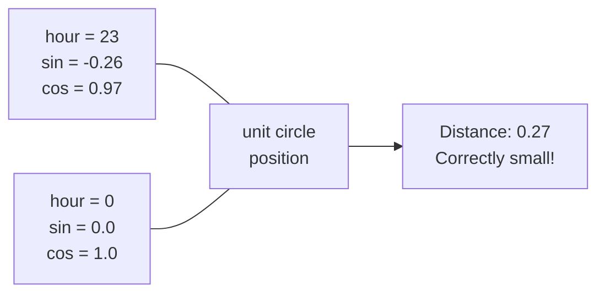

# Feature Engineering — Intermediate

## Feature Interactions

Real-world relationships are rarely additive. Feature interactions capture multiplicative effects that single features miss.

```python
from sklearn.preprocessing import PolynomialFeatures
import pandas as pd
import numpy as np

# Manual interaction features
df["age_x_income"] = df["age"] * df["income"]
df["tenure_x_plan_premium"] = df["tenure_months"] * (df["plan_type"] == "premium").astype(int)
df["monthly_spend_per_day"] = df["monthly_spend"] / df["days_active"].clip(1)

# Automated polynomial interaction features
poly = PolynomialFeatures(degree=2, interaction_only=True, include_bias=False)
X_poly = poly.fit_transform(X_numeric[["age", "income", "tenure_months"]])
feature_names = poly.get_feature_names_out(["age", "income", "tenure_months"])
# Produces: age, income, tenure_months, age*income, age*tenure_months, income*tenure_months

print(f"Original: 3 features → Polynomial: {X_poly.shape[1]} features")
```

### Ratio Features

```python
def build_ratio_features(df: pd.DataFrame) -> pd.DataFrame:
    """Ratio features often more powerful than raw values."""
    
    # Financial ratios
    df["debt_to_income"] = df["total_debt"] / df["annual_income"].clip(1)
    df["spend_to_limit"] = df["monthly_spend"] / df["credit_limit"].clip(1)
    
    # Behavioral ratios
    df["login_to_purchase_ratio"] = df["purchases_count"] / df["login_count"].clip(1)
    df["support_to_tenure_ratio"] = df["support_tickets"] / df["tenure_months"].clip(1)
    
    # Change ratios
    df["spend_growth"] = (df["spend_m1"] - df["spend_m2"]) / df["spend_m2"].clip(1)
    
    return df
```

---

## Time-Series Feature Engineering

Time-series data requires extracting temporal patterns through lag features and rolling statistics.

### Lag Features

```python
import pandas as pd

def create_lag_features(df: pd.DataFrame, col: str, lags: list) -> pd.DataFrame:
    """Create lagged versions of a column."""
    df = df.sort_values("date")
    for lag in lags:
        df[f"{col}_lag_{lag}d"] = df.groupby("user_id")[col].shift(lag)
    return df

# Example: user daily spend
df = create_lag_features(df, "daily_spend", lags=[1, 3, 7, 14, 30])

# df["daily_spend_lag_7d"] = spend 7 days ago
# Great for detecting seasonal patterns
```

### Rolling Statistics

```python
def create_rolling_features(df: pd.DataFrame, col: str, windows: list) -> pd.DataFrame:
    """Rolling window aggregations for trend and volatility signals."""
    df = df.sort_values(["user_id", "date"])
    
    for window in windows:
        # Use closed="left" for non-leaky rolling (excludes current row)
        rolling = df.groupby("user_id")[col].rolling(
            window=window, min_periods=1, closed="left"
        )
        
        df[f"{col}_roll_{window}d_mean"] = rolling.mean().reset_index(level=0, drop=True)
        df[f"{col}_roll_{window}d_std"]  = rolling.std().reset_index(level=0, drop=True)
        df[f"{col}_roll_{window}d_min"]  = rolling.min().reset_index(level=0, drop=True)
        df[f"{col}_roll_{window}d_max"]  = rolling.max().reset_index(level=0, drop=True)
        
        # Trend: current vs rolling mean
        df[f"{col}_vs_roll_{window}d"] = (
            df[col] - df[f"{col}_roll_{window}d_mean"]
        ) / df[f"{col}_roll_{window}d_std"].clip(1e-6)
    
    return df

df = create_rolling_features(df, "daily_spend", windows=[7, 14, 30, 90])
```

### Calendar / Datetime Features

```python
def extract_datetime_features(df: pd.DataFrame, date_col: str) -> pd.DataFrame:
    """Extract temporal patterns from datetime columns."""
    dt = pd.to_datetime(df[date_col])
    
    # Calendar features
    df["hour_of_day"] = dt.dt.hour
    df["day_of_week"] = dt.dt.dayofweek          # 0=Monday
    df["day_of_month"] = dt.dt.day
    df["week_of_year"] = dt.dt.isocalendar().week.astype(int)
    df["month"] = dt.dt.month
    df["quarter"] = dt.dt.quarter
    df["is_weekend"] = (dt.dt.dayofweek >= 5).astype(int)
    df["is_month_end"] = dt.dt.is_month_end.astype(int)
    
    # Cyclical encoding — captures periodicity (Monday is close to Sunday)
    df["hour_sin"] = np.sin(2 * np.pi * df["hour_of_day"] / 24)
    df["hour_cos"] = np.cos(2 * np.pi * df["hour_of_day"] / 24)
    df["day_sin"] = np.sin(2 * np.pi * df["day_of_week"] / 7)
    df["day_cos"] = np.cos(2 * np.pi * df["day_of_week"] / 7)
    df["month_sin"] = np.sin(2 * np.pi * df["month"] / 12)
    df["month_cos"] = np.cos(2 * np.pi * df["month"] / 12)
    
    return df
```

### Why Cyclical Encoding?

Without cyclical encoding, 23:00 (hour=23) and 00:00 (hour=0) appear maximally far apart to a linear model. With sin/cos encoding they are adjacent on the unit circle.



---

## Embeddings for High-Cardinality Features

When OHE is impractical (thousands of categories), learn dense embeddings.

### Entity Embeddings with PyTorch

```python
import torch
import torch.nn as nn
import numpy as np

class EmbeddingModel(nn.Module):
    """
    Neural network with entity embeddings for categorical features.
    Embeddings are learned end-to-end with the prediction task.
    """
    
    def __init__(self, n_categories: dict, embedding_dims: dict, n_numeric: int):
        super().__init__()
        
        # Embedding layers for each categorical feature
        self.embeddings = nn.ModuleDict({
            cat: nn.Embedding(n_cats, embedding_dims[cat])
            for cat, n_cats in n_categories.items()
        })
        
        # Compute total embedding dimension
        total_emb_dim = sum(embedding_dims.values())
        
        # MLP that takes embeddings + numeric features
        self.mlp = nn.Sequential(
            nn.Linear(total_emb_dim + n_numeric, 256),
            nn.ReLU(),
            nn.BatchNorm1d(256),
            nn.Dropout(0.3),
            nn.Linear(256, 64),
            nn.ReLU(),
            nn.Linear(64, 1),
            nn.Sigmoid(),
        )
    
    def forward(self, cat_inputs: dict, numeric_inputs: torch.Tensor):
        # Get embeddings for each categorical feature
        embedded = [self.embeddings[cat](cat_inputs[cat]) for cat in cat_inputs]
        
        # Concatenate all embeddings + numerics
        x = torch.cat(embedded + [numeric_inputs], dim=1)
        
        return self.mlp(x)


# Example: user_id embeddings (10K users → 32-dim embedding)
n_categories = {"user_id": 10_000, "product_id": 50_000, "region": 100}
embedding_dims = {
    "user_id":    32,   # rule of thumb: min(50, (n_cats + 1) // 2)
    "product_id": 64,
    "region":     8,
}

model = EmbeddingModel(
    n_categories=n_categories,
    embedding_dims=embedding_dims,
    n_numeric=15,
)
```

### Pre-trained Word Embeddings for Text Features

```python
from sentence_transformers import SentenceTransformer
import numpy as np
import pandas as pd

# Load pre-trained model
encoder = SentenceTransformer("all-MiniLM-L6-v2")  # 384-dim embeddings

def encode_text_features(df: pd.DataFrame, text_col: str) -> pd.DataFrame:
    """Encode text column into dense embedding features."""
    texts = df[text_col].fillna("").tolist()
    
    # Batch encode (efficient)
    embeddings = encoder.encode(
        texts,
        batch_size=256,
        show_progress_bar=True,
        normalize_embeddings=True,
    )
    
    # Add as feature columns
    emb_df = pd.DataFrame(
        embeddings,
        columns=[f"{text_col}_emb_{i}" for i in range(embeddings.shape[1])],
        index=df.index,
    )
    
    return pd.concat([df, emb_df], axis=1)

# Example: product descriptions → embeddings for recommendations
df = encode_text_features(df, "product_description")
print(f"Added {384} embedding features for product_description")
```

---

## Principal Component Analysis (PCA)

PCA reduces dimensionality while preserving maximum variance. Useful when you have many correlated features.

```python
from sklearn.decomposition import PCA
from sklearn.preprocessing import StandardScaler
import matplotlib.pyplot as plt
import numpy as np

# Step 1: Scale (PCA is scale-sensitive)
scaler = StandardScaler()
X_scaled = scaler.fit_transform(X_train)

# Step 2: Fit PCA
pca = PCA(n_components=0.95)  # Keep 95% of variance
X_pca = pca.fit_transform(X_scaled)

print(f"Original: {X_train.shape[1]} features")
print(f"After PCA: {X_pca.shape[1]} components")
print(f"Variance explained: {pca.explained_variance_ratio_.cumsum()[-1]:.3f}")

# Elbow plot
cumvar = np.cumsum(pca.explained_variance_ratio_)
plt.plot(range(1, len(cumvar)+1), cumvar, marker="o")
plt.axhline(y=0.95, color="r", linestyle="--", label="95% threshold")
plt.xlabel("Number of Components")
plt.ylabel("Cumulative Explained Variance")
plt.title("PCA Variance Explained")
plt.legend()
plt.grid(True)
```

### PCA in Production Pipeline

```python
from sklearn.pipeline import Pipeline
from sklearn.decomposition import PCA

# PCA as part of preprocessing pipeline
pipeline = Pipeline([
    ("scaler", StandardScaler()),
    ("pca", PCA(n_components=50)),         # Reduce to 50 components
    ("model", GradientBoostingClassifier()),
])

# IMPORTANT: PCA is fit only on training data
pipeline.fit(X_train, y_train)

# For inference: same PCA transform applied automatically
predictions = pipeline.predict(X_new)
```

### When to Use PCA

| Situation | Use PCA? |
|-----------|----------|
| Many correlated features (>100) | Yes |
| Multicollinearity causing instability | Yes |
| Image features (pixel values) | Yes |
| Interpretability required | No — components are not interpretable |
| Tree-based models | Usually not needed |
| Text embeddings | Consider SVD/UMAP instead |

---

## Feature Hashing (Hashing Trick)

For extremely high-cardinality data, hash features to a fixed-size vector without a vocabulary.

```python
from sklearn.feature_extraction import FeatureHasher
import pandas as pd

# Useful for: URL paths, user agent strings, very large categoricals
records = [
    {"url_path": "/products/shoes/running", "method": "GET"},
    {"url_path": "/cart/add", "method": "POST"},
    {"url_path": "/products/shoes/trail", "method": "GET"},
]

hasher = FeatureHasher(n_features=2**16, input_type="dict")
X_hashed = hasher.fit_transform(records)
print(f"Shape: {X_hashed.shape}")  # (3, 65536) — sparse matrix

# For text
from sklearn.feature_extraction.text import HashingVectorizer
hv = HashingVectorizer(n_features=2**18, ngram_range=(1, 2))
X_text = hv.transform(["the quick brown fox", "the lazy dog"])
```

---

## Feature Engineering for Imbalanced Data

```python
from imblearn.over_sampling import SMOTE, ADASYN
from imblearn.under_sampling import RandomUnderSampler
from imblearn.pipeline import Pipeline as ImbPipeline

# SMOTE: Synthetic Minority Over-sampling Technique
smote = SMOTE(sampling_strategy=0.3, random_state=42)  # minority:majority = 30:100
X_resampled, y_resampled = smote.fit_resample(X_train, y_train)

print(f"Before: {y_train.value_counts().to_dict()}")
print(f"After SMOTE: {pd.Series(y_resampled).value_counts().to_dict()}")

# In a full pipeline (imblearn integrates with sklearn)
pipeline = ImbPipeline([
    ("scaler", StandardScaler()),
    ("smote", SMOTE(random_state=42)),
    ("model", GradientBoostingClassifier()),
])

# Note: SMOTE is only applied during training, not at inference
```

---

## Interview Tips

> **Tip 1:** "Why use cyclical encoding for hour of day instead of treating it as a number 0-23?" — "Because the model needs to understand that hour 23 and hour 0 are adjacent. If you encode hour as an integer 0-23, the model sees a distance of 23 between them. Cyclical encoding with sin/cos maps hours onto a circle, so midnight and 11PM have a small angular distance. This matters for patterns like 'late night behavior' that spans midnight."

> **Tip 2:** "What's the rule of thumb for embedding dimension?" — "A common heuristic is min(50, (n_categories + 1) // 2). So 100 categories → 50-dim embedding, 10 categories → 5-dim. The intuition: you need enough dimensions to capture variety, but too many leads to overfitting. In practice, tune this as a hyperparameter or use the rule of thumb as a starting point."

> **Tip 3:** "When does PCA hurt model performance?" — "When the most predictive directions in feature space are NOT the highest-variance directions. PCA selects components by variance, not by predictive power. A small variance component might be highly correlated with the target. PCA also destroys interpretability — you can't explain 'principal component 3' to a business stakeholder."

> **Tip 4:** "How do you create features from lag values without leakage in time-series?" — "Use `closed='left'` in rolling windows and shift with strictly positive lag values so you never include the current row. Additionally, in cross-validation use TimeSeriesSplit — KFold would allow future lags to appear in training data, which is leakage."
