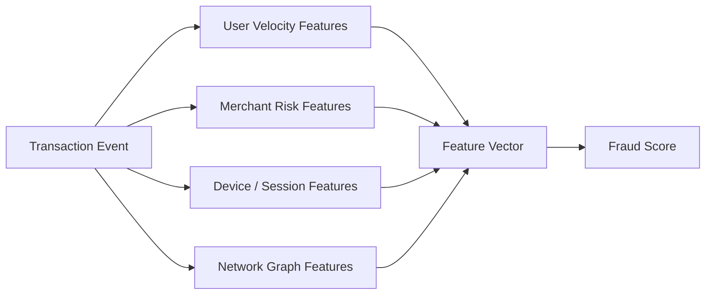

# Feature Engineering — Real World Patterns

## Fraud Detection Feature Engineering

Fraud detection requires features that capture velocity, network patterns, and behavioral anomalies — all computed in real time for every transaction.



### Velocity Features

```python
import redis
import json
from datetime import datetime, timedelta
from typing import Dict, List

class FraudVelocityFeatures:
    """
    Real-time velocity features computed from Redis.
    Target latency: < 2ms total feature fetch.
    """
    
    WINDOWS = [
        ("1h",  3600),
        ("6h",  21600),
        ("24h", 86400),
        ("7d",  604800),
    ]
    
    def __init__(self, redis_client: redis.Redis):
        self.redis = redis_client
    
    def get_user_velocity(self, user_id: str, tx_amount: float, tx_ts: datetime) -> Dict:
        """
        Get velocity features for a user.
        Uses Redis sorted sets with timestamps as scores.
        """
        pipe = self.redis.pipeline(transaction=False)  # Pipelined for latency
        
        ts = tx_ts.timestamp()
        
        for window_name, window_seconds in self.WINDOWS:
            min_ts = ts - window_seconds
            # Count transactions in window
            pipe.zcount(f"tx:{user_id}:ts", min_ts, ts)
            # Sum amounts in window
            pipe.zrangebyscore(f"tx:{user_id}:amounts", min_ts, ts)
        
        results = pipe.execute()
        
        features = {}
        for i, (window_name, _) in enumerate(self.WINDOWS):
            count = results[i * 2]
            amounts = [float(a) for a in results[i * 2 + 1]]
            
            features[f"tx_count_{window_name}"] = int(count)
            features[f"tx_amount_sum_{window_name}"] = sum(amounts)
            features[f"tx_amount_avg_{window_name}"] = (
                sum(amounts) / len(amounts) if amounts else 0.0
            )
            features[f"tx_amount_max_{window_name}"] = max(amounts) if amounts else 0.0
        
        # Amount deviation from user's historical average
        hist_avg = self.redis.get(f"tx:{user_id}:hist_avg_amount")
        if hist_avg:
            features["amount_deviation_from_hist"] = tx_amount / float(hist_avg) - 1.0
        else:
            features["amount_deviation_from_hist"] = 0.0
        
        return features
    
    def get_merchant_risk_features(self, merchant_id: str) -> Dict:
        """Pre-computed merchant risk signals."""
        key = f"merchant:{merchant_id}:risk"
        data = self.redis.hgetall(key)
        
        if not data:
            return {
                "merchant_fraud_rate_30d": 0.0,
                "merchant_chargeback_rate": 0.0,
                "merchant_age_days": 0,
                "merchant_is_high_risk_category": 0,
            }
        
        return {
            "merchant_fraud_rate_30d": float(data.get(b"fraud_rate", 0)),
            "merchant_chargeback_rate": float(data.get(b"chargeback_rate", 0)),
            "merchant_age_days": int(data.get(b"age_days", 0)),
            "merchant_is_high_risk_category": int(data.get(b"high_risk_category", 0)),
        }
```

### Device and Session Features

```python
from user_agents import parse

def extract_device_features(request_context: dict) -> dict:
    """Parse device and session signals for fraud detection."""
    ua_string = request_context.get("user_agent", "")
    ua = parse(ua_string)
    
    return {
        # Device characteristics
        "is_mobile": int(ua.is_mobile),
        "is_bot": int(ua.is_bot),
        "is_new_device": int(request_context.get("device_id") not in request_context.get("known_devices", [])),
        
        # Browser/OS
        "browser_family": ua.browser.family,
        "os_family": ua.os.family,
        
        # Network
        "ip_is_vpn": int(request_context.get("ip_is_vpn", False)),
        "ip_is_proxy": int(request_context.get("ip_is_proxy", False)),
        "ip_country": request_context.get("ip_country", "unknown"),
        "ip_country_matches_card": int(
            request_context.get("ip_country") == request_context.get("card_billing_country")
        ),
        
        # Session
        "session_age_minutes": request_context.get("session_age_minutes", 0),
        "failed_login_attempts": request_context.get("failed_logins_last_hour", 0),
        "is_first_purchase": int(request_context.get("purchase_count", 0) == 0),
    }
```

### Time-of-Day Risk Features

```python
import numpy as np
from datetime import datetime, timezone

def extract_temporal_risk_features(tx_timestamp: datetime) -> dict:
    """Temporal features that capture unusual transaction timing."""
    
    # Convert to local time at merchant location
    ts = tx_timestamp.astimezone(timezone.utc)
    hour = ts.hour
    day_of_week = ts.weekday()  # 0=Monday
    
    # High-risk time windows
    is_late_night = int(0 <= hour < 5)      # Midnight to 5am
    is_weekend = int(day_of_week >= 5)
    
    # Cyclical encoding
    hour_sin = np.sin(2 * np.pi * hour / 24)
    hour_cos = np.cos(2 * np.pi * hour / 24)
    dow_sin = np.sin(2 * np.pi * day_of_week / 7)
    dow_cos = np.cos(2 * np.pi * day_of_week / 7)
    
    return {
        "hour_of_day": hour,
        "day_of_week": day_of_week,
        "is_late_night": is_late_night,
        "is_weekend": is_weekend,
        "hour_sin": float(hour_sin),
        "hour_cos": float(hour_cos),
        "dow_sin": float(dow_sin),
        "dow_cos": float(dow_cos),
    }
```

---

## Recommendation System Embeddings

Recommendation systems live and die by their embedding quality. The goal is to map users and items into a shared vector space where similar entities are close.

### Two-Tower Model for User-Item Embeddings

```python
import torch
import torch.nn as nn
from torch.utils.data import Dataset, DataLoader

class UserTower(nn.Module):
    """Encodes user features into embedding space."""
    
    def __init__(self, user_vocab_size: int, user_feature_dim: int, embedding_dim: int = 64):
        super().__init__()
        
        # User ID embedding
        self.user_embedding = nn.Embedding(user_vocab_size, 32)
        
        # Dense network on top of ID embedding + behavioral features
        self.network = nn.Sequential(
            nn.Linear(32 + user_feature_dim, 256),
            nn.ReLU(),
            nn.BatchNorm1d(256),
            nn.Dropout(0.2),
            nn.Linear(256, 128),
            nn.ReLU(),
            nn.Linear(128, embedding_dim),
        )
        self.normalize = nn.functional.normalize
    
    def forward(self, user_ids: torch.Tensor, user_features: torch.Tensor):
        uid_emb = self.user_embedding(user_ids)
        x = torch.cat([uid_emb, user_features], dim=1)
        embedding = self.network(x)
        return nn.functional.normalize(embedding, dim=1)  # Unit sphere

class ItemTower(nn.Module):
    """Encodes item features into the same embedding space."""
    
    def __init__(self, item_vocab_size: int, item_feature_dim: int, embedding_dim: int = 64):
        super().__init__()
        
        self.item_embedding = nn.Embedding(item_vocab_size, 32)
        
        self.network = nn.Sequential(
            nn.Linear(32 + item_feature_dim, 256),
            nn.ReLU(),
            nn.BatchNorm1d(256),
            nn.Dropout(0.2),
            nn.Linear(256, 128),
            nn.ReLU(),
            nn.Linear(128, embedding_dim),
        )
    
    def forward(self, item_ids: torch.Tensor, item_features: torch.Tensor):
        iid_emb = self.item_embedding(item_ids)
        x = torch.cat([iid_emb, item_features], dim=1)
        embedding = self.network(x)
        return nn.functional.normalize(embedding, dim=1)


class TwoTowerModel(nn.Module):
    """
    Two-tower model for retrieval.
    Trained with in-batch negatives or sampled negatives.
    """
    
    def __init__(self, user_tower: UserTower, item_tower: ItemTower, temperature: float = 0.1):
        super().__init__()
        self.user_tower = user_tower
        self.item_tower = item_tower
        self.temperature = temperature
    
    def forward(self, user_ids, user_features, item_ids, item_features):
        user_emb = self.user_tower(user_ids, user_features)  # (B, D)
        item_emb = self.item_tower(item_ids, item_features)  # (B, D)
        
        # Dot product similarity
        scores = torch.sum(user_emb * item_emb, dim=1) / self.temperature
        return scores
    
    def compute_loss(self, user_emb, item_emb):
        """In-batch softmax loss: positive pairs on diagonal."""
        logits = torch.matmul(user_emb, item_emb.T) / self.temperature
        labels = torch.arange(user_emb.size(0)).to(user_emb.device)
        
        # Cross-entropy: diagonal is positive, off-diagonal are negatives
        loss = nn.CrossEntropyLoss()(logits, labels)
        return loss
```

### Approximate Nearest Neighbor Search

After training embeddings, ANN search retrieves the top-K most similar items for a user at inference time.

```python
import numpy as np
import faiss

class EmbeddingIndex:
    """
    FAISS-based ANN index for fast embedding retrieval.
    Used in the retrieval stage of recommendation pipelines.
    """
    
    def __init__(self, embedding_dim: int = 64, use_gpu: bool = True):
        self.dim = embedding_dim
        
        # IVF-PQ index: billion-scale ANN with compression
        # nlist: number of Voronoi cells (clusters)
        # m: number of sub-quantizers for PQ compression
        nlist = 4096
        m = 8
        
        quantizer = faiss.IndexFlatIP(embedding_dim)  # Inner product (for normalized)
        self.index = faiss.IndexIVFPQ(quantizer, embedding_dim, nlist, m, 8)
        
        if use_gpu and faiss.get_num_gpus() > 0:
            self.index = faiss.index_cpu_to_all_gpus(self.index)
    
    def train_and_add(self, embeddings: np.ndarray):
        """Build the index from item embeddings."""
        embeddings = embeddings.astype(np.float32)
        
        print(f"Training FAISS index on {len(embeddings):,} embeddings...")
        self.index.train(embeddings)
        
        print("Adding embeddings to index...")
        self.index.add(embeddings)
        print(f"Index built: {self.index.ntotal:,} items")
    
    def search(self, query_embedding: np.ndarray, k: int = 100) -> tuple:
        """
        Find top-K nearest items.
        Returns: (distances, item_indices)
        """
        query = query_embedding.reshape(1, -1).astype(np.float32)
        
        # Set nprobe: higher = more accurate but slower
        self.index.nprobe = 64  # Check 64 of 4096 clusters
        
        distances, indices = self.index.search(query, k)
        return distances[0], indices[0]
    
    def save(self, path: str):
        faiss.write_index(self.index, path)
    
    @classmethod
    def load(cls, path: str, embedding_dim: int = 64) -> "EmbeddingIndex":
        instance = cls(embedding_dim=embedding_dim, use_gpu=False)
        instance.index = faiss.read_index(path)
        return instance
```

---

## Real-Time Feature Computation at Scale

### Flink-Based Feature Pipeline

```python
# PyFlink: compute features from Kafka stream
from pyflink.datastream import StreamExecutionEnvironment
from pyflink.table import StreamTableEnvironment, EnvironmentSettings

env = StreamExecutionEnvironment.get_execution_environment()
settings = EnvironmentSettings.new_instance().in_streaming_mode().build()
t_env = StreamTableEnvironment.create(env, environment_settings=settings)

# Define Kafka source
t_env.execute_sql("""
    CREATE TABLE transactions (
        user_id BIGINT,
        merchant_id BIGINT,
        amount DOUBLE,
        transaction_ts TIMESTAMP(3),
        WATERMARK FOR transaction_ts AS transaction_ts - INTERVAL '5' SECOND
    ) WITH (
        'connector' = 'kafka',
        'topic' = 'transactions',
        'properties.bootstrap.servers' = 'kafka:9092',
        'format' = 'json'
    )
""")

# Compute velocity features using tumbling windows
t_env.execute_sql("""
    CREATE TABLE user_velocity_features (
        user_id BIGINT,
        window_end TIMESTAMP(3),
        tx_count_1h BIGINT,
        tx_amount_sum_1h DOUBLE,
        tx_amount_avg_1h DOUBLE,
        PRIMARY KEY (user_id) NOT ENFORCED
    ) WITH (
        'connector' = 'upsert-kafka',
        'topic' = 'user-velocity-features',
        'properties.bootstrap.servers' = 'kafka:9092',
        'key.format' = 'json',
        'value.format' = 'json'
    )
""")

t_env.execute_sql("""
    INSERT INTO user_velocity_features
    SELECT
        user_id,
        TUMBLE_END(transaction_ts, INTERVAL '1' HOUR) AS window_end,
        COUNT(*) AS tx_count_1h,
        SUM(amount) AS tx_amount_sum_1h,
        AVG(amount) AS tx_amount_avg_1h
    FROM transactions
    GROUP BY
        user_id,
        TUMBLE(transaction_ts, INTERVAL '1' HOUR)
""")
```

---

## Interview Tips

> **Tip 1:** "How do fraud detection features differ from recommendation features?" — "Fraud features are primarily behavioral velocity signals (how many transactions in the last hour?), network signals (is this merchant connected to known fraudsters?), and anomaly scores (is this amount unusual for this user?). They must be computed in milliseconds for real-time decisions. Recommendation features are collaborative filtering signals (what did similar users like?) and content features (item category, price range). They optimize for relevance over time, not real-time anomaly detection."

> **Tip 2:** "Why use two-tower models for recommendations instead of matrix factorization?" — "Two-tower models can incorporate rich side features — user demographics, item metadata, context — while matrix factorization is purely ID-based. Two-tower also handles the cold-start problem better: a new item with good content features gets a reasonable embedding even without interaction history. Additionally, two-tower enables efficient retrieval via ANN search since both towers produce embeddings in the same space."

> **Tip 3:** "How do you serve 50K transactions per second through feature computation?" — "Pre-compute features and store in Redis: user velocity features updated via streaming (Flink/Kafka Streams), merchant risk scores updated nightly in batch. For real-time events, only compute what can't be pre-computed (current transaction amount, device fingerprint). Redis pipelining reduces RTTs — batch multiple keys in one network call. Target: feature fetch < 2ms at p99."

> **Tip 4:** "What's the tradeoff in FAISS between IVFFlat and IVFPQ?" — "IVFFlat is exact within each cluster but stores full-precision vectors — accurate but memory-intensive (100M 64-dim vectors = 25GB). IVFPQ applies product quantization to compress vectors — 100M vectors in ~1GB with <1% accuracy loss. For production with billions of items, IVFPQ is essential. The compression ratio is controlled by 'm' (number of sub-quantizers) and bits per code."
