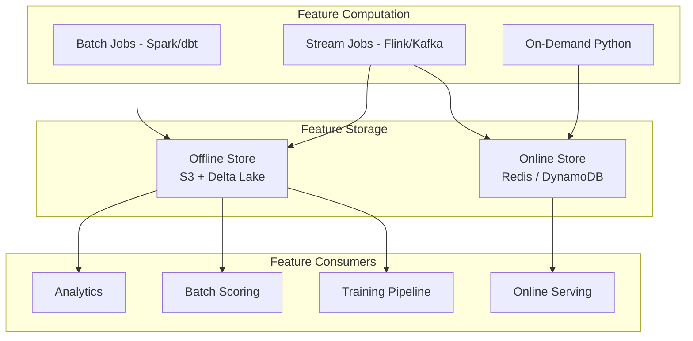

# Feature Engineering — Senior Deep Dive

## Feature Stores: Architecture and Design

A feature store is a centralized platform that manages the entire lifecycle of ML features — definition, computation, storage, versioning, and serving. It solves the fundamental problem of feature duplication and training-serving skew across teams.



### Feast Feature Store

```python
from feast import (
    Entity, Feature, FeatureView, FileSource, PushSource,
    RequestSource, FeatureService, ValueType
)
from feast.types import Float32, Int64, String, Bool
from datetime import timedelta

# Define entities (join keys)
user = Entity(
    name="user_id",
    value_type=ValueType.INT64,
    description="User identifier across all feature views",
)

product = Entity(
    name="product_id",
    value_type=ValueType.INT64,
)

# Offline data sources
user_stats_source = FileSource(
    name="user_stats_source",
    path="s3://features/user_stats/",
    file_format="parquet",
    event_timestamp_column="feature_timestamp",
    created_timestamp_column="created_at",
)

# Feature views define what features exist and their metadata
user_behavioral_fv = FeatureView(
    name="user_behavioral_features",
    entities=["user_id"],
    ttl=timedelta(days=90),  # Features expire after 90 days
    schema=[
        Feature(name="purchase_count_30d", dtype=Int64),
        Feature(name="avg_purchase_value_30d", dtype=Float32),
        Feature(name="days_since_last_purchase", dtype=Int64),
        Feature(name="preferred_category", dtype=String),
        Feature(name="is_high_value", dtype=Bool),
        Feature(name="churn_risk_score", dtype=Float32),
    ],
    source=user_stats_source,
    tags={"team": "growth", "pii": "false", "sla": "4h"},
)

# Feature service: curated set of features for a specific model
churn_feature_service = FeatureService(
    name="churn_model_v3_features",
    features=[
        user_behavioral_fv[["purchase_count_30d", "avg_purchase_value_30d", "days_since_last_purchase"]],
    ],
    description="Features for churn prediction model v3",
    tags={"model": "churn-v3"},
)
```

### Feast Point-In-Time Correct Joins

Point-in-time (PIT) joins prevent data leakage in training by only using feature values that were available at the time of the label event.

```python
import pandas as pd
from feast import FeatureStore

store = FeatureStore(repo_path="feature_repo/")

# Entity dataframe: defines WHEN we want features for each entity
# The event_timestamp is the label time — features must be from BEFORE this time
entity_df = pd.DataFrame({
    "user_id": [100, 200, 300, 100, 200],
    "event_timestamp": pd.to_datetime([
        "2024-01-15 10:00:00",  # User 100's churn event
        "2024-01-16 14:30:00",  # User 200's churn event
        "2024-01-17 09:15:00",  # User 300's churn event
        "2024-01-10 10:00:00",  # User 100, one week earlier (different features!)
        "2024-01-01 14:30:00",  # User 200, two weeks earlier
    ]),
    "churned": [1, 0, 1, 0, 0],  # Labels
})

# PIT join: for each row, fetches features from BEFORE event_timestamp
# Uses binary search on the feature store's timestamp index
training_df = store.get_historical_features(
    entity_df=entity_df,
    features=["user_behavioral_features:purchase_count_30d",
              "user_behavioral_features:avg_purchase_value_30d",
              "user_behavioral_features:days_since_last_purchase"],
).to_df()

print(training_df.head())
# User 100 at 2024-01-15 gets features computed before Jan 15
# User 100 at 2024-01-10 gets features computed before Jan 10 (different values!)
```

---

## Online/Offline Consistency

The biggest production ML risk is training on features computed differently from how they're served.

### The Consistency Problem

```python
# TRAINING: feature computed in Spark
# rolling 30-day average, UTC timestamps, NaN handled as 0
def compute_avg_spend_spark(df):
    w = Window.partitionBy("user_id").orderBy("event_ts").rangeBetween(-30*86400, 0)
    return df.withColumn("avg_spend_30d", F.avg("amount").over(w).fillna(0))

# SERVING: feature computed in Python microservice
# DIFFERENT: using local timezone, missing values become None
def get_avg_spend_online(user_id: str, redis_client) -> float:
    values = redis_client.lrange(f"spend:{user_id}", 0, 29)
    if not values:
        return None  # BUG: training uses 0, serving returns None
    return sum(float(v) for v in values) / len(values)  # BUG: different window
```

### The Solution: Unified Feature Computation

```python
# Define feature logic once in Python
# Run the SAME code in batch (offline) and real-time (online)
from typing import Optional, List
from datetime import datetime, timedelta

class AvgSpendFeature:
    """
    Single implementation for both offline and online contexts.
    Deployed as a shared library imported by both pipelines.
    """
    
    WINDOW_DAYS = 30
    DEFAULT_VALUE = 0.0
    
    @classmethod
    def compute(cls, spend_history: List[dict], reference_time: datetime) -> float:
        """
        Args:
            spend_history: list of {"amount": float, "timestamp": datetime}
            reference_time: compute window relative to this time (UTC)
        """
        cutoff = reference_time - timedelta(days=cls.WINDOW_DAYS)
        
        relevant = [
            s["amount"]
            for s in spend_history
            if s["timestamp"] >= cutoff and s["timestamp"] < reference_time
        ]
        
        if not relevant:
            return cls.DEFAULT_VALUE
        
        return sum(relevant) / len(relevant)
    
    @classmethod
    def compute_offline_batch(cls, spark_df):
        """Spark implementation of the same logic."""
        from pyspark.sql import functions as F
        from pyspark.sql.window import Window
        
        w = Window.partitionBy("user_id").orderBy("event_ts").rangeBetween(
            -cls.WINDOW_DAYS * 86400, -1  # Exclude current row
        )
        return spark_df.withColumn(
            "avg_spend_30d",
            F.coalesce(F.avg("amount").over(w), F.lit(cls.DEFAULT_VALUE))
        )
    
    @classmethod  
    def compute_online(cls, user_id: str, redis_client) -> float:
        """Redis implementation for sub-millisecond serving."""
        now = datetime.utcnow()
        spend_events = redis_client.zrangebyscore(
            f"spend:{user_id}",
            min=(now - timedelta(days=cls.WINDOW_DAYS)).timestamp(),
            max=now.timestamp(),
            withscores=True,
        )
        amounts = [float(amount) for amount, _ in spend_events]
        return sum(amounts) / len(amounts) if amounts else cls.DEFAULT_VALUE
```

---

## Feature Drift Detection

Features drift when the distribution of input data changes over time, causing model performance to degrade silently.

```python
import numpy as np
import pandas as pd
from scipy.stats import ks_2samp, chi2_contingency
from scipy.special import entr

class FeatureDriftMonitor:
    """Detect distribution shift in features between reference and current data."""
    
    def __init__(self, reference_data: pd.DataFrame, feature_cols: list):
        self.reference = reference_data
        self.features = feature_cols
        self._compute_reference_stats()
    
    def _compute_reference_stats(self):
        self.ref_stats = {}
        for col in self.features:
            if self.reference[col].dtype in [np.float32, np.float64, np.int64]:
                self.ref_stats[col] = {
                    "type": "numeric",
                    "mean": self.reference[col].mean(),
                    "std": self.reference[col].std(),
                    "percentiles": np.percentile(self.reference[col].dropna(), np.arange(0, 110, 10)),
                }
            else:
                self.ref_stats[col] = {
                    "type": "categorical",
                    "distribution": self.reference[col].value_counts(normalize=True).to_dict(),
                }
    
    def compute_psi(self, reference_dist: np.ndarray, current_dist: np.ndarray, bins: int = 10) -> float:
        """
        Population Stability Index.
        < 0.1: No significant change
        0.1-0.2: Moderate shift — monitor
        > 0.2: Significant shift — investigate
        """
        ref_counts, bin_edges = np.histogram(reference_dist, bins=bins)
        cur_counts, _ = np.histogram(current_dist, bins=bin_edges)
        
        ref_pct = ref_counts / ref_counts.sum() + 1e-10
        cur_pct = cur_counts / cur_counts.sum() + 1e-10
        
        psi = np.sum((cur_pct - ref_pct) * np.log(cur_pct / ref_pct))
        return float(psi)
    
    def compute_kl_divergence(self, p: np.ndarray, q: np.ndarray) -> float:
        """KL divergence — asymmetric measure of distribution difference."""
        p = p + 1e-10
        q = q + 1e-10
        p = p / p.sum()
        q = q / q.sum()
        return float(np.sum(entr(p) - entr(q)))
    
    def check_drift(self, current_data: pd.DataFrame) -> dict:
        results = {}
        
        for col in self.features:
            ref_col = self.reference[col].dropna()
            cur_col = current_data[col].dropna()
            
            if self.ref_stats[col]["type"] == "numeric":
                # KS test
                ks_stat, ks_pval = ks_2samp(ref_col, cur_col)
                psi = self.compute_psi(ref_col.values, cur_col.values)
                
                results[col] = {
                    "type": "numeric",
                    "ks_statistic": round(ks_stat, 4),
                    "ks_pvalue": round(ks_pval, 4),
                    "psi": round(psi, 4),
                    "drift_detected": psi > 0.1 or ks_pval < 0.05,
                    "drift_severity": "high" if psi > 0.2 else "medium" if psi > 0.1 else "low",
                    "mean_shift": round(cur_col.mean() - ref_col.mean(), 4),
                    "std_ratio": round(cur_col.std() / (ref_col.std() + 1e-10), 4),
                }
            else:
                # Chi-squared test for categorical
                ref_dist = self.ref_stats[col]["distribution"]
                cur_dist = current_data[col].value_counts(normalize=True).to_dict()
                
                all_cats = set(ref_dist) | set(cur_dist)
                ref_freq = np.array([ref_dist.get(c, 1e-10) for c in all_cats])
                cur_freq = np.array([cur_dist.get(c, 1e-10) for c in all_cats])
                
                kl = self.compute_kl_divergence(ref_freq, cur_freq)
                
                results[col] = {
                    "type": "categorical",
                    "kl_divergence": round(kl, 4),
                    "drift_detected": kl > 0.1,
                    "new_categories": list(set(cur_dist) - set(ref_dist)),
                    "missing_categories": list(set(ref_dist) - set(cur_dist)),
                }
        
        return results
```

---

## Advanced Feature Engineering Patterns

### Feature Hashing with Collision Avoidance

```python
import hashlib
import numpy as np
from typing import List

def feature_hash(value: str, n_buckets: int = 2**18) -> int:
    """Deterministic hash to bucket index."""
    return int(hashlib.md5(value.encode()).hexdigest(), 16) % n_buckets

def build_sparse_features(records: List[dict], n_buckets: int = 2**18) -> np.ndarray:
    """Build sparse feature matrix using hashing trick."""
    from scipy.sparse import lil_matrix
    
    X = lil_matrix((len(records), n_buckets), dtype=np.float32)
    
    for i, record in enumerate(records):
        for key, value in record.items():
            if isinstance(value, str):
                bucket = feature_hash(f"{key}={value}", n_buckets)
                X[i, bucket] += 1.0
            elif isinstance(value, (int, float)):
                bucket = feature_hash(key, n_buckets)
                X[i, bucket] = float(value)
    
    return X.tocsr()
```

### Graph Features for Fraud Detection

```python
import networkx as nx
import pandas as pd

def build_transaction_graph_features(transactions: pd.DataFrame) -> pd.DataFrame:
    """
    Extract graph-based features from transaction network.
    Fraudsters often form dense subgraphs (rings, chains).
    """
    G = nx.DiGraph()
    
    for _, row in transactions.iterrows():
        G.add_edge(
            row["sender_id"],
            row["receiver_id"],
            weight=row["amount"],
            timestamp=row["timestamp"],
        )
    
    features = {}
    
    for node in G.nodes():
        features[node] = {
            "in_degree": G.in_degree(node),
            "out_degree": G.out_degree(node),
            "pagerank": nx.pagerank(G)[node],
            "in_weight": sum(G[u][node]["weight"] for u in G.predecessors(node)),
            "out_weight": sum(G[node][v]["weight"] for v in G.successors(node)),
            "clustering_coeff": nx.clustering(G.to_undirected(), node),
            "betweenness": nx.betweenness_centrality(G)[node],
        }
    
    return pd.DataFrame.from_dict(features, orient="index")
```

---

## Interview Tips

> **Tip 1:** "What is point-in-time correct joining and why does it matter?" — "PIT join ensures that when you create a training dataset, each training example only uses feature values that were available at the time of the label event. Without it, you might use a feature value computed on January 20 for a label event that happened January 10 — the model learns from future information, and in production where you have no future data, performance collapses."

> **Tip 2:** "How do you detect and handle feature drift in production?" — "Track PSI (Population Stability Index) and KL divergence for each feature weekly. PSI > 0.1 triggers an investigation, PSI > 0.2 triggers a model retraining alert. For immediate action: check if the data pipeline itself changed (upstream schema drift), check if user behavior genuinely shifted (seasonal effects), then decide between retraining with recent data or domain adaptation."

> **Tip 3:** "Feast vs Tecton — when would you choose each?" — "Feast is open-source, free, and great for teams building their first feature store. Tecton is enterprise, managed SaaS with better operational tooling, built-in monitoring, and SLAs. Choose Feast if you have engineering bandwidth to operate it and want flexibility. Choose Tecton if you need rapid deployment, operational reliability, and are willing to pay for a managed service."

> **Tip 4:** "How do you ensure feature consistency between training and serving?" — "Three strategies: (1) Unified code: define feature logic in Python, compile to Spark SQL for batch and to Redis commands for online — same logic, different executors. (2) Feature store: compute once, serve everywhere (Feast/Tecton materialize batch features to both offline and online stores). (3) Consistency testing: after each deployment, compare training-time feature values against serving-time values for a held-out set of entities and assert they match within tolerance."

## ⚡ Cheat Sheet

**Feature Store Architecture — Two Stores**
| Store | Purpose | Tech | Latency |
|---|---|---|---|
| Offline Store | Training, batch scoring | S3 + Delta Lake | Minutes |
| Online Store | Real-time serving | Redis / DynamoDB | < 10 ms |

**Point-In-Time Join — The Rule**
- Entity DataFrame must have `event_timestamp` = label event time
- Feast's `get_historical_features()` uses binary search: for each row, returns the most recent feature value **before** `event_timestamp`
- Without PIT join: you'd use features from Jan 20 for a Jan 10 event → future leakage → model collapses in production

**Feast vs Tecton Decision Rule**
- **Feast**: open-source, first feature store, engineering bandwidth available, flexibility needed
- **Tecton**: managed SaaS, need operational SLAs, rapid deployment, willing to pay

**Drift Detection Thresholds**
- PSI < 0.1: no significant change
- PSI 0.1–0.2: moderate shift → monitor closely
- PSI > 0.2: significant shift → alert + retrain investigation
- KL divergence > 0.1: flag categorical drift
- KS test p-value < 0.05: distribution has shifted (use alongside PSI)

**Training-Serving Consistency — Three Strategies**
1. **Unified code**: same Python class implements `compute_offline_batch()` (Spark) and `compute_online()` (Redis)
2. **Feature store**: compute once (Feast/Tecton materializes to both stores)
3. **Consistency test**: compare training-time vs serving-time feature values for held-out entities after each deploy

**Common Skew Sources + Fixes**
| Cause | Fix |
|---|---|
| Different aggregation windows | Pin exact window in shared class |
| UTC vs local timezone | UTC everywhere, log explicitly |
| NULL handling | Feature store enforces consistent default |
| Schema drift (new category) | `handle_unknown="ignore"` in sklearn encoders |
| Data freshness difference | Monitor `feature_freshness` metric in prod |

**Graph Feature Rules (Fraud)**
- Dense subgraphs = fraud signal (rings, chains)
- Key features: `in_degree`, `out_degree`, `pagerank`, `clustering_coeff`, `betweenness`
- Compute PageRank on full graph first, then extract per-node features
