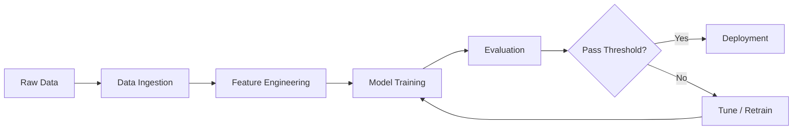
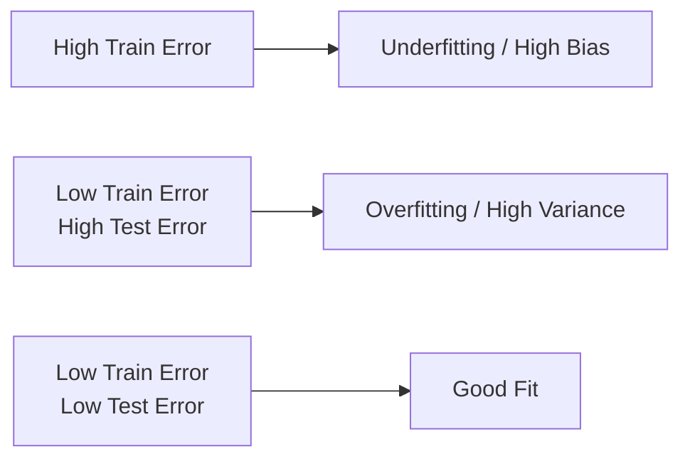

# Machine Learning Pipelines — Fundamentals

## What Is a Machine Learning Pipeline?

A machine learning pipeline is a structured sequence of steps that transforms raw data into a trained, deployable model. Every production ML system needs a pipeline to ensure reproducibility, maintainability, and auditability.



---

## The 5 Core Pipeline Stages

### 1. Data Ingestion
Pull data from source systems — databases, data lakes, APIs, streams. Key concerns:
- **Schema validation** — reject malformed records early
- **Deduplication** — avoid training on duplicate rows
- **Freshness checks** — stale data can silently hurt model quality

```python
import pandas as pd

def ingest_data(source_path: str) -> pd.DataFrame:
    df = pd.read_parquet(source_path)
    assert df.shape[0] > 0, "Empty dataset!"
    assert "label" in df.columns, "Missing target column"
    print(f"Loaded {df.shape[0]:,} rows, {df.shape[1]} columns")
    return df
```

### 2. Feature Engineering
Transform raw columns into model-ready features. This is the highest-leverage stage — garbage in, garbage out.

```python
from sklearn.preprocessing import StandardScaler, OneHotEncoder
from sklearn.impute import SimpleImputer
import numpy as np

def preprocess(df: pd.DataFrame):
    numeric_cols = df.select_dtypes(include=[np.number]).columns.tolist()
    cat_cols = df.select_dtypes(include=["object", "category"]).columns.tolist()
    
    # Impute then scale numerics
    imputer = SimpleImputer(strategy="median")
    scaler = StandardScaler()
    X_num = scaler.fit_transform(imputer.fit_transform(df[numeric_cols]))
    
    # Encode categoricals
    enc = OneHotEncoder(handle_unknown="ignore", sparse_output=False)
    X_cat = enc.fit_transform(df[cat_cols])
    
    return np.hstack([X_num, X_cat])
```

### 3. Model Training
Fit a model on training data. The model "learns" patterns that generalize to unseen data.

```python
from sklearn.ensemble import GradientBoostingClassifier

def train_model(X_train, y_train):
    model = GradientBoostingClassifier(
        n_estimators=100,
        learning_rate=0.1,
        max_depth=4,
        random_state=42,
    )
    model.fit(X_train, y_train)
    return model
```

### 4. Evaluation
Measure model quality on **held-out** data (the test set). Never evaluate on training data.

| Metric | Use Case |
|--------|----------|
| Accuracy | Balanced classes |
| AUC-ROC | Imbalanced binary classification |
| F1-Score | Recall/Precision tradeoff |
| RMSE/MAE | Regression |
| Log Loss | Probabilistic classifiers |

```python
from sklearn.metrics import classification_report, roc_auc_score

def evaluate(model, X_test, y_test):
    y_pred = model.predict(X_test)
    y_prob = model.predict_proba(X_test)[:, 1]
    
    print(classification_report(y_test, y_pred))
    print(f"AUC-ROC: {roc_auc_score(y_test, y_prob):.4f}")
```

### 5. Deployment
Serialize the trained model and expose it as an API or batch scorer.

```python
import joblib

def save_model(model, path: str = "model.joblib"):
    joblib.dump(model, path)
    print(f"Model saved to {path}")

def load_model(path: str = "model.joblib"):
    return joblib.load(path)
```

---

## sklearn Pipeline — The Gold Standard

`sklearn.pipeline.Pipeline` chains preprocessing and modeling into a single object. This is **critical** to prevent data leakage.

```python
from sklearn.pipeline import Pipeline
from sklearn.compose import ColumnTransformer
from sklearn.preprocessing import StandardScaler, OneHotEncoder
from sklearn.impute import SimpleImputer
from sklearn.ensemble import RandomForestClassifier

numeric_features = ["age", "income", "tenure"]
categorical_features = ["plan_type", "region"]

numeric_transformer = Pipeline([
    ("imputer", SimpleImputer(strategy="median")),
    ("scaler", StandardScaler()),
])

categorical_transformer = Pipeline([
    ("imputer", SimpleImputer(strategy="most_frequent")),
    ("encoder", OneHotEncoder(handle_unknown="ignore")),
])

preprocessor = ColumnTransformer([
    ("num", numeric_transformer, numeric_features),
    ("cat", categorical_transformer, categorical_features),
])

full_pipeline = Pipeline([
    ("preprocessor", preprocessor),
    ("classifier", RandomForestClassifier(n_estimators=200, random_state=42)),
])

# Fit and predict — preprocessing is automatically applied
full_pipeline.fit(X_train, y_train)
y_pred = full_pipeline.predict(X_test)
```

### Why Pipeline Prevents Data Leakage

**Wrong** (leaky): scaler fitted on all data before splitting

```python
# BAD — scaler sees test data during fit
scaler = StandardScaler()
X_scaled = scaler.fit_transform(X_all)
X_train, X_test = train_test_split(X_scaled, ...)
```

**Correct**: scaler only sees training data

```python
# GOOD — scaler fit only on X_train
X_train, X_test = train_test_split(X_all, ...)
full_pipeline.fit(X_train, y_train)   # scaler.fit on X_train only
full_pipeline.score(X_test, y_test)   # scaler.transform on X_test
```

---

## Data Splits

### Train / Validation / Test

```python
from sklearn.model_selection import train_test_split

# First split: 80% train+val, 20% test
X_trainval, X_test, y_trainval, y_test = train_test_split(
    X, y, test_size=0.2, random_state=42, stratify=y
)

# Second split: 75% train, 25% val (= 60/20/20 overall)
X_train, X_val, y_train, y_val = train_test_split(
    X_trainval, y_trainval, test_size=0.25, random_state=42, stratify=y_trainval
)

print(f"Train: {len(X_train):,}, Val: {len(X_val):,}, Test: {len(X_test):,}")
```

### K-Fold Cross-Validation

Use when data is limited — each sample appears in the validation set exactly once.

```python
from sklearn.model_selection import StratifiedKFold, cross_val_score

cv = StratifiedKFold(n_splits=5, shuffle=True, random_state=42)
scores = cross_val_score(full_pipeline, X_train, y_train, cv=cv, scoring="roc_auc")

print(f"CV AUC: {scores.mean():.4f} ± {scores.std():.4f}")
```

### Time-Series Splits

For temporal data, respect chronological order:

```python
from sklearn.model_selection import TimeSeriesSplit

tscv = TimeSeriesSplit(n_splits=5)
for fold, (train_idx, val_idx) in enumerate(tscv.split(X)):
    X_tr, X_v = X[train_idx], X[val_idx]
    y_tr, y_v = y[train_idx], y[val_idx]
    # Train on past, validate on future
```

---

## Overfitting vs Underfitting



### Detecting Overfitting

```python
train_score = full_pipeline.score(X_train, y_train)
test_score = full_pipeline.score(X_test, y_test)
gap = train_score - test_score

print(f"Train AUC: {train_score:.4f}")
print(f"Test  AUC: {test_score:.4f}")
print(f"Gap:       {gap:.4f}  {'⚠ Overfitting!' if gap > 0.05 else '✓ OK'}")
```

### Remedies

| Problem | Remedy |
|---------|--------|
| Overfitting | Regularization (L1/L2), dropout, early stopping, more data, simpler model |
| Underfitting | More features, larger model, reduce regularization, train longer |
| High variance | Cross-validation, ensemble methods, data augmentation |

### Learning Curves

```python
import matplotlib.pyplot as plt
from sklearn.model_selection import learning_curve
import numpy as np

train_sizes, train_scores, val_scores = learning_curve(
    full_pipeline, X_train, y_train,
    cv=5, scoring="roc_auc",
    train_sizes=np.linspace(0.1, 1.0, 10),
)

plt.plot(train_sizes, train_scores.mean(axis=1), label="Train")
plt.plot(train_sizes, val_scores.mean(axis=1), label="Validation")
plt.xlabel("Training set size")
plt.ylabel("AUC-ROC")
plt.legend()
plt.title("Learning Curve")
plt.show()
```

---

## Putting It All Together — End-to-End Pipeline

```python
import pandas as pd
import numpy as np
from sklearn.pipeline import Pipeline
from sklearn.compose import ColumnTransformer
from sklearn.preprocessing import StandardScaler, OneHotEncoder
from sklearn.impute import SimpleImputer
from sklearn.ensemble import GradientBoostingClassifier
from sklearn.model_selection import train_test_split, StratifiedKFold, cross_val_score
from sklearn.metrics import roc_auc_score, classification_report
import joblib

# 1. Load data
df = pd.read_parquet("s3://my-bucket/churn_data.parquet")
X = df.drop("churned", axis=1)
y = df["churned"]

# 2. Split
X_train, X_test, y_train, y_test = train_test_split(
    X, y, test_size=0.2, stratify=y, random_state=42
)

# 3. Build pipeline
num_cols = X.select_dtypes(include=np.number).columns.tolist()
cat_cols = X.select_dtypes(include="object").columns.tolist()

preprocessor = ColumnTransformer([
    ("num", Pipeline([
        ("imp", SimpleImputer(strategy="median")),
        ("scl", StandardScaler()),
    ]), num_cols),
    ("cat", Pipeline([
        ("imp", SimpleImputer(strategy="constant", fill_value="missing")),
        ("enc", OneHotEncoder(handle_unknown="ignore")),
    ]), cat_cols),
])

pipeline = Pipeline([
    ("prep", preprocessor),
    ("model", GradientBoostingClassifier(n_estimators=200, random_state=42)),
])

# 4. Cross-validate
cv = StratifiedKFold(n_splits=5, shuffle=True, random_state=42)
cv_scores = cross_val_score(pipeline, X_train, y_train, cv=cv, scoring="roc_auc")
print(f"CV AUC: {cv_scores.mean():.4f} ± {cv_scores.std():.4f}")

# 5. Final fit and evaluate
pipeline.fit(X_train, y_train)
test_auc = roc_auc_score(y_test, pipeline.predict_proba(X_test)[:, 1])
print(f"Test AUC: {test_auc:.4f}")

# 6. Save
joblib.dump(pipeline, "churn_model_v1.joblib")
```

---

## Key Concepts Cheat Sheet

| Concept | Definition |
|---------|-----------|
| Pipeline | Chained sequence of transformers + estimator |
| Fit | Learn parameters from training data |
| Transform | Apply learned parameters to new data |
| Data leakage | Test data influencing training — invalidates evaluation |
| Stratify | Preserve class distribution across splits |
| Cross-validation | Multiple train/val splits for robust evaluation |
| Overfitting | Model memorizes training data, fails on new data |
| Regularization | Penalty on model complexity to reduce overfitting |

---

## Interview Tips

> **Tip 1:** "What's the most important reason to use sklearn Pipeline?" — "Preventing data leakage. If you fit a scaler on all data before splitting, your test set is contaminated — the scaler has 'seen' test samples, making your evaluation metrics optimistically biased."

> **Tip 2:** "How do you choose between accuracy and AUC-ROC?" — "Accuracy is misleading for imbalanced datasets. If 95% of your data is class 0, a model that always predicts 0 has 95% accuracy but is useless. AUC-ROC measures the model's ability to rank positives above negatives regardless of threshold."

> **Tip 3:** "How do you detect overfitting without a test set?" — "Use cross-validation. If CV score is much lower than training score, you're overfitting. Learning curves reveal whether adding more data would help (high variance) or whether you need a better model (high bias)."

> **Tip 4:** "When would you use TimeSeriesSplit instead of KFold?" — "Whenever the data has temporal ordering — stock prices, user behavior sequences, sensor readings. KFold allows future data to predict the past, which is leakage. TimeSeriesSplit always trains on the past and validates on the future."
