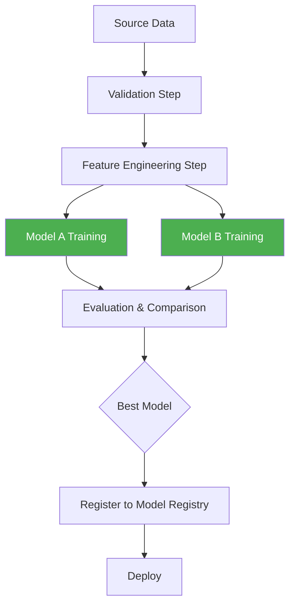

# Machine Learning Pipelines — Intermediate

## Beyond sklearn: Production Pipeline Orchestration

At production scale, pipelines need to handle distributed compute, caching, versioning, and multi-step parallelism. Tools like Kubeflow Pipelines and MLflow Projects address these needs.



---

## Kubeflow Pipelines

Kubeflow Pipelines (KFP) is the de facto standard for orchestrating ML workflows on Kubernetes. Each pipeline step runs as a separate container.

### Core Concepts

| Concept | Description |
|---------|-------------|
| Component | Reusable function wrapped in a container |
| Pipeline | DAG of components |
| Run | Single execution of a pipeline |
| Experiment | Logical grouping of runs |
| Artifact | Outputs (datasets, models, metrics) stored in metadata store |

### Defining a KFP Pipeline

```python
from kfp import dsl
from kfp.components import func_to_container_op
from typing import NamedTuple

# Define a component as a Python function
@func_to_container_op
def load_data(
    data_path: str,
    output_path: dsl.OutputPath("Dataset"),
) -> None:
    import pandas as pd
    df = pd.read_parquet(data_path)
    df.to_parquet(output_path)
    print(f"Loaded {len(df):,} rows")


@func_to_container_op
def train_model(
    data_path: dsl.InputPath("Dataset"),
    learning_rate: float,
    n_estimators: int,
    model_path: dsl.OutputPath("Model"),
    metrics_path: dsl.OutputPath("Metrics"),
) -> NamedTuple("Outputs", [("auc", float)]):
    import pandas as pd
    from sklearn.ensemble import GradientBoostingClassifier
    from sklearn.metrics import roc_auc_score
    import joblib, json

    df = pd.read_parquet(data_path)
    X = df.drop("label", axis=1)
    y = df["label"]

    model = GradientBoostingClassifier(
        learning_rate=learning_rate,
        n_estimators=n_estimators,
        random_state=42,
    )
    model.fit(X, y)
    auc = roc_auc_score(y, model.predict_proba(X)[:, 1])

    joblib.dump(model, model_path)
    with open(metrics_path, "w") as f:
        json.dump({"auc": auc}, f)

    from collections import namedtuple
    return namedtuple("Outputs", ["auc"])(auc)


@dsl.pipeline(name="churn-training-pipeline", description="End-to-end churn model")
def churn_pipeline(
    data_path: str = "gs://my-bucket/data/churn.parquet",
    learning_rate: float = 0.1,
    n_estimators: int = 200,
):
    load_op = load_data(data_path=data_path)
    
    train_op = train_model(
        data_path=load_op.outputs["output"],
        learning_rate=learning_rate,
        n_estimators=n_estimators,
    )
    
    # Set resource requests for training step
    train_op.set_cpu_request("2")
    train_op.set_memory_request("8G")
    train_op.set_gpu_limit("1")
```

### Submitting a Pipeline Run

```python
import kfp

client = kfp.Client(host="https://kubeflow.my-company.com/pipeline")

# Compile
kfp.compiler.Compiler().compile(churn_pipeline, "churn_pipeline.yaml")

# Run
run = client.create_run_from_pipeline_func(
    churn_pipeline,
    arguments={
        "data_path": "gs://my-bucket/data/churn_2024.parquet",
        "learning_rate": 0.05,
        "n_estimators": 300,
    },
    experiment_name="churn-model-v2",
    run_name="churn-run-2024-01-15",
)

print(f"Run ID: {run.run_id}")
```

---

## MLflow Projects

MLflow Projects package ML code in a reusable, reproducible way using a `MLproject` file.

### MLproject File

```yaml
# MLproject
name: churn_model

conda_env: conda.yaml

entry_points:
  train:
    parameters:
      learning_rate: {type: float, default: 0.1}
      n_estimators: {type: int, default: 200}
      data_path: {type: str}
    command: "python train.py --lr {learning_rate} --n {n_estimators} --data {data_path}"

  evaluate:
    parameters:
      model_uri: {type: str}
      test_data: {type: str}
    command: "python evaluate.py --model {model_uri} --data {test_data}"
```

### Training Script with MLflow Tracking

```python
# train.py
import argparse
import mlflow
import mlflow.sklearn
import pandas as pd
from sklearn.ensemble import GradientBoostingClassifier
from sklearn.model_selection import train_test_split
from sklearn.metrics import roc_auc_score, f1_score

def train(learning_rate: float, n_estimators: int, data_path: str):
    df = pd.read_parquet(data_path)
    X = df.drop("label", axis=1)
    y = df["label"]
    
    X_train, X_test, y_train, y_test = train_test_split(
        X, y, test_size=0.2, stratify=y, random_state=42
    )
    
    with mlflow.start_run():
        # Log parameters
        mlflow.log_param("learning_rate", learning_rate)
        mlflow.log_param("n_estimators", n_estimators)
        mlflow.log_param("data_path", data_path)
        
        # Train
        model = GradientBoostingClassifier(
            learning_rate=learning_rate,
            n_estimators=n_estimators,
            random_state=42,
        )
        model.fit(X_train, y_train)
        
        # Log metrics
        y_prob = model.predict_proba(X_test)[:, 1]
        y_pred = model.predict(X_test)
        
        mlflow.log_metric("test_auc", roc_auc_score(y_test, y_prob))
        mlflow.log_metric("test_f1", f1_score(y_test, y_pred))
        mlflow.log_metric("train_auc", roc_auc_score(y_train, model.predict_proba(X_train)[:, 1]))
        
        # Log model
        mlflow.sklearn.log_model(
            model,
            artifact_path="model",
            registered_model_name="churn-classifier",
        )
        
        print(f"Test AUC: {roc_auc_score(y_test, y_prob):.4f}")

if __name__ == "__main__":
    parser = argparse.ArgumentParser()
    parser.add_argument("--lr", type=float, default=0.1)
    parser.add_argument("--n", type=int, default=200)
    parser.add_argument("--data", type=str, required=True)
    args = parser.parse_args()
    train(args.lr, args.n, args.data)
```

### Running MLflow Projects

```bash
# Run locally
mlflow run . -P learning_rate=0.05 -P n_estimators=300 \
    -P data_path=data/churn.parquet

# Run on Databricks
mlflow run . -P learning_rate=0.05 \
    --backend databricks \
    --backend-config '{"cluster_id": "abc123"}'

# Run from Git
mlflow run https://github.com/my-org/churn-model.git \
    -v "v1.2.0" \
    -P learning_rate=0.05
```

---

## Pipeline Versioning

Versioning pipelines is as important as versioning code. Key strategies:

### Git-Based Pipeline Versioning

```bash
# Tag pipeline versions
git tag -a "pipeline-v1.2.0" -m "Added feature interaction step"
git push origin pipeline-v1.2.0

# Track which pipeline version produced which model
mlflow.set_tag("pipeline_version", "v1.2.0")
mlflow.set_tag("git_commit", subprocess.check_output(
    ["git", "rev-parse", "HEAD"]
).decode().strip())
```

### Pipeline Version Metadata in MLflow

```python
import mlflow
import subprocess

def get_git_info():
    commit = subprocess.check_output(["git", "rev-parse", "HEAD"]).decode().strip()
    branch = subprocess.check_output(["git", "rev-parse", "--abbrev-ref", "HEAD"]).decode().strip()
    return commit, branch

with mlflow.start_run():
    commit, branch = get_git_info()
    mlflow.set_tags({
        "pipeline_name": "churn-training",
        "pipeline_version": "1.2.0",
        "git_commit": commit,
        "git_branch": branch,
        "data_version": "2024-01-15",
        "environment": "production",
    })
```

---

## Parallel Pipeline Steps

Running steps in parallel dramatically reduces total pipeline runtime.

### KFP Parallel Steps

```python
@dsl.pipeline(name="parallel-training")
def parallel_pipeline(data_path: str):
    data_op = load_data(data_path=data_path)
    
    # Run three model variants in parallel
    with dsl.ParallelFor(["gbt", "rf", "xgb"]) as model_type:
        train_op = train_model(
            data_path=data_op.outputs["output"],
            model_type=model_type,
        )
    
    # Combine results after all parallel steps finish
    compare_op = compare_models(
        model_paths=dsl.Collected(train_op.outputs["model"]),
    )
```

### Python-Level Parallelism with joblib

```python
from joblib import Parallel, delayed
from sklearn.ensemble import GradientBoostingClassifier, RandomForestClassifier
from sklearn.linear_model import LogisticRegression

def train_single(model, X_train, y_train, X_test, y_test):
    model.fit(X_train, y_train)
    auc = roc_auc_score(y_test, model.predict_proba(X_test)[:, 1])
    return {"model": model, "auc": auc, "name": type(model).__name__}

models = [
    GradientBoostingClassifier(n_estimators=200, random_state=42),
    RandomForestClassifier(n_estimators=200, random_state=42),
    LogisticRegression(max_iter=1000),
]

results = Parallel(n_jobs=-1)(
    delayed(train_single)(m, X_train, y_train, X_test, y_test)
    for m in models
)

best = max(results, key=lambda r: r["auc"])
print(f"Best: {best['name']} — AUC: {best['auc']:.4f}")
```

---

## Pipeline Caching

Re-running unchanged steps wastes compute. Both KFP and MLflow support caching.

### KFP Caching

```python
@dsl.pipeline(name="cached-pipeline")
def cached_pipeline(data_path: str, learning_rate: float):
    # Enable caching — step is skipped if inputs + code haven't changed
    load_op = load_data(data_path=data_path)
    load_op.execution_options.caching_strategy.max_cache_staleness = "P30D"  # 30 days
    
    # Disable caching for steps that must always rerun
    train_op = train_model(
        data_path=load_op.outputs["output"],
        learning_rate=learning_rate,
    )
    train_op.execution_options.caching_strategy.max_cache_staleness = "P0D"  # no cache
```

### DVC-Based Pipeline Caching

DVC caches pipeline stage outputs based on dependency hashes.

```yaml
# dvc.yaml
stages:
  load_data:
    cmd: python src/load_data.py --output data/processed/train.parquet
    deps:
      - src/load_data.py
      - data/raw/churn.csv
    outs:
      - data/processed/train.parquet   # DVC caches this

  train_model:
    cmd: python src/train.py
    deps:
      - src/train.py
      - data/processed/train.parquet   # only reruns if this changes
    outs:
      - models/churn_model.joblib
    metrics:
      - metrics/scores.json
```

```bash
# Run pipeline — only changed stages execute
dvc repro

# Force rerun all stages
dvc repro --force

# Show what would run without executing
dvc repro --dry
```

---

## Hyperparameter Tuning in Pipelines

```python
from sklearn.model_selection import GridSearchCV, RandomizedSearchCV
from sklearn.pipeline import Pipeline
from scipy.stats import randint, uniform

# Grid search over pipeline parameters
param_grid = {
    "model__n_estimators": [100, 200, 500],
    "model__learning_rate": [0.01, 0.05, 0.1],
    "model__max_depth": [3, 4, 5],
    "prep__num__scl__with_std": [True, False],
}

# Random search — more efficient for large spaces
param_dist = {
    "model__n_estimators": randint(100, 500),
    "model__learning_rate": uniform(0.01, 0.2),
    "model__max_depth": randint(3, 8),
    "model__subsample": uniform(0.6, 0.4),
}

search = RandomizedSearchCV(
    pipeline,
    param_distributions=param_dist,
    n_iter=50,
    cv=StratifiedKFold(5),
    scoring="roc_auc",
    n_jobs=-1,
    random_state=42,
    verbose=2,
)
search.fit(X_train, y_train)

print(f"Best AUC: {search.best_score_:.4f}")
print(f"Best params: {search.best_params_}")
```

---

## Pipeline Monitoring During Training

```python
from sklearn.base import BaseEstimator, TransformerMixin

class DataQualityChecker(BaseEstimator, TransformerMixin):
    """Custom transformer that validates data before passing it downstream."""
    
    def __init__(self, max_null_frac=0.1, min_rows=1000):
        self.max_null_frac = max_null_frac
        self.min_rows = min_rows
    
    def fit(self, X, y=None):
        return self
    
    def transform(self, X):
        import pandas as pd
        if isinstance(X, pd.DataFrame):
            null_frac = X.isnull().sum().sum() / X.size
            if null_frac > self.max_null_frac:
                raise ValueError(f"Too many nulls: {null_frac:.1%} > {self.max_null_frac:.1%}")
            if len(X) < self.min_rows:
                raise ValueError(f"Too few rows: {len(X)} < {self.min_rows}")
        return X

# Insert into pipeline
pipeline = Pipeline([
    ("quality_check", DataQualityChecker(max_null_frac=0.05)),
    ("prep", preprocessor),
    ("model", GradientBoostingClassifier()),
])
```

---

## Interview Tips

> **Tip 1:** "What's the difference between KFP and MLflow Projects?" — "KFP orchestrates containerized steps on Kubernetes with full DAG control, resource requests, and caching at the infrastructure level. MLflow Projects packages code with environment definitions for reproducibility and portability — it's lighter and more focused on experiment tracking. In practice, many teams use both: KFP for orchestration, MLflow for tracking."

> **Tip 2:** "How does pipeline caching work in DVC?" — "DVC hashes the content of each stage's dependencies (input files + code). If the hash matches a previous run, DVC skips re-execution and restores outputs from the cache. This is content-addressed caching — identical inputs always produce a cache hit regardless of when they were computed."

> **Tip 3:** "Why run model variants in parallel instead of sequentially?" — "Parallel execution reduces total wall-clock time proportionally to the number of variants. If each takes 2 hours and you train 4 variants, sequential takes 8 hours, parallel takes ~2 hours. With cloud compute, the marginal cost is similar since you're paying for total compute regardless."

> **Tip 4:** "How do you handle pipeline failures mid-run?" — "Use checkpointing: save intermediate outputs to durable storage (GCS/S3) after each step. KFP and DVC both support this. On failure, resume from the last successful checkpoint rather than restarting from scratch. Also implement retry logic with exponential backoff for transient failures."
