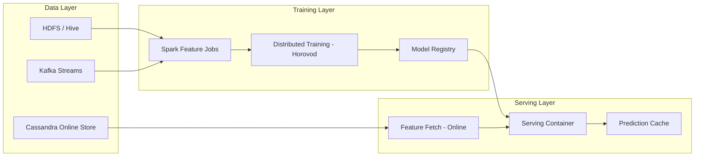
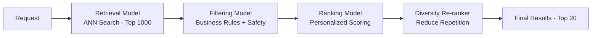

# Machine Learning Pipelines — Real World Patterns

## Netflix ML Platform Patterns

Netflix's Metaflow and their broader ML platform handle thousands of experiments and production pipelines across multiple teams. Key architectural decisions:

### Metaflow-Style Pipeline Design

```python
from metaflow import FlowSpec, step, Parameter, conda, resources, retry

class NetflixStyleRecommendationFlow(FlowSpec):
    """
    Mimics Netflix's approach: each step is isolated, resumable,
    and tracked. Compute is provisioned per step.
    """
    
    num_users = Parameter("num_users", default=1_000_000)
    model_version = Parameter("model_version", default="v3")
    
    @step
    def start(self):
        print(f"Starting pipeline for {self.num_users:,} users")
        self.next(self.fetch_interactions)
    
    @resources(memory=16384, cpu=4)
    @retry(times=3)
    @step
    def fetch_interactions(self):
        """Pull user-item interactions from data warehouse."""
        import pandas as pd
        # In practice: Spark job reading from Hive/Delta
        self.interactions = pd.read_parquet(
            f"s3://netflix-ml/interactions/latest/*.parquet"
        )
        print(f"Fetched {len(self.interactions):,} interactions")
        self.next(self.compute_features, self.compute_item_embeddings)
    
    @resources(memory=32768, cpu=8)
    @step
    def compute_features(self):
        """User and context features — parallelizable."""
        self.user_features = self._build_user_features(self.interactions)
        self.next(self.join)
    
    @resources(memory=32768, cpu=8, gpu=1)
    @step
    def compute_item_embeddings(self):
        """Item embeddings from content metadata."""
        self.item_embeddings = self._build_item_embeddings()
        self.next(self.join)
    
    @step
    def join(self, inputs):
        """Join results from parallel branches."""
        self.user_features = inputs.compute_features.user_features
        self.item_embeddings = inputs.compute_item_embeddings.item_embeddings
        self.next(self.train_model)
    
    @resources(memory=65536, cpu=16, gpu=4)
    @step
    def train_model(self):
        """Train the ranking model."""
        self.model, self.metrics = self._train_two_tower_model(
            self.user_features,
            self.item_embeddings,
        )
        self.next(self.evaluate)
    
    @step
    def evaluate(self):
        """Offline evaluation: NDCG@10, Recall@50."""
        self.eval_results = self._evaluate_ranking(self.model)
        self.passed = self.eval_results["ndcg_at_10"] > 0.35
        self.next(self.register_model)
    
    @step
    def register_model(self):
        if self.passed:
            self._register_to_mlflow(self.model, self.eval_results)
            print("Model registered — ready for shadow testing")
        else:
            print(f"Model failed eval: NDCG@10={self.eval_results['ndcg_at_10']:.4f}")
        self.next(self.end)
    
    @step
    def end(self):
        print("Pipeline complete")
    
    def _build_user_features(self, interactions):
        # Compute viewing history, genre preferences, recency signals
        pass
    
    def _build_item_embeddings(self):
        # Two-tower or matrix factorization embeddings
        pass
    
    def _train_two_tower_model(self, user_features, item_embeddings):
        pass
    
    def _evaluate_ranking(self, model):
        pass
    
    def _register_to_mlflow(self, model, metrics):
        pass
```

---

## Uber's Michelangelo Platform Patterns

Uber's Michelangelo handles real-time predictions at massive scale across ride-hailing, food delivery, and freight.

### Key Architectural Decisions



### Uber-Style Distributed Feature Computation

```python
from pyspark.sql import SparkSession
from pyspark.sql import functions as F
from pyspark.sql.window import Window

def compute_driver_features(spark: SparkSession, snapshot_date: str):
    """
    Compute driver-level features for surge pricing model.
    Mirrors Uber's approach: Spark batch + streaming hybrid.
    """
    
    trips = spark.table("trips").filter(F.col("date") <= snapshot_date)
    
    # Rolling window features
    driver_window_7d = Window.partitionBy("driver_id").orderBy("trip_start_ts").rangeBetween(
        -7 * 86400,  # 7 days in seconds
        0
    )
    
    driver_features = trips.groupBy("driver_id").agg(
        # Acceptance rate
        (F.sum("accepted") / F.count("*")).alias("7d_acceptance_rate"),
        
        # Completion rate
        (F.sum("completed") / F.sum("accepted")).alias("7d_completion_rate"),
        
        # Average rating
        F.avg("rating").alias("7d_avg_rating"),
        
        # Trip count
        F.count("*").alias("7d_trip_count"),
        
        # Revenue
        F.sum("fare_usd").alias("7d_total_revenue"),
        
        # Activity hours
        F.sum("trip_duration_minutes").alias("7d_active_minutes"),
    ).withColumn("snapshot_date", F.lit(snapshot_date))
    
    # Write to feature store (offline)
    driver_features.write.mode("overwrite").partitionBy("snapshot_date").parquet(
        f"s3://uber-features/driver_stats/snapshot_date={snapshot_date}/"
    )
    
    # Materialize to online store (Redis/Cassandra)
    materialize_to_online_store(driver_features, feature_group="driver_stats")
    
    return driver_features
```

---

## Multi-Model Pipelines

Production systems rarely use a single model. Multi-model pipelines chain specialists for different subtasks.

### Cascade Architecture



```python
from dataclasses import dataclass
from typing import List
import numpy as np

@dataclass
class Item:
    item_id: str
    score: float
    metadata: dict

class CascadeRecommendationPipeline:
    """
    Multi-stage recommendation pipeline.
    Each stage reduces candidate set size, increasing computation per item.
    """
    
    def __init__(self, retrieval_model, ranker_model, diversity_config):
        self.retrieval = retrieval_model       # Fast ANN — handles millions
        self.ranker = ranker_model             # Slower DNN — handles thousands
        self.diversity_config = diversity_config
    
    def predict(
        self,
        user_id: str,
        user_context: dict,
        n_final: int = 20,
    ) -> List[Item]:
        # Stage 1: Retrieval (ANN) — O(log N)
        candidates = self.retrieval.get_top_k(
            user_id=user_id,
            k=1000,
        )  # 1000 candidates, ~5ms
        
        # Stage 2: Business rule filtering
        candidates = self._apply_filters(candidates, user_context)
        
        # Stage 3: Scoring with full feature set — O(k)
        features = self._build_ranking_features(user_id, candidates, user_context)
        scores = self.ranker.predict(features)  # DNN inference, ~20ms
        
        ranked = sorted(
            zip(candidates, scores),
            key=lambda x: x[1],
            reverse=True,
        )[:100]  # Keep top 100
        
        # Stage 4: Diversity re-ranking — MMR
        final = self._max_marginal_relevance(
            ranked_items=ranked,
            n=n_final,
            diversity_weight=self.diversity_config["lambda"],
        )
        
        return final
    
    def _apply_filters(self, candidates, context):
        return [c for c in candidates if self._passes_filters(c, context)]
    
    def _build_ranking_features(self, user_id, candidates, context):
        # Build feature matrix for ranking model
        pass
    
    def _max_marginal_relevance(self, ranked_items, n, diversity_weight):
        """MMR: balance relevance and diversity."""
        selected = []
        remaining = list(ranked_items)
        
        # First item: highest relevance
        selected.append(remaining.pop(0))
        
        while len(selected) < n and remaining:
            mmr_scores = []
            for item, score in remaining:
                # Similarity to already selected items
                max_sim = max(
                    self._similarity(item, sel_item)
                    for sel_item, _ in selected
                )
                mmr = (1 - diversity_weight) * score - diversity_weight * max_sim
                mmr_scores.append(mmr)
            
            best_idx = np.argmax(mmr_scores)
            selected.append(remaining.pop(best_idx))
        
        return [item for item, _ in selected]
    
    def _similarity(self, item_a, item_b):
        # Cosine similarity between item embeddings
        pass
    
    def _passes_filters(self, candidate, context):
        pass
```

---

## Champion-Challenger Architecture

Champion-challenger patterns allow continuous model improvement without risky full cutover.

```python
import random
from typing import Dict, Any
from datetime import datetime
import mlflow

class ChampionChallengerRouter:
    """
    Routes prediction requests to champion or challenger models
    based on configured traffic split.
    
    Automatically promotes challenger if it wins on business metrics.
    """
    
    def __init__(
        self,
        champion_model_uri: str,
        challenger_model_uri: str,
        challenger_traffic_pct: float = 0.10,
        promotion_threshold_lift: float = 0.02,  # 2% relative improvement
        min_samples_for_promotion: int = 10_000,
    ):
        self.champion = mlflow.pyfunc.load_model(champion_model_uri)
        self.challenger = mlflow.pyfunc.load_model(challenger_model_uri)
        self.challenger_traffic_pct = challenger_traffic_pct
        self.promotion_threshold = promotion_threshold_lift
        self.min_samples = min_samples_for_promotion
        
        self.champion_outcomes = []
        self.challenger_outcomes = []
    
    def predict(self, features: Dict[str, Any]) -> Dict[str, Any]:
        # Traffic split
        use_challenger = random.random() < self.challenger_traffic_pct
        
        if use_challenger:
            pred = self.challenger.predict(features)
            variant = "challenger"
        else:
            pred = self.champion.predict(features)
            variant = "champion"
        
        return {
            "prediction": pred,
            "variant": variant,
            "timestamp": datetime.utcnow().isoformat(),
        }
    
    def record_outcome(self, request_id: str, variant: str, converted: bool):
        """Record actual business outcomes for statistical testing."""
        if variant == "champion":
            self.champion_outcomes.append(converted)
        else:
            self.challenger_outcomes.append(converted)
        
        # Auto-promote if conditions are met
        if (
            len(self.challenger_outcomes) >= self.min_samples
            and self._should_promote()
        ):
            self._promote_challenger()
    
    def _should_promote(self) -> bool:
        if not self.champion_outcomes or not self.challenger_outcomes:
            return False
        
        champion_cvr = sum(self.champion_outcomes) / len(self.champion_outcomes)
        challenger_cvr = sum(self.challenger_outcomes) / len(self.challenger_outcomes)
        
        lift = (challenger_cvr - champion_cvr) / champion_cvr
        return lift >= self.promotion_threshold
    
    def _promote_challenger(self):
        """Swap challenger to champion."""
        print("Promoting challenger to champion!")
        self.champion = self.challenger
        self.champion_outcomes = self.challenger_outcomes.copy()
        self.challenger_outcomes = []
        # In practice: update model registry, notify team, trigger redeployment
```

---

## Production Pipeline Monitoring Dashboard

```python
from dataclasses import dataclass, field
from typing import Dict, List
from datetime import datetime, timedelta
import statistics

@dataclass
class PipelineHealth:
    pipeline_name: str
    last_run_time: datetime
    last_run_duration_minutes: float
    last_run_status: str  # success / failed / running
    success_rate_30d: float
    avg_duration_30d_minutes: float
    model_metrics: Dict[str, float]
    alerts: List[str] = field(default_factory=list)

def generate_pipeline_report(pipeline_runs: List[dict]) -> PipelineHealth:
    """Generate health report for a pipeline from run history."""
    
    recent_runs = [r for r in pipeline_runs 
                   if r["end_time"] > datetime.utcnow() - timedelta(days=30)]
    
    success_rate = sum(1 for r in recent_runs if r["status"] == "success") / len(recent_runs)
    avg_duration = statistics.mean(r["duration_minutes"] for r in recent_runs)
    
    latest = max(pipeline_runs, key=lambda r: r["end_time"])
    
    alerts = []
    if success_rate < 0.95:
        alerts.append(f"Low success rate: {success_rate:.1%}")
    if avg_duration > 240:  # 4 hours
        alerts.append(f"Slow pipeline: {avg_duration:.0f} min avg")
    if latest["model_metrics"].get("test_auc", 1.0) < 0.75:
        alerts.append("Model quality below threshold")
    
    return PipelineHealth(
        pipeline_name=latest["pipeline_name"],
        last_run_time=latest["end_time"],
        last_run_duration_minutes=latest["duration_minutes"],
        last_run_status=latest["status"],
        success_rate_30d=success_rate,
        avg_duration_30d_minutes=avg_duration,
        model_metrics=latest["model_metrics"],
        alerts=alerts,
    )
```

---

## Cost Optimization Patterns

```python
# Spot instance handling for training jobs
import boto3
from botocore.exceptions import ClientError

def submit_training_job_with_fallback(job_config: dict):
    """
    Try spot instances first (70-90% cheaper).
    Fall back to on-demand if spot is unavailable.
    """
    sagemaker = boto3.client("sagemaker")
    
    spot_config = {
        **job_config,
        "EnableManagedSpotTraining": True,
        "StoppingCondition": {
            "MaxRuntimeInSeconds": 4 * 3600,
            "MaxWaitTimeInSeconds": 6 * 3600,  # Wait up to 6h for spot
        },
        "CheckpointConfig": {
            "S3Uri": f"s3://my-bucket/checkpoints/{job_config['TrainingJobName']}/",
            "LocalPath": "/opt/ml/checkpoints",
        },
    }
    
    try:
        response = sagemaker.create_training_job(**spot_config)
        print(f"Submitted spot training job: {response['TrainingJobArn']}")
        return response
    except ClientError as e:
        if "InsufficientCapacityError" in str(e):
            print("Spot unavailable, falling back to on-demand")
            response = sagemaker.create_training_job(**job_config)
            return response
        raise
```

---

## Interview Tips

> **Tip 1:** "Describe how Netflix or Uber approaches ML pipelines differently from a startup." — "At Netflix scale, every pipeline step is containerized and independently versioned, compute is provisioned per step (not per pipeline), and data lineage is tracked automatically. Startups typically use a monolithic script. The key differences are: isolated step execution (resume on failure), automatic resource scaling, and integrated experiment tracking — all of which require platform investment."

> **Tip 2:** "When does a multi-stage cascade make sense vs a single model?" — "Cascades work when: (1) your item catalog is large (millions), making scoring all items with a heavy model infeasible, and (2) you can define a fast approximate retrieval step (ANN, BM25) that has high recall. The tradeoff is added latency from multiple model calls and complexity in debugging — a bug in stage 1 silently filters good items before stage 2 even sees them."

> **Tip 3:** "How do you decide the challenger traffic percentage in champion-challenger?" — "Start conservative — 5-10% challenger traffic. Compute the minimum sample size needed for statistical significance given your expected effect size (typically 2-5% lift). At 10% traffic, reaching 10K samples takes 10x longer than at 100% traffic. For high-traffic systems this is fine; for low-traffic, increase to 20-30%. Always define the decision criteria (lift threshold, significance level, test duration) before starting the test."

> **Tip 4:** "How do you prevent a bad model from going to production automatically?" — "Implement a multi-gate promotion checklist: (1) offline evaluation gates (AUC > threshold, no regression vs champion), (2) shadow test gates (latency SLA met, error rate < 0.1%), (3) A/B test statistical significance, (4) business metric gates (conversion rate, revenue). Each gate requires human approval in a regulated environment, or can be automated with Slack notification + auto-rollback if post-deploy metrics degrade."
