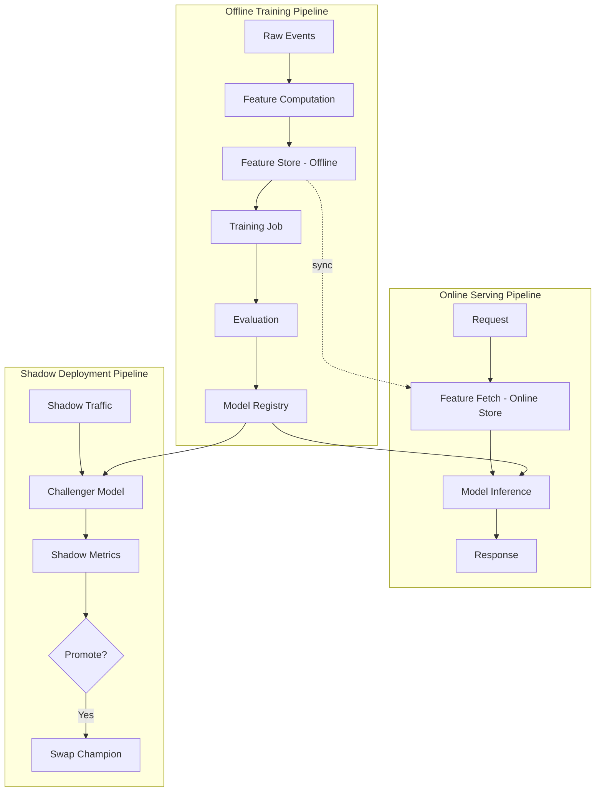
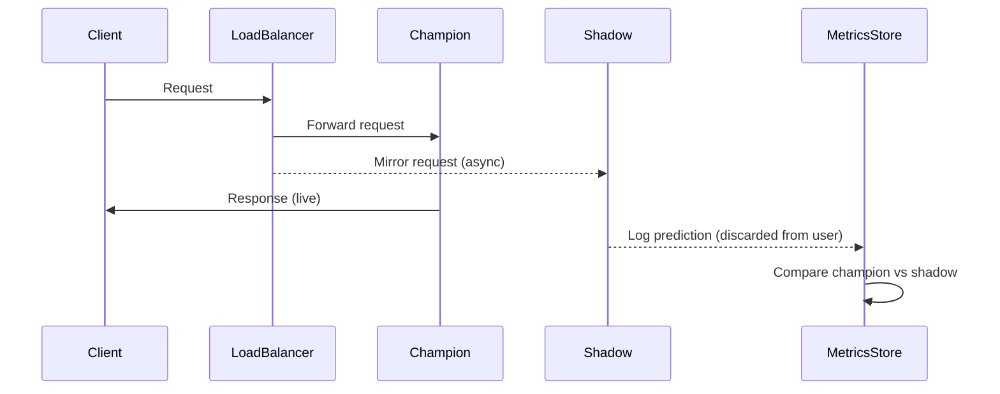
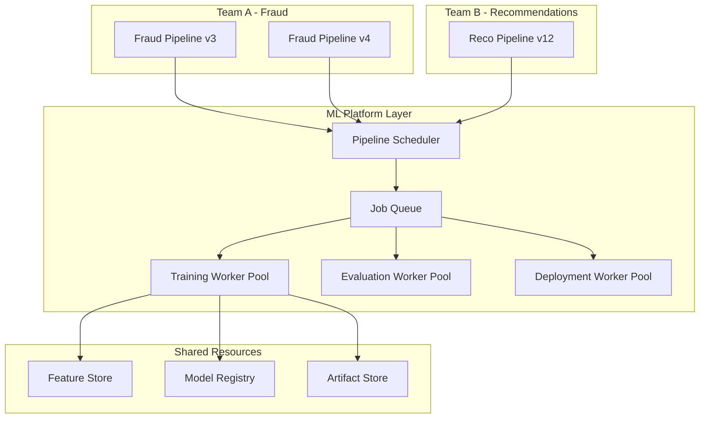

# Machine Learning Pipelines — Senior Deep Dive

## Pipeline Orchestration at Scale

Senior engineers design pipelines that handle thousands of models, petabytes of data, and sub-second latency requirements. The architecture decisions made here have lasting organizational impact.



---

## Feature Store Integration

Feature stores solve the training-serving skew problem by providing a single source of truth for features in both offline training and online inference.

### Feast Integration

```python
from feast import FeatureStore, Entity, Feature, FeatureView, FileSource, ValueType
from feast.types import Float32, Int64, String
from datetime import timedelta
import pandas as pd

# Define feature store
store = FeatureStore(repo_path="feature_repo/")

# Retrieve offline features for training (point-in-time correct)
entity_df = pd.DataFrame({
    "user_id": [100, 200, 300],
    "event_timestamp": pd.to_datetime([
        "2024-01-10", "2024-01-11", "2024-01-12"
    ]),
})

training_df = store.get_historical_features(
    entity_df=entity_df,
    features=[
        "user_stats:30d_purchase_count",
        "user_stats:avg_order_value",
        "user_stats:days_since_last_purchase",
        "product_features:category_popularity",
    ],
).to_df()

print(f"Training data shape: {training_df.shape}")

# Retrieve online features for inference
feature_vector = store.get_online_features(
    features=[
        "user_stats:30d_purchase_count",
        "user_stats:avg_order_value",
    ],
    entity_rows=[{"user_id": 100}],
).to_dict()
```

### Feature Definition

```python
# feature_repo/features.py
from feast import Entity, Feature, FeatureView, FileSource, ValueType
from feast.types import Float32, Int64
from datetime import timedelta

user = Entity(name="user_id", value_type=ValueType.INT64, description="User identifier")

user_stats_source = FileSource(
    path="s3://my-bucket/features/user_stats/*.parquet",
    event_timestamp_column="event_timestamp",
    created_timestamp_column="created_timestamp",
)

user_stats_fv = FeatureView(
    name="user_stats",
    entities=["user_id"],
    ttl=timedelta(days=90),
    features=[
        Feature(name="30d_purchase_count", dtype=Int64),
        Feature(name="avg_order_value", dtype=Float32),
        Feature(name="days_since_last_purchase", dtype=Int64),
        Feature(name="churn_risk_score", dtype=Float32),
    ],
    source=user_stats_source,
)
```

---

## Online/Offline Skew

Training-serving skew is one of the most insidious production ML bugs. Features computed offline during training differ from features computed online during serving.

### Common Causes and Mitigations

| Cause | Example | Mitigation |
|-------|---------|-----------|
| Different aggregation windows | 7d avg in training, 8d at serving | Pin feature computation to identical code |
| Time zone handling | UTC vs local time in aggregations | Use UTC everywhere, log explicitly |
| NULL handling | fillna(0) in training, NULL at serving | Use feature store for consistent logic |
| Schema drift | New category added post-training | One-hot encoder with `handle_unknown="ignore"` |
| Data freshness | Training on D-1 data, serving uses D-2 | Monitor feature freshness in production |

### Detecting Skew

```python
import numpy as np
from scipy.stats import ks_2samp
from scipy.special import kl_div

def detect_training_serving_skew(
    training_features: np.ndarray,
    serving_features: np.ndarray,
    feature_names: list,
    threshold_psi: float = 0.1,
):
    """
    Compute Population Stability Index (PSI) between training and serving.
    PSI < 0.1: No significant change
    PSI 0.1-0.2: Moderate change — investigate
    PSI > 0.2: Significant change — likely skew
    """
    results = {}
    
    for i, name in enumerate(feature_names):
        train_col = training_features[:, i]
        serve_col = serving_features[:, i]
        
        # Bin based on training distribution
        bins = np.percentile(train_col, np.linspace(0, 100, 11))
        bins = np.unique(bins)
        
        train_counts = np.histogram(train_col, bins=bins)[0]
        serve_counts = np.histogram(serve_col, bins=bins)[0]
        
        # Normalize to proportions
        train_pct = train_counts / len(train_col) + 1e-10
        serve_pct = serve_counts / len(serve_col) + 1e-10
        
        psi = np.sum((serve_pct - train_pct) * np.log(serve_pct / train_pct))
        
        # KS test for distribution difference
        ks_stat, ks_pval = ks_2samp(train_col, serve_col)
        
        results[name] = {
            "psi": psi,
            "ks_statistic": ks_stat,
            "ks_pvalue": ks_pval,
            "skew_detected": psi > threshold_psi,
        }
    
    return results
```

---

## Shadow Deployments

Shadow deployments let you test a new model on real production traffic without affecting users. The challenger model receives a copy of every request but its outputs are discarded.



### Shadow Deployment Implementation

```python
import asyncio
import httpx
import logging
from typing import Optional

logger = logging.getLogger(__name__)

async def shadow_predict(
    request_payload: dict,
    champion_url: str,
    challenger_url: str,
    metrics_client,
) -> dict:
    """
    Send request to champion (blocking) and challenger (non-blocking shadow).
    Returns champion response — challenger runs in background.
    """
    
    async def call_challenger():
        try:
            async with httpx.AsyncClient(timeout=5.0) as client:
                resp = await client.post(f"{challenger_url}/predict", json=request_payload)
                challenger_pred = resp.json()
                
                # Log for comparison — don't return to user
                metrics_client.log_shadow_prediction(
                    request_id=request_payload.get("request_id"),
                    challenger_score=challenger_pred.get("score"),
                    challenger_label=challenger_pred.get("label"),
                )
        except Exception as e:
            logger.warning(f"Shadow call failed: {e}")
    
    # Champion call (blocking)
    async with httpx.AsyncClient(timeout=2.0) as client:
        resp = await client.post(f"{champion_url}/predict", json=request_payload)
        champion_response = resp.json()
    
    # Challenger call (fire and forget)
    asyncio.create_task(call_challenger())
    
    return champion_response
```

### Shadow Metrics Analysis

```python
import pandas as pd
from scipy.stats import wilcoxon

def analyze_shadow_results(shadow_logs_df: pd.DataFrame):
    """Compare champion vs challenger on production traffic."""
    
    # Score distribution comparison
    champion_scores = shadow_logs_df["champion_score"]
    challenger_scores = shadow_logs_df["challenger_score"]
    
    # Statistical test for score difference
    stat, pval = wilcoxon(champion_scores, challenger_scores)
    
    # Agreement rate (for classification)
    agreement = (
        shadow_logs_df["champion_label"] == shadow_logs_df["challenger_label"]
    ).mean()
    
    # Latency comparison
    latency_improvement = (
        shadow_logs_df["champion_latency_ms"].mean() -
        shadow_logs_df["challenger_latency_ms"].mean()
    )
    
    return {
        "n_requests": len(shadow_logs_df),
        "score_diff_pvalue": pval,
        "significant_diff": pval < 0.05,
        "label_agreement_rate": agreement,
        "latency_delta_ms": latency_improvement,
        "challenger_is_faster": latency_improvement > 0,
    }
```

---

## A/B Testing Pipelines

When shadow testing validates the challenger, A/B testing measures real business impact by routing a fraction of live traffic.

```python
import hashlib
from enum import Enum

class ModelVariant(str, Enum):
    CHAMPION = "champion"
    CHALLENGER_A = "challenger_a"
    CHALLENGER_B = "challenger_b"

def assign_variant(
    user_id: str,
    experiment_id: str,
    traffic_split: dict,  # {"champion": 0.8, "challenger_a": 0.2}
) -> ModelVariant:
    """
    Deterministically assign users to variants using consistent hashing.
    Same user always gets the same variant.
    """
    hash_input = f"{experiment_id}:{user_id}"
    hash_value = int(hashlib.md5(hash_input.encode()).hexdigest(), 16)
    bucket = (hash_value % 1000) / 1000.0  # 0.000 to 0.999
    
    cumulative = 0.0
    for variant, fraction in traffic_split.items():
        cumulative += fraction
        if bucket < cumulative:
            return ModelVariant(variant)
    
    return ModelVariant.CHAMPION  # fallback


class ABTestingRouter:
    def __init__(self, experiment_config: dict):
        self.config = experiment_config
        self.models = {
            "champion": load_model(experiment_config["champion_uri"]),
            "challenger_a": load_model(experiment_config["challenger_a_uri"]),
        }
    
    def predict(self, user_id: str, features: dict) -> dict:
        variant = assign_variant(
            user_id=user_id,
            experiment_id=self.config["experiment_id"],
            traffic_split=self.config["traffic_split"],
        )
        
        model = self.models[variant.value]
        score = model.predict_proba([list(features.values())])[0][1]
        
        return {
            "score": float(score),
            "variant": variant.value,
            "experiment_id": self.config["experiment_id"],
        }
```

### Statistical Significance for A/B Tests

```python
from scipy import stats
import numpy as np

def ab_test_significance(
    control_conversions: int,
    control_n: int,
    treatment_conversions: int,
    treatment_n: int,
    alpha: float = 0.05,
):
    """Two-proportion z-test for A/B test results."""
    
    p_control = control_conversions / control_n
    p_treatment = treatment_conversions / treatment_n
    
    # Pooled proportion
    p_pool = (control_conversions + treatment_conversions) / (control_n + treatment_n)
    
    # Standard error
    se = np.sqrt(p_pool * (1 - p_pool) * (1/control_n + 1/treatment_n))
    
    # Z-statistic
    z = (p_treatment - p_control) / se
    
    # Two-tailed p-value
    pvalue = 2 * (1 - stats.norm.cdf(abs(z)))
    
    # Relative lift
    lift = (p_treatment - p_control) / p_control
    
    # Required sample size for 80% power
    effect_size = abs(p_treatment - p_control) / np.sqrt(p_pool * (1 - p_pool))
    required_n = int(stats.norm.ppf(0.8) ** 2 / effect_size ** 2 + stats.norm.ppf(1 - alpha/2) ** 2 / effect_size ** 2)
    
    return {
        "control_rate": p_control,
        "treatment_rate": p_treatment,
        "relative_lift": lift,
        "z_statistic": z,
        "pvalue": pvalue,
        "significant": pvalue < alpha,
        "recommended_min_n": required_n,
    }
```

---

## Multi-Tenant Pipeline Architecture

Large organizations run hundreds of pipelines sharing the same infrastructure.



### Pipeline Isolation and Resource Quotas

```python
from dataclasses import dataclass
from typing import Optional

@dataclass
class PipelineConfig:
    team: str
    pipeline_name: str
    max_cpu_cores: int
    max_memory_gb: int
    max_gpu_count: int
    priority: int  # 0=low, 1=normal, 2=high
    cost_center: str
    max_concurrent_runs: int = 3
    timeout_hours: Optional[int] = 24

# Team quotas
TEAM_QUOTAS = {
    "fraud": PipelineConfig(
        team="fraud",
        pipeline_name="fraud-detection",
        max_cpu_cores=64,
        max_memory_gb=256,
        max_gpu_count=4,
        priority=2,  # High priority — fraud is business critical
        cost_center="risk-engineering",
    ),
    "recommendations": PipelineConfig(
        team="recommendations",
        pipeline_name="recommendation-engine",
        max_cpu_cores=128,
        max_memory_gb=512,
        max_gpu_count=8,
        priority=1,
        cost_center="growth-engineering",
    ),
}
```

---

## Pipeline SLAs and Alerting

```python
import time
from functools import wraps
from dataclasses import dataclass, field
from typing import Callable, Optional
import boto3  # or your preferred notification client

@dataclass
class PipelineSLA:
    max_duration_hours: float
    max_failure_rate: float = 0.05  # 5% failure rate threshold
    alert_on_violation: bool = True
    pagerduty_service_key: Optional[str] = None

def pipeline_sla_monitor(sla: PipelineSLA):
    """Decorator that enforces SLA on pipeline runs."""
    def decorator(func: Callable):
        @wraps(func)
        def wrapper(*args, **kwargs):
            start = time.time()
            try:
                result = func(*args, **kwargs)
                elapsed_hours = (time.time() - start) / 3600
                
                if elapsed_hours > sla.max_duration_hours:
                    send_alert(
                        f"Pipeline SLA violated: took {elapsed_hours:.1f}h "
                        f"(SLA: {sla.max_duration_hours}h)"
                    )
                return result
            except Exception as e:
                send_alert(f"Pipeline FAILED: {e}")
                raise
        return wrapper
    return decorator

@pipeline_sla_monitor(PipelineSLA(max_duration_hours=4.0))
def run_daily_training_pipeline():
    # ... pipeline logic
    pass
```

---

## Interview Tips

> **Tip 1:** "How do you prevent training-serving skew at scale?" — "Use a feature store as the single source of truth. The same feature computation code runs in both the offline pipeline (for training) and the online serving layer. Feast and Tecton both provide this — you define features once and get consistent values whether fetching 1 row online or 10M rows offline."

> **Tip 2:** "When do you promote a challenger to champion?" — "I look at three gates: (1) statistical significance in A/B test business metrics with sufficient sample size, (2) no regression in latency or error rate SLAs, and (3) shadow test agreement rate above a threshold (e.g., 95% same prediction direction). All three must pass before automatic promotion. Champion rollback should be automatic if production metrics degrade within 24h."

> **Tip 3:** "How do you handle 100+ models on the same ML platform?" — "Enforce quotas per team (CPU, GPU, memory, concurrent runs), use priority queues so business-critical pipelines preempt batch jobs, and implement cost attribution so teams can see their spend. Shared feature stores and model registries reduce duplication. Standardize pipeline templates — most teams need the same 5-stage flow, just with different models."

> **Tip 4:** "What's the difference between shadow deployment and canary deployment?" — "Shadow: 100% of traffic goes to the champion, a copy goes to the challenger — users see zero impact, you observe model behavior risk-free. Canary: a small percentage (e.g., 5%) of users get the new model for real — you measure actual business impact but risk degraded experience for that slice. Use shadow first to validate model quality, then canary to measure business lift."

## ⚡ Cheat Sheet

**Pipeline Stage Summary**
1. Raw Events → Feature Computation → Feature Store (Offline)
2. Training Job → Evaluation → Model Registry
3. Shadow Deployment → compare champion vs challenger (no user impact)
4. Canary (5% live traffic) → A/B test (business metrics) → Promote champion

**Shadow vs Canary — Decision Rule**
- **Shadow first**: validate model quality risk-free (100% to champion, copy to challenger)
- **Canary next**: small % (5-10%) of real users; measures business lift
- Never skip shadow for architecturally different models or high-stakes decisions

**PSI Thresholds for Skew Detection**
- PSI < 0.1: no skew
- PSI 0.1–0.2: investigate
- PSI > 0.2: significant skew → likely training-serving mismatch

**Promotion Gates (All Must Pass)**
1. A/B test statistical significance (p < 0.05) with sufficient sample size
2. No latency/error rate regression vs SLA
3. Shadow test label agreement rate > threshold (e.g., 95%)

**A/B Test Statistics**
```python
# Two-proportion z-test
p_pool = (conv_ctrl + conv_treat) / (n_ctrl + n_treat)
se = sqrt(p_pool * (1 - p_pool) * (1/n_ctrl + 1/n_treat))
z = (p_treat - p_ctrl) / se
pvalue = 2 * (1 - norm.cdf(abs(z)))
```
- Minimum sample size: compute from effect size + 80% power before launching

**Multi-Team Quota Framework**
- Enforce per-team: `max_cpu_cores`, `max_memory_gb`, `max_gpu_count`, `max_concurrent_runs`
- Priority queue: fraud/revenue-critical → `priority=2`; batch backfill → `priority=0`
- Cost attribution: tag pipeline runs by `cost_center` for chargeback

**Feature Store Integration Pattern**
```python
# Training (offline, PIT-correct)
store.get_historical_features(entity_df=..., features=[...]).to_df()
# Serving (online, < 10ms)
store.get_online_features(features=[...], entity_rows=[{"user_id": x}]).to_dict()
```
