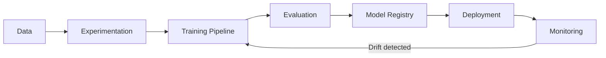
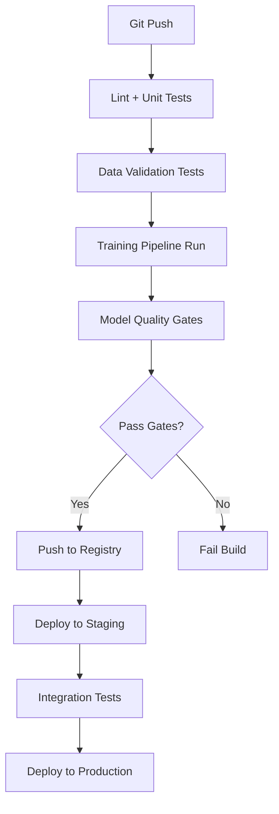

# MLOps — Fundamentals

## What Is MLOps?

MLOps (Machine Learning Operations) is the practice of applying DevOps principles to ML systems. It covers the full lifecycle: data preparation, experimentation, training, deployment, monitoring, and retraining.



---

## MLOps Maturity Levels

| Level | Description | Manual Steps |
|-------|-------------|-------------|
| 0 | Ad hoc notebooks, manual deployment | Everything |
| 1 | Automated training pipeline, manual deploy | Deploy, trigger |
| 2 | Automated training + deployment, manual retraining trigger | Trigger only |
| 3 | Fully automated, continuous training on data drift | None |

Most companies aim for Level 2; Level 3 is for mature ML platforms.

---

## CI/CD for ML

Traditional CI/CD tests code. ML CI/CD additionally tests data, model quality, and infrastructure.



### GitHub Actions ML Pipeline

```yaml
# .github/workflows/ml_pipeline.yml
name: ML Training and Deployment Pipeline

on:
  push:
    branches: [main]
    paths:
      - "src/**"
      - "data/schemas/**"
  schedule:
    - cron: "0 2 * * 1"  # Weekly Monday 2am retraining

env:
  MLFLOW_TRACKING_URI: ${{ secrets.MLFLOW_TRACKING_URI }}
  AWS_DEFAULT_REGION: us-east-1

jobs:
  validate-data:
    runs-on: ubuntu-latest
    steps:
      - uses: actions/checkout@v3
      
      - name: Set up Python
        uses: actions/setup-python@v4
        with:
          python-version: "3.11"
      
      - name: Install dependencies
        run: pip install -r requirements.txt
      
      - name: Validate data schema
        run: python src/validate_data.py --config data/schemas/churn.yaml
      
      - name: Check data freshness
        run: python src/check_data_freshness.py --max-age-hours 48

  train-model:
    needs: validate-data
    runs-on: [self-hosted, gpu]
    steps:
      - uses: actions/checkout@v3
      
      - name: Configure AWS credentials
        uses: aws-actions/configure-aws-credentials@v2
        with:
          role-to-assume: ${{ secrets.AWS_ROLE_ARN }}
          aws-region: us-east-1
      
      - name: Train model
        run: |
          python src/train.py \
            --config configs/churn_model.yaml \
            --experiment-name "churn-model-ci-${{ github.sha }}"
        env:
          MLFLOW_TRACKING_URI: ${{ env.MLFLOW_TRACKING_URI }}
      
      - name: Evaluate model
        run: python src/evaluate.py --min-auc 0.80 --min-f1 0.75

  deploy-staging:
    needs: train-model
    runs-on: ubuntu-latest
    environment: staging
    steps:
      - name: Deploy to staging
        run: |
          kubectl set image deployment/churn-model \
            model-server=registry/churn-model:${{ github.sha }}
          kubectl rollout status deployment/churn-model -n staging

  deploy-production:
    needs: deploy-staging
    runs-on: ubuntu-latest
    environment: production
    if: github.ref == 'refs/heads/main'
    steps:
      - name: Deploy to production
        run: |
          kubectl set image deployment/churn-model \
            model-server=registry/churn-model:${{ github.sha }}
          kubectl rollout status deployment/churn-model -n production
```

---

## Model Registry

The model registry is the central store for trained models with metadata, versioning, and stage management.

### MLflow Model Registry Concepts

| Concept | Description |
|---------|-------------|
| Registered Model | A named model (e.g., "churn-classifier") |
| Model Version | A specific trained instance with run_id, metrics |
| Stage | Lifecycle stage: None → Staging → Production → Archived |
| Alias | Human-readable pointer: "champion", "challenger" |

```python
import mlflow
from mlflow.tracking import MlflowClient

mlflow.set_tracking_uri("https://mlflow.company.com")
client = MlflowClient()

# Register a model from a run
run_id = "abc123def456"
model_uri = f"runs:/{run_id}/model"

model_version = mlflow.register_model(
    model_uri=model_uri,
    name="churn-classifier",
    tags={
        "training_auc": "0.891",
        "training_data_version": "2024-01-15",
        "git_sha": "a1b2c3d4",
        "team": "growth",
    },
)

print(f"Registered version: {model_version.version}")

# Transition to staging for testing
client.transition_model_version_stage(
    name="churn-classifier",
    version=model_version.version,
    stage="Staging",
    archive_existing_versions=False,
)

# After testing, promote to production
client.transition_model_version_stage(
    name="churn-classifier",
    version=model_version.version,
    stage="Production",
    archive_existing_versions=True,  # Archive old production
)

# Load production model (in serving)
production_model = mlflow.sklearn.load_model("models:/churn-classifier/Production")
```

---

## Experiment Tracking vs Production Tracking

| Dimension | Experiment Tracking | Production Tracking |
|-----------|--------------------|--------------------|
| Purpose | Compare model variants | Monitor deployed model |
| When | During development | In production |
| What | Params, metrics, artifacts | Prediction distributions, latency, drift |
| Tools | MLflow, W&B | Prometheus, Grafana, Evidently |
| Frequency | Per run | Real-time / hourly |

---

## ML-Specific Testing

```python
# tests/test_model.py
import pytest
import numpy as np
import pandas as pd
import joblib
from sklearn.metrics import roc_auc_score

@pytest.fixture
def model():
    return joblib.load("models/churn_model_v2.joblib")

@pytest.fixture
def test_data():
    return pd.read_parquet("tests/fixtures/test_data.parquet")


class TestModelQuality:
    def test_model_loads(self, model):
        """Model file is valid and loads without errors."""
        assert model is not None
    
    def test_prediction_shape(self, model, test_data):
        """Model produces correct output shape."""
        X = test_data.drop("label", axis=1)
        preds = model.predict_proba(X)
        assert preds.shape == (len(X), 2)
        assert preds.min() >= 0 and preds.max() <= 1
    
    def test_auc_above_threshold(self, model, test_data):
        """Model meets minimum AUC requirement."""
        X = test_data.drop("label", axis=1)
        y = test_data["label"]
        auc = roc_auc_score(y, model.predict_proba(X)[:, 1])
        assert auc >= 0.80, f"AUC {auc:.4f} below minimum 0.80"
    
    def test_no_nan_predictions(self, model, test_data):
        """Model never produces NaN predictions."""
        X = test_data.drop("label", axis=1)
        preds = model.predict_proba(X)
        assert not np.isnan(preds).any()
    
    def test_score_distribution(self, model, test_data):
        """Score distribution is not degenerate (all 0 or all 1)."""
        X = test_data.drop("label", axis=1)
        scores = model.predict_proba(X)[:, 1]
        assert scores.std() > 0.01, "Score distribution is too narrow (degenerate model)"
    
    def test_minority_class_recall(self, model, test_data):
        """Model recalls at least 60% of churned users (fraud/churn specific)."""
        from sklearn.metrics import recall_score
        X = test_data.drop("label", axis=1)
        y = test_data["label"]
        y_pred = model.predict(X)
        recall = recall_score(y, y_pred)
        assert recall >= 0.60, f"Recall {recall:.4f} below minimum 0.60"


class TestDataSchema:
    def test_required_features_present(self, test_data):
        """All required features exist in test data."""
        required = ["age", "tenure_months", "monthly_spend", "plan_type"]
        missing = [f for f in required if f not in test_data.columns]
        assert not missing, f"Missing features: {missing}"
    
    def test_no_future_dates(self, test_data):
        """No features derived from future timestamps."""
        if "last_login_date" in test_data.columns:
            max_date = pd.to_datetime(test_data["last_login_date"]).max()
            assert max_date < pd.Timestamp.now()
```

---

## Environment Management

```yaml
# conda.yaml
name: churn-model-env
channels:
  - conda-forge
  - defaults
dependencies:
  - python=3.11
  - pip:
    - scikit-learn==1.4.0
    - mlflow==2.9.2
    - pandas==2.1.4
    - numpy==1.26.3
    - joblib==1.3.2
```

```python
# requirements.txt — pinned for reproducibility
scikit-learn==1.4.0
mlflow==2.9.2
pandas==2.1.4
numpy==1.26.3
xgboost==2.0.3
lightgbm==4.2.0
fastapi==0.109.0
uvicorn==0.27.0
pydantic==2.5.3
```

---

## Interview Tips

> **Tip 1:** "What's the difference between MLOps and DevOps?" — "DevOps manages code and infrastructure. MLOps adds management of data (versioned, validated), models (registered, staged), and experiments (tracked, reproducible). A key difference is non-determinism — the same code on different data produces different models, so you must version and track far more artifacts. Also, ML systems degrade silently (model drift) in ways software rarely does."

> **Tip 2:** "What gates should a model pass before production?" — "Minimum quality gates: (1) AUC/F1 above threshold on held-out test set, (2) no regression vs. current production model (new model must be at least as good), (3) prediction distribution sanity check (not degenerate), (4) latency meets SLA, (5) shadow deployment passes if available. Add business gates for sensitive applications: fairness checks, calibration checks."

> **Tip 3:** "Why do you need a model registry separate from artifact storage?" — "Model registry adds governance: stage transitions (Staging → Production), aliasing ('champion'/'challenger'), metadata (training metrics, data version, team owner), and lineage (which data produced which model). S3 is just a file store — it doesn't track what version is in production, who approved it, or what business metrics it achieved. MLflow's registry enforces these workflows."

> **Tip 4:** "How is CI/CD for ML different from software CI/CD?" — "Software CI/CD validates code correctness — tests pass or fail deterministically. ML CI/CD validates statistical properties — 'does this model achieve AUC > 0.80?' — which requires running the full training pipeline on every commit. This means ML CI/CD jobs take minutes to hours (not seconds), require GPU compute, and need data access. The feedback loop is much slower, making fast failure detection critical."
