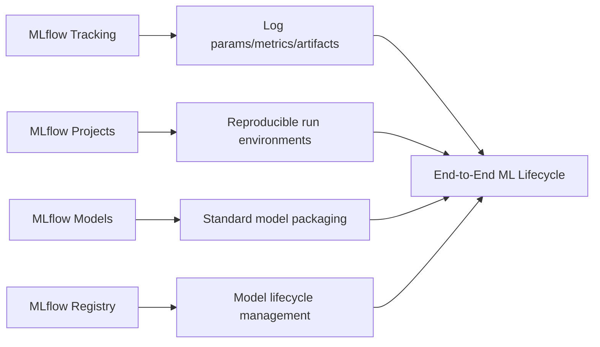

# MLOps — Intermediate

## MLflow Full Stack

MLflow provides four integrated components: Tracking, Projects, Models, and Registry.



### Complete MLflow Tracking Example

```python
import mlflow
import mlflow.sklearn
import mlflow.xgboost
from mlflow.models import infer_signature
import pandas as pd
import numpy as np
from sklearn.model_selection import cross_val_score, StratifiedKFold
from sklearn.metrics import roc_auc_score, f1_score, precision_score, recall_score, confusion_matrix
import xgboost as xgb
import matplotlib.pyplot as plt
import seaborn as sns
from datetime import datetime
import subprocess

def get_git_info():
    try:
        sha = subprocess.check_output(["git", "rev-parse", "HEAD"]).decode().strip()
        branch = subprocess.check_output(["git", "rev-parse", "--abbrev-ref", "HEAD"]).decode().strip()
        return sha, branch
    except:
        return "unknown", "unknown"


def train_with_full_tracking(
    X_train, y_train, X_test, y_test,
    params: dict,
    experiment_name: str = "churn-model",
    run_name: str = None,
):
    mlflow.set_experiment(experiment_name)
    
    git_sha, git_branch = get_git_info()
    run_name = run_name or f"xgb-{datetime.now().strftime('%Y%m%d_%H%M%S')}"
    
    with mlflow.start_run(run_name=run_name) as run:
        # ── Tags ─────────────────────────────────────────────
        mlflow.set_tags({
            "model_type": "XGBoost",
            "team": "growth",
            "git_sha": git_sha,
            "git_branch": git_branch,
            "data_version": "2024-01-15",
            "environment": "dev",
        })
        
        # ── Parameters ──────────────────────────────────────
        mlflow.log_params(params)
        mlflow.log_param("n_train", len(X_train))
        mlflow.log_param("n_test", len(X_test))
        mlflow.log_param("n_features", X_train.shape[1])
        mlflow.log_param("class_balance", float(y_train.mean()))
        
        # ── Training ─────────────────────────────────────────
        model = xgb.XGBClassifier(**params, random_state=42, eval_metric="logloss")
        
        # Training with eval set for learning curves
        eval_set = [(X_train, y_train), (X_test, y_test)]
        model.fit(
            X_train, y_train,
            eval_set=eval_set,
            verbose=False,
        )
        
        # Log training curves
        results = model.evals_result()
        for epoch, (train_loss, test_loss) in enumerate(zip(
            results["validation_0"]["logloss"],
            results["validation_1"]["logloss"],
        )):
            mlflow.log_metric("train_logloss", train_loss, step=epoch)
            mlflow.log_metric("val_logloss", test_loss, step=epoch)
        
        # ── Metrics ──────────────────────────────────────────
        y_prob = model.predict_proba(X_test)[:, 1]
        y_pred = model.predict(X_test)
        
        metrics = {
            "test_auc": roc_auc_score(y_test, y_prob),
            "test_f1": f1_score(y_test, y_pred),
            "test_precision": precision_score(y_test, y_pred),
            "test_recall": recall_score(y_test, y_pred),
            "train_auc": roc_auc_score(y_train, model.predict_proba(X_train)[:, 1]),
        }
        mlflow.log_metrics(metrics)
        
        # Cross-validation metrics
        cv = StratifiedKFold(n_splits=5, shuffle=True, random_state=42)
        cv_scores = cross_val_score(model, X_train, y_train, cv=cv, scoring="roc_auc")
        mlflow.log_metric("cv_auc_mean", cv_scores.mean())
        mlflow.log_metric("cv_auc_std", cv_scores.std())
        
        # ── Artifacts ────────────────────────────────────────
        # Confusion matrix
        cm = confusion_matrix(y_test, y_pred)
        fig, ax = plt.subplots(figsize=(6, 5))
        sns.heatmap(cm, annot=True, fmt="d", ax=ax)
        ax.set_title("Confusion Matrix")
        mlflow.log_figure(fig, "confusion_matrix.png")
        plt.close()
        
        # Feature importance plot
        fig, ax = plt.subplots(figsize=(10, 8))
        xgb.plot_importance(model, ax=ax, max_num_features=20)
        mlflow.log_figure(fig, "feature_importance.png")
        plt.close()
        
        # ── Log Model ────────────────────────────────────────
        signature = infer_signature(X_train, y_prob)
        
        mlflow.xgboost.log_model(
            xgb_model=model,
            artifact_path="model",
            signature=signature,
            registered_model_name="churn-xgboost",
            input_example=X_train.iloc[:5],
        )
        
        print(f"Run ID: {run.info.run_id}")
        print(f"Test AUC: {metrics['test_auc']:.4f}")
        print(f"CV AUC: {cv_scores.mean():.4f} ± {cv_scores.std():.4f}")
        
        return run.info.run_id, metrics
```

---

## DVC (Data Version Control)

DVC extends git for data and model versioning, with built-in pipeline management.

### DVC Setup

```bash
# Initialize DVC in existing git repo
git init
dvc init
git add .dvc/
git commit -m "Initialize DVC"

# Configure remote storage
dvc remote add -d s3remote s3://my-bucket/dvc-store
dvc remote modify s3remote region us-east-1
git add .dvc/config
git commit -m "Configure DVC S3 remote"

# Track a large dataset
dvc add data/raw/churn_data.parquet
git add data/raw/churn_data.parquet.dvc .gitignore
git commit -m "Track churn dataset with DVC"
dvc push  # Upload to S3
```

### DVC Pipeline

```yaml
# dvc.yaml
stages:
  preprocess:
    cmd: python src/preprocess.py
    deps:
      - src/preprocess.py
      - data/raw/churn_data.parquet
    params:
      - params.yaml:
        - preprocess.test_size
        - preprocess.random_seed
    outs:
      - data/processed/train.parquet
      - data/processed/test.parquet

  train:
    cmd: python src/train.py
    deps:
      - src/train.py
      - data/processed/train.parquet
    params:
      - params.yaml:
        - model.n_estimators
        - model.learning_rate
        - model.max_depth
    outs:
      - models/churn_model.pkl
    metrics:
      - metrics/scores.json:
          cache: false

  evaluate:
    cmd: python src/evaluate.py
    deps:
      - src/evaluate.py
      - models/churn_model.pkl
      - data/processed/test.parquet
    metrics:
      - metrics/test_scores.json:
          cache: false
    plots:
      - metrics/roc_curve.csv:
          x: fpr
          y: tpr
```

```yaml
# params.yaml
preprocess:
  test_size: 0.2
  random_seed: 42

model:
  n_estimators: 200
  learning_rate: 0.05
  max_depth: 5
  subsample: 0.8
  colsample_bytree: 0.8
```

```python
# src/train.py — DVC-aware training script
import dvc.api
import yaml
import json
import mlflow
from pathlib import Path

# Load params (tracked by DVC)
with open("params.yaml") as f:
    params = yaml.safe_load(f)

# Load processed data
import pandas as pd
train = pd.read_parquet("data/processed/train.parquet")

X_train = train.drop("churned", axis=1)
y_train = train["churned"]

# Train
from xgboost import XGBClassifier
model = XGBClassifier(**params["model"], random_state=42)
model.fit(X_train, y_train)

# Save model (DVC tracks this)
import joblib
Path("models").mkdir(exist_ok=True)
joblib.dump(model, "models/churn_model.pkl")

# Save metrics (DVC tracks these)
from sklearn.metrics import roc_auc_score
train_auc = roc_auc_score(y_train, model.predict_proba(X_train)[:, 1])

Path("metrics").mkdir(exist_ok=True)
with open("metrics/scores.json", "w") as f:
    json.dump({"train_auc": train_auc, "n_estimators": params["model"]["n_estimators"]}, f)
```

```bash
# Run pipeline
dvc repro

# Compare metrics across experiments
dvc metrics show
dvc metrics diff HEAD~1  # Compare with last commit

# Visualize plots
dvc plots show

# Reproduce specific version
git checkout v1.2.0
dvc checkout  # Restores data and models for that commit
```

---

## Automated Retraining Triggers

Models should be retrained when data distribution shifts, not on a fixed calendar.

### Drift-Based Retraining

```python
from dataclasses import dataclass
from typing import Callable, Optional
import numpy as np

@dataclass
class RetrainingConfig:
    # Data drift thresholds
    psi_threshold: float = 0.2          # Population Stability Index
    ks_pvalue_threshold: float = 0.01   # KS test p-value
    
    # Performance thresholds
    auc_degradation_pct: float = 0.05   # 5% relative AUC drop
    
    # Scheduled fallback
    max_days_without_retraining: int = 30
    
    # Notification
    slack_webhook: Optional[str] = None


class RetrainingTrigger:
    """
    Evaluates multiple signals to decide if retraining is needed.
    Avoids unnecessary retraining (expensive) while catching real drift.
    """
    
    def __init__(self, config: RetrainingConfig, notify_fn: Optional[Callable] = None):
        self.config = config
        self.notify = notify_fn
    
    def should_retrain(
        self,
        current_psi: float,
        current_ks_pvalue: float,
        baseline_auc: float,
        current_auc: float,
        days_since_last_training: int,
    ) -> dict:
        reasons = []
        
        # Check data drift
        if current_psi > self.config.psi_threshold:
            reasons.append(f"Data drift: PSI={current_psi:.3f} > threshold={self.config.psi_threshold}")
        
        if current_ks_pvalue < self.config.ks_pvalue_threshold:
            reasons.append(f"Distribution shift: KS p-value={current_ks_pvalue:.4f}")
        
        # Check performance degradation
        auc_drop = (baseline_auc - current_auc) / baseline_auc
        if auc_drop > self.config.auc_degradation_pct:
            reasons.append(f"Performance drop: AUC declined {auc_drop:.1%} (from {baseline_auc:.4f} to {current_auc:.4f})")
        
        # Check scheduled retraining
        if days_since_last_training >= self.config.max_days_without_retraining:
            reasons.append(f"Scheduled: {days_since_last_training} days since last training")
        
        should = len(reasons) > 0
        
        if should and self.notify:
            self.notify(f"Retraining triggered: {'; '.join(reasons)}")
        
        return {
            "should_retrain": should,
            "reasons": reasons,
            "psi": current_psi,
            "auc_drop_pct": auc_drop * 100,
            "days_since_training": days_since_last_training,
        }
```

### Airflow-Orchestrated Retraining DAG

```python
from airflow import DAG
from airflow.operators.python import PythonOperator, BranchPythonOperator
from airflow.operators.bash import BashOperator
from airflow.utils.dates import days_ago
from datetime import timedelta

def check_retraining_needed(**context):
    """Check if retraining is needed based on drift signals."""
    from drift_monitor import load_drift_report
    
    report = load_drift_report()
    trigger = RetrainingTrigger(RetrainingConfig())
    
    result = trigger.should_retrain(**report)
    context["ti"].xcom_push("retraining_decision", result)
    
    return "train_model" if result["should_retrain"] else "skip_training"


def train_model(**context):
    """Run training pipeline."""
    import subprocess
    result = subprocess.run(
        ["python", "src/train.py", "--config", "configs/churn.yaml"],
        capture_output=True, text=True, check=True,
    )
    print(result.stdout)


def evaluate_and_register(**context):
    """Evaluate model and register if it passes gates."""
    import mlflow, json
    
    with open("metrics/test_scores.json") as f:
        metrics = json.load(f)
    
    if metrics["test_auc"] < 0.80:
        raise ValueError(f"Model quality below threshold: AUC={metrics['test_auc']}")
    
    client = mlflow.tracking.MlflowClient()
    # ... register model


with DAG(
    dag_id="ml_retraining_pipeline",
    schedule_interval="@daily",
    start_date=days_ago(1),
    catchup=False,
    default_args={"retries": 2, "retry_delay": timedelta(minutes=5)},
    tags=["ml", "churn"],
) as dag:
    
    check_drift = BranchPythonOperator(
        task_id="check_retraining_needed",
        python_callable=check_retraining_needed,
    )
    
    train = PythonOperator(
        task_id="train_model",
        python_callable=train_model,
    )
    
    evaluate = PythonOperator(
        task_id="evaluate_and_register",
        python_callable=evaluate_and_register,
    )
    
    skip = BashOperator(
        task_id="skip_training",
        bash_command="echo 'No retraining needed'",
    )
    
    check_drift >> [train, skip]
    train >> evaluate
```

---

## Interview Tips

> **Tip 1:** "How does DVC differ from git-lfs for data versioning?" — "git-lfs stores large files in a separate LFS server but still through git protocol. DVC stores data in any remote (S3, GCS, Azure) and manages a small pointer file (.dvc) in git. DVC also adds pipeline management (dvc.yaml stages), metrics tracking, and data registry features. DVC is more ML-focused; git-lfs is more general."

> **Tip 2:** "What triggers automatic retraining in a mature MLOps system?" — "Three signals: (1) data drift — PSI > threshold on key features, indicating distribution shift; (2) performance degradation — AUC drops >5% from baseline on a holdout set sampled from recent production data; (3) time-based fallback — even if no drift is detected, retrain every 30 days to incorporate recent examples. Avoid retraining on every data point — it's expensive and may not improve the model."

> **Tip 3:** "What's the purpose of DVC stages vs just running scripts?" — "DVC stages track dependencies (inputs) and outputs declaratively. DVC computes hashes of all dependencies and only reruns stages where inputs changed — identical to make but for ML pipelines. This provides: (1) incremental execution, (2) reproducibility (same inputs → same outputs), (3) version control for pipeline definitions alongside data."

> **Tip 4:** "How do you test an ML pipeline in CI without running full training?" — "Use smoke tests with a tiny dataset (100 rows) to verify the pipeline runs end-to-end without errors. Run full training only on merge to main, not on every PR. Also test: schema validation (data contracts), unit tests for feature transformations (deterministic, no model), and integration tests with mock model predictions."
