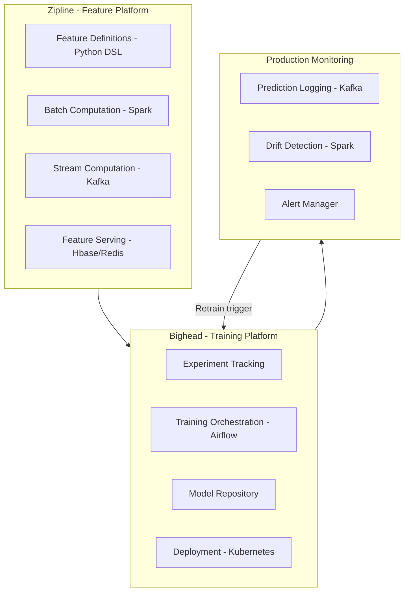

# MLOps — Real World Patterns

## Airbnb's Bighead / Zipline ML Platform

Airbnb built Bighead (training platform) and Zipline (feature store) to standardize ML across dozens of teams and hundreds of models.

### Key Architectural Decisions



### Airbnb-Style Feature Definition (Python DSL)

```python
from datetime import timedelta
from typing import List

class Feature:
    """Airbnb Zipline-style feature definition DSL."""
    
    def __init__(self, name: str, entity: str, source: str, ttl: timedelta):
        self.name = name
        self.entity = entity
        self.source = source
        self.ttl = ttl
    
    def __repr__(self):
        return f"Feature({self.name}, entity={self.entity}, ttl={self.ttl})"


class GroupBy:
    """Define aggregated feature group — analogous to Airbnb's GroupBy."""
    
    def __init__(
        self,
        name: str,
        source: str,
        keys: List[str],
        aggregations: List[dict],
        windows: List[str],
    ):
        self.name = name
        self.source = source
        self.keys = keys
        self.aggregations = aggregations
        self.windows = windows
    
    def to_spark_query(self, spark):
        """Generate Spark SQL for batch computation."""
        aggs = []
        for window in self.windows:
            for agg in self.aggregations:
                col = agg["column"]
                func = agg["function"]
                alias = f"{func}_{col}_{window}"
                aggs.append(f"{func}({col}) OVER (PARTITION BY {', '.join(self.keys)} "
                           f"ORDER BY event_ts "
                           f"ROWS BETWEEN INTERVAL '{window}' PRECEDING AND CURRENT ROW) AS {alias}")
        
        return f"""
            SELECT {', '.join(self.keys)}, {', '.join(aggs)}
            FROM {self.source}
        """


# Define features for listing price recommendation
host_activity_features = GroupBy(
    name="host_activity_30d",
    source="host_events",
    keys=["host_id"],
    aggregations=[
        {"column": "listing_views", "function": "SUM"},
        {"column": "booking_requests", "function": "COUNT"},
        {"column": "response_time_minutes", "function": "AVG"},
    ],
    windows=["7 DAYS", "30 DAYS", "90 DAYS"],
)

listing_booking_features = GroupBy(
    name="listing_booking_stats",
    source="booking_events",
    keys=["listing_id"],
    aggregations=[
        {"column": "booking_price", "function": "AVG"},
        {"column": "occupancy_rate", "function": "AVG"},
        {"column": "cancellation_count", "function": "SUM"},
    ],
    windows=["7 DAYS", "30 DAYS"],
)
```

---

## LinkedIn's Pro-ML Platform

LinkedIn's approach: every ML model follows the same lifecycle through a unified platform with built-in compliance.

### Prediction Service Architecture

```python
from typing import Optional, Dict, Any
from dataclasses import dataclass
import time
import logging
import uuid

logger = logging.getLogger(__name__)

@dataclass
class PredictionRequest:
    model_name: str
    model_version: Optional[str]  # None = use production
    entity_id: str
    features: Dict[str, Any]
    timeout_ms: float = 100.0

@dataclass
class PredictionResponse:
    request_id: str
    model_name: str
    model_version: str
    entity_id: str
    score: float
    latency_ms: float
    metadata: Dict[str, Any]

class UnifiedPredictionService:
    """
    Single entry point for all ML predictions across the platform.
    Provides: versioning, logging, circuit breaking, rate limiting.
    Analogous to LinkedIn's approach.
    """
    
    def __init__(self, model_registry, feature_store, prediction_logger):
        self.registry = model_registry
        self.feature_store = feature_store
        self.logger = prediction_logger
        self._circuit_breakers = {}
    
    def predict(self, request: PredictionRequest) -> PredictionResponse:
        request_id = str(uuid.uuid4())
        start = time.perf_counter()
        
        try:
            # 1. Resolve model version
            version = request.model_version or self.registry.get_production_version(
                request.model_name
            )
            model = self.registry.load(request.model_name, version)
            
            # 2. Enrich with feature store features
            stored_features = self.feature_store.get_online_features(
                entity_id=request.entity_id,
                feature_group=f"{request.model_name}_features",
            )
            all_features = {**stored_features, **request.features}
            
            # 3. Inference
            score = float(model.predict_proba([list(all_features.values())])[0][1])
            
            latency_ms = (time.perf_counter() - start) * 1000
            
            response = PredictionResponse(
                request_id=request_id,
                model_name=request.model_name,
                model_version=version,
                entity_id=request.entity_id,
                score=score,
                latency_ms=latency_ms,
                metadata={"feature_count": len(all_features)},
            )
            
            # 4. Log prediction (for monitoring and retraining)
            self.logger.log_prediction(
                request_id=request_id,
                model_name=request.model_name,
                model_version=version,
                entity_id=request.entity_id,
                features=all_features,
                score=score,
                latency_ms=latency_ms,
            )
            
            return response
        
        except Exception as e:
            latency_ms = (time.perf_counter() - start) * 1000
            logger.error(f"Prediction failed: {e}", exc_info=True)
            
            # Log failure
            self.logger.log_error(
                request_id=request_id,
                model_name=request.model_name,
                error=str(e),
                latency_ms=latency_ms,
            )
            raise
```

---

## End-to-End MLOps Pipeline at Scale

A complete example of what a mature MLOps system looks like operationally.

```python
# Complete MLOps orchestration with Airflow
from airflow import DAG
from airflow.operators.python import PythonOperator
from airflow.providers.slack.operators.slack_webhook import SlackWebhookOperator
from datetime import datetime, timedelta

def check_data_quality(**context):
    """Step 1: Validate incoming data."""
    from great_expectations import DataContext
    
    context_ge = DataContext()
    suite = context_ge.get_expectation_suite("churn_data_suite")
    
    result = context_ge.run_checkpoint(
        checkpoint_name="churn_daily_checkpoint",
        validations=[{
            "batch_request": {
                "datasource_name": "churn_datasource",
                "data_connector_name": "default_runtime_data_connector",
                "data_asset_name": "churn_data",
                "runtime_parameters": {"path": f"s3://data/churn_{context['ds']}.parquet"},
            },
            "expectation_suite_name": "churn_data_suite",
        }]
    )
    
    if not result["success"]:
        raise ValueError(f"Data quality check failed: {result}")
    
    context["ti"].xcom_push("row_count", result["statistics"]["evaluated_expectations"])


def train_model(**context):
    """Step 2: Train the model with tracked hyperparameters."""
    import mlflow, yaml
    
    with open("configs/churn_model.yaml") as f:
        config = yaml.safe_load(f)
    
    mlflow.set_experiment("churn-model-prod")
    
    with mlflow.start_run(run_name=f"prod-train-{context['ds']}") as run:
        mlflow.log_params(config["model_params"])
        mlflow.set_tags({
            "trigger": "scheduled",
            "airflow_dag_run_id": context["run_id"],
            "data_date": context["ds"],
        })
        
        # ... actual training code ...
        
        context["ti"].xcom_push("run_id", run.info.run_id)


def evaluate_and_gate(**context):
    """Step 3: Quality gates before promotion."""
    import mlflow, json
    
    run_id = context["ti"].xcom_pull("run_id", task_ids="train_model")
    client = mlflow.tracking.MlflowClient()
    run = client.get_run(run_id)
    
    metrics = run.data.metrics
    
    # Gate 1: AUC above minimum
    if metrics.get("test_auc", 0) < 0.80:
        raise ValueError(f"AUC gate failed: {metrics['test_auc']:.4f} < 0.80")
    
    # Gate 2: No regression vs production
    prod_model = mlflow.sklearn.load_model("models:/churn-classifier/Production")
    import pandas as pd, numpy as np
    test_data = pd.read_parquet(f"s3://data/test/churn_holdout.parquet")
    X, y = test_data.drop("churned", axis=1), test_data["churned"]
    
    from sklearn.metrics import roc_auc_score
    prod_auc = roc_auc_score(y, prod_model.predict_proba(X)[:, 1])
    new_auc = metrics["test_auc"]
    
    if new_auc < prod_auc * 0.97:
        raise ValueError(f"Regression gate failed: new={new_auc:.4f} vs prod={prod_auc:.4f}")
    
    context["ti"].xcom_push("new_model_version", run_id)
    print(f"All gates passed. New AUC: {new_auc:.4f} vs Production: {prod_auc:.4f}")


def promote_to_production(**context):
    """Step 4: Register and promote the model."""
    import mlflow
    
    run_id = context["ti"].xcom_pull("run_id", task_ids="train_model")
    
    model_version = mlflow.register_model(
        f"runs:/{run_id}/model",
        "churn-classifier"
    )
    
    client = mlflow.tracking.MlflowClient()
    client.transition_model_version_stage(
        name="churn-classifier",
        version=model_version.version,
        stage="Production",
        archive_existing_versions=True,
    )
    
    context["ti"].xcom_push("promoted_version", model_version.version)
    print(f"Promoted version {model_version.version} to Production")


with DAG(
    dag_id="churn_model_weekly_retraining",
    schedule_interval="0 3 * * 1",  # Monday 3am
    start_date=datetime(2024, 1, 1),
    catchup=False,
    default_args={
        "owner": "growth-ml",
        "retries": 2,
        "retry_delay": timedelta(minutes=10),
        "email_on_failure": True,
        "email": ["growth-ml-alerts@company.com"],
    },
    tags=["ml", "churn", "production"],
) as dag:
    
    check_data = PythonOperator(task_id="check_data_quality", python_callable=check_data_quality)
    train = PythonOperator(task_id="train_model", python_callable=train_model)
    evaluate = PythonOperator(task_id="evaluate_and_gate", python_callable=evaluate_and_gate)
    promote = PythonOperator(task_id="promote_to_production", python_callable=promote_to_production)
    
    notify = SlackWebhookOperator(
        task_id="notify_success",
        webhook_token="{{ var.value.slack_webhook_token }}",
        message="Churn model retraining complete. Version promoted: {{ ti.xcom_pull('promoted_version', task_ids='promote_to_production') }}",
        channel="#ml-deployments",
    )
    
    check_data >> train >> evaluate >> promote >> notify
```

---

## Interview Tips

> **Tip 1:** "What were Airbnb's key insights in building Zipline?" — "Three insights: (1) Teams were computing the same features independently — a unified feature platform eliminates this duplication. (2) Training-serving skew was causing silent failures — computing features once and serving them from the same store eliminates the divergence. (3) Feature discovery was a major bottleneck for new team members — a searchable registry with ownership metadata solves onboarding."

> **Tip 2:** "How does LinkedIn handle model governance at scale?" — "Every model goes through the same promotion workflow: automated quality gates, required documentation (model card), multi-party approval, and an audit trail stored in the registry. Models are versioned with semantic versions. Every production prediction is logged for audit and retraining. The platform team enforces this workflow — teams can't deploy without it."

> **Tip 3:** "What's the most common failure mode in production MLOps systems?" — "Silent model degradation. Unlike code bugs (which crash loudly), a model that gradually decays over weeks shows no errors — it just makes slightly worse predictions. This is often the result of data drift (input distribution shifts) or concept drift (the relationship between features and target changes). Without proactive monitoring, you discover the problem via customer complaints or business metric declines — much later than ideal."

> **Tip 4:** "How do you achieve true end-to-end automation in MLOps?" — "Four components: (1) Automated data quality gates — fail fast on bad data before wasting training compute. (2) Drift-triggered retraining — don't wait for scheduled jobs if drift is detected. (3) Automated quality gates — models that fail AUC/latency checks are never deployed. (4) Automated rollback — post-deployment monitoring with automatic fallback if business metrics degrade. Human oversight at model card review and compliance stages, automation everywhere else."
