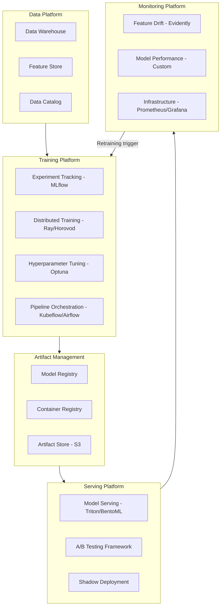

# MLOps — Senior Deep Dive

## ML Platform Architecture

An ML platform provides self-service infrastructure for teams to train, deploy, and monitor models without needing to manage infrastructure.



---

## Multi-Team MLOps Governance

When multiple teams share an ML platform, governance ensures quality, compliance, and accountability.

### Model Approval Workflow

```python
from dataclasses import dataclass, field
from typing import List, Optional
from enum import Enum
from datetime import datetime

class ApprovalStatus(str, Enum):
    PENDING = "pending"
    APPROVED = "approved"
    REJECTED = "rejected"
    NEEDS_REVISION = "needs_revision"

@dataclass
class ModelPromotion:
    """Tracks a model's journey from development to production."""
    model_name: str
    version: str
    requester: str
    team: str
    
    # Technical gates (automated)
    test_auc: float
    baseline_auc: float
    latency_p99_ms: float
    latency_sla_ms: float
    shadow_test_passed: bool
    fairness_check_passed: bool
    
    # Documentation (required)
    model_card_url: str
    data_lineage_url: str
    experiment_run_id: str
    
    # Approval chain
    technical_approver: Optional[str] = None
    technical_approved_at: Optional[datetime] = None
    technical_status: ApprovalStatus = ApprovalStatus.PENDING
    
    business_approver: Optional[str] = None
    business_approved_at: Optional[datetime] = None
    business_status: ApprovalStatus = ApprovalStatus.PENDING
    
    # For regulated models: compliance review
    compliance_review_required: bool = False
    compliance_approver: Optional[str] = None
    compliance_status: ApprovalStatus = ApprovalStatus.PENDING
    
    notes: List[str] = field(default_factory=list)
    
    @property
    def automated_gates_pass(self) -> bool:
        return (
            self.test_auc >= self.baseline_auc * 0.95  # No more than 5% regression
            and self.latency_p99_ms <= self.latency_sla_ms
            and self.shadow_test_passed
            and self.fairness_check_passed
        )
    
    @property
    def is_fully_approved(self) -> bool:
        base = (
            self.automated_gates_pass
            and self.technical_status == ApprovalStatus.APPROVED
            and self.business_status == ApprovalStatus.APPROVED
        )
        if self.compliance_review_required:
            return base and self.compliance_status == ApprovalStatus.APPROVED
        return base
    
    def reject(self, approver: str, reason: str, level: str = "technical"):
        self.notes.append(f"[{level}] {approver}: {reason}")
        if level == "technical":
            self.technical_status = ApprovalStatus.REJECTED
        elif level == "business":
            self.business_status = ApprovalStatus.REJECTED


def promote_model_to_production(promotion: ModelPromotion):
    """Only promote if all gates and approvals are satisfied."""
    
    if not promotion.automated_gates_pass:
        failures = []
        if promotion.test_auc < promotion.baseline_auc * 0.95:
            failures.append(f"AUC regression: {promotion.test_auc:.4f} vs baseline {promotion.baseline_auc:.4f}")
        if promotion.latency_p99_ms > promotion.latency_sla_ms:
            failures.append(f"Latency SLA breach: {promotion.latency_p99_ms:.1f}ms > {promotion.latency_sla_ms:.1f}ms")
        raise ValueError(f"Automated gates failed: {'; '.join(failures)}")
    
    if not promotion.is_fully_approved:
        pending = [
            role for role, status in [
                ("technical", promotion.technical_status),
                ("business", promotion.business_status),
                ("compliance", promotion.compliance_status),
            ]
            if status != ApprovalStatus.APPROVED
        ]
        raise ValueError(f"Missing approvals: {pending}")
    
    # Execute promotion
    import mlflow
    client = mlflow.tracking.MlflowClient()
    client.transition_model_version_stage(
        name=promotion.model_name,
        version=promotion.version,
        stage="Production",
        archive_existing_versions=True,
    )
    
    print(f"Model {promotion.model_name} v{promotion.version} promoted to Production")
    print(f"Approved by: {promotion.technical_approver}, {promotion.business_approver}")
```

---

## Model Cards and Documentation

Model cards are standardized documentation that describes what a model does, how it performs, and its limitations.

```python
from dataclasses import dataclass, field
from typing import List, Dict, Optional
import json

@dataclass
class ModelCard:
    """
    Model Card following Google's model card standard.
    Required for all production models in regulated industries.
    """
    
    # Model identity
    model_name: str
    version: str
    date: str
    
    # Model overview
    model_type: str
    intended_use: str
    out_of_scope_uses: List[str]
    
    # Training data
    training_data_description: str
    training_data_size: int
    training_date_range: str
    known_data_limitations: List[str]
    
    # Performance metrics
    performance_metrics: Dict[str, float]
    performance_by_subgroup: Dict[str, Dict[str, float]]  # e.g., {"age_group": {"18-25": 0.85}}
    
    # Fairness considerations
    protected_attributes_tested: List[str]
    fairness_metrics: Dict[str, float]
    fairness_limitations: List[str]
    
    # Ethical considerations
    ethical_considerations: List[str]
    potential_harms: List[str]
    mitigation_strategies: List[str]
    
    # Technical details
    input_features: List[str]
    model_architecture: str
    hyperparameters: Dict[str, object]
    
    # Owners and contact
    owner_team: str
    primary_contact: str
    review_cycle: str  # "monthly", "quarterly", etc.
    
    def to_json(self) -> str:
        return json.dumps(self.__dict__, indent=2, default=str)
    
    def to_markdown(self) -> str:
        return f"""
# Model Card: {self.model_name} v{self.version}

**Date**: {self.date}
**Owner**: {self.owner_team} | **Contact**: {self.primary_contact}

## Overview
- **Type**: {self.model_type}
- **Intended Use**: {self.intended_use}

## Performance
| Metric | Value |
|--------|-------|
{chr(10).join(f'| {k} | {v:.4f} |' for k, v in self.performance_metrics.items())}

## Fairness Analysis
Protected attributes tested: {', '.join(self.protected_attributes_tested)}

| Metric | Value |
|--------|-------|
{chr(10).join(f'| {k} | {v:.4f} |' for k, v in self.fairness_metrics.items())}

## Known Limitations
{chr(10).join(f'- {lim}' for lim in self.known_data_limitations)}

## Ethical Considerations
{chr(10).join(f'- {ec}' for ec in self.ethical_considerations)}
"""


# Example model card for churn prediction
churn_card = ModelCard(
    model_name="churn-classifier",
    version="3.2.0",
    date="2024-01-15",
    model_type="XGBoost binary classifier",
    intended_use="Predict 30-day churn probability for subscription customers to enable proactive retention outreach",
    out_of_scope_uses=[
        "Not for automatic cancellation of accounts",
        "Not for loan or credit decisions",
        "Not for employment decisions",
    ],
    training_data_description="User behavioral data from Jan 2022 - Dec 2023",
    training_data_size=2_500_000,
    training_date_range="2022-01-01 to 2023-12-31",
    known_data_limitations=[
        "Underrepresents users from new markets (India, Brazil) added Q4 2023",
        "Enterprise users have different behavioral patterns not fully captured",
    ],
    performance_metrics={"test_auc": 0.891, "test_f1": 0.743, "test_precision": 0.812, "test_recall": 0.684},
    performance_by_subgroup={
        "tenure_group": {"0-3m": 0.821, "3-12m": 0.889, "12m+": 0.902},
        "plan_type": {"basic": 0.876, "premium": 0.901},
    },
    protected_attributes_tested=["age_group", "gender", "geographic_region"],
    fairness_metrics={"demographic_parity_diff": 0.023, "equalized_odds_diff": 0.031},
    fairness_limitations=["Gender not available for 12% of users — imputed from name"],
    ethical_considerations=["Targeted outreach may feel intrusive to users who chose not to engage"],
    potential_harms=["False positives may lead to unnecessary promotional offers (cost)"],
    mitigation_strategies=["Score threshold set conservatively to minimize false negatives"],
    input_features=["age", "tenure_months", "monthly_spend", "plan_type", "login_count_30d"],
    model_architecture="XGBoost gradient boosted trees (200 estimators, max_depth=5)",
    hyperparameters={"n_estimators": 200, "learning_rate": 0.05, "max_depth": 5, "subsample": 0.8},
    owner_team="growth-ml",
    primary_contact="growth-ml@company.com",
    review_cycle="monthly",
)
```

---

## Feature Platform Design

```python
from dataclasses import dataclass
from typing import List, Optional, Callable
from enum import Enum

class ComputeType(str, Enum):
    BATCH = "batch"         # Spark/dbt, computed hourly/daily
    STREAMING = "streaming" # Flink/Kafka, computed in near-real-time
    ON_DEMAND = "on_demand" # Computed at request time in serving layer

class StorageType(str, Enum):
    OFFLINE_ONLY = "offline_only"   # Training use only
    ONLINE_ONLY = "online_only"     # Serving use only
    DUAL_STORE = "dual_store"       # Both offline and online

@dataclass
class FeaturePlatformConfig:
    name: str
    entity: str
    compute_type: ComputeType
    storage_type: StorageType
    freshness_sla_minutes: int
    compute_fn: Optional[Callable] = None
    
    # Lineage
    source_tables: List[str] = None
    
    # Cost
    estimated_monthly_compute_cost_usd: Optional[float] = None
    estimated_monthly_storage_cost_usd: Optional[float] = None

# Example feature platform configurations
FEATURE_CONFIGS = {
    "user_purchase_count_30d": FeaturePlatformConfig(
        name="user_purchase_count_30d",
        entity="user_id",
        compute_type=ComputeType.BATCH,
        storage_type=StorageType.DUAL_STORE,
        freshness_sla_minutes=240,  # 4 hours
        source_tables=["transactions"],
        estimated_monthly_compute_cost_usd=50,
    ),
    "user_session_duration_realtime": FeaturePlatformConfig(
        name="user_session_duration_realtime",
        entity="user_id",
        compute_type=ComputeType.STREAMING,
        storage_type=StorageType.ONLINE_ONLY,
        freshness_sla_minutes=1,    # 1 minute
        source_tables=["clickstream_events"],
        estimated_monthly_compute_cost_usd=800,
    ),
}
```

---

## Interview Tips

> **Tip 1:** "What's the difference between a model registry and an artifact store?" — "An artifact store (S3, GCS) is just a file system — it stores binary blobs. A model registry adds governance: named models with semantic versions, stage transitions (Staging → Production) with audit trails, metadata (training metrics, data versions, approvers), and cross-team discoverability. The model registry answers 'what model is in production?' whereas S3 just stores bytes."

> **Tip 2:** "How do you handle model governance in a regulated industry (banking, healthcare)?" — "Three pillars: (1) Model documentation — model cards for every production model with performance by subgroup, fairness metrics, and known limitations. (2) Approval workflows — multi-party sign-off (technical + business + compliance) tracked in the registry. (3) Audit trails — immutable logs of every prediction (for GDPR/CCPA right-to-explanation), model version, and promotion decision stored for 7 years."

> **Tip 3:** "How do you prevent ML teams from becoming a bottleneck for each other on a shared platform?" — "Self-service: standardized templates for common pipeline patterns so teams don't need platform team involvement. Resource quotas per team prevent one team from starving others. Feature registry with search prevents duplicate feature computation. Shared monitoring dashboards give teams visibility without needing custom tooling. Platform team provides primitives, not custom solutions."

> **Tip 4:** "What's a model card and why is it required?" — "A model card is a structured document that describes a model's intended use, training data characteristics, performance across population subgroups, fairness analysis, and known limitations. It's required because models have downstream impacts on real people, and stakeholders (regulators, ethics boards, product teams) need to understand what the model does and doesn't do. Without model cards, you can't answer 'why did the model make this decision?' in a regulatory audit."
