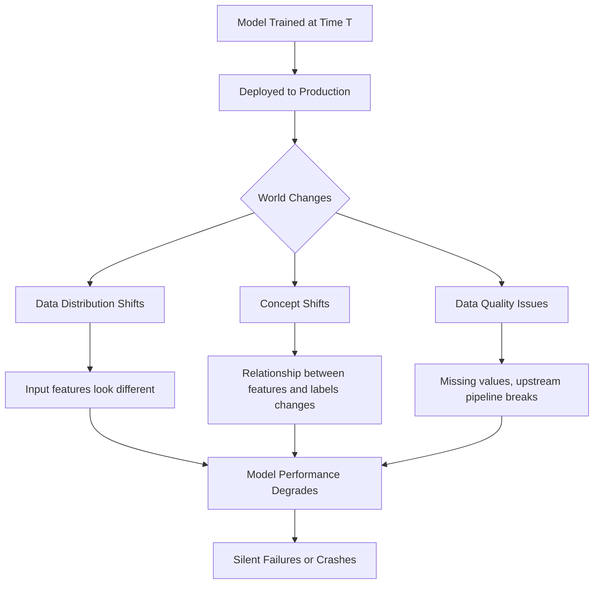

# Model Monitoring — Fundamentals

## Why Models Degrade in Production

A model trained on historical data may become less accurate over time as the real world changes. This phenomenon is called **model decay** or **model staleness**.



### Real Examples of Model Decay

| Event | How it Causes Decay |
|-------|---------------------|
| COVID-19 (March 2020) | Consumer spending patterns changed overnight; fraud models, recommendation models all broke |
| New product launch | User behavior shifts; recommendation model doesn't know new product |
| Upstream pipeline change | A feature column is renamed → model gets NaN for that feature |
| Seasonal patterns | Model trained on summer data deployed in winter |
| Regulatory change | New rules change what counts as fraud |
| Population shift | New customer segment not present in training data |

---

## Types of Drift

### 1. Data Drift (Covariate Shift)

The distribution of **input features** changes, but the relationship between features and labels stays the same.

```python
import numpy as np
import pandas as pd
from scipy import stats

# Training data: customer age distribution was 18-50
train_ages = np.random.normal(32, 8, 10000)  # mean=32, std=8

# Production data 6 months later: younger demographic
prod_ages = np.random.normal(25, 6, 10000)   # mean=25, std=6

# Detect data drift with KS test
ks_stat, p_value = stats.ks_2samp(train_ages, prod_ages)
print(f"KS Statistic: {ks_stat:.4f}")
print(f"P-value: {p_value:.6f}")
print(f"Data drift detected: {p_value < 0.05}")

# KS stat close to 0 = distributions are similar
# KS stat close to 1 = distributions are very different
```

### 2. Concept Drift

The **relationship between features and labels** changes. The same input now means something different.

```python
# Example: email spam detection
# TRAINING time (2020): "bitcoin" in email → 90% spam
# PRODUCTION (2023): "bitcoin" legitimately used in business emails → maybe 40% spam

# The feature "contains_bitcoin" now has a different relationship with the label
# Even though the word appears at the same rate, its meaning for spam has changed

# Signs of concept drift (no feature drift, but performance drops):
# - Model scores look reasonable (feature distributions unchanged)
# - But accuracy/precision/recall are declining
# - Ground truth labels are needed to detect this (delayed feedback problem)
```

### 3. Label Drift

The **distribution of target labels** shifts in production.

```python
# Training: 2% fraud rate
# Production 6 months later: 4% fraud rate (fraud increased)
# Even if the model is "correct", recall drops because base rate changed

train_fraud_rate = 0.02
prod_fraud_rate = 0.04

print(f"Training fraud rate: {train_fraud_rate:.1%}")
print(f"Production fraud rate: {prod_fraud_rate:.1%}")
print(f"Relative increase: {(prod_fraud_rate/train_fraud_rate - 1):.0%}")
# → 100% increase in fraud rate → need to recalibrate threshold or retrain
```

### 4. Data Quality / Pipeline Drift

Infrastructure or upstream data changes cause unexpected values.

```python
import pandas as pd
import numpy as np

def check_data_quality(df: pd.DataFrame, feature_schema: dict) -> dict:
    """
    Basic data quality checks for incoming inference requests.
    
    feature_schema: {feature_name: {"dtype": type, "min": val, "max": val, "null_rate_max": pct}}
    """
    issues = []
    
    for col, schema in feature_schema.items():
        if col not in df.columns:
            issues.append(f"MISSING_COLUMN: {col}")
            continue
        
        # Null rate check
        null_rate = df[col].isnull().mean()
        if null_rate > schema.get("null_rate_max", 0.05):
            issues.append(f"HIGH_NULL_RATE: {col} = {null_rate:.1%} (max: {schema['null_rate_max']:.1%})")
        
        # Range check
        if "min" in schema:
            below_min = (df[col] < schema["min"]).sum()
            if below_min > 0:
                issues.append(f"BELOW_MIN: {col} has {below_min} values below {schema['min']}")
        
        if "max" in schema:
            above_max = (df[col] > schema["max"]).sum()
            if above_max > 0:
                issues.append(f"ABOVE_MAX: {col} has {above_max} values above {schema['max']}")
    
    return {"issues": issues, "n_rows": len(df), "pass": len(issues) == 0}

# Define expected schema from training data
FEATURE_SCHEMA = {
    "age": {"min": 18, "max": 120, "null_rate_max": 0.01},
    "income": {"min": 0, "max": 10_000_000, "null_rate_max": 0.05},
    "credit_score": {"min": 300, "max": 850, "null_rate_max": 0.02},
}

quality_report = check_data_quality(inference_df, FEATURE_SCHEMA)
```

---

## Monitoring Metrics

### Statistical Tests for Drift Detection

| Metric | Use For | Threshold | Notes |
|--------|---------|-----------|-------|
| KS Test | Continuous features | p < 0.05 | Sensitive to sample size |
| Chi-Square Test | Categorical features | p < 0.05 | Requires sufficient counts per bin |
| PSI | Continuous features | PSI > 0.2 | Industry standard in credit/finance |
| KL Divergence | Any distribution | KL > 0.1 | Not symmetric |
| Jensen-Shannon | Any distribution | JS > 0.1 | Symmetric, bounded 0-1 |
| Wasserstein Distance | Continuous features | domain-specific | "Earth mover's distance" |

### Population Stability Index (PSI)

PSI is widely used in credit scoring and financial modeling for measuring distribution shift.

```python
import numpy as np
import pandas as pd

def calculate_psi(expected: np.ndarray, actual: np.ndarray, n_bins: int = 10) -> float:
    """
    Population Stability Index (PSI).
    Measures how much a distribution has shifted.
    
    PSI < 0.1:  No significant change
    PSI 0.1-0.2: Moderate change, monitor closely
    PSI > 0.2:  Significant change, investigate and consider retraining
    """
    # Create bins based on expected (training) distribution
    breakpoints = np.nanpercentile(expected, np.linspace(0, 100, n_bins + 1))
    breakpoints = np.unique(breakpoints)  # Remove duplicate edges
    
    # Count observations in each bin
    expected_counts = np.histogram(expected, bins=breakpoints)[0]
    actual_counts = np.histogram(actual, bins=breakpoints)[0]
    
    # Convert to proportions, add small epsilon to avoid log(0)
    eps = 1e-4
    expected_pct = expected_counts / len(expected) + eps
    actual_pct = actual_counts / len(actual) + eps
    
    # PSI formula
    psi = np.sum((actual_pct - expected_pct) * np.log(actual_pct / expected_pct))
    
    return float(psi)

def interpret_psi(psi: float) -> str:
    if psi < 0.1:
        return "STABLE: No significant change"
    elif psi < 0.2:
        return "MODERATE: Some instability, monitor closely"
    else:
        return "UNSTABLE: Significant change — investigate and consider retraining"


# Calculate PSI for all features
def feature_psi_report(train_df: pd.DataFrame, prod_df: pd.DataFrame) -> pd.DataFrame:
    results = []
    
    for col in train_df.select_dtypes(include=[np.number]).columns:
        psi = calculate_psi(
            train_df[col].dropna().values,
            prod_df[col].dropna().values,
        )
        results.append({
            "feature": col,
            "psi": round(psi, 4),
            "status": interpret_psi(psi),
        })
    
    return pd.DataFrame(results).sort_values("psi", ascending=False)
```

### KL Divergence

```python
from scipy.special import rel_entr
import numpy as np

def kl_divergence_hist(p_samples: np.ndarray, q_samples: np.ndarray, n_bins: int = 20) -> float:
    """
    KL divergence D(P || Q) from samples via histogram.
    Measures how much Q differs from P (reference = P = training distribution).
    NOT symmetric: D(P||Q) != D(Q||P)
    """
    # Create bins from combined data
    all_data = np.concatenate([p_samples, q_samples])
    bins = np.linspace(all_data.min(), all_data.max(), n_bins + 1)
    
    p_hist = np.histogram(p_samples, bins=bins)[0].astype(float) + 1e-10
    q_hist = np.histogram(q_samples, bins=bins)[0].astype(float) + 1e-10
    
    # Normalize
    p_hist /= p_hist.sum()
    q_hist /= q_hist.sum()
    
    # KL divergence
    return float(np.sum(rel_entr(p_hist, q_hist)))  # sum(p * log(p/q))
```

---

## Model Performance Monitoring

When ground truth labels are available (e.g., after a delay), track model performance over time.

```python
import pandas as pd
import numpy as np
from sklearn.metrics import accuracy_score, roc_auc_score, f1_score, precision_score, recall_score

def compute_performance_metrics(
    y_true: np.ndarray,
    y_pred: np.ndarray,
    y_prob: np.ndarray = None,
    period_label: str = None,
) -> dict:
    """Compute a standard set of classification performance metrics."""
    
    metrics = {
        "period": period_label,
        "n_samples": len(y_true),
        "n_positive": int(y_true.sum()),
        "positive_rate": float(y_true.mean()),
        "accuracy": round(accuracy_score(y_true, y_pred), 4),
        "precision": round(precision_score(y_true, y_pred, zero_division=0), 4),
        "recall": round(recall_score(y_true, y_pred, zero_division=0), 4),
        "f1": round(f1_score(y_true, y_pred, zero_division=0), 4),
    }
    
    if y_prob is not None:
        metrics["auc"] = round(roc_auc_score(y_true, y_prob), 4)
    
    return metrics


def build_performance_trend(weekly_data: list) -> pd.DataFrame:
    """
    Track model metrics over rolling weekly windows.
    
    weekly_data: list of (week_label, y_true, y_pred, y_prob) tuples
    """
    rows = []
    for week_label, y_true, y_pred, y_prob in weekly_data:
        row = compute_performance_metrics(y_true, y_pred, y_prob, week_label)
        rows.append(row)
    
    df = pd.DataFrame(rows).set_index("period")
    
    # Flag weeks where AUC dropped more than 3% from rolling average
    if "auc" in df.columns:
        df["auc_rolling_avg"] = df["auc"].rolling(4, min_periods=1).mean().shift(1)
        df["auc_degraded"] = df["auc"] < (df["auc_rolling_avg"] - 0.03)
    
    return df
```

---

## Setting Up Monitoring Alerts

```python
from dataclasses import dataclass
from typing import Optional
from enum import Enum

class AlertSeverity(Enum):
    INFO = "info"
    WARNING = "warning"
    CRITICAL = "critical"

@dataclass
class MonitoringAlert:
    metric: str
    value: float
    threshold: float
    severity: AlertSeverity
    message: str

MONITORING_THRESHOLDS = {
    "psi": {"warning": 0.1, "critical": 0.2},
    "null_rate": {"warning": 0.05, "critical": 0.15},
    "auc_drop": {"warning": 0.03, "critical": 0.05},   # Drop from baseline
    "recall_drop": {"warning": 0.05, "critical": 0.10},
}

def check_thresholds(metrics: dict) -> list:
    """Evaluate metrics against thresholds and return alerts."""
    alerts = []
    
    for metric, value in metrics.items():
        if metric not in MONITORING_THRESHOLDS:
            continue
        
        thresholds = MONITORING_THRESHOLDS[metric]
        
        if value >= thresholds["critical"]:
            alerts.append(MonitoringAlert(
                metric=metric,
                value=value,
                threshold=thresholds["critical"],
                severity=AlertSeverity.CRITICAL,
                message=f"{metric}={value:.4f} exceeds critical threshold {thresholds['critical']}",
            ))
        elif value >= thresholds["warning"]:
            alerts.append(MonitoringAlert(
                metric=metric,
                value=value,
                threshold=thresholds["warning"],
                severity=AlertSeverity.WARNING,
                message=f"{metric}={value:.4f} exceeds warning threshold {thresholds['warning']}",
            ))
    
    return alerts
```

---

## Interview Tips

> **Tip 1:** "What is the difference between data drift and concept drift?" — "Data drift (covariate shift) is when the input feature distribution changes — e.g., your customer base gets younger. The model is still correct in principle, but it may now be extrapolating outside its training distribution. Concept drift is when the relationship between features and labels changes — e.g., 'bitcoin' in an email used to strongly predict spam; now it's commonly used in legitimate business emails. Data drift is detectable without labels (compare feature distributions). Concept drift requires ground truth labels to detect."

> **Tip 2:** "What is PSI and how do you interpret it?" — "Population Stability Index measures how much a feature's distribution has shifted between training and production. PSI = sum((actual% - expected%) * log(actual%/expected%)). Rule of thumb: PSI < 0.1 means stable; 0.1-0.2 means moderate change, monitor closely; > 0.2 means significant instability, investigate root cause and consider retraining. PSI originated in credit scoring and is widely used in regulated industries."

> **Tip 3:** "What metrics do you monitor in production ML systems?" — "At minimum: (1) Feature statistics (mean, std, null rates, PSI) to detect data drift; (2) Model output distribution (score distribution, prediction rate) to catch obvious errors without labels; (3) Business metrics (conversion rate, fraud rate, click rate) as a proxy for model quality; (4) Ground truth performance metrics (AUC, precision, recall) when labels are available, even with delay; (5) System health (latency p99, error rate, throughput)."

> **Tip 4:** "What is the challenge of detecting concept drift compared to data drift?" — "Data drift is easy to detect — you just compare feature distributions between training and production, no labels needed. Concept drift requires knowing whether predictions are correct, which means you need ground truth labels. Labels often arrive with significant delay (e.g., in credit, you don't know if a loan defaults for 12 months). Solutions: (1) proxy metrics (upstream business KPIs), (2) human labeling of samples, (3) champion-challenger with random holdout, (4) shadow mode evaluation against a newer model."
