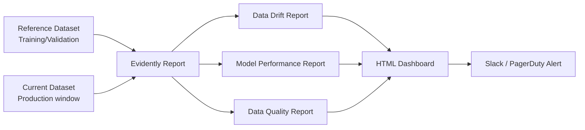

# Model Monitoring — Intermediate

## Evidently AI

Evidently is an open-source ML monitoring framework. It generates reports and runs as part of CI or scheduled monitoring pipelines.



### Basic Evidently Setup

```python
import pandas as pd
import numpy as np
from evidently.report import Report
from evidently.metric_preset import DataDriftPreset, ModelPerformancePreset, DataQualityPreset
from evidently.metrics import (
    DatasetDriftMetric,
    DataDriftTable,
    ColumnDriftMetric,
    ClassificationQualityMetric,
    ClassificationClassBalance,
)

# Reference data = training or validation set (baseline)
reference_data = pd.read_parquet("data/train_val.parquet")
# Current data = recent production window (e.g., last 7 days)
current_data = pd.read_parquet("data/prod_last_7days.parquet")

# Basic drift report
drift_report = Report(metrics=[
    DataDriftPreset(),          # Column-level drift for all features
    DataQualityPreset(),        # Null rates, ranges, unique counts
])

drift_report.run(
    reference_data=reference_data,
    current_data=current_data,
)

# Save HTML report
drift_report.save_html("reports/drift_report.html")

# Get results as dictionary for alerting
drift_results = drift_report.as_dict()

# Check if overall dataset drift detected
dataset_drift = drift_results["metrics"][0]["result"]["dataset_drift"]
n_drifted_features = drift_results["metrics"][0]["result"]["number_of_drifted_columns"]
print(f"Dataset drift: {dataset_drift}")
print(f"Drifted features: {n_drifted_features}")
```

### Evidently with Column Mapping

```python
from evidently import ColumnMapping

# Tell Evidently which columns are prediction, target, and features
column_mapping = ColumnMapping(
    target="label",              # Ground truth column
    prediction="score",          # Model prediction column
    numerical_features=[
        "age", "income", "credit_score", "loan_amount",
    ],
    categorical_features=[
        "employment_type", "home_ownership", "loan_purpose",
    ],
    datetime_features=["application_date"],
)

# Performance report (requires ground truth labels)
performance_report = Report(metrics=[
    ModelPerformancePreset(),
    ClassificationQualityMetric(),
    ClassificationClassBalance(),
])

performance_report.run(
    reference_data=reference_with_labels,
    current_data=current_with_labels,
    column_mapping=column_mapping,
)

# Check AUC degradation
perf_result = performance_report.as_dict()["metrics"][0]["result"]
ref_auc = perf_result["reference"]["roc_auc"]
cur_auc = perf_result["current"]["roc_auc"]
auc_drop = ref_auc - cur_auc

print(f"Reference AUC: {ref_auc:.4f}")
print(f"Current AUC: {cur_auc:.4f}")
print(f"AUC drop: {auc_drop:.4f}")
if auc_drop > 0.03:
    print("ALERT: AUC degradation detected!")
```

### Evidently Test Suites for CI/CD

```python
from evidently.test_suite import TestSuite
from evidently.tests import (
    TestNumberOfDriftedColumns,
    TestShareOfDriftedColumns,
    TestColumnDrift,
    TestShareOfMissingValues,
    TestMeanInNSigmas,
)

# Define pass/fail tests (not just reports)
test_suite = TestSuite(tests=[
    TestNumberOfDriftedColumns(lt=3),        # Pass if fewer than 3 features drift
    TestShareOfDriftedColumns(lt=0.25),      # Pass if fewer than 25% features drift
    TestColumnDrift(column_name="income"),   # Pass if income specifically doesn't drift
    TestShareOfMissingValues(lt=0.05),       # Pass if null rate < 5%
    TestMeanInNSigmas(column_name="age", n=2),  # Pass if mean within 2 sigma
])

test_suite.run(
    reference_data=reference_data,
    current_data=current_data,
)

# Returns pass/fail for CI gating
summary = test_suite.as_dict()["summary"]
print(f"Tests passed: {summary['success_tests']}/{summary['total_tests']}")
print(f"All passed: {summary['all_passed']}")

# Use in CI pipeline
if not summary["all_passed"]:
    print("Monitoring gate FAILED — block deployment")
    exit(1)
```

---

## WhyLogs

WhyLogs generates compact statistical profiles (whylogs profiles) of data for storage, comparison, and drift detection.

```python
import whylogs as why
from whylogs.core.constraints.factories import (
    no_missing_values,
    column_is_in_range,
)

# Profile production data
with why.logger() as logger:
    logger.log(df=current_data)
    profile = logger.get_profile()

# View profile statistics
profile_view = profile.view()
print(profile_view.to_pandas())
# Shows: count, nulls, min, max, mean, std, distinct count per column

# Save profile for future comparison
profile.write("profiles/2024-01-15.bin")

# Compare two time periods
reference_profile = why.read("profiles/train_baseline.bin").profile()
current_profile = why.read("profiles/2024-01-15.bin").profile()

# Compute drift metrics between profiles
from whylogs.viz import NotebookProfileVisualizer
visualizer = NotebookProfileVisualizer()
visualizer.set_profiles(
    target_profile_view=current_profile.view(),
    reference_profile_view=reference_profile.view(),
)
visualizer.double_histogram(feature_name="income")

# WhyLogs constraints — data validation
from whylogs.core.constraints import ConstraintsBuilder

builder = ConstraintsBuilder(dataset_profile_view=profile_view)
builder.add_constraint(no_missing_values(column_name="credit_score"))
builder.add_constraint(column_is_in_range(column_name="age", lower=18, upper=120))
constraints = builder.build()

valid = constraints.validate()
report = constraints.generate_constraints_report()
```

---

## Monitoring Pipeline Architecture

A production monitoring pipeline runs on a schedule (hourly, daily) and alerts when drift is detected.

```python
import pandas as pd
import numpy as np
from datetime import datetime, timedelta
from typing import Optional
import logging

logger = logging.getLogger(__name__)

class ModelMonitoringPipeline:
    """
    Scheduled model monitoring pipeline.
    Runs feature drift checks, performance checks, and data quality checks.
    Sends alerts to Slack/PagerDuty when thresholds are exceeded.
    """
    
    def __init__(
        self,
        model_name: str,
        reference_data: pd.DataFrame,
        drift_psi_warning: float = 0.1,
        drift_psi_critical: float = 0.2,
        auc_drop_critical: float = 0.05,
    ):
        self.model_name = model_name
        self.reference_data = reference_data
        self.drift_psi_warning = drift_psi_warning
        self.drift_psi_critical = drift_psi_critical
        self.auc_drop_critical = auc_drop_critical
        
        # Compute reference statistics on init
        self.reference_stats = self._compute_stats(reference_data)
    
    def _compute_stats(self, df: pd.DataFrame) -> dict:
        """Compute summary statistics for drift comparison."""
        stats = {}
        for col in df.select_dtypes(include=[np.number]).columns:
            stats[col] = {
                "mean": df[col].mean(),
                "std": df[col].std(),
                "min": df[col].min(),
                "max": df[col].max(),
                "null_rate": df[col].isnull().mean(),
                "values": df[col].dropna().values,  # Stored for PSI/KS
            }
        return stats
    
    def _calculate_psi(self, expected: np.ndarray, actual: np.ndarray, n_bins: int = 10) -> float:
        breakpoints = np.nanpercentile(expected, np.linspace(0, 100, n_bins + 1))
        breakpoints = np.unique(breakpoints)
        eps = 1e-4
        expected_pct = np.histogram(expected, bins=breakpoints)[0].astype(float) + eps
        actual_pct = np.histogram(actual, bins=breakpoints)[0].astype(float) + eps
        expected_pct /= expected_pct.sum()
        actual_pct /= actual_pct.sum()
        return float(np.sum((actual_pct - expected_pct) * np.log(actual_pct / expected_pct)))
    
    def run_drift_check(self, current_data: pd.DataFrame) -> dict:
        """Check all features for distribution drift."""
        current_stats = self._compute_stats(current_data)
        
        drift_results = {}
        alerts = []
        
        for col in self.reference_stats:
            if col not in current_stats:
                alerts.append(f"MISSING_FEATURE: {col}")
                continue
            
            psi = self._calculate_psi(
                self.reference_stats[col]["values"],
                current_stats[col]["values"],
            )
            
            null_rate = current_stats[col]["null_rate"]
            
            status = "OK"
            if psi >= self.drift_psi_critical:
                status = "CRITICAL"
                alerts.append(f"CRITICAL_DRIFT: {col} PSI={psi:.3f}")
            elif psi >= self.drift_psi_warning:
                status = "WARNING"
                alerts.append(f"WARNING_DRIFT: {col} PSI={psi:.3f}")
            
            drift_results[col] = {
                "psi": round(psi, 4),
                "status": status,
                "null_rate": round(null_rate, 4),
            }
        
        return {"feature_drift": drift_results, "alerts": alerts}
    
    def run_performance_check(
        self,
        current_data: pd.DataFrame,
        y_true_col: str,
        y_pred_col: str,
        y_prob_col: Optional[str] = None,
        reference_auc: Optional[float] = None,
    ) -> dict:
        """Check model performance on labeled data."""
        from sklearn.metrics import roc_auc_score, precision_score, recall_score
        
        y_true = current_data[y_true_col].values
        y_pred = current_data[y_pred_col].values
        
        metrics = {
            "precision": round(precision_score(y_true, y_pred, zero_division=0), 4),
            "recall": round(recall_score(y_true, y_pred, zero_division=0), 4),
            "n": len(y_true),
        }
        
        alerts = []
        
        if y_prob_col:
            auc = roc_auc_score(y_true, current_data[y_prob_col].values)
            metrics["auc"] = round(auc, 4)
            
            if reference_auc and (reference_auc - auc) >= self.auc_drop_critical:
                alerts.append(
                    f"CRITICAL_PERF: AUC dropped {reference_auc - auc:.4f} "
                    f"({reference_auc:.4f} → {auc:.4f})"
                )
        
        return {"performance": metrics, "alerts": alerts}
    
    def run(self, current_data: pd.DataFrame, labeled_data: Optional[pd.DataFrame] = None) -> dict:
        """Full monitoring run."""
        drift_result = self.run_drift_check(current_data)
        
        all_alerts = drift_result["alerts"].copy()
        result = {
            "model": self.model_name,
            "timestamp": datetime.utcnow().isoformat(),
            "feature_drift": drift_result["feature_drift"],
        }
        
        if labeled_data is not None:
            perf_result = self.run_performance_check(
                labeled_data,
                y_true_col="label",
                y_pred_col="prediction",
                y_prob_col="score",
            )
            result["performance"] = perf_result["performance"]
            all_alerts.extend(perf_result["alerts"])
        
        result["alerts"] = all_alerts
        result["all_clear"] = len(all_alerts) == 0
        
        if all_alerts:
            logger.warning(f"[{self.model_name}] Monitoring alerts: {all_alerts}")
        
        return result
```

---

## Alerting Strategies

### Alerting Tiers

```python
from enum import Enum
from dataclasses import dataclass
from typing import Callable

class AlertChannel(Enum):
    SLACK_INFO = "slack_info"
    SLACK_ALERT = "slack_alert"
    PAGERDUTY = "pagerduty"
    EMAIL = "email"

@dataclass
class AlertRule:
    name: str
    condition: Callable[[dict], bool]
    channel: AlertChannel
    message_template: str
    cooldown_minutes: int = 60  # Don't re-alert within this window

# Define alert rules
ALERT_RULES = [
    AlertRule(
        name="critical_data_drift",
        condition=lambda r: any("CRITICAL_DRIFT" in a for a in r.get("alerts", [])),
        channel=AlertChannel.PAGERDUTY,
        message_template="CRITICAL: Data drift detected in {model}. Features: {features}",
        cooldown_minutes=120,
    ),
    AlertRule(
        name="performance_degradation",
        condition=lambda r: any("CRITICAL_PERF" in a for a in r.get("alerts", [])),
        channel=AlertChannel.PAGERDUTY,
        message_template="CRITICAL: Model {model} AUC degraded significantly",
        cooldown_minutes=60,
    ),
    AlertRule(
        name="warning_drift",
        condition=lambda r: any("WARNING_DRIFT" in a for a in r.get("alerts", [])),
        channel=AlertChannel.SLACK_ALERT,
        message_template="WARNING: Feature drift detected in {model}",
        cooldown_minutes=240,
    ),
]
```

### Baseline Comparison Strategy

```python
class BaselineStrategy(Enum):
    TRAINING_SET = "training_set"      # Compare to training data (most stable baseline)
    ROLLING_WINDOW = "rolling_window"   # Compare to recent N-day window (catches gradual drift)
    SAME_PERIOD_LAST_YEAR = "yoy"       # Compare to same period last year (seasonal)

def select_baseline_strategy(model_type: str, data_seasonality: bool) -> BaselineStrategy:
    """Choose the right baseline comparison strategy."""
    if data_seasonality:
        # For retail/ecommerce with strong seasonal patterns
        return BaselineStrategy.SAME_PERIOD_LAST_YEAR
    elif model_type == "fraud":
        # Fraud patterns evolve; rolling baseline better than static training
        return BaselineStrategy.ROLLING_WINDOW
    else:
        # Default: compare to training distribution
        return BaselineStrategy.TRAINING_SET

# Rolling window baseline — more sensitive to gradual drift
def rolling_baseline_check(
    historical_windows: list,  # Last N weekly snapshots
    current_window: pd.DataFrame,
    window_size: int = 4,  # Use last 4 weeks as baseline
) -> dict:
    """Compare current window to rolling recent history."""
    recent_history = pd.concat(historical_windows[-window_size:], ignore_index=True)
    # Now compare current_window to recent_history instead of training data
    # This catches gradual drift that would be missed vs static training baseline
    ...
```

---

## Monitoring as Code

Airflow DAG for scheduled monitoring:

```python
from airflow import DAG
from airflow.operators.python import PythonOperator
from datetime import datetime, timedelta

def _run_monitoring(**context):
    import boto3
    import pandas as pd
    from model_monitoring_pipeline import ModelMonitoringPipeline
    
    # Load reference data from S3
    s3 = boto3.client("s3")
    reference_df = pd.read_parquet("s3://ml-data/monitoring/reference_dataset.parquet")
    
    # Load last 24 hours of production inference logs
    ds = context["ds"]
    current_df = pd.read_parquet(f"s3://ml-data/inference-logs/date={ds}/")
    
    pipeline = ModelMonitoringPipeline(
        model_name="fraud_scoring_v4",
        reference_data=reference_df,
    )
    
    result = pipeline.run(current_data=current_df)
    
    # Push result to XCom for downstream tasks
    return result

def _check_and_alert(**context):
    result = context["task_instance"].xcom_pull(task_ids="run_monitoring")
    
    if not result["all_clear"]:
        import requests
        slack_msg = {
            "text": f"Model monitoring ALERT for `{result['model']}`\n" + "\n".join(result["alerts"])
        }
        requests.post(SLACK_WEBHOOK_URL, json=slack_msg)

with DAG(
    "model_monitoring_daily",
    default_args={"owner": "ml-platform", "retries": 1},
    schedule_interval="0 8 * * *",  # Daily at 8am
    start_date=datetime(2024, 1, 1),
    catchup=False,
) as dag:
    
    run_monitoring = PythonOperator(
        task_id="run_monitoring",
        python_callable=_run_monitoring,
    )
    
    check_and_alert = PythonOperator(
        task_id="check_and_alert",
        python_callable=_check_and_alert,
    )
    
    run_monitoring >> check_and_alert
```

---

## Interview Tips

> **Tip 1:** "What is Evidently AI and why is it useful?" — "Evidently is an open-source monitoring framework that generates statistical drift reports by comparing a reference dataset (training/validation) to a current production window. It handles feature drift (statistical tests per column), data quality (null rates, value ranges), and performance reports (when labels are available). It integrates with Airflow, MLflow, and CI pipelines. Its test suite mode generates pass/fail results, enabling monitoring gates in deployment pipelines."

> **Tip 2:** "What's the difference between monitoring with a static baseline vs a rolling baseline?" — "Static baseline: compare production to training data. Catches any drift from training distribution. Problem: after retraining, the 'baseline' is stale until you update it. Also misses seasonality — if training was in summer and production is winter, drift is expected. Rolling baseline: compare to a recent window (e.g., last 4 weeks). Catches sudden changes well but misses gradual drift (since the baseline also drifts slowly). Best practice: use both — static for gross distribution shifts, rolling for anomaly detection."

> **Tip 3:** "How do you handle alert fatigue in model monitoring?" — "Alert fatigue is when too many alerts cause teams to ignore all of them. Solutions: (1) Tiered severity — only page on-call for critical thresholds (PSI > 0.2, AUC drop > 5%), use Slack for warnings; (2) Cooldown windows — don't re-alert for the same metric within 2 hours; (3) Aggregation — alert on 'N features drifted' rather than each feature separately; (4) Business impact filtering — only alert on features with high SHAP importance; (5) Trend detection — alert when a metric has been declining for 3 consecutive days, not on single-day noise."

> **Tip 4:** "What is WhyLogs and how does it differ from Evidently?" — "WhyLogs generates compact statistical profiles (sketches) of datasets rather than running full comparisons. A profile is a small binary file (kilobytes) summarizing a dataset's statistics — histograms, distinct counts, null rates. Profiles are stored separately and compared later. This is more scalable: you profile every hour, store profiles cheaply, and compare across any two time points on demand. Evidently requires both reference and current data in memory simultaneously, which doesn't scale to very large datasets."
