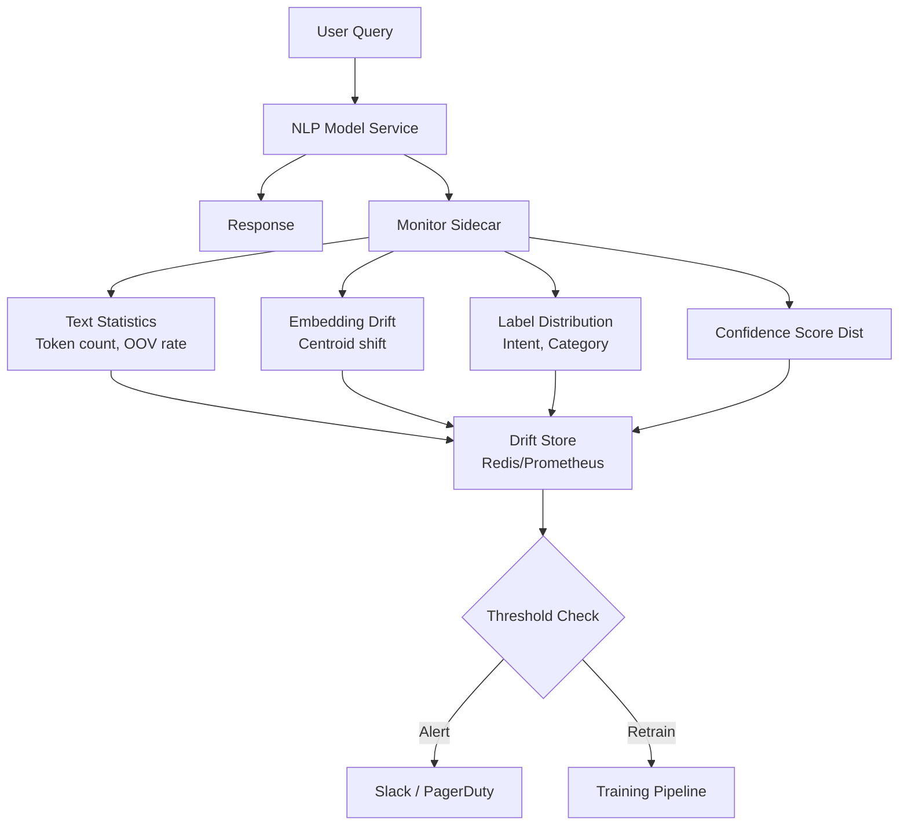

# Model Monitoring — Real World Patterns

## Production NLP Model Monitoring

NLP models face unique monitoring challenges: text distributions are high-dimensional, embedding drift is hard to measure, and new vocabulary appears continuously.



### Text Distribution Monitoring

```python
import numpy as np
import pandas as pd
from collections import Counter
from typing import List, Optional
import re

class NLPDistributionMonitor:
    """
    Monitor text input distribution for NLP models.
    Tracks: vocabulary drift, document length, OOV rate, topic distribution.
    """
    
    def __init__(self, reference_texts: List[str], vocabulary: set):
        self.vocabulary = vocabulary
        self.reference_stats = self._compute_text_stats(reference_texts)
        self._current_texts = []
    
    def _tokenize(self, text: str) -> List[str]:
        """Simple whitespace tokenizer."""
        return re.findall(r'\b\w+\b', text.lower())
    
    def _compute_text_stats(self, texts: List[str]) -> dict:
        all_lengths = [len(self._tokenize(t)) for t in texts]
        all_tokens = [token for t in texts for token in self._tokenize(t)]
        token_freq = Counter(all_tokens)
        
        # OOV rate: fraction of tokens not in vocabulary
        oov_count = sum(1 for t in all_tokens if t not in self.vocabulary)
        oov_rate = oov_count / len(all_tokens) if all_tokens else 0
        
        return {
            "mean_length": np.mean(all_lengths),
            "std_length": np.std(all_lengths),
            "median_length": np.median(all_lengths),
            "oov_rate": oov_rate,
            "top_100_tokens": set([t for t, _ in token_freq.most_common(100)]),
            "lengths": np.array(all_lengths),
        }
    
    def check_drift(self, current_texts: List[str]) -> dict:
        """Compare current text window to reference distribution."""
        from scipy import stats
        
        current_stats = self._compute_text_stats(current_texts)
        
        # Length distribution drift
        ks_stat, p_value = stats.ks_2samp(
            self.reference_stats["lengths"],
            current_stats["lengths"],
        )
        
        # OOV rate change (new words appearing = possible domain drift)
        oov_delta = current_stats["oov_rate"] - self.reference_stats["oov_rate"]
        
        # Vocabulary overlap
        vocab_overlap = len(
            current_stats["top_100_tokens"] & self.reference_stats["top_100_tokens"]
        ) / 100
        
        alerts = []
        if p_value < 0.01:
            alerts.append(f"TEXT_LENGTH_DRIFT: KS={ks_stat:.3f}, p={p_value:.4f}")
        if oov_delta > 0.05:
            alerts.append(f"HIGH_OOV_INCREASE: +{oov_delta:.1%} new/unknown tokens")
        if vocab_overlap < 0.70:
            alerts.append(f"VOCABULARY_SHIFT: only {vocab_overlap:.0%} top-100 token overlap")
        
        return {
            "length_ks_stat": round(ks_stat, 4),
            "length_p_value": round(p_value, 6),
            "oov_rate_current": round(current_stats["oov_rate"], 4),
            "oov_rate_reference": round(self.reference_stats["oov_rate"], 4),
            "oov_delta": round(oov_delta, 4),
            "vocab_overlap": round(vocab_overlap, 4),
            "alerts": alerts,
        }


class EmbeddingDriftMonitor:
    """
    Detect concept drift via embedding space drift.
    If the centroid of incoming request embeddings shifts far from
    the training distribution centroid, the model may be out of distribution.
    """
    
    def __init__(self, reference_embeddings: np.ndarray):
        self.reference_centroid = reference_embeddings.mean(axis=0)
        self.reference_std = reference_embeddings.std(axis=0)
        
        # PCA for visualization
        from sklearn.decomposition import PCA
        self.pca = PCA(n_components=2)
        self.pca.fit(reference_embeddings)
    
    def compute_centroid_drift(self, current_embeddings: np.ndarray) -> dict:
        """Cosine similarity between reference and current centroid."""
        current_centroid = current_embeddings.mean(axis=0)
        
        # Cosine similarity
        cos_sim = np.dot(self.reference_centroid, current_centroid) / (
            np.linalg.norm(self.reference_centroid) * np.linalg.norm(current_centroid)
        )
        
        # Mahalanobis-like distance using reference std
        normalized_drift = np.abs(current_centroid - self.reference_centroid) / (self.reference_std + 1e-8)
        mean_normalized_drift = float(normalized_drift.mean())
        
        return {
            "cosine_similarity": round(float(cos_sim), 4),
            "normalized_drift": round(mean_normalized_drift, 4),
            "alert": cos_sim < 0.90 or mean_normalized_drift > 2.0,
        }
```

---

## Fraud Model Drift Detection

Fraud patterns evolve rapidly — fraudsters adapt to model changes. Fraud model monitoring requires high-frequency checks and adversarial awareness.

```python
import numpy as np
import pandas as pd
from datetime import datetime, timedelta
from typing import Optional

class FraudModelDriftDetector:
    """
    Specialized drift detection for fraud models.
    
    Key challenges:
    1. Fraud labels arrive with delay (chargebacks take days/weeks)
    2. Fraudsters actively learn and adapt to model behavior
    3. Business events (sales, holidays) cause expected short-term spikes
    4. False positives are costly (customer friction); false negatives are costly (losses)
    """
    
    def __init__(
        self,
        reference_fraud_rate: float,
        reference_score_dist: np.ndarray,
        business_calendar: dict = None,  # Known events that cause temporary shifts
    ):
        self.reference_fraud_rate = reference_fraud_rate
        self.reference_score_dist = reference_score_dist
        self.business_calendar = business_calendar or {}
    
    def is_business_event(self, date: datetime) -> Optional[str]:
        """Check if date falls on a known business event causing expected variance."""
        date_str = date.strftime("%Y-%m-%d")
        return self.business_calendar.get(date_str)
    
    def check_velocity_anomaly(
        self,
        recent_transactions: pd.DataFrame,
        window_hours: int = 1,
    ) -> dict:
        """
        Detect sudden spikes in fraud rate or high-risk transactions.
        Fraud attacks often manifest as velocity spikes.
        """
        cutoff = datetime.utcnow() - timedelta(hours=window_hours)
        recent = recent_transactions[recent_transactions["timestamp"] >= cutoff]
        
        if len(recent) < 100:
            return {"insufficient_data": True}
        
        # Score distribution of recent transactions
        recent_high_risk = (recent["fraud_score"] > 0.7).mean()
        
        # Compare to baseline: flag if 2x normal high-risk rate
        baseline_high_risk_rate = (self.reference_score_dist > 0.7).mean()
        spike_ratio = recent_high_risk / (baseline_high_risk_rate + 1e-8)
        
        return {
            "window_hours": window_hours,
            "n_transactions": len(recent),
            "recent_high_risk_rate": round(float(recent_high_risk), 4),
            "baseline_high_risk_rate": round(float(baseline_high_risk_rate), 4),
            "spike_ratio": round(float(spike_ratio), 2),
            "attack_detected": spike_ratio >= 2.0,
        }
    
    def compute_delayed_label_auc(
        self,
        predictions_df: pd.DataFrame,  # Predictions from N days ago
        labels_df: pd.DataFrame,        # Chargebacks resolved since then
    ) -> dict:
        """
        Evaluate model AUC using delayed chargeback labels.
        Join predictions to resolved fraud labels (may be partial).
        """
        from sklearn.metrics import roc_auc_score, average_precision_score
        
        # Inner join: only evaluate on transactions with resolved labels
        joined = predictions_df.merge(labels_df, on="transaction_id", how="inner")
        
        if len(joined) < 100:
            return {"insufficient_labeled_data": True, "n_labeled": len(joined)}
        
        auc = roc_auc_score(joined["is_fraud"], joined["fraud_score"])
        ap = average_precision_score(joined["is_fraud"], joined["fraud_score"])
        
        return {
            "n_labeled": len(joined),
            "coverage_pct": len(joined) / len(predictions_df),  # How many got labels
            "auc": round(auc, 4),
            "average_precision": round(ap, 4),
        }
    
    def detect_adversarial_adaptation(
        self,
        flagged_fraud_features: pd.DataFrame,   # Features of transactions flagged as fraud
        historical_flagged: pd.DataFrame,
    ) -> dict:
        """
        Detect if fraud patterns are shifting — adversarial adaptation.
        Fraudsters learn which feature values trigger detection and adjust.
        """
        from scipy import stats
        
        adaptation_signals = {}
        
        for col in flagged_fraud_features.select_dtypes(include=[np.number]).columns:
            ks_stat, p_value = stats.ks_2samp(
                historical_flagged[col].dropna(),
                flagged_fraud_features[col].dropna(),
            )
            
            if p_value < 0.01:
                adaptation_signals[col] = {
                    "ks_stat": round(ks_stat, 4),
                    "p_value": round(p_value, 6),
                    "historical_mean": round(float(historical_flagged[col].mean()), 4),
                    "current_mean": round(float(flagged_fraud_features[col].mean()), 4),
                }
        
        return {
            "adapting_features": adaptation_signals,
            "adversarial_adaptation_detected": len(adaptation_signals) > 2,
            "recommendation": (
                "Retrain with recent fraud patterns" if len(adaptation_signals) > 2
                else "No significant adaptation detected"
            ),
        }
```

---

## Monitoring During Data Outages

Production data pipelines fail. A monitoring system must distinguish "model is degrading" from "our data pipeline is broken."

```python
from dataclasses import dataclass
from enum import Enum
from typing import Optional
import pandas as pd
import numpy as np

class OutageType(Enum):
    FEATURE_PIPELINE_FAILURE = "feature_pipeline_failure"
    UPSTREAM_DATA_DELAY = "upstream_data_delay"
    FEATURE_VALUE_CORRUPTION = "feature_value_corruption"
    SCHEMA_CHANGE = "schema_change"
    NONE = "none"

class DataOutageDetector:
    """
    Distinguish data outages from genuine model drift.
    Data outages manifest differently from drift:
    - Sudden null rate spikes (pipeline dropped columns)
    - Sudden value range violations (upstream bug introduced invalid values)
    - Zero-variance features (upstream job got stuck, returning stale cached value)
    - Feature count mismatch (schema change)
    """
    
    def __init__(self, expected_schema: dict):
        """
        expected_schema: {feature_name: {"dtype": ..., "null_rate_max": ..., "min": ..., "max": ...}}
        """
        self.expected_schema = expected_schema
    
    def diagnose(self, current_batch: pd.DataFrame) -> dict:
        """Diagnose data quality issues in a batch of inference inputs."""
        
        issues = {}
        outage_type = OutageType.NONE
        
        # Check for schema mismatch
        missing_cols = set(self.expected_schema.keys()) - set(current_batch.columns)
        extra_cols = set(current_batch.columns) - set(self.expected_schema.keys())
        
        if missing_cols:
            outage_type = OutageType.SCHEMA_CHANGE
            issues["missing_columns"] = list(missing_cols)
        
        if extra_cols:
            issues["extra_columns"] = list(extra_cols)
        
        for col, schema in self.expected_schema.items():
            if col not in current_batch.columns:
                continue
            
            col_data = current_batch[col]
            
            # Null rate check
            null_rate = col_data.isnull().mean()
            if null_rate > schema.get("null_rate_max", 0.05) * 5:
                # 5x expected null rate → pipeline failure
                outage_type = OutageType.FEATURE_PIPELINE_FAILURE
                issues[f"{col}_null_rate"] = {
                    "current": round(null_rate, 4),
                    "expected_max": schema.get("null_rate_max"),
                }
            
            # Zero variance check (stuck pipeline returning same value)
            if col_data.std() == 0:
                outage_type = OutageType.UPSTREAM_DATA_DELAY
                issues[f"{col}_zero_variance"] = {
                    "constant_value": float(col_data.iloc[0]) if len(col_data) > 0 else None,
                }
            
            # Range violation check
            if "min" in schema and "max" in schema:
                pct_invalid = (
                    (col_data < schema["min"]) | (col_data > schema["max"])
                ).mean()
                if pct_invalid > 0.10:  # >10% out of range = corruption, not drift
                    outage_type = OutageType.FEATURE_VALUE_CORRUPTION
                    issues[f"{col}_value_corruption"] = {
                        "pct_invalid": round(pct_invalid, 4),
                    }
        
        return {
            "outage_detected": outage_type != OutageType.NONE,
            "outage_type": outage_type.value,
            "issues": issues,
            "n_rows": len(current_batch),
            "recommendation": self._get_recommendation(outage_type),
        }
    
    def _get_recommendation(self, outage_type: OutageType) -> str:
        recommendations = {
            OutageType.FEATURE_PIPELINE_FAILURE: (
                "Check upstream feature pipeline. Use fallback model or cached predictions."
            ),
            OutageType.UPSTREAM_DATA_DELAY: (
                "Upstream data source appears delayed. Monitor for resolution. "
                "Consider using previous hour's feature values."
            ),
            OutageType.FEATURE_VALUE_CORRUPTION: (
                "Feature values appear corrupted. Check data validation in feature pipeline. "
                "Do not serve predictions on corrupted features."
            ),
            OutageType.SCHEMA_CHANGE: (
                "Schema mismatch detected. Check for upstream schema changes. "
                "Update feature schema or feature pipeline."
            ),
            OutageType.NONE: "No issues detected.",
        }
        return recommendations.get(outage_type, "Unknown outage type")


class MonitoringDuringOutage:
    """
    Monitoring strategy when upstream data is unavailable.
    Implements graceful degradation and recovery.
    """
    
    def __init__(self, model_name: str, fallback_prediction: float = 0.5):
        self.model_name = model_name
        self.fallback_prediction = fallback_prediction
        self._outage_start: Optional[float] = None
        self._in_outage = False
    
    def handle_missing_features(
        self,
        available_features: dict,
        required_features: list,
    ) -> dict:
        """
        Strategy for handling partial feature availability during outage.
        
        Options (in order of preference):
        1. Impute with training median (low-risk features)
        2. Use sub-model trained on available features
        3. Fall back to rule-based heuristic
        4. Return "model unavailable" and defer decision
        """
        missing = [f for f in required_features if f not in available_features]
        
        if not missing:
            return {"strategy": "normal", "features": available_features}
        
        missing_pct = len(missing) / len(required_features)
        
        if missing_pct <= 0.1:
            # Impute minor missing features with median
            imputed = available_features.copy()
            for feat in missing:
                imputed[feat] = self._get_training_median(feat)
            return {"strategy": "imputed", "features": imputed, "imputed_features": missing}
        
        elif missing_pct <= 0.3:
            # Use degraded sub-model with available features
            return {"strategy": "degraded_model", "available_features": available_features}
        
        else:
            # Too many features missing — refuse to predict
            if not self._in_outage:
                self._outage_start = __import__("time").time()
                self._in_outage = True
            
            return {
                "strategy": "fallback",
                "fallback_score": self.fallback_prediction,
                "outage_features": missing,
                "recommendation": "Alert on-call. Route to rule-based system.",
            }
    
    def _get_training_median(self, feature: str) -> float:
        """Return training-time median for imputation. Load from feature store."""
        # In production: load from Redis cache or feature store
        MEDIANS = {"age": 35.0, "income": 65000.0, "credit_score": 690.0}
        return MEDIANS.get(feature, 0.0)
    
    def mark_outage_resolved(self) -> dict:
        """Mark outage as resolved and compute outage duration."""
        if not self._in_outage:
            return {"was_in_outage": False}
        
        duration_minutes = (__import__("time").time() - self._outage_start) / 60
        self._in_outage = False
        self._outage_start = None
        
        return {
            "was_in_outage": True,
            "outage_duration_minutes": round(duration_minutes, 2),
            "action_required": "Review predictions made during outage. Backfill if needed.",
        }
```

---

## Interview Tips

> **Tip 1:** "How do you monitor an NLP model differently from a tabular model?" — "NLP models have text as input, which doesn't have a simple mean/std. Instead monitor: (1) Document length distribution (KS test on token counts), (2) OOV rate — if 10% more tokens are unknown to the vocabulary, language patterns have shifted; (3) Embedding centroid drift — if the average embedding of recent requests is far from training, the model is out of distribution; (4) Prediction confidence distribution — if the model returns more low-confidence scores, it's seen unusual inputs; (5) Topic or intent distribution — if a customer service bot suddenly sees more shipping queries and fewer returns queries, behavior has shifted."

> **Tip 2:** "How do you handle fraud model monitoring when labels arrive with a 2-week delay?" — "Use leading indicators that don't require labels: (1) Score distribution shift — if the model's fraud score distribution for all transactions shifts, something has changed; (2) Feature drift — if transaction amount distribution, merchant category distribution, or velocity features shift; (3) Rule-based fraud rate — track the rate of transactions caught by rules (no ML label needed) as a leading indicator; (4) Early chargeback signals — chargebacks filed within 48-72 hours provide a fast-feedback partial label signal. Full AUC evaluation runs with a 2-week lag, but you get signal much sooner."

> **Tip 3:** "What is the difference between model drift and data pipeline issues?" — "Both manifest as unusual feature statistics, but the remediation is completely different. Pipeline issues: sudden null rate spikes (feature column dropped), zero-variance features (stuck cache), systematic range violations (upstream bug). Model drift: gradual distribution shift, PSI increasing over weeks, seasonally expected changes. Diagnosis: check if the anomaly happened suddenly (pipeline) or gradually (drift). Check if multiple features spiked simultaneously in a correlated way (one upstream source = pipeline). Check pipeline monitoring dashboards first before concluding model drift."

> **Tip 4:** "How would you design monitoring for 100 production models?" — "At scale you need: (1) Standardized monitoring config per model (YAML: thresholds, baseline path, alert channels) stored in a registry; (2) A shared monitoring service that applies the config — not 100 separate monitoring jobs; (3) Tiered alerting: only a subset of models are business-critical (p99 SLA, immediate retraining); (4) Automated report generation and Grafana dashboards from a shared template; (5) A monitoring health dashboard showing which models haven't been monitored recently; (6) Drift severity scoring that normalizes across models — so you can triage 'which model needs attention most' across the fleet."
