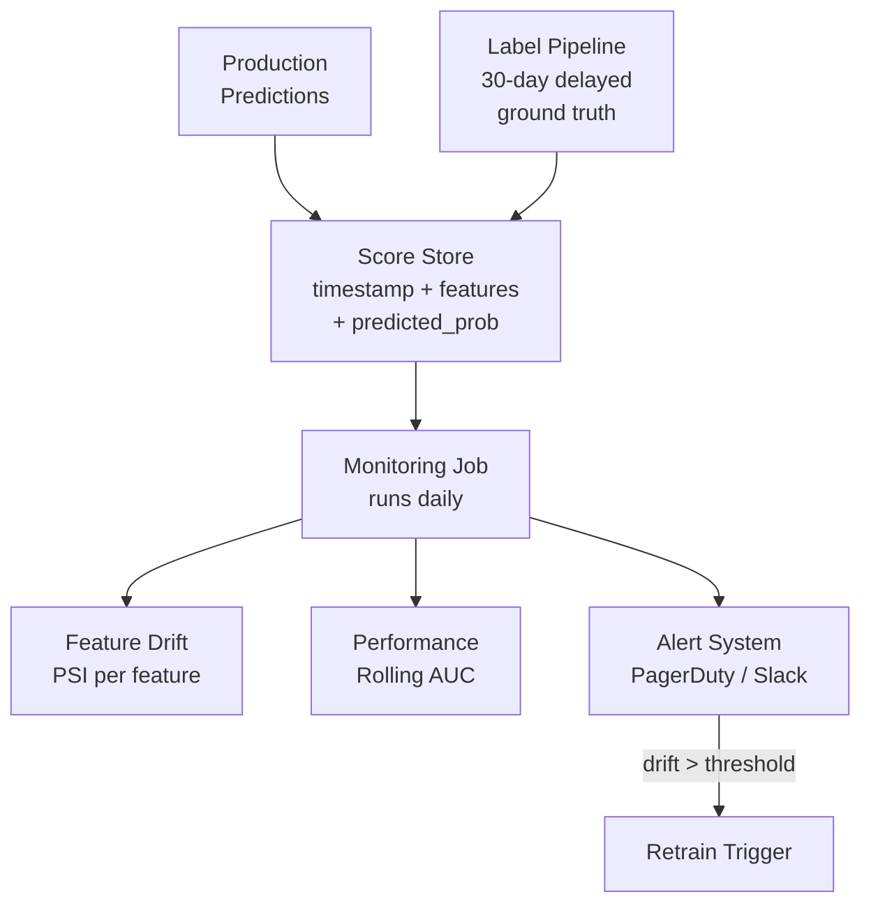
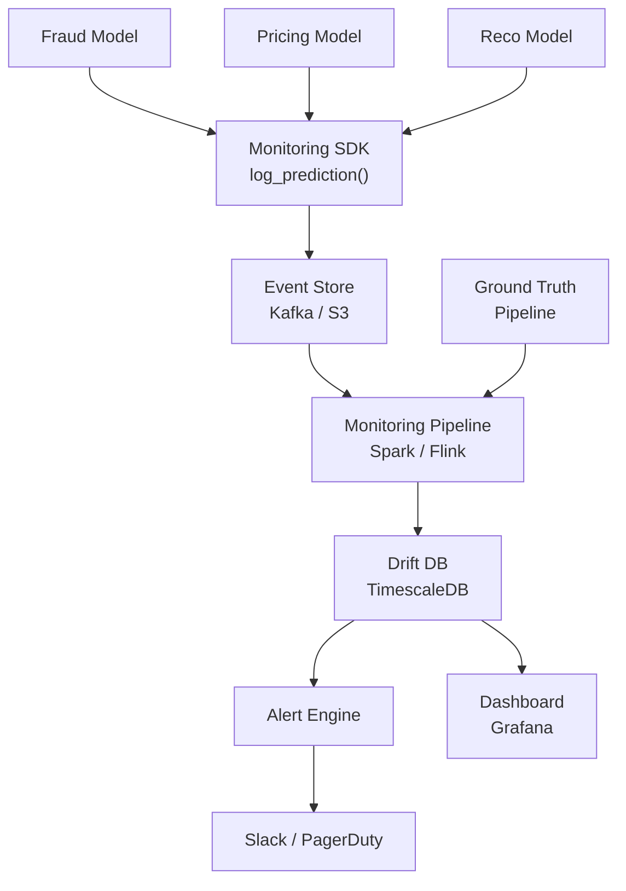

# Scenario Questions — Model Monitoring

<article data-difficulty="junior">

## 🟢 Junior: Alert on Sudden Accuracy Drop

**Scenario:** Your fraud detection model was scoring 0.94 AUC last week. Today your on-call alert fired — AUC dropped to 0.71 overnight. Walk through how you diagnose this.

<details>
<summary>💡 Hint</summary>
Think about what could cause a sudden (not gradual) drop. Is it the model, the data pipeline, or the labels? Check infrastructure before blaming the model.
</details>

<details>
<summary>✅ Solution</summary>

**Step 1: Check if it's a data pipeline issue first (most likely cause of sudden drops)**

```python
import pandas as pd

# Check incoming feature distributions vs baseline
def quick_audit(today_df, baseline_df):
    print("=== NULL RATES ===")
    null_diff = today_df.isnull().mean() - baseline_df.isnull().mean()
    print(null_diff[null_diff.abs() > 0.01])

    print("\n=== VALUE RANGES ===")
    for col in today_df.select_dtypes('number').columns:
        b_min, b_max = baseline_df[col].min(), baseline_df[col].max()
        t_min, t_max = today_df[col].min(), today_df[col].max()
        if t_min < b_min * 0.5 or t_max > b_max * 2:
            print(f"⚠️  {col}: baseline [{b_min:.1f}, {b_max:.1f}] vs today [{t_min:.1f}, {t_max:.1f}]")

quick_audit(today_df, baseline_df)
```

**Step 2: Check label quality**

```python
# Sudden AUC drops often come from label leakage or label swap
print(f"Positive rate today:    {today_df['label'].mean():.4f}")
print(f"Positive rate baseline: {baseline_df['label'].mean():.4f}")
# If positive rate is 0.0 or 1.0 — label pipeline broke
```

**Step 3: Check prediction distribution**

```python
from scipy.stats import ks_2samp

stat, p = ks_2samp(baseline_scores, today_scores)
print(f"KS statistic: {stat:.4f}, p-value: {p:.6f}")
# If scores are all identical → model not loading correctly
# If scores are all 0.5 → model defaulting to random
print(f"Score variance today: {today_scores.std():.6f}")
```

**Common root causes of sudden drops:**
1. Data pipeline failure (null/zero values replacing real features)
2. Schema change in upstream source (column renamed/dropped)
3. Label pipeline bug (labels all flipped or all same class)
4. Wrong model version deployed
5. Feature computation error (dividing by zero, wrong join)

**Resolution checklist:**
- [ ] Check upstream data pipeline logs
- [ ] Verify feature null rates vs baseline
- [ ] Verify label distribution
- [ ] Confirm correct model version is loaded
- [ ] If pipeline issue: fix + backfill, don't retrain

</details>
</article>

<article data-difficulty="mid-level">

## 🟡 Mid-Level: Gradual Concept Drift Detection

**Scenario:** Your credit risk model has been in production for 8 months. AUC has slowly declined from 0.89 to 0.81. The data pipeline is healthy. Design a monitoring system that catches this earlier and triggers retraining automatically.

<details>
<summary>💡 Hint</summary>
Gradual drift requires rolling windows, not point-in-time snapshots. Consider both leading indicators (feature drift) and lagging indicators (AUC). Labels arrive with delay — design around that.
</details>

<details>
<summary>✅ Solution</summary>

**Architecture:**



**Rolling PSI monitor:**

```python
import pandas as pd
import numpy as np

def compute_psi(expected, actual, buckets=10):
    breakpoints = np.percentile(expected, np.linspace(0, 100, buckets + 1))
    breakpoints = np.unique(breakpoints)
    e = (np.histogram(expected, bins=breakpoints)[0] + 0.0001) / len(expected)
    a = (np.histogram(actual, bins=breakpoints)[0] + 0.0001) / len(actual)
    return float(np.sum((a - e) * np.log(a / e)))

class DriftMonitor:
    def __init__(self, baseline_df, features, psi_threshold=0.2):
        self.baseline = baseline_df
        self.features = features
        self.threshold = psi_threshold

    def check(self, current_df):
        alerts = []
        for feat in self.features:
            psi = compute_psi(self.baseline[feat].dropna(),
                              current_df[feat].dropna())
            status = "🚨 DRIFT" if psi > self.threshold else ("⚠️ WATCH" if psi > 0.1 else "✅ OK")
            print(f"{feat:30s} PSI={psi:.4f} {status}")
            if psi > self.threshold:
                alerts.append((feat, psi))
        return alerts

monitor = DriftMonitor(baseline_df, numeric_features)
alerts = monitor.check(current_week_df)
```

**Rolling AUC with delayed labels:**

```python
from sklearn.metrics import roc_auc_score

def rolling_auc(predictions_store, label_delay_days=30, window_days=14):
    df = predictions_store.copy()
    df['date'] = pd.to_datetime(df['timestamp']).dt.date

    # Only use rows where labels have arrived
    cutoff = pd.Timestamp.now() - pd.Timedelta(days=label_delay_days)
    df = df[pd.to_datetime(df['timestamp']) < cutoff]
    df = df.dropna(subset=['actual_label'])

    results = []
    dates = sorted(df['date'].unique())
    for i, date in enumerate(dates):
        if i < window_days:
            continue
        window = df[df['date'].isin(dates[i-window_days:i])]
        if len(window) < 100:
            continue
        auc = roc_auc_score(window['actual_label'], window['predicted_prob'])
        results.append({'date': date, 'auc': auc, 'n': len(window)})

    return pd.DataFrame(results)
```

**Auto-retraining trigger:**

```python
def should_retrain(auc_history, baseline_auc=0.89,
                   degradation_threshold=0.05,
                   consecutive_weeks=3):
    recent = auc_history.tail(consecutive_weeks)
    if len(recent) < consecutive_weeks:
        return False
    # Trigger if consistently degraded for N weeks
    consistently_degraded = all(
        (baseline_auc - row['auc']) / baseline_auc > degradation_threshold
        for _, row in recent.iterrows()
    )
    if consistently_degraded:
        print(f"🚨 Retraining triggered: {consecutive_weeks} consecutive weeks of >5% degradation")
        return True
    return False
```

</details>
</article>

<article data-difficulty="senior">

## 🔴 Senior: Design a Production ML Monitoring Platform

**Scenario:** Your company runs 50+ ML models across fraud, pricing, recommendations, and risk. You're asked to design a centralized monitoring platform. Requirements: (1) detect data and concept drift within 24h, (2) automatic alerting with context (not just "AUC dropped"), (3) support models with no ground truth labels for 30-90 days, (4) minimal engineering overhead per new model onboarding.

<details>
<summary>💡 Hint</summary>
Think about a standard contract each model team provides. You need leading indicators (feature drift) that don't require labels. Consider alert fatigue — context-rich alerts beat noisy ones.
</details>

<details>
<summary>✅ Solution</summary>

**Platform Architecture:**



**Model contract (onboarding schema):**

```python
from dataclasses import dataclass
from typing import Optional

@dataclass
class ModelMonitoringConfig:
    model_id: str
    model_version: str
    feature_schema: dict          # {feature_name: dtype}
    baseline_dataset_path: str    # S3 path to training data sample
    label_delay_days: int         # how long until ground truth arrives
    psi_threshold: float = 0.2
    auc_degradation_threshold: float = 0.05
    alert_channels: list = None   # ['#ml-alerts', 'pagerduty-ml']
    business_owner: str = None

# Each model team registers once
config = ModelMonitoringConfig(
    model_id="fraud-v3",
    model_version="3.2.1",
    feature_schema={"amount": "float", "country": "str", "hour": "int"},
    baseline_dataset_path="s3://ml-data/fraud/baseline_sample_10k.parquet",
    label_delay_days=24,
    alert_channels=["#fraud-team", "pagerduty-fraud-oncall"],
    business_owner="fraud-team@company.com"
)
```

**SDK for prediction logging:**

```python
import uuid, time, json
from kafka import KafkaProducer

producer = KafkaProducer(bootstrap_servers=['kafka:9092'],
                         value_serializer=lambda v: json.dumps(v).encode())

def log_prediction(model_id, features, prediction, probability, request_id=None):
    event = {
        "event_id": request_id or str(uuid.uuid4()),
        "model_id": model_id,
        "timestamp": time.time(),
        "features": features,
        "prediction": prediction,
        "probability": probability,
    }
    producer.send(f"ml-predictions-{model_id}", event)

# Usage in model serving code
log_prediction("fraud-v3", request.features, pred, prob, request.request_id)
```

**Context-rich alerting:**

```python
def generate_alert(model_id, drift_results, performance_results):
    """Generate a rich alert with diagnosis context, not just 'drift detected'."""
    drifted_features = [(f, psi) for f, psi in drift_results.items() if psi > 0.2]
    drifted_features.sort(key=lambda x: -x[1])

    message = f"""
🚨 *Model Alert: {model_id}*

*Performance:*
  Current AUC: {performance_results['current_auc']:.4f}
  Baseline AUC: {performance_results['baseline_auc']:.4f}
  Degradation: {performance_results['degradation_pct']:.1f}%

*Top Drifted Features:*
{chr(10).join(f"  • {f}: PSI={psi:.3f}" for f, psi in drifted_features[:5])}

*Likely Cause:* {"Data pipeline issue" if any(psi > 0.5 for _, psi in drifted_features)
                  else "Gradual concept drift"}

*Recommended Action:*
  {"🔧 Check upstream data pipeline for {drifted_features[0][0]}" if drifted_features
   else "🔄 Trigger retraining with recent data"}

*Dashboard:* https://grafana.internal/ml-monitoring/{model_id}
*Runbook:* https://wiki.internal/ml/drift-runbook
"""
    return message
```

**Onboarding a new model (5 minutes):**

```bash
# 1. Register model config
python ml_platform/register_model.py \
  --config fraud_monitoring_config.yaml

# 2. Add SDK call to serving code (1 line)
# log_prediction("fraud-v3", features, pred, prob)

# 3. Platform automatically:
#    - Downloads baseline sample from config
#    - Sets up PSI monitoring for all features
#    - Creates Grafana dashboard
#    - Configures alerting channels
```

**Key design decisions:**
- **Leading vs lagging indicators**: Feature PSI is available immediately; AUC requires label delay. Use both — PSI for early warning, AUC for confirmation
- **Alert fatigue prevention**: Rate-limit alerts (max 1 per feature per 24h), require 3 consecutive days before paging
- **No-label monitoring**: Monitor prediction score distribution PSI as proxy for performance degradation
- **Baseline refresh**: Automatically update baseline quarterly using recent production data

</details>
</article>
