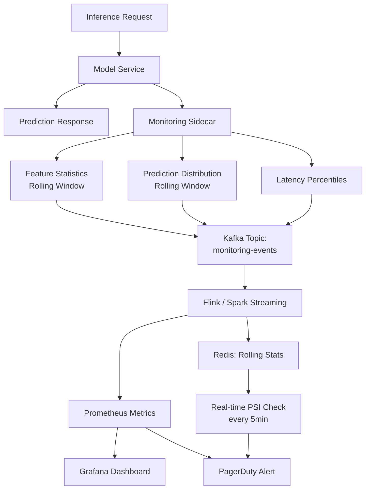

# Model Monitoring — Senior Deep Dive

## Real-Time Monitoring at Scale

Batch monitoring (daily reports) is insufficient for high-stakes, high-throughput models. Real-time monitoring detects issues in minutes, not days.



### Streaming Drift Detection

```python
import numpy as np
from collections import deque
from scipy import stats
from dataclasses import dataclass, field
from datetime import datetime
from typing import Optional
import threading

@dataclass
class StreamingFeatureMonitor:
    """
    Online drift detector for a single feature.
    Maintains rolling window of recent values and computes drift vs baseline.
    
    Uses ADWIN (Adaptive Windowing) concept: detects drift when 
    two sub-windows of the stream have statistically different means.
    """
    feature_name: str
    reference_values: np.ndarray  # From training data
    window_size: int = 1000       # Rolling window size
    ks_p_threshold: float = 0.01  # KS test significance level
    
    _window: deque = field(default_factory=deque, init=False)
    _drift_count: int = field(default=0, init=False)
    _lock: threading.Lock = field(default_factory=threading.Lock, init=False)
    
    def update(self, value: float) -> Optional[dict]:
        """Update with new observation. Returns drift alert if detected."""
        with self._lock:
            self._window.append(value)
            if len(self._window) > self.window_size:
                self._window.popleft()
            
            # Only run test when window is full
            if len(self._window) < self.window_size:
                return None
            
            window_values = np.array(self._window)
            ks_stat, p_value = stats.ks_2samp(self.reference_values, window_values)
            
            if p_value < self.ks_p_threshold:
                self._drift_count += 1
                return {
                    "feature": self.feature_name,
                    "ks_statistic": float(ks_stat),
                    "p_value": float(p_value),
                    "window_mean": float(window_values.mean()),
                    "reference_mean": float(self.reference_values.mean()),
                    "drift_events": self._drift_count,
                    "timestamp": datetime.utcnow().isoformat(),
                }
            
            return None


class RealTimeModelMonitor:
    """
    Real-time monitoring for a production model.
    Runs as a sidecar alongside the model service.
    """
    
    def __init__(self, model_name: str, reference_df, numeric_features: list):
        self.model_name = model_name
        self.feature_monitors = {
            col: StreamingFeatureMonitor(
                feature_name=col,
                reference_values=reference_df[col].dropna().values,
            )
            for col in numeric_features
        }
        self._prediction_window = deque(maxlen=1000)
        self._reference_prediction_dist = None  # Set from validation predictions
    
    def record_inference(self, features: dict, score: float) -> list:
        """Record a single inference event and check for drift."""
        alerts = []
        
        # Check feature drift
        for feature_name, value in features.items():
            if feature_name in self.feature_monitors:
                alert = self.feature_monitors[feature_name].update(value)
                if alert:
                    alerts.append(alert)
        
        # Track score distribution
        self._prediction_window.append(score)
        
        # Check score distribution every 100 predictions
        if len(self._prediction_window) >= 100 and len(self._prediction_window) % 100 == 0:
            score_alert = self._check_score_distribution()
            if score_alert:
                alerts.append(score_alert)
        
        return alerts
    
    def _check_score_distribution(self) -> Optional[dict]:
        """Check if prediction score distribution has shifted."""
        if self._reference_prediction_dist is None:
            return None
        
        current_scores = np.array(self._prediction_window)
        ks_stat, p_value = stats.ks_2samp(self._reference_prediction_dist, current_scores)
        
        if p_value < 0.01:
            return {
                "type": "score_distribution_drift",
                "ks_statistic": float(ks_stat),
                "current_mean_score": float(current_scores.mean()),
                "reference_mean_score": float(self._reference_prediction_dist.mean()),
            }
        return None
```

---

## Shadow Mode Evaluation

Shadow mode runs a challenger model alongside the champion, mirroring all traffic, but serving only the champion's predictions. The challenger's predictions are logged for offline evaluation.

```python
import asyncio
import aiohttp
import logging
from typing import Optional
import time

logger = logging.getLogger(__name__)

class ShadowModeEvaluator:
    """
    Runs challenger model in shadow mode.
    
    Champion: serves real predictions
    Challenger: receives same input, predictions logged but NOT served
    
    Benefits:
    - Zero risk to production
    - Real traffic distribution (no sampling bias)
    - Detect model disagreements before canary rollout
    """
    
    def __init__(
        self,
        champion_endpoint: str,
        challenger_endpoint: str,
        shadow_sample_rate: float = 1.0,  # Shadow 100% of traffic by default
    ):
        self.champion_endpoint = champion_endpoint
        self.challenger_endpoint = challenger_endpoint
        self.shadow_sample_rate = shadow_sample_rate
        self._disagreements = []
        self._latency_challenger = []
    
    async def predict(self, features: dict) -> dict:
        """
        Serve champion prediction; async shadow challenger.
        Returns champion result immediately.
        """
        import random
        
        # Always get champion prediction (serves user)
        champion_task = asyncio.create_task(self._call_model(self.champion_endpoint, features))
        
        # Shadow challenger at specified rate
        if random.random() < self.shadow_sample_rate:
            asyncio.create_task(self._shadow_challenger(features))
        
        champion_result = await champion_task
        return champion_result
    
    async def _call_model(self, endpoint: str, features: dict) -> dict:
        async with aiohttp.ClientSession() as session:
            start = time.monotonic()
            async with session.post(endpoint, json={"features": features}) as resp:
                result = await resp.json()
                result["latency_ms"] = (time.monotonic() - start) * 1000
                return result
    
    async def _shadow_challenger(self, features: dict) -> None:
        """Fire-and-forget challenger call. Log result but don't block."""
        try:
            start = time.monotonic()
            async with aiohttp.ClientSession() as session:
                async with session.post(self.challenger_endpoint, json={"features": features}) as resp:
                    result = await resp.json()
                    latency_ms = (time.monotonic() - start) * 1000
                    self._latency_challenger.append(latency_ms)
                    
                    # Log to monitoring store (Kafka, S3, etc.)
                    await self._log_shadow_prediction(features, result, latency_ms)
        except Exception as e:
            logger.warning(f"Shadow challenger failed (non-blocking): {e}")
    
    async def _log_shadow_prediction(self, features: dict, result: dict, latency_ms: float) -> None:
        """Persist shadow prediction for offline analysis."""
        record = {
            "timestamp": time.time(),
            "features_hash": hash(str(sorted(features.items()))),
            "challenger_score": result.get("score"),
            "challenger_latency_ms": latency_ms,
        }
        # In production: write to Kafka or S3
        logger.debug(f"Shadow prediction logged: {record}")
    
    def compute_disagreement_rate(
        self,
        champion_scores: list,
        challenger_scores: list,
        threshold: float = 0.5,
        disagreement_tolerance: float = 0.05,
    ) -> dict:
        """
        Compute rate at which champion and challenger disagree on the prediction label.
        High disagreement → significant model behavior change → investigate before promoting.
        """
        champion_labels = [1 if s >= threshold else 0 for s in champion_scores]
        challenger_labels = [1 if s >= threshold else 0 for s in challenger_scores]
        
        disagreements = sum(c != ch for c, ch in zip(champion_labels, challenger_labels))
        disagreement_rate = disagreements / len(champion_labels)
        
        return {
            "n_predictions": len(champion_labels),
            "disagreements": disagreements,
            "disagreement_rate": round(disagreement_rate, 4),
            "safe_to_promote": disagreement_rate <= disagreement_tolerance,
            "recommendation": (
                "Proceed with canary rollout" if disagreement_rate <= disagreement_tolerance
                else "Investigate disagreements before promotion"
            ),
        }
```

---

## Automated Retraining Triggers

```python
from dataclasses import dataclass
from enum import Enum
from typing import Optional
import pandas as pd
import numpy as np

class RetrainingTriggerReason(Enum):
    FEATURE_DRIFT = "feature_drift"
    PERFORMANCE_DEGRADATION = "performance_degradation"
    SCORE_DISTRIBUTION_SHIFT = "score_distribution_shift"
    SCHEDULED = "scheduled"
    MANUAL = "manual"
    DATA_VOLUME_CHANGE = "data_volume_change"

@dataclass
class RetrainingDecision:
    should_retrain: bool
    reason: Optional[RetrainingTriggerReason]
    urgency: str  # "immediate", "scheduled", "none"
    details: dict

class AutomatedRetrainingController:
    """
    Decides whether to trigger retraining based on monitoring signals.
    Implements a scoring-based approach: each signal contributes a score;
    retrain if total score exceeds threshold.
    """
    
    # Signal weights
    SIGNAL_WEIGHTS = {
        "critical_feature_drift": 3,    # PSI > 0.2 for any important feature
        "auc_drop_5pct": 3,             # AUC dropped > 5% from baseline
        "auc_drop_3pct": 1,             # AUC dropped > 3% from baseline
        "moderate_feature_drift": 1,    # PSI > 0.1 for any feature
        "score_distribution_shift": 2,  # Prediction score dist shifted
        "n_days_since_last_train": 0.1, # Staleness (per day)
    }
    
    RETRAIN_THRESHOLD = 3  # Score >= 3 triggers retraining
    
    def evaluate(
        self,
        monitoring_result: dict,
        baseline_auc: float,
        current_auc: Optional[float],
        days_since_last_train: int,
    ) -> RetrainingDecision:
        
        score = 0
        signals_triggered = []
        
        # Feature drift signals
        for feat, drift_info in monitoring_result.get("feature_drift", {}).items():
            psi = drift_info.get("psi", 0)
            if psi >= 0.2:
                score += self.SIGNAL_WEIGHTS["critical_feature_drift"]
                signals_triggered.append(f"critical_drift:{feat}(PSI={psi:.3f})")
            elif psi >= 0.1:
                score += self.SIGNAL_WEIGHTS["moderate_feature_drift"]
                signals_triggered.append(f"moderate_drift:{feat}(PSI={psi:.3f})")
        
        # Performance signals
        if current_auc is not None:
            auc_drop = baseline_auc - current_auc
            if auc_drop >= 0.05:
                score += self.SIGNAL_WEIGHTS["auc_drop_5pct"]
                signals_triggered.append(f"auc_drop:{auc_drop:.4f}")
            elif auc_drop >= 0.03:
                score += self.SIGNAL_WEIGHTS["auc_drop_3pct"]
                signals_triggered.append(f"auc_drop_minor:{auc_drop:.4f}")
        
        # Staleness
        score += self.SIGNAL_WEIGHTS["n_days_since_last_train"] * days_since_last_train
        
        # Score distribution shift
        if monitoring_result.get("score_distribution_drift"):
            score += self.SIGNAL_WEIGHTS["score_distribution_shift"]
            signals_triggered.append("score_distribution_shift")
        
        if score >= self.RETRAIN_THRESHOLD:
            urgency = "immediate" if score >= 6 else "scheduled"
            primary_reason = (
                RetrainingTriggerReason.PERFORMANCE_DEGRADATION if current_auc and (baseline_auc - current_auc) >= 0.05
                else RetrainingTriggerReason.FEATURE_DRIFT
            )
            return RetrainingDecision(
                should_retrain=True,
                reason=primary_reason,
                urgency=urgency,
                details={"score": score, "signals": signals_triggered},
            )
        
        return RetrainingDecision(
            should_retrain=False,
            reason=None,
            urgency="none",
            details={"score": score, "signals": signals_triggered},
        )
    
    def trigger_retraining_pipeline(self, decision: RetrainingDecision, model_name: str) -> None:
        """Trigger Airflow DAG or SageMaker Pipeline for retraining."""
        if not decision.should_retrain:
            return
        
        trigger_payload = {
            "model_name": model_name,
            "trigger_reason": decision.reason.value,
            "urgency": decision.urgency,
            "signals": decision.details["signals"],
        }
        
        # In production: call Airflow REST API or SageMaker StartPipelineExecution
        if decision.urgency == "immediate":
            # High-priority: bypass scheduling queue
            print(f"IMMEDIATE RETRAINING TRIGGERED: {trigger_payload}")
        else:
            # Queue for next scheduled training slot
            print(f"SCHEDULED RETRAINING QUEUED: {trigger_payload}")
```

---

## SLA Monitoring

Model serving SLAs combine accuracy SLAs (model quality) and latency SLAs (service reliability).

```python
import time
from dataclasses import dataclass, field
from collections import deque
from typing import Optional
import threading
import prometheus_client as prom

# Prometheus metrics for SLA tracking
PREDICTION_LATENCY = prom.Histogram(
    "model_prediction_latency_seconds",
    "Prediction latency in seconds",
    buckets=[0.01, 0.025, 0.05, 0.1, 0.25, 0.5, 1.0, 2.5],
    labelnames=["model_name", "version"],
)

PREDICTION_ERRORS = prom.Counter(
    "model_prediction_errors_total",
    "Total prediction errors",
    labelnames=["model_name", "version", "error_type"],
)

MODEL_SCORE_DISTRIBUTION = prom.Histogram(
    "model_prediction_score",
    "Distribution of model prediction scores",
    buckets=[0.1, 0.2, 0.3, 0.4, 0.5, 0.6, 0.7, 0.8, 0.9, 1.0],
    labelnames=["model_name"],
)

@dataclass
class SLADefinition:
    model_name: str
    latency_p99_ms: float = 100.0   # p99 latency must be < 100ms
    latency_p50_ms: float = 20.0    # p50 latency must be < 20ms
    error_rate_pct: float = 0.1     # Error rate must be < 0.1%
    availability_pct: float = 99.9  # 99.9% uptime

class SLAMonitor:
    """
    Tracks SLA compliance for model serving endpoints.
    Computes rolling p50/p99 latency and error rates.
    Alerts when SLAs are breached.
    """
    
    def __init__(self, sla: SLADefinition, window_size: int = 1000):
        self.sla = sla
        self._latencies = deque(maxlen=window_size)
        self._errors = deque(maxlen=window_size)
        self._lock = threading.Lock()
    
    def record_prediction(
        self,
        latency_ms: float,
        error: Optional[str] = None,
        score: Optional[float] = None,
    ) -> Optional[dict]:
        """Record a prediction and check SLA compliance."""
        
        with self._lock:
            self._latencies.append(latency_ms)
            self._errors.append(1 if error else 0)
        
        # Record Prometheus metrics
        PREDICTION_LATENCY.labels(
            model_name=self.sla.model_name,
            version="v1",
        ).observe(latency_ms / 1000)
        
        if score is not None:
            MODEL_SCORE_DISTRIBUTION.labels(model_name=self.sla.model_name).observe(score)
        
        if error:
            PREDICTION_ERRORS.labels(
                model_name=self.sla.model_name,
                version="v1",
                error_type=type(error).__name__,
            ).inc()
        
        # Check SLA every 100 predictions
        if len(self._latencies) % 100 == 0:
            return self._check_sla_compliance()
        
        return None
    
    def _check_sla_compliance(self) -> dict:
        with self._lock:
            latencies = np.array(self._latencies)
            error_rate = np.mean(self._errors)
        
        p50 = np.percentile(latencies, 50)
        p99 = np.percentile(latencies, 99)
        
        violations = []
        if p99 > self.sla.latency_p99_ms:
            violations.append(f"p99 latency {p99:.1f}ms > SLA {self.sla.latency_p99_ms}ms")
        if p50 > self.sla.latency_p50_ms:
            violations.append(f"p50 latency {p50:.1f}ms > SLA {self.sla.latency_p50_ms}ms")
        if error_rate * 100 > self.sla.error_rate_pct:
            violations.append(f"Error rate {error_rate:.3%} > SLA {self.sla.error_rate_pct}%")
        
        return {
            "p50_ms": round(p50, 2),
            "p99_ms": round(p99, 2),
            "error_rate_pct": round(error_rate * 100, 4),
            "sla_violations": violations,
            "sla_breached": len(violations) > 0,
        }
```

---

## Multi-Model Monitoring Platform

At scale, you monitor hundreds of models. A monitoring platform abstracts per-model configuration.

```python
import yaml
from pathlib import Path

@dataclass
class ModelMonitoringConfig:
    model_name: str
    model_version: str
    feature_schema: dict
    drift_thresholds: dict
    performance_thresholds: dict
    retraining_rules: dict
    alert_channels: list
    baseline_path: str  # S3 path to reference dataset

class MonitoringRegistry:
    """Central registry for all model monitoring configurations."""
    
    def __init__(self, config_path: str):
        self._configs = {}
        self._load_from_yaml(config_path)
    
    def _load_from_yaml(self, config_path: str) -> None:
        with open(config_path) as f:
            configs = yaml.safe_load(f)
        
        for model_config in configs["models"]:
            self._configs[model_config["model_name"]] = ModelMonitoringConfig(**model_config)
    
    def get_config(self, model_name: str) -> ModelMonitoringConfig:
        if model_name not in self._configs:
            raise KeyError(f"No monitoring config found for model: {model_name}")
        return self._configs[model_name]
    
    def list_models(self) -> list:
        return list(self._configs.keys())

# monitoring_config.yaml
EXAMPLE_CONFIG = """
models:
  - model_name: fraud_scoring_v4
    model_version: "4.2.1"
    baseline_path: s3://ml-data/baselines/fraud_train_val.parquet
    drift_thresholds:
      psi_warning: 0.1
      psi_critical: 0.2
    performance_thresholds:
      auc_min: 0.85
      recall_min: 0.70
    retraining_rules:
      auto_trigger: true
      min_days_between_retrains: 7
    alert_channels:
      - pagerduty_critical
      - slack_ml_alerts

  - model_name: churn_prediction_v2
    model_version: "2.1.0"
    baseline_path: s3://ml-data/baselines/churn_train_val.parquet
    drift_thresholds:
      psi_warning: 0.15
      psi_critical: 0.25
    performance_thresholds:
      auc_min: 0.78
    retraining_rules:
      auto_trigger: false
      schedule: "0 0 * * 0"  # Weekly on Sunday
    alert_channels:
      - slack_ml_alerts
"""
```

---

## Interview Tips

> **Tip 1:** "How does shadow mode evaluation work and when do you use it?" — "Shadow mode runs a challenger model against real production traffic, but only the champion's predictions are served to users. The challenger receives the same request asynchronously (fire-and-forget), and its predictions are logged. You then compare champion and challenger predictions offline: disagreement rate, score distribution, and — once labels arrive — performance metrics. Shadow mode is the safest way to validate a new model on live traffic before any canary rollout. Use it when: (1) the new model architecture is significantly different, (2) training data was substantially changed, (3) the model impacts a regulated or high-stakes decision."

> **Tip 2:** "What is the difference between reactive and proactive monitoring?" — "Reactive monitoring: detect when something has already gone wrong (AUC dropped, error rate spiked). You respond after damage is done. Proactive monitoring: detect early warning signals before performance drops — feature distribution shifts (PSI), score distribution changes, data quality issues. Proactive is better but harder: it requires understanding which signals precede performance degradation for your specific model and domain. The gold standard is both: proactive signals for early warning plus performance tracking when labels arrive."

> **Tip 3:** "How do you avoid false alert storms in real-time monitoring?" — "False alert storms happen when one root cause (e.g., upstream data pipeline change) triggers alerts for every affected feature simultaneously. Solutions: (1) Alert deduplication — group alerts by root cause using correlation analysis; (2) Minimum sample size — only alert when the rolling window has enough data; (3) Alert cooldown — suppress re-alerts within a cooldown window; (4) Threshold tuning using historical data — what PSI level actually predicts degradation for this specific model? (5) Tiered severity — only send immediate alerts (PagerDuty) for verified performance impact, not for drift signals alone."

> **Tip 4:** "How do you design automated retraining to avoid training-serving skew?" — "Automated retraining can introduce skew if not careful: (1) The same data pipeline must be used for training and serving feature computation — use a shared feature store; (2) The retraining trigger should evaluate the monitoring signals that indicate actual degradation, not just any drift; (3) The retrained model should go through the same validation and shadow mode evaluation as any manually retrained model — don't deploy automatically without gates; (4) Implement a minimum time between retrains to prevent thrashing; (5) Log the trigger reason and feature data snapshot for every automated retraining run for reproducibility."
