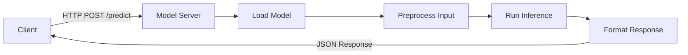
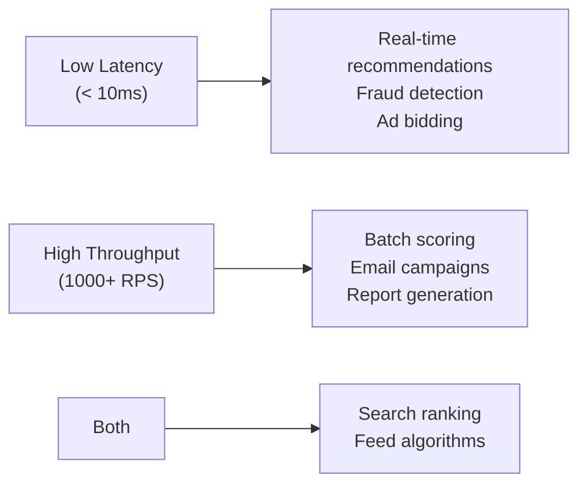

# Model Serving — Fundamentals

## What Is Model Serving?

Model serving is the process of deploying a trained ML model to make predictions on new data. The goal is to expose model predictions via an API that other services and applications can call reliably, with acceptable latency.



---

## Flask Serving Pattern

Flask is simple and suitable for low-traffic model serving.

```python
# app.py
from flask import Flask, request, jsonify
import joblib
import numpy as np
import pandas as pd
from typing import Dict, Any
import logging

logging.basicConfig(level=logging.INFO)
logger = logging.getLogger(__name__)

app = Flask(__name__)

# Load model once at startup (not per request!)
MODEL = joblib.load("models/churn_model_v2.joblib")
FEATURE_NAMES = ["age", "tenure_months", "monthly_spend", "plan_type_premium"]


@app.route("/health", methods=["GET"])
def health():
    """Health check endpoint for load balancer."""
    return jsonify({"status": "ok", "model_version": "2.1.0"})


@app.route("/predict", methods=["POST"])
def predict():
    """
    Predict churn probability for a user.
    
    Request body:
    {
        "user_id": "u_12345",
        "features": {
            "age": 35,
            "tenure_months": 24,
            "monthly_spend": 89.99,
            "plan_type_premium": 1
        }
    }
    """
    try:
        data = request.get_json(force=True)
        user_id = data.get("user_id")
        features = data.get("features", {})
        
        # Validate required features
        missing = [f for f in FEATURE_NAMES if f not in features]
        if missing:
            return jsonify({"error": f"Missing features: {missing}"}), 400
        
        # Build feature vector
        X = np.array([[features[f] for f in FEATURE_NAMES]])
        
        # Inference
        score = float(MODEL.predict_proba(X)[0][1])
        label = "high_risk" if score > 0.5 else "low_risk"
        
        logger.info(f"user_id={user_id} score={score:.4f} label={label}")
        
        return jsonify({
            "user_id": user_id,
            "churn_probability": round(score, 4),
            "risk_label": label,
            "model_version": "2.1.0",
        })
    
    except Exception as e:
        logger.error(f"Prediction error: {e}", exc_info=True)
        return jsonify({"error": "Internal server error"}), 500


@app.route("/predict/batch", methods=["POST"])
def predict_batch():
    """Batch prediction endpoint."""
    data = request.get_json(force=True)
    records = data.get("records", [])
    
    if not records:
        return jsonify({"error": "No records provided"}), 400
    
    if len(records) > 1000:
        return jsonify({"error": "Batch size limit is 1000"}), 400
    
    # Build batch feature matrix
    X = np.array([[r["features"][f] for f in FEATURE_NAMES] for r in records])
    
    scores = MODEL.predict_proba(X)[:, 1]
    
    results = [
        {
            "user_id": records[i].get("user_id"),
            "churn_probability": round(float(scores[i]), 4),
        }
        for i in range(len(records))
    ]
    
    return jsonify({"predictions": results, "count": len(results)})


if __name__ == "__main__":
    app.run(host="0.0.0.0", port=8080, debug=False)
```

---

## FastAPI Serving Pattern

FastAPI is the modern alternative — async, type-safe, automatic OpenAPI docs.

```python
# main.py
from fastapi import FastAPI, HTTPException, BackgroundTasks
from pydantic import BaseModel, Field
from contextlib import asynccontextmanager
from typing import List, Optional
import joblib
import numpy as np
import time
import logging

logger = logging.getLogger(__name__)

# Request/response models
class PredictRequest(BaseModel):
    user_id: str = Field(..., description="User identifier")
    age: int = Field(..., ge=18, le=120)
    tenure_months: int = Field(..., ge=0)
    monthly_spend: float = Field(..., ge=0)
    plan_type_premium: int = Field(..., ge=0, le=1)

class PredictResponse(BaseModel):
    user_id: str
    churn_probability: float
    risk_label: str
    model_version: str
    latency_ms: float

class BatchRequest(BaseModel):
    records: List[PredictRequest]

class BatchResponse(BaseModel):
    predictions: List[PredictResponse]
    count: int
    total_latency_ms: float


# Application lifespan (startup/shutdown)
@asynccontextmanager
async def lifespan(app: FastAPI):
    # Startup: load model
    app.state.model = joblib.load("models/churn_model_v2.joblib")
    app.state.model_version = "2.1.0"
    logger.info(f"Model loaded: {app.state.model_version}")
    yield
    # Shutdown: cleanup
    logger.info("Shutting down")


app = FastAPI(
    title="Churn Prediction API",
    description="Predict customer churn probability",
    version="2.1.0",
    lifespan=lifespan,
)

FEATURE_NAMES = ["age", "tenure_months", "monthly_spend", "plan_type_premium"]


@app.get("/health")
async def health():
    return {"status": "ok", "model_version": app.state.model_version}


@app.post("/predict", response_model=PredictResponse)
async def predict(request: PredictRequest):
    start = time.monotonic()
    
    try:
        X = np.array([[
            request.age,
            request.tenure_months,
            request.monthly_spend,
            request.plan_type_premium,
        ]])
        
        score = float(app.state.model.predict_proba(X)[0][1])
        latency_ms = (time.monotonic() - start) * 1000
        
        return PredictResponse(
            user_id=request.user_id,
            churn_probability=round(score, 4),
            risk_label="high_risk" if score > 0.5 else "low_risk",
            model_version=app.state.model_version,
            latency_ms=round(latency_ms, 2),
        )
    
    except Exception as e:
        logger.error(f"Prediction failed for {request.user_id}: {e}")
        raise HTTPException(status_code=500, detail="Prediction failed")


@app.post("/predict/batch", response_model=BatchResponse)
async def predict_batch(request: BatchRequest):
    if len(request.records) > 1000:
        raise HTTPException(status_code=400, detail="Max batch size is 1000")
    
    start = time.monotonic()
    
    X = np.array([[
        r.age, r.tenure_months, r.monthly_spend, r.plan_type_premium
    ] for r in request.records])
    
    scores = app.state.model.predict_proba(X)[:, 1]
    total_latency = (time.monotonic() - start) * 1000
    
    predictions = [
        PredictResponse(
            user_id=request.records[i].user_id,
            churn_probability=round(float(scores[i]), 4),
            risk_label="high_risk" if scores[i] > 0.5 else "low_risk",
            model_version=app.state.model_version,
            latency_ms=round(total_latency / len(request.records), 2),
        )
        for i in range(len(request.records))
    ]
    
    return BatchResponse(
        predictions=predictions,
        count=len(predictions),
        total_latency_ms=round(total_latency, 2),
    )
```

---

## Model Loading Strategies

### Load Once at Startup

```python
# WRONG: Load per request (expensive)
@app.route("/predict")
def predict():
    model = joblib.load("model.joblib")  # 500ms each call!
    return model.predict(...)

# CORRECT: Load once at module level
MODEL = joblib.load("model.joblib")  # Once at startup

@app.route("/predict")
def predict():
    return MODEL.predict(...)  # < 1ms
```

### Model Registry Loading

```python
import mlflow

def load_model_from_registry(model_name: str, stage: str = "Production"):
    """Load the Production-stage model from MLflow registry."""
    model_uri = f"models:/{model_name}/{stage}"
    model = mlflow.sklearn.load_model(model_uri)
    logger.info(f"Loaded {model_name} @ {stage}")
    return model

# Load on startup
MODEL = load_model_from_registry("churn-classifier", stage="Production")
```

---

## Latency vs Throughput

These are the two primary performance dimensions for model serving:

| Metric | Definition | Typical Target |
|--------|-----------|----------------|
| Latency (p50) | Median response time | < 50ms |
| Latency (p99) | 99th percentile response | < 200ms |
| Throughput (RPS) | Requests per second | Varies by use case |
| Concurrency | Parallel requests | CPU cores * 2-4 |



### Benchmarking Your Server

```bash
# Install wrk
brew install wrk

# Test FastAPI endpoint
wrk -t4 -c100 -d30s -s post.lua http://localhost:8080/predict

# post.lua
wrk.method = "POST"
wrk.body   = '{"user_id":"u1","age":35,"tenure_months":24,"monthly_spend":89.99,"plan_type_premium":1}'
wrk.headers["Content-Type"] = "application/json"
```

```python
# Python benchmarking with locust
from locust import HttpUser, task, between
import json

class ModelServingUser(HttpUser):
    wait_time = between(0.01, 0.1)
    
    @task
    def predict(self):
        payload = {
            "user_id": "u_test",
            "age": 35,
            "tenure_months": 24,
            "monthly_spend": 89.99,
            "plan_type_premium": 1,
        }
        self.client.post("/predict", json=payload)
```

---

## Containerization with Docker

```dockerfile
# Dockerfile
FROM python:3.11-slim

WORKDIR /app

# Install dependencies first (cached layer)
COPY requirements.txt .
RUN pip install --no-cache-dir -r requirements.txt

# Copy application
COPY models/ models/
COPY main.py .

# Run with multiple workers
CMD ["uvicorn", "main:app", "--host", "0.0.0.0", "--port", "8080", "--workers", "4"]

EXPOSE 8080
```

```yaml
# docker-compose.yml
version: "3.9"
services:
  model-server:
    build: .
    ports:
      - "8080:8080"
    environment:
      - MODEL_PATH=/app/models/churn_model_v2.joblib
    healthcheck:
      test: ["CMD", "curl", "-f", "http://localhost:8080/health"]
      interval: 30s
      timeout: 5s
      retries: 3
    deploy:
      resources:
        limits:
          cpus: "2.0"
          memory: 4G
```

---

## Request/Response Format Best Practices

```python
# Standard error response schema
from enum import Enum
from pydantic import BaseModel
from typing import Optional

class ErrorCode(str, Enum):
    VALIDATION_ERROR = "VALIDATION_ERROR"
    MODEL_ERROR = "MODEL_ERROR"
    RATE_LIMIT = "RATE_LIMIT"
    NOT_FOUND = "NOT_FOUND"

class ErrorResponse(BaseModel):
    error_code: ErrorCode
    message: str
    request_id: Optional[str] = None
    details: Optional[dict] = None

# Include request_id for tracing
import uuid
from fastapi import Request

@app.middleware("http")
async def add_request_id(request: Request, call_next):
    request_id = str(uuid.uuid4())
    request.state.request_id = request_id
    response = await call_next(request)
    response.headers["X-Request-ID"] = request_id
    return response
```

---

## Interview Tips

> **Tip 1:** "Why use FastAPI over Flask for model serving?" — "FastAPI provides async support (handles I/O-bound tasks without blocking), automatic request validation with Pydantic (no manual error checking), and auto-generated OpenAPI docs. For CPU-bound inference, the async advantage is smaller, but for models that do feature fetches from Redis/databases, async matters significantly. Flask is simpler but synchronous."

> **Tip 2:** "What's the first thing you check when a model server has high latency?" — "Check where time is spent: model loading (should be 0 — load at startup), preprocessing (vectorized or looping?), model inference, and I/O (feature fetches from external stores). Add timing instrumentation around each stage. Usually preprocessing or feature fetches are the culprit, not the model itself."

> **Tip 3:** "How do you choose the number of Gunicorn/Uvicorn workers?" — "Rule of thumb: 2 * CPU_cores + 1 for synchronous workers (Gunicorn). For async workers (Uvicorn), 1 worker per CPU is typically enough since async handles concurrent I/O without blocking. Always load test to find the saturation point — too many workers with large models causes memory pressure."

> **Tip 4:** "What's the difference between p50 and p99 latency and why does p99 matter?" — "p50 (median) is the typical experience. p99 is the worst-case experience for 1 in 100 requests. In high-traffic systems, if you serve 10K RPS, p99 latency affects 100 users per second. Users experiencing slow responses often abandon, so p99 directly impacts revenue. Model garbage collection pauses and cold-start effects often show up in p99 but not p50."
