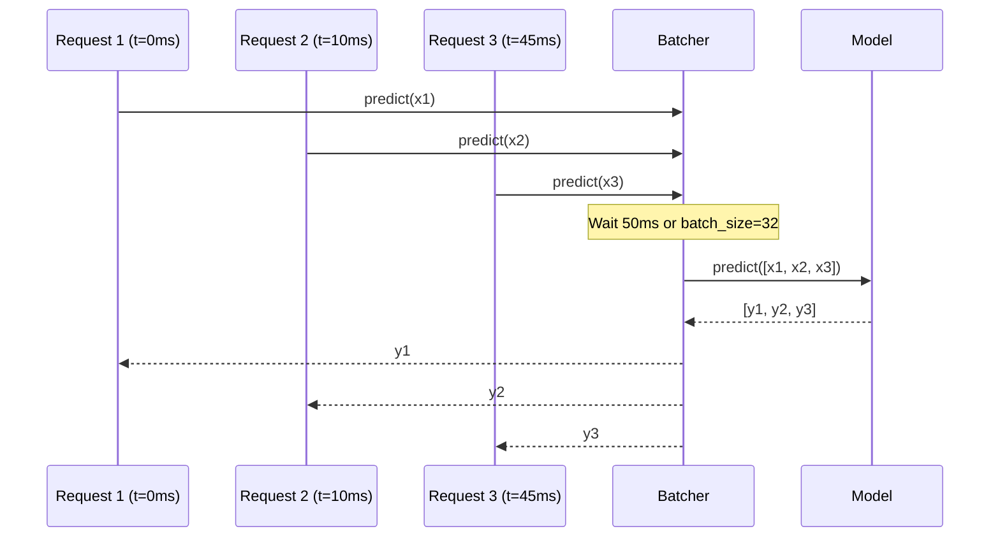

# Model Serving — Intermediate

## Model Serving Frameworks Comparison

| Framework | Best For | Key Feature |
|-----------|----------|-------------|
| BentoML | Python-first, flexible | Unified packaging + serving |
| TorchServe | PyTorch models | Native PyTorch support, batch inference |
| TF Serving | TensorFlow/Keras | gRPC, model warmup, multiple versions |
| Triton Inference Server | Multi-framework, GPU | ONNX, TensorRT, concurrent execution |
| Ray Serve | Python actors at scale | Composable, dynamic batching |

---

## BentoML

BentoML packages models with their serving logic into a "Bento" — a portable, self-contained unit.

```python
import bentoml
from bentoml.io import JSON, NumpyNdarray
import numpy as np
import pandas as pd
from pydantic import BaseModel

# 1. Save model to BentoML's model store
import sklearn
from sklearn.ensemble import GradientBoostingClassifier

model = GradientBoostingClassifier()
# ... train ...

saved_model = bentoml.sklearn.save_model(
    "churn_classifier",
    model,
    signatures={
        "predict": {"batchable": True, "batch_dim": 0},
        "predict_proba": {"batchable": True, "batch_dim": 0},
    },
    metadata={
        "model_version": "2.1.0",
        "training_auc": 0.89,
        "feature_names": ["age", "tenure_months", "monthly_spend"],
    },
)
print(f"Saved: {saved_model.tag}")  # churn_classifier:a1b2c3d4


# 2. Define service
class ChurnRequest(BaseModel):
    user_id: str
    age: int
    tenure_months: int
    monthly_spend: float

class ChurnResponse(BaseModel):
    user_id: str
    churn_probability: float
    risk_label: str

# Load runner (handles batching and concurrency automatically)
churn_runner = bentoml.sklearn.get("churn_classifier:latest").to_runner()

svc = bentoml.Service("churn_service", runners=[churn_runner])

@svc.api(input=JSON(pydantic_model=ChurnRequest), output=JSON(pydantic_model=ChurnResponse))
async def predict(request: ChurnRequest) -> ChurnResponse:
    features = np.array([[
        request.age,
        request.tenure_months,
        request.monthly_spend,
    ]])
    
    # Async runner call — BentoML handles batching internally
    score = await churn_runner.predict_proba.async_run(features)
    score = float(score[0][1])
    
    return ChurnResponse(
        user_id=request.user_id,
        churn_probability=round(score, 4),
        risk_label="high_risk" if score > 0.5 else "low_risk",
    )
```

```bash
# Build and serve
bentoml build
bentoml serve churn_service:latest --port 8080

# Containerize
bentoml containerize churn_service:latest -t churn-service:latest
docker run -p 8080:8080 churn-service:latest
```

---

## TorchServe

TorchServe is optimized for PyTorch models with built-in batch inference.

### Custom Handler

```python
# handler.py
from ts.torch_handler.base_handler import BaseHandler
import torch
import numpy as np
from typing import List

class ChurnHandler(BaseHandler):
    """Custom handler for churn prediction model."""
    
    def initialize(self, context):
        """Load model and setup."""
        super().initialize(context)
        
        # Load additional artifacts (e.g., feature scaler)
        import joblib
        artifacts_dir = context.system_properties.get("model_dir")
        self.scaler = joblib.load(f"{artifacts_dir}/scaler.joblib")
        self.feature_names = ["age", "tenure_months", "monthly_spend", "plan_premium"]
        
        self.model.eval()
    
    def preprocess(self, data: List[dict]) -> torch.Tensor:
        """Convert request data to tensor batch."""
        features = []
        for item in data:
            body = item.get("body", {})
            row = [body[f] for f in self.feature_names]
            features.append(row)
        
        X = np.array(features, dtype=np.float32)
        X_scaled = self.scaler.transform(X)
        return torch.tensor(X_scaled)
    
    def inference(self, inputs: torch.Tensor) -> torch.Tensor:
        """Run model inference."""
        with torch.no_grad():
            outputs = self.model(inputs)
            return torch.sigmoid(outputs)
    
    def postprocess(self, outputs: torch.Tensor) -> List[dict]:
        """Format predictions as JSON."""
        scores = outputs.numpy().flatten()
        return [
            {
                "churn_probability": float(score),
                "risk_label": "high_risk" if score > 0.5 else "low_risk",
            }
            for score in scores
        ]
```

```bash
# Package model
torch-model-archiver \
    --model-name churn_classifier \
    --version 2.1.0 \
    --model-file model.py \
    --serialized-file churn_model.pt \
    --handler handler.py \
    --extra-files "scaler.joblib,config.json" \
    --export-path model_store/

# Start server
torchserve \
    --start \
    --model-store model_store \
    --models churn_classifier=churn_classifier.mar \
    --ts-config config.properties
```

```ini
# config.properties
inference_address=http://0.0.0.0:8080
management_address=http://0.0.0.0:8081
metrics_address=http://0.0.0.0:8082

# Batching configuration
batch_size=32
max_batch_delay=100  # ms — wait up to 100ms to fill batch

# Worker configuration
default_workers_per_model=4
```

---

## Dynamic Batching

Batching groups multiple individual requests into a single inference call, dramatically improving GPU utilization.



### Custom Dynamic Batching Implementation

```python
import asyncio
import time
from typing import List, Tuple
import numpy as np

class DynamicBatcher:
    """
    Collects individual requests and processes them as batches.
    Target: reduce per-sample inference cost on GPU models.
    """
    
    def __init__(
        self,
        model,
        max_batch_size: int = 64,
        max_wait_ms: float = 50.0,
    ):
        self.model = model
        self.max_batch_size = max_batch_size
        self.max_wait_ms = max_wait_ms
        self.queue: List[Tuple[np.ndarray, asyncio.Future]] = []
        self.lock = asyncio.Lock()
        self._flush_task = None
    
    async def predict(self, features: np.ndarray) -> np.ndarray:
        """Submit a single request to the batch queue."""
        loop = asyncio.get_event_loop()
        future = loop.create_future()
        
        async with self.lock:
            self.queue.append((features, future))
            
            if len(self.queue) >= self.max_batch_size:
                # Batch full — flush immediately
                await self._flush()
            elif self._flush_task is None:
                # Schedule flush after max_wait_ms
                self._flush_task = asyncio.create_task(
                    self._delayed_flush()
                )
        
        return await future
    
    async def _delayed_flush(self):
        await asyncio.sleep(self.max_wait_ms / 1000)
        async with self.lock:
            if self.queue:
                await self._flush()
            self._flush_task = None
    
    async def _flush(self):
        if not self.queue:
            return
        
        # Grab current batch
        batch = self.queue[:self.max_batch_size]
        self.queue = self.queue[self.max_batch_size:]
        
        features_list, futures = zip(*batch)
        
        try:
            # Batch inference
            X = np.vstack(features_list)
            scores = self.model.predict_proba(X)[:, 1]
            
            # Resolve futures
            for i, future in enumerate(futures):
                future.set_result(scores[i])
        
        except Exception as e:
            for future in futures:
                future.set_exception(e)
```

---

## Model Versioning

Multiple model versions should be manageable without service restarts.

### Multi-Version Serving with FastAPI

```python
from fastapi import FastAPI, HTTPException
import mlflow
from typing import Dict

app = FastAPI()

class ModelRegistry:
    """Manages multiple model versions in memory."""
    
    def __init__(self):
        self.models: Dict[str, object] = {}
        self.default_version: str = "production"
    
    def load(self, version: str, model_uri: str):
        self.models[version] = mlflow.sklearn.load_model(model_uri)
        print(f"Loaded model version: {version}")
    
    def get(self, version: str = None):
        version = version or self.default_version
        if version not in self.models:
            raise KeyError(f"Model version {version} not found")
        return self.models[version]
    
    def set_default(self, version: str):
        if version not in self.models:
            raise KeyError(f"Cannot set default to unloaded version: {version}")
        self.default_version = version
        print(f"Default version set to: {version}")
    
    def list_versions(self):
        return {
            "versions": list(self.models.keys()),
            "default": self.default_version,
        }

registry = ModelRegistry()

@app.on_event("startup")
async def startup():
    registry.load("v2", "models:/churn-classifier/2")
    registry.load("v3", "models:/churn-classifier/3")
    registry.set_default("v3")

@app.get("/models")
def list_models():
    return registry.list_versions()

@app.post("/predict")
def predict(request: dict, version: str = None):
    model = registry.get(version)
    X = build_features(request)
    score = float(model.predict_proba(X)[0][1])
    return {"score": score, "version": version or registry.default_version}

@app.post("/models/{version}/load")
def load_model(version: str, model_uri: str):
    """Hot-reload a new model version without service restart."""
    registry.load(version, model_uri)
    return {"message": f"Loaded version {version}"}

@app.put("/models/default/{version}")
def set_default(version: str):
    registry.set_default(version)
    return {"message": f"Default version set to {version}"}
```

---

## Canary Deployments

Route a small fraction of traffic to a new model version before full rollout.

```python
import random
from enum import Enum

class TrafficPolicy:
    """Routes traffic between model versions."""
    
    def __init__(self):
        self.traffic_split = {
            "v2": 0.90,    # 90% of traffic
            "v3": 0.10,    # 10% canary
        }
    
    def route(self, user_id: str) -> str:
        """
        Consistent hashing: same user always goes to same version.
        Prevents inconsistent experiences within a session.
        """
        import hashlib
        hash_val = int(hashlib.md5(user_id.encode()).hexdigest(), 16)
        bucket = (hash_val % 1000) / 1000.0
        
        cumulative = 0.0
        for version, fraction in self.traffic_split.items():
            cumulative += fraction
            if bucket < cumulative:
                return version
        
        return "v2"  # fallback
    
    def update_split(self, new_split: dict):
        """Gradually shift traffic to new version."""
        assert abs(sum(new_split.values()) - 1.0) < 0.001, "Must sum to 1.0"
        self.traffic_split = new_split
        print(f"Traffic split updated: {new_split}")


traffic_policy = TrafficPolicy()

@app.post("/predict/routed")
def predict_with_routing(request: dict):
    user_id = request.get("user_id", "anonymous")
    version = traffic_policy.route(user_id)
    
    model = registry.get(version)
    X = build_features(request)
    score = float(model.predict_proba(X)[0][1])
    
    # Log version for analysis
    log_prediction(user_id=user_id, version=version, score=score)
    
    return {"score": score, "version": version}
```

---

## Interview Tips

> **Tip 1:** "When does dynamic batching help and when does it hurt?" — "Batching helps when inference is GPU-bound: the GPU has idle capacity between small requests, and batching fills that capacity. For CPU-bound sklearn models, batching adds latency (waiting to fill the batch) with minimal throughput gain. Batching hurts when your p99 SLA is strict — requests at the start of a batch wait while the batch fills up."

> **Tip 2:** "How do you implement zero-downtime model updates?" — "Three approaches: (1) hot-reload — load new model in memory, atomic pointer swap; (2) rolling deployment — update pods one at a time in Kubernetes; (3) blue-green — run two identical environments, switch load balancer. Hot-reload is fastest but risks brief inconsistency if requests are in flight. Blue-green is safest but costs double the compute during the switchover."

> **Tip 3:** "What's the difference between TorchServe and Triton?" — "TorchServe is PyTorch-native, simpler to configure, good for single-framework deployments. Triton (NVIDIA) supports multiple backends (PyTorch, TensorFlow, ONNX, TensorRT) and provides concurrent model execution on GPUs — you can run multiple models sharing the same GPU. Triton also supports dynamic batching natively and is better for high-throughput GPU inference at scale."

> **Tip 4:** "BentoML vs custom FastAPI — when do you choose each?" — "BentoML when you want standardization across teams: packaging, serving, and containerization in one tool, with built-in batching and model store. Custom FastAPI when you need full control — complex preprocessing, custom middleware, specific performance tuning, or composing multiple models in the same request."
