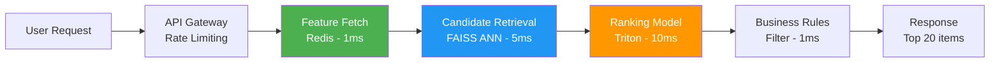

# Model Serving — Real World Patterns

## Real-Time Recommendation Serving

Recommendation serving must balance accuracy, latency, and personalization at massive scale.



### Production Recommendation Service

```python
import asyncio
import aioredis
import numpy as np
import logging
import time
from typing import List, Dict
from dataclasses import dataclass
import tritonclient.http.aio as triton_http

logger = logging.getLogger(__name__)

@dataclass
class RecoResult:
    item_id: str
    score: float
    position: int

class ProductionRecoService:
    """
    Two-stage recommendation service:
    Stage 1: Candidate retrieval (FAISS ANN) — 1000 candidates in <5ms
    Stage 2: Ranking (Neural network via Triton) — personalized scoring in <10ms
    
    Target: p99 latency < 50ms at 10K RPS
    """
    
    def __init__(
        self,
        redis_url: str,
        triton_url: str,
        faiss_index_path: str,
        n_candidates: int = 1000,
        n_final: int = 20,
    ):
        self.n_candidates = n_candidates
        self.n_final = n_final
        self._redis = None
        self._triton = None
        self.faiss_index = self._load_faiss_index(faiss_index_path)
        self._redis_url = redis_url
        self._triton_url = triton_url
    
    async def initialize(self):
        self._redis = await aioredis.from_url(self._redis_url, max_connections=200)
        self._triton = triton_http.InferenceServerClient(self._triton_url)
    
    async def get_recommendations(
        self,
        user_id: str,
        context: dict,
    ) -> List[RecoResult]:
        """Full recommendation pipeline — async throughout."""
        
        start = time.monotonic()
        
        # Parallel: fetch user features AND retrieve candidates
        user_features_task = asyncio.create_task(self._get_user_features(user_id))
        user_embedding_task = asyncio.create_task(self._get_user_embedding(user_id))
        
        user_features, user_embedding = await asyncio.gather(
            user_features_task, user_embedding_task
        )
        
        feature_latency = (time.monotonic() - start) * 1000
        
        # Stage 1: Candidate retrieval via ANN
        candidate_ids, candidate_embeddings = self._retrieve_candidates(user_embedding)
        retrieval_latency = (time.monotonic() - start) * 1000 - feature_latency
        
        # Stage 2: Ranking
        scores = await self._rank_candidates(
            user_features=user_features,
            candidate_ids=candidate_ids,
            candidate_embeddings=candidate_embeddings,
        )
        ranking_latency = (time.monotonic() - start) * 1000 - feature_latency - retrieval_latency
        
        # Stage 3: Post-processing
        ranked = sorted(zip(candidate_ids, scores), key=lambda x: x[1], reverse=True)
        filtered = self._apply_business_rules(ranked, context)[:self.n_final]
        
        total_latency = (time.monotonic() - start) * 1000
        
        logger.info(
            f"user_id={user_id} "
            f"feature={feature_latency:.1f}ms "
            f"retrieval={retrieval_latency:.1f}ms "
            f"ranking={ranking_latency:.1f}ms "
            f"total={total_latency:.1f}ms"
        )
        
        return [
            RecoResult(item_id=item_id, score=float(score), position=i+1)
            for i, (item_id, score) in enumerate(filtered)
        ]
    
    async def _get_user_features(self, user_id: str) -> np.ndarray:
        """Fetch pre-computed user features from Redis."""
        pipe = self._redis.pipeline()
        pipe.hgetall(f"user:features:{user_id}")
        pipe.get(f"user:embedding:{user_id}")
        results = await pipe.execute()
        
        features_dict = results[0] or {}
        
        return np.array([
            float(features_dict.get(b"purchase_count_30d", 0)),
            float(features_dict.get(b"avg_order_value", 0)),
            float(features_dict.get(b"days_since_last_purchase", 999)),
        ], dtype=np.float32)
    
    async def _get_user_embedding(self, user_id: str) -> np.ndarray:
        raw = await self._redis.get(f"user:embedding:{user_id}")
        if raw:
            return np.frombuffer(raw, dtype=np.float32)
        return np.zeros(64, dtype=np.float32)
    
    def _retrieve_candidates(self, user_embedding: np.ndarray):
        """FAISS ANN search for candidate retrieval."""
        distances, indices = self.faiss_index.search(
            user_embedding.reshape(1, -1),
            self.n_candidates,
        )
        # Return candidate IDs and their item embeddings
        candidate_ids = [self.item_id_map[i] for i in indices[0] if i >= 0]
        candidate_embeddings = self.item_embeddings[indices[0][indices[0] >= 0]]
        return candidate_ids, candidate_embeddings
    
    async def _rank_candidates(
        self,
        user_features: np.ndarray,
        candidate_ids: List[str],
        candidate_embeddings: np.ndarray,
    ) -> np.ndarray:
        """Triton inference for ranking."""
        import tritonclient.http as httpclient
        
        n = len(candidate_ids)
        user_features_repeated = np.tile(user_features, (n, 1))
        
        inputs = [
            triton_http.InferInput("user_features", user_features_repeated.shape, "FP32"),
            triton_http.InferInput("item_embeddings", candidate_embeddings.shape, "FP32"),
        ]
        inputs[0].set_data_from_numpy(user_features_repeated)
        inputs[1].set_data_from_numpy(candidate_embeddings.astype(np.float32))
        
        outputs = [triton_http.InferRequestedOutput("scores")]
        
        response = await self._triton.infer("ranking_model", inputs, outputs=outputs)
        return response.as_numpy("scores").flatten()
    
    def _apply_business_rules(self, ranked_items, context):
        """Filter items based on business rules."""
        filtered = []
        for item_id, score in ranked_items:
            if self._is_eligible(item_id, context):
                filtered.append((item_id, score))
        return filtered
    
    def _is_eligible(self, item_id, context):
        """Check business rules: availability, region, user eligibility."""
        return True  # Simplified
    
    def _load_faiss_index(self, path):
        import faiss
        return faiss.read_index(path)
```

---

## Fraud Scoring at 10K RPS

Fraud scoring is the most latency-sensitive ML use case — a slow fraud check blocks the transaction.

```python
from fastapi import FastAPI, BackgroundTasks
import asyncio
import aioredis
import time
import numpy as np
from prometheus_client import Histogram, Counter, generate_latest
from starlette.responses import Response

# Metrics
FRAUD_SCORE_LATENCY = Histogram(
    "fraud_score_latency_ms",
    "Fraud scoring latency",
    buckets=[0.5, 1, 2, 5, 10, 25, 50, 100, 250],
)
FRAUD_SCORE_TOTAL = Counter("fraud_scores_total", "Total fraud scores", ["decision"])

app = FastAPI()

class FraudScoringService:
    """
    Production fraud service:
    - Target: p99 < 10ms end-to-end (transaction must not be delayed)
    - Scale: 10K TPS peak
    - Architecture: In-process XGBoost + Redis for feature lookup
    """
    
    def __init__(self, model_path: str, redis_url: str):
        import xgboost as xgb
        self.model = xgb.Booster()
        self.model.load_model(model_path)
        self._redis_url = redis_url
        self._redis = None
        
        # Pre-warm model with dummy prediction (JIT compilation)
        self._warmup()
    
    def _warmup(self):
        """Pre-warm model to avoid cold-start on first request."""
        import xgboost as xgb
        dummy = np.zeros((1, 64), dtype=np.float32)
        _ = self.model.predict(xgb.DMatrix(dummy))
        print("Model warmed up")
    
    async def initialize(self):
        self._redis = await aioredis.from_url(
            self._redis_url,
            max_connections=500,  # High connection pool for 10K TPS
            socket_timeout=0.05,  # 50ms Redis timeout
        )
    
    async def score(self, transaction: dict) -> dict:
        start = time.perf_counter()
        
        # 1. Parallel feature fetch (target: < 2ms)
        user_id = transaction["user_id"]
        merchant_id = transaction["merchant_id"]
        
        pipe = self._redis.pipeline()
        pipe.hgetall(f"user:risk:{user_id}")
        pipe.hgetall(f"merchant:risk:{merchant_id}")
        pipe.get(f"user:device_count:{user_id}")
        
        redis_results = await pipe.execute()
        fetch_ms = (time.perf_counter() - start) * 1000
        
        user_risk = redis_results[0] or {}
        merchant_risk = redis_results[1] or {}
        device_count = int(redis_results[2] or 1)
        
        # 2. Feature assembly (< 0.1ms)
        features = self._build_features(transaction, user_risk, merchant_risk, device_count)
        
        # 3. XGBoost inference (< 2ms for single sample)
        import xgboost as xgb
        dmatrix = xgb.DMatrix(features.reshape(1, -1))
        fraud_score = float(self.model.predict(dmatrix)[0])
        
        inference_ms = (time.perf_counter() - start) * 1000 - fetch_ms
        
        # 4. Decision
        decision = self._make_decision(fraud_score, transaction)
        
        total_ms = (time.perf_counter() - start) * 1000
        FRAUD_SCORE_LATENCY.observe(total_ms)
        FRAUD_SCORE_TOTAL.labels(decision=decision["action"]).inc()
        
        return {
            "transaction_id": transaction["transaction_id"],
            "fraud_score": round(fraud_score, 4),
            "decision": decision,
            "latency_ms": round(total_ms, 2),
        }
    
    def _build_features(self, tx, user_risk, merchant_risk, device_count):
        return np.array([
            float(tx.get("amount", 0)),
            float(user_risk.get(b"tx_count_1h", 0)),
            float(user_risk.get(b"tx_amount_sum_1h", 0)),
            float(user_risk.get(b"days_since_first_tx", 0)),
            float(merchant_risk.get(b"fraud_rate_30d", 0)),
            float(merchant_risk.get(b"chargeback_rate", 0)),
            float(device_count),
            int(tx.get("ip_is_vpn", 0)),
            int(tx.get("is_new_device", 0)),
            # ... 55 more features
        ], dtype=np.float32)
    
    def _make_decision(self, score: float, tx: dict) -> dict:
        if score >= 0.90:
            return {"action": "block", "reason": "high_fraud_risk"}
        elif score >= 0.60:
            return {"action": "review", "reason": "medium_fraud_risk"}
        elif tx["amount"] > 10_000 and score >= 0.30:
            return {"action": "review", "reason": "high_amount_elevated_risk"}
        else:
            return {"action": "approve", "reason": "low_risk"}


fraud_service = FraudScoringService("fraud_model.json", "redis://fraud-cache:6379")

@app.on_event("startup")
async def startup():
    await fraud_service.initialize()

@app.post("/score")
async def score_transaction(transaction: dict):
    return await fraud_service.score(transaction)

@app.get("/metrics")
async def metrics():
    return Response(generate_latest(), media_type="text/plain")
```

---

## Edge Deployment

Edge deployment runs models on devices (phones, IoT, edge servers) with limited compute and no network dependency.

```python
# TensorFlow Lite for mobile/edge
import tensorflow as tf
import numpy as np

def convert_to_tflite(keras_model, output_path: str, quantize: bool = True):
    """
    Convert Keras model to TFLite for edge deployment.
    Quantization reduces model size 4x and speeds up inference.
    """
    converter = tf.lite.TFLiteConverter.from_keras_model(keras_model)
    
    if quantize:
        converter.optimizations = [tf.lite.Optimize.DEFAULT]
        
        # Representative dataset for full integer quantization
        def representative_data_gen():
            for _ in range(100):
                yield [np.random.randn(1, 64).astype(np.float32)]
        
        converter.representative_dataset = representative_data_gen
        converter.target_spec.supported_ops = [tf.lite.OpsSet.TFLITE_BUILTINS_INT8]
        converter.inference_input_type = tf.int8
        converter.inference_output_type = tf.int8
    
    tflite_model = converter.convert()
    
    with open(output_path, "wb") as f:
        f.write(tflite_model)
    
    original_mb = sum(v.numpy().nbytes for v in keras_model.variables) / 1024**2
    tflite_mb = len(tflite_model) / 1024**2
    
    print(f"Original: {original_mb:.1f} MB")
    print(f"TFLite:   {tflite_mb:.1f} MB ({original_mb/tflite_mb:.1f}x smaller)")
    
    return tflite_model

class EdgeInferenceEngine:
    """TFLite inference engine for edge deployment."""
    
    def __init__(self, model_path: str):
        self.interpreter = tf.lite.Interpreter(model_path=model_path)
        self.interpreter.allocate_tensors()
        
        self.input_details = self.interpreter.get_input_details()
        self.output_details = self.interpreter.get_output_details()
        
        # Check quantization
        self.is_quantized = self.input_details[0]["dtype"] == np.int8
        if self.is_quantized:
            self.input_scale = self.input_details[0]["quantization"][0]
            self.input_zero_point = self.input_details[0]["quantization"][1]
            self.output_scale = self.output_details[0]["quantization"][0]
            self.output_zero_point = self.output_details[0]["quantization"][1]
    
    def predict(self, features: np.ndarray) -> float:
        if self.is_quantized:
            # Quantize input
            features_q = (features / self.input_scale + self.input_zero_point).astype(np.int8)
        else:
            features_q = features.astype(np.float32)
        
        self.interpreter.set_tensor(self.input_details[0]["index"], features_q.reshape(1, -1))
        self.interpreter.invoke()
        
        output = self.interpreter.get_tensor(self.output_details[0]["index"])
        
        if self.is_quantized:
            # Dequantize output
            return float((output[0][0] - self.output_zero_point) * self.output_scale)
        
        return float(output[0][0])
```

---

## Interview Tips

> **Tip 1:** "How did you design the recommendation system to hit 50ms p99?" — "Three decisions: (1) Async throughout — every I/O operation (Redis, Triton) is awaited, not blocked. This allows a single worker to handle many concurrent requests. (2) Parallel fetching — user features and user embeddings are fetched concurrently with asyncio.gather. (3) Pre-computation — most features exist in Redis before the request arrives, so serving is a lookup not a computation."

> **Tip 2:** "Fraud scoring requires < 10ms — how do you achieve that?" — "Pre-materialize all features to Redis before requests arrive. XGBoost inference on CPU for a single sample with 64 features takes ~1ms. Redis pipelining batches multiple key fetches in one network round-trip (~0.5ms). The remaining budget covers API deserialization and response serialization. Keep the feature set tight — every extra feature that requires an additional Redis call costs ~0.3ms."

> **Tip 3:** "What's the tradeoff between edge and cloud deployment?" — "Edge: no network latency, works offline, private data stays on device, lower operational cost at scale, but limited compute. Cloud: more powerful models, easier to update, centralized monitoring, but requires network, has latency, and raises privacy concerns. Edge is appropriate for: mobile keyboards (privacy), autonomous vehicles (can't wait 50ms for cloud), offline scenarios. Cloud for: complex models (BERT-scale), cases where network latency is acceptable."

> **Tip 4:** "How do you handle model rollback in production fraud detection?" — "Maintain the last 3 model versions in the registry. Track per-version metrics (approval rate, chargeback rate, false positive rate) in real-time. If chargeback rate rises > 20% relative to baseline within 1 hour, auto-rollback to previous version. Alert the team for human review. Keep the old model warm so rollback is a config switch, not a cold start."
