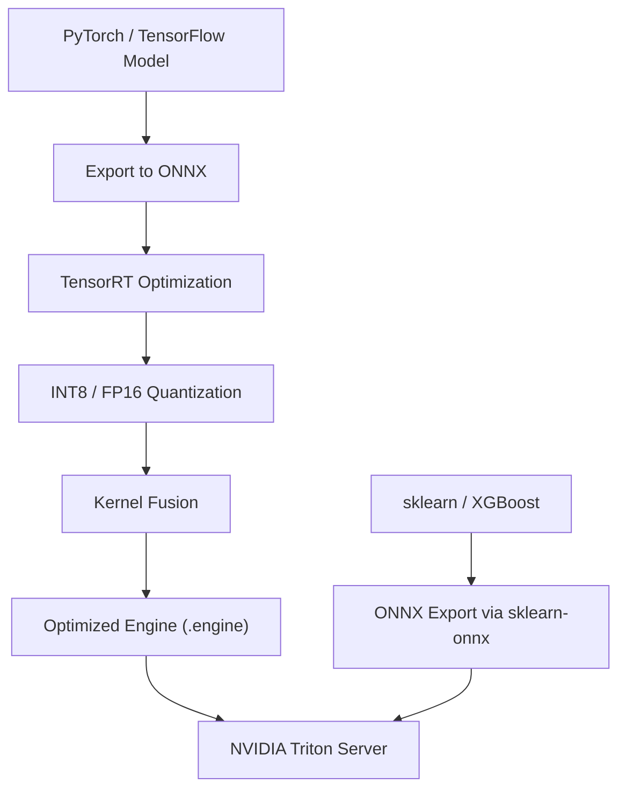

# Model Serving — Senior Deep Dive

## Inference Optimization Stack



---

## ONNX: Cross-Framework Model Export

ONNX (Open Neural Network Exchange) creates a framework-agnostic model representation, enabling optimization with TensorRT and deployment on non-native runtimes.

```python
import torch
import torch.nn as nn
import onnx
import onnxruntime as ort
import numpy as np

class FraudDetectionModel(nn.Module):
    def __init__(self, input_dim: int = 64, hidden_dim: int = 256):
        super().__init__()
        self.network = nn.Sequential(
            nn.Linear(input_dim, hidden_dim),
            nn.ReLU(),
            nn.BatchNorm1d(hidden_dim),
            nn.Dropout(0.3),
            nn.Linear(hidden_dim, 64),
            nn.ReLU(),
            nn.Linear(64, 1),
            nn.Sigmoid(),
        )
    
    def forward(self, x: torch.Tensor) -> torch.Tensor:
        return self.network(x)


def export_to_onnx(model: nn.Module, input_dim: int, output_path: str):
    model.eval()
    
    # Dummy input for tracing
    dummy_input = torch.randn(1, input_dim)
    
    torch.onnx.export(
        model,
        dummy_input,
        output_path,
        opset_version=17,
        input_names=["features"],
        output_names=["fraud_probability"],
        dynamic_axes={
            "features": {0: "batch_size"},          # Variable batch size
            "fraud_probability": {0: "batch_size"},
        },
        do_constant_folding=True,  # Fold constant ops
        verbose=False,
    )
    
    # Validate exported model
    onnx_model = onnx.load(output_path)
    onnx.checker.check_model(onnx_model)
    print(f"ONNX model validated: {output_path}")


def run_onnx_inference(model_path: str, features: np.ndarray) -> np.ndarray:
    """ONNX Runtime is typically 2-5x faster than pure PyTorch on CPU."""
    
    session = ort.InferenceSession(
        model_path,
        providers=["CUDAExecutionProvider", "CPUExecutionProvider"],
    )
    
    input_name = session.get_inputs()[0].name
    output_name = session.get_outputs()[0].name
    
    # Run inference
    result = session.run(
        [output_name],
        {input_name: features.astype(np.float32)}
    )
    return result[0]


# Export and benchmark
model = FraudDetectionModel()
export_to_onnx(model, input_dim=64, output_path="fraud_model.onnx")

# Benchmark: PyTorch vs ONNX Runtime
import time

X = np.random.randn(100, 64).astype(np.float32)
X_tensor = torch.tensor(X)

# PyTorch inference
start = time.perf_counter()
for _ in range(1000):
    with torch.no_grad():
        _ = model(X_tensor)
pytorch_ms = (time.perf_counter() - start) * 1000 / 1000

# ONNX Runtime inference
session = ort.InferenceSession("fraud_model.onnx", providers=["CPUExecutionProvider"])
start = time.perf_counter()
for _ in range(1000):
    _ = run_onnx_inference("fraud_model.onnx", X)
onnx_ms = (time.perf_counter() - start) * 1000 / 1000

print(f"PyTorch: {pytorch_ms:.2f}ms/batch")
print(f"ONNX:    {onnx_ms:.2f}ms/batch  ({pytorch_ms/onnx_ms:.1f}x speedup)")
```

### sklearn to ONNX

```python
from sklearn.ensemble import GradientBoostingClassifier
from skl2onnx import convert_sklearn
from skl2onnx.common.data_types import FloatTensorType
import onnxruntime as ort

def export_sklearn_to_onnx(sklearn_model, n_features: int, output_path: str):
    """Export any sklearn model to ONNX format."""
    
    initial_type = [("float_input", FloatTensorType([None, n_features]))]
    
    onnx_model = convert_sklearn(
        sklearn_model,
        initial_types=initial_type,
        options={type(sklearn_model): {"nocl": True, "zipmap": False}},
    )
    
    with open(output_path, "wb") as f:
        f.write(onnx_model.SerializeToString())
    
    print(f"sklearn model exported to ONNX: {output_path}")

# Usage
model = GradientBoostingClassifier(n_estimators=200).fit(X_train, y_train)
export_sklearn_to_onnx(model, n_features=X_train.shape[1], output_path="gbm.onnx")
```

---

## Quantization

Quantization reduces model precision (FP32 → INT8) for 2-4x speedup with minimal accuracy loss.

### Post-Training Dynamic Quantization

```python
import torch
from torch.quantization import quantize_dynamic

# Quantize Linear layers to INT8
quantized_model = quantize_dynamic(
    model,
    qconfig_spec={nn.Linear},
    dtype=torch.qint8,
)

# Compare sizes
original_size = sum(p.numel() * p.element_size() for p in model.parameters())
quantized_size = sum(p.numel() * p.element_size() for p in quantized_model.parameters())

print(f"Original size: {original_size / 1024:.1f} KB")
print(f"Quantized size: {quantized_size / 1024:.1f} KB ({original_size/quantized_size:.1f}x smaller)")

# Validate accuracy preserved
import torch.nn.functional as F

with torch.no_grad():
    original_pred = torch.sigmoid(model(X_tensor))
    quantized_pred = torch.sigmoid(quantized_model(X_tensor))

mae = (original_pred - quantized_pred).abs().mean().item()
print(f"Prediction MAE: {mae:.6f}")  # Should be very small
```

### Static Quantization (Better Accuracy)

```python
import torch.quantization

def calibrate_model(model, calibration_loader):
    """Feed calibration data to collect activation statistics."""
    model.eval()
    with torch.no_grad():
        for data, _ in calibration_loader:
            model(data)

# Prepare model for static quantization
model.qconfig = torch.quantization.get_default_qconfig("fbgemm")  # CPU
torch.quantization.prepare(model, inplace=True)

# Calibrate (1000 samples is usually sufficient)
calibrate_model(model, calibration_loader)

# Convert to quantized model
torch.quantization.convert(model, inplace=True)
```

---

## Multi-Model Serving with NVIDIA Triton

Triton enables multiple models to share GPU resources with concurrent execution.

```yaml
# model_repository/churn_model/config.pbtxt
name: "churn_model"
backend: "onnxruntime"
max_batch_size: 256
input [
  {
    name: "features"
    data_type: TYPE_FP32
    dims: [ 64 ]
  }
]
output [
  {
    name: "fraud_probability"
    data_type: TYPE_FP32
    dims: [ 1 ]
  }
]
dynamic_batching {
  preferred_batch_size: [ 32, 64, 128 ]
  max_queue_delay_microseconds: 50000   # 50ms max wait
}
instance_group [
  {
    count: 2           # 2 model instances
    kind: KIND_GPU
    gpus: [ 0 ]        # On GPU 0
  }
]
```

```python
import tritonclient.http as triton_http
import numpy as np

def triton_predict(model_name: str, features: np.ndarray) -> np.ndarray:
    """Send inference request to Triton server."""
    client = triton_http.InferenceServerClient("localhost:8000")
    
    # Create input tensor
    inputs = [
        triton_http.InferInput("features", features.shape, "FP32")
    ]
    inputs[0].set_data_from_numpy(features.astype(np.float32))
    
    # Request outputs
    outputs = [triton_http.InferRequestedOutput("fraud_probability")]
    
    # Synchronous inference
    response = client.infer(
        model_name=model_name,
        inputs=inputs,
        outputs=outputs,
    )
    
    return response.as_numpy("fraud_probability")

# Async inference for higher throughput
async def triton_predict_async(client, model_name: str, features: np.ndarray):
    """Async Triton inference — better for high-concurrency serving."""
    import tritonclient.http.aio as async_triton
    
    inputs = [async_triton.InferInput("features", features.shape, "FP32")]
    inputs[0].set_data_from_numpy(features.astype(np.float32))
    outputs = [async_triton.InferRequestedOutput("fraud_probability")]
    
    response = await client.infer(model_name, inputs, outputs=outputs)
    return response.as_numpy("fraud_probability")
```

---

## SLA Monitoring and Circuit Breaking

```python
import time
import asyncio
from collections import deque
from dataclasses import dataclass, field
from typing import Optional
import logging
from prometheus_client import Histogram, Counter, Gauge

logger = logging.getLogger(__name__)

# Prometheus metrics
INFERENCE_LATENCY = Histogram(
    "model_inference_latency_seconds",
    "Model inference latency",
    ["model_name", "version"],
    buckets=[0.001, 0.005, 0.01, 0.025, 0.05, 0.1, 0.25, 0.5, 1.0],
)
INFERENCE_ERRORS = Counter(
    "model_inference_errors_total",
    "Total inference errors",
    ["model_name", "error_type"],
)
CIRCUIT_STATE = Gauge(
    "model_circuit_breaker_state",
    "Circuit breaker state (0=closed, 1=open, 2=half-open)",
    ["model_name"],
)

@dataclass
class CircuitBreaker:
    """
    Circuit breaker pattern for model serving.
    Prevents cascade failures when the model server is struggling.
    
    States:
    - CLOSED: Normal operation, requests pass through
    - OPEN: Too many failures, requests rejected immediately
    - HALF_OPEN: Testing recovery, small fraction of requests allowed
    """
    model_name: str
    failure_threshold: int = 5      # Open after 5 failures in window
    recovery_timeout_s: float = 60  # Try recovery after 60s
    success_threshold: int = 2      # Close after 2 successes in HALF_OPEN
    window_size: int = 10           # Rolling window
    
    failures: deque = field(default_factory=lambda: deque(maxlen=10))
    state: str = "CLOSED"
    last_failure_time: Optional[float] = None
    half_open_successes: int = 0
    
    def call(self, func, *args, **kwargs):
        if self.state == "OPEN":
            if time.time() - self.last_failure_time > self.recovery_timeout_s:
                self.state = "HALF_OPEN"
                self.half_open_successes = 0
                CIRCUIT_STATE.labels(self.model_name).set(2)
            else:
                raise RuntimeError(f"Circuit OPEN for {self.model_name}")
        
        try:
            result = func(*args, **kwargs)
            self._record_success()
            return result
        except Exception as e:
            self._record_failure()
            raise
    
    def _record_success(self):
        self.failures.append(False)
        if self.state == "HALF_OPEN":
            self.half_open_successes += 1
            if self.half_open_successes >= self.success_threshold:
                self.state = "CLOSED"
                CIRCUIT_STATE.labels(self.model_name).set(0)
                logger.info(f"Circuit CLOSED for {self.model_name}")
    
    def _record_failure(self):
        self.failures.append(True)
        self.last_failure_time = time.time()
        
        recent_failures = sum(self.failures)
        if recent_failures >= self.failure_threshold:
            self.state = "OPEN"
            CIRCUIT_STATE.labels(self.model_name).set(1)
            logger.error(f"Circuit OPEN for {self.model_name}: {recent_failures} failures")


class SLAAwareModelServer:
    """Model server with SLA enforcement and circuit breaking."""
    
    def __init__(
        self,
        model,
        model_name: str,
        p99_sla_ms: float = 100.0,
        fallback_model=None,
    ):
        self.model = model
        self.model_name = model_name
        self.p99_sla_ms = p99_sla_ms
        self.fallback = fallback_model
        self.circuit_breaker = CircuitBreaker(model_name)
        self.latencies = deque(maxlen=1000)
    
    def predict(self, features):
        start = time.perf_counter()
        
        try:
            result = self.circuit_breaker.call(
                self.model.predict_proba,
                features
            )
            
            latency_ms = (time.perf_counter() - start) * 1000
            self.latencies.append(latency_ms)
            INFERENCE_LATENCY.labels(self.model_name, "v3").observe(latency_ms / 1000)
            
            return result
        
        except RuntimeError as e:
            # Circuit is open — use fallback
            if self.fallback:
                logger.warning(f"Using fallback for {self.model_name}: {e}")
                INFERENCE_ERRORS.labels(self.model_name, "circuit_open").inc()
                return self.fallback.predict_proba(features)
            raise
    
    def get_p99_latency(self) -> float:
        if not self.latencies:
            return 0.0
        import numpy as np
        return float(np.percentile(list(self.latencies), 99))
    
    def is_within_sla(self) -> bool:
        return self.get_p99_latency() < self.p99_sla_ms
```

---

## GPU Sharing Strategies

```python
# Multi-Process Service (MPS) for GPU sharing between models
# Configured at the CUDA level, not in Python

# In Triton config: concurrent model instances on same GPU
# config.pbtxt for two models sharing GPU 0
"""
instance_group [
  {
    count: 1
    kind: KIND_GPU
    gpus: [0]
  }
]
"""

# Time-sliced GPU sharing (Kubernetes)
# nvidia-device-plugin supports time-slicing
"""
# values.yaml for nvidia device plugin
config:
  map:
    default: |-
      version: v1
      flags:
        migStrategy: none
      sharing:
        timeSlicing:
          replicas: 4   # Each GPU appears as 4 virtual GPUs
"""

# MIG (Multi-Instance GPU) for A100/H100
# Partitions GPU into isolated slices with guaranteed bandwidth
import subprocess

def configure_mig(gpu_id: int, profile: str = "1g.5gb"):
    """Configure Multi-Instance GPU partitioning."""
    # Enable MIG mode
    subprocess.run(["nvidia-smi", "-i", str(gpu_id), "-mig", "1"], check=True)
    
    # Create MIG instance (1/7 of A100 = ~10GB)
    subprocess.run([
        "nvidia-smi", "mig",
        "-i", str(gpu_id),
        "-cgi", profile,
        "-C"
    ], check=True)
    
    print(f"GPU {gpu_id} partitioned into {profile} instances")
```

---

## Interview Tips

> **Tip 1:** "What's the typical speedup from ONNX Runtime vs native PyTorch on CPU?" — "2-4x for inference, mainly because ORT applies graph optimizations (constant folding, operator fusion) and uses hardware-specific kernels (Intel MKL, ARM compute library). For example, a BERT forward pass that takes 40ms in PyTorch takes ~15ms in ORT. The gap is larger for smaller models where Python overhead dominates."

> **Tip 2:** "When would you use INT8 quantization vs FP16?" — "FP16 halves memory and doubles throughput on modern GPUs with Tensor Cores (V100, A100) with near-zero accuracy loss — always try this first. INT8 offers 4x reduction in memory and 4-8x throughput on specialized hardware (T4, Jetson) but requires calibration and can have 0.5-2% accuracy loss. Use INT8 for edge deployment or extreme throughput requirements."

> **Tip 3:** "How does Triton's dynamic batching differ from application-level batching?" — "Triton batches at the model server level, transparently to the application. Multiple clients send individual requests; Triton queues them and forms optimal batches before GPU inference. This is more efficient than application-level batching because it eliminates serialization overhead and the server can optimize batch formation across multiple model instances."

> **Tip 4:** "When does a circuit breaker open and what happens?" — "A circuit breaker tracks the error rate in a rolling window. When errors exceed the threshold (e.g., 5 failures in 10 requests), it 'opens' — subsequent requests are rejected immediately without calling the model server. This prevents a struggling model server from becoming overwhelmed with queued requests. After a timeout (60s), it goes 'half-open' — one request is allowed through; if it succeeds, the circuit closes; if it fails, it opens again."

## ⚡ Cheat Sheet

**Inference Optimization Decision Tree**
1. Export to ONNX → 2-4× CPU speedup (graph opts + hardware kernels)
2. Dynamic quantization (INT8 Linear layers) → 2-4× size reduction, minimal accuracy loss
3. Static quantization → better accuracy, requires calibration dataset (~1000 samples)
4. FP16 on GPU (Tensor Cores) → 2× throughput, near-zero accuracy loss → always try first
5. TensorRT engine → further GPU kernel fusion, highest throughput

**FP16 vs INT8 Decision Rule**
- **FP16**: V100/A100 with Tensor Cores, near-zero loss, always try first
- **INT8**: T4, edge (Jetson), extreme throughput; requires calibration; 0.5–2% accuracy loss
- GPU memory: FP32 → FP16 = 2× reduction; FP32 → INT8 = 4× reduction

**ONNX Export Checklist**
```python
torch.onnx.export(model, dummy_input, path,
    opset_version=17,
    dynamic_axes={"features": {0: "batch_size"}},  # variable batch
    do_constant_folding=True)
onnx.checker.check_model(onnx.load(path))  # validate
```
- `onnxruntime` with `CUDAExecutionProvider` for GPU fallback to CPU

**Triton Dynamic Batching Config**
```
dynamic_batching {
  preferred_batch_size: [ 32, 64, 128 ]
  max_queue_delay_microseconds: 50000  # 50ms max wait
}
```
- Triton batches transparently across multiple clients → no application-level batching needed
- `instance_group count: 2` → 2 model replicas on same GPU

**GPU Sharing Strategies**
| Strategy | Isolation | Use Case |
|---|---|---|
| Time-slicing (k8s) | Weak (shared memory) | Many small models |
| MIG (A100/H100) | Strong (partitioned BW) | Guaranteed QoS per tenant |
| MPS | Medium | Multiple inference processes |

**Circuit Breaker States + Thresholds**
- CLOSED → OPEN: 5 failures in rolling window of 10 requests
- OPEN → HALF_OPEN: after 60s recovery timeout
- HALF_OPEN → CLOSED: 2 consecutive successes
- When OPEN: reject immediately, use fallback model if available

**Latency SLA Typical Values**
- p50 SLA: 20 ms; p99 SLA: 100 ms (adjust by use case)
- Error rate SLA: < 0.1%
- Prometheus metrics: `Histogram` for latency, `Counter` for errors, `Gauge` for circuit state
