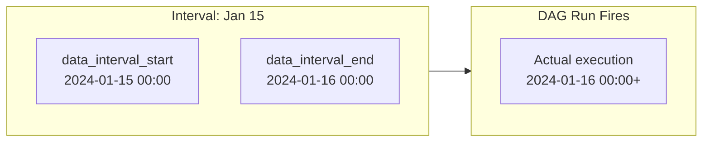

# Airflow Backfills — Fundamentals


## 🎯 Analogy

Think of backfilling like catching up on missed newspaper deliveries: Airflow re-runs past intervals that were skipped, treating each historical date as if it were today for that run.

---
## What Is a Backfill?

A **backfill** is the process of running a DAG for historical dates that it either missed or needs to reprocess. When a new pipeline is deployed, or when a bug is discovered and fixed, you often need to re-execute the pipeline over a past date range.

**Real-world scenarios:**
- A new pipeline launches today — you need last 6 months of historical data loaded
- A bug corrupted 2 weeks of data — you fix the bug and need to reprocess those 2 weeks
- Schema changed — you need to re-run a migration for older partitions
- A data source outage caused 3 days of missed loads — you need to catch up

> **Key Insight:** Backfills are only meaningful when your pipeline is **idempotent** — running the same task multiple times for the same date produces the same result. If it's not idempotent (e.g., appends data on each run), backfilling creates duplicates.

---

## How Airflow Tracks DAG Runs

Airflow runs a DAG for each **schedule interval** defined by the `schedule_interval`. The key concept: each DAG run processes data for one interval.

```python
dag = DAG(
    dag_id='daily_sales_load',
    schedule_interval='@daily',      # runs once per day
    start_date=datetime(2024, 1, 1), # first scheduled run is FOR Jan 1 data
    catchup=True,                    # whether to backfill missed intervals
)
```

**Timeline:**
```
start_date: 2024-01-01
Today:      2024-01-05

Scheduled intervals Airflow "knows about":
  Run 1: execution_date=2024-01-01, processes data for 2024-01-01
  Run 2: execution_date=2024-01-02, processes data for 2024-01-02
  Run 3: execution_date=2024-01-03, processes data for 2024-01-03
  Run 4: execution_date=2024-01-04, processes data for 2024-01-04
  Run 5: execution_date=2024-01-05 (scheduled for future, not yet run)
```

---

## catchup=True vs catchup=False

`catchup` controls whether Airflow automatically runs all missed intervals when a DAG first activates.

```python
# catchup=True (default): run ALL missed intervals since start_date
dag = DAG(
    dag_id='backfill_example',
    start_date=datetime(2024, 1, 1),
    schedule_interval='@daily',
    catchup=True,   # deploy today (Jan 10) → creates runs for Jan 1 through Jan 9
)

# catchup=False: only run from "now" forward — ignore the past
dag = DAG(
    dag_id='live_only_example',
    start_date=datetime(2024, 1, 1),
    schedule_interval='@daily',
    catchup=False,  # deploy today (Jan 10) → only creates runs from Jan 10 onward
)
```

### When to Use catchup=True vs False

| Scenario | catchup | Reason |
|----------|---------|--------|
| New pipeline needing historical data | `True` | Need to load past data |
| Reporting pipeline where old data doesn't matter | `False` | Don't need history, avoid cluttering UI |
| Live metric tracking (current state only) | `False` | Historical runs meaningless |
| Incident recovery / data fix | `True` (with CLI backfill) | Specific date ranges |
| API polling (idempotent state sync) | `False` | Always pulls current state |

> **Production default:** Most teams set `catchup=False` globally in `airflow.cfg` (`catchup_by_default = False`) to prevent accidental backfills on deploy. Explicit backfills are done via CLI.

---

## execution_date vs data_interval

This is one of the most confusing concepts in Airflow — understanding it is essential.

### The Fundamental Relationship

```
For a daily DAG scheduled at midnight:

execution_date (= data_interval_start): 2024-01-15 00:00:00
data_interval_end:                      2024-01-16 00:00:00
Actual run time:                        2024-01-16 00:00:00+ (after interval ends)
Data the run processes:                 2024-01-15 (yesterday)
```

**The pipeline runs AFTER the interval it represents completes.**



### Practical Usage in Tasks

```python
from airflow import DAG
from airflow.operators.python import PythonOperator
from datetime import datetime

def load_daily_data(**context):
    # The interval start and end are the data range to process
    data_start = context['data_interval_start']   # 2024-01-15 00:00:00
    data_end = context['data_interval_end']       # 2024-01-16 00:00:00
    
    # Simpler: just the date string
    date = context['ds']                          # '2024-01-15' (= data_interval_start date)
    
    print(f"Loading data for: {date}")
    print(f"Full interval: {data_start} to {data_end}")
    
    # Use in SQL
    sql = f"""
        INSERT INTO warehouse.fact_sales
        SELECT * FROM staging.raw_sales
        WHERE sale_date = '{date}'
    """

with DAG('daily_load', start_date=datetime(2024, 1, 1), catchup=False) as dag:
    PythonOperator(task_id='load', python_callable=load_daily_data)
```

### Jinja Template Variables for Dates

| Template | Value for execution_date=2024-01-15 | Notes |
|----------|-------------------------------------|-------|
| `{{ ds }}` | `2024-01-15` | Most commonly used |
| `{{ ds_nodash }}` | `20240115` | For filenames, partition paths |
| `{{ data_interval_start }}` | `2024-01-15T00:00:00+00:00` | Full interval start |
| `{{ data_interval_end }}` | `2024-01-16T00:00:00+00:00` | Full interval end |
| `{{ prev_ds }}` | `2024-01-14` | Previous interval date |
| `{{ next_ds }}` | `2024-01-16` | Next interval date |

---

## The Backfill CLI Command

The primary way to run historical intervals programmatically:

```bash
# Basic backfill: run all intervals between start and end dates
airflow dags backfill \
    --dag-id daily_sales_load \
    --start-date 2024-01-01 \
    --end-date 2024-01-31

# Backfill with limited concurrency (don't overwhelm the system)
airflow dags backfill \
    --dag-id daily_sales_load \
    --start-date 2024-01-01 \
    --end-date 2024-01-31 \
    --max-active-runs 3

# Dry run: show which runs would be created without executing
airflow dags backfill \
    --dag-id daily_sales_load \
    --start-date 2024-01-01 \
    --end-date 2024-01-31 \
    --dry-run

# Backfill with depends_on_past (sequential)
airflow dags backfill \
    --dag-id daily_sales_load \
    --start-date 2024-01-01 \
    --end-date 2024-01-31 \
    --run-backwards False   # process chronologically (Jan 1 before Jan 2)

# Rerun only specific tasks (not the whole DAG)
airflow dags backfill \
    --dag-id daily_sales_load \
    --start-date 2024-01-15 \
    --end-date 2024-01-20 \
    --task-regex 'transform.*'   # only tasks matching this pattern
```

---

## max_active_runs: Controlling Concurrent Backfill Runs

`max_active_runs` limits how many DAG run instances can execute simultaneously. This prevents backfill from overwhelming downstream systems.

```python
dag = DAG(
    dag_id='daily_sales_load',
    start_date=datetime(2024, 1, 1),
    schedule_interval='@daily',
    catchup=True,
    max_active_runs=3,    # at most 3 historical runs in parallel during backfill
)
```

**Backfill behavior with `max_active_runs=3`:**

```
Day 1 runs: Jan 1, Jan 2, Jan 3 (in parallel)
              ↓ when any finish ↓
Day 2 runs: Jan 4 (and remaining from Day 1)
...continuing until all intervals are complete
```

> **Recommendation for backfills:** Set `max_active_runs=1` for data-sensitive pipelines (prevents partial data from multiple runs overlapping), or `max_active_runs=3–5` for fast pipelines where runs are fully independent.

---

## How Airflow Determines Missing Runs

When `catchup=True` or when you run the backfill CLI, Airflow calculates all intervals between `start_date` and "now" (or your specified end date) and creates DAG runs for any that don't already exist in the metadata database with a `success` or `running` status.

```
Algorithm:
1. Generate all expected intervals: start_date → end_date, step=schedule_interval
2. For each interval:
   a. Check if a DAG run with that execution_date exists in metadata DB
   b. If run exists with state='success': skip (already done)
   c. If run exists with state='failed' or 'running': depends on flags
   d. If run doesn't exist: CREATE the run
3. Execute created runs
```

**Checking existing runs before backfill:**

```bash
# List all DAG runs for a DAG
airflow dags list-runs --dag-id daily_sales_load --state failed

# Check a specific run
airflow dags state daily_sales_load 2024-01-15T00:00:00
```

---

## Common Backfill Patterns

### Full Historical Load (New Pipeline)

```bash
# Load all data from 2 years ago to yesterday
airflow dags backfill \
    --dag-id daily_sales_load \
    --start-date 2022-01-01 \
    --end-date $(date -d "yesterday" '+%Y-%m-%d') \
    --max-active-runs 5
```

### Incident Recovery (Re-run Specific Date Range)

```bash
# Something went wrong Jan 15–20 — re-run those days
airflow dags backfill \
    --dag-id daily_sales_load \
    --start-date 2024-01-15 \
    --end-date 2024-01-20 \
    --reset-dagruns          # clear existing failed runs and re-create
```

### Single Date Re-run

```bash
# Re-run just one specific date
airflow dags backfill \
    --dag-id daily_sales_load \
    --start-date 2024-01-15 \
    --end-date 2024-01-15
```

---


## ▶️ Try It Yourself

```bash
# Trigger a backfill for a date range
airflow dags backfill my_etl_dag \
    --start-date 2024-01-01 \
    --end-date 2024-01-31

# Check backfill status
airflow dags list-runs -d my_etl_dag

# Dry run (show what would run without executing)
airflow dags backfill my_etl_dag \
    --start-date 2024-01-01 \
    --end-date 2024-01-07 \
    --dry-run
```

> **Run it:** Copy the snippet into a REPL or file and run it — no external services needed for the basic example.

---
## Interview Tips

> **Tip 1:** "What's the difference between `catchup=True` and the backfill CLI command?" — "`catchup=True` is automatic — when the DAG activates, Airflow automatically creates and runs all intervals from `start_date` to now. The backfill CLI is manual — you explicitly specify a date range to process. Most production teams use `catchup=False` globally and run targeted backfills via CLI to avoid accidental mass re-runs on deploy."

> **Tip 2:** "What is `execution_date` in Airflow?" — "The `execution_date` (now called `logical_date`) is the start of the data interval that the DAG run represents. For a daily DAG, the run with `execution_date=2024-01-15` processes data from Jan 15 and actually fires on Jan 16 (after the interval completes). This is a source of confusion — the task doesn't run on the `execution_date`, it runs after."

> **Tip 3:** "Why does backfilling only work safely for idempotent pipelines?" — "Backfilling means re-running tasks for the same date. If your task appends new rows on every run (not idempotent), backfilling creates duplicates — you'd have double the data for the backfilled dates. Idempotent means 'same input → same output regardless of how many times you run it.' Common patterns: use MERGE/UPSERT instead of INSERT, partition tables by date and DELETE+INSERT the partition before loading, or use TRUNCATE+INSERT on a staging table."
