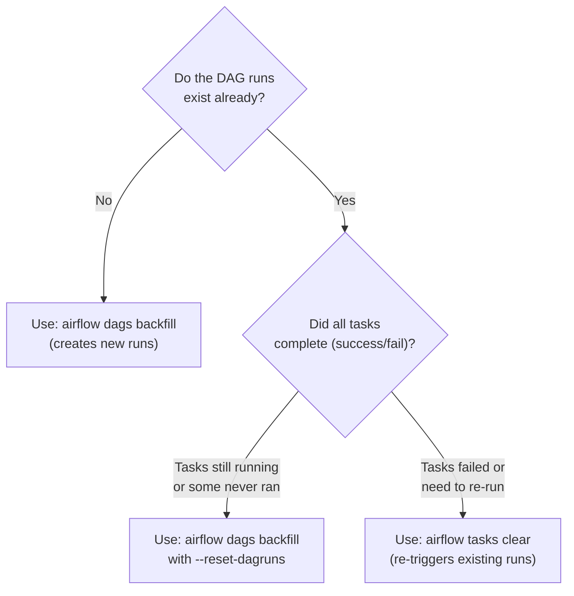

# Airflow Backfills — Intermediate

## Selective Backfill Strategies

Not every backfill needs to re-run the entire DAG. Airflow provides fine-grained control over what gets re-executed.

### Task-Level Selective Backfill

```bash
# Re-run only tasks matching a regex pattern for a date range
airflow dags backfill \
    --dag-id sales_pipeline \
    --start-date 2024-01-01 \
    --end-date 2024-01-31 \
    --task-regex '^load_.*'   # only tasks starting with 'load_'

# Re-run only specific downstream tasks
airflow dags backfill \
    --dag-id sales_pipeline \
    --start-date 2024-01-15 \
    --end-date 2024-01-20 \
    --task-regex 'transform_and_aggregate'
```

### clear vs backfill: Key Differences

These are the two ways to re-run historical work — they behave differently:

| Aspect | `backfill` CLI | `clear` command |
|--------|---------------|-----------------|
| **Creates new DAG runs** | Yes (for missing intervals) | No (operates on existing runs) |
| **Scope** | Date range of intervals | Specific existing DAG runs |
| **Use when** | Runs don't exist yet (new pipeline, gap in history) | Runs exist but tasks failed/need retry |
| **Dependency clearing** | Optional via `--include-downstream` | Configurable via UI checkboxes or CLI flags |
| **In UI** | Admin → Backfill (Airflow 2.6+) | Browse → DAG Runs → Clear |

```bash
# CLEAR: re-trigger existing runs from a specific task forward
# This clears 'transform' and all downstream tasks in the Jan 15 run
airflow tasks clear \
    --dag-id sales_pipeline \
    --task-id transform \
    --start-date 2024-01-15 \
    --end-date 2024-01-15 \
    --downstream \       # also clear tasks downstream of transform
    --yes               # skip confirmation prompt

# Clear an entire DAG run (all tasks)
airflow tasks clear \
    --dag-id sales_pipeline \
    --start-date 2024-01-15 \
    --end-date 2024-01-16 \
    --yes

# Clear only failed tasks (don't re-run successful ones)
airflow tasks clear \
    --dag-id sales_pipeline \
    --start-date 2024-01-01 \
    --end-date 2024-01-31 \
    --only-failed \
    --yes
```

### Decision Tree: backfill vs clear



---

## Backfill with depends_on_past

`depends_on_past=True` creates a sequential constraint: each run's task must succeed before the next run's task starts. This fundamentally changes backfill behavior.

### Without depends_on_past: Parallel Backfill

```
max_active_runs=5, no depends_on_past:

Batch 1 (parallel): Jan 1, Jan 2, Jan 3, Jan 4, Jan 5
Batch 2 (parallel): Jan 6, Jan 7, Jan 8, Jan 9, Jan 10
...
Total time ≈ (num_intervals / max_active_runs) × single_run_time
```

### With depends_on_past=True: Sequential Backfill

```
depends_on_past=True:

Run Jan 1 → wait for success → Run Jan 2 → wait → Run Jan 3 ...
Total time ≈ num_intervals × single_run_time (much slower!)
```

```bash
# For depends_on_past pipelines, backfill must be sequential
airflow dags backfill \
    --dag-id incremental_pipeline \
    --start-date 2024-01-01 \
    --end-date 2024-01-31 \
    --max-active-runs 1 \     # force sequential
    --run-backwards False     # chronological order (Jan 1 before Jan 2)
```

**Warning:** The `--run-backwards` flag (or running without it) can cause `depends_on_past` violations because a later run may execute before an earlier run has completed. Always use `--max-active-runs 1` with `depends_on_past`.

### Checking depends_on_past Status

```bash
# Find tasks blocked by depends_on_past
airflow tasks states-for-dag-run \
    --dag-id incremental_pipeline \
    --execution-date 2024-01-15T00:00:00

# If a task shows 'none' state and previous run isn't successful, depends_on_past is blocking it
```

---

## Controlling Concurrency During Backfill

Backfilling 2 years of daily data = 730 DAG runs queued simultaneously. Without controls, this overwhelms workers, databases, and downstream systems.

### Multi-Layer Concurrency Control

```python
# In the DAG definition — these limits apply during backfill too
dag = DAG(
    dag_id='daily_warehouse_load',
    start_date=datetime(2022, 1, 1),
    schedule_interval='@daily',
    catchup=False,                    # use CLI for controlled backfill
    max_active_runs=5,                # at most 5 DAG runs simultaneously
    max_active_tasks=20,              # at most 20 tasks across all active runs
)
```

```bash
# Override max_active_runs during specific backfill
airflow dags backfill \
    --dag-id daily_warehouse_load \
    --start-date 2022-01-01 \
    --end-date 2023-12-31 \
    --max-active-runs 3        # override DAG's setting for this backfill
```

### Pool-Based Throttling During Backfill

```python
# Use a Airflow Variable to reduce pool size during backfill
from airflow.models import Variable

pool_size = int(Variable.get('warehouse_pool_size', default_var=8))

load_task = PythonOperator(
    task_id='load_to_warehouse',
    python_callable=load_fn,
    pool='warehouse_pool',
    pool_slots=1,
)
```

```bash
# Before starting a large backfill: reduce pool to throttle
airflow variables set warehouse_pool_size 3   # normal: 8, backfill: 3
airflow pools set warehouse_pool 3 "Throttled for backfill"

# Start backfill
airflow dags backfill --dag-id daily_warehouse_load -s 2022-01-01 -e 2022-12-31

# After backfill: restore normal size
airflow pools set warehouse_pool 8 "Restored after backfill"
```

---

## Re-running Specific Dates

Several methods to target specific historical dates without affecting other runs:

### Method 1: Narrow Date Range in backfill

```bash
# Re-run exactly 3 specific days
airflow dags backfill \
    --dag-id daily_load \
    --start-date 2024-03-15 \
    --end-date 2024-03-17    # inclusive of end date
```

### Method 2: UI — Clear Specific Tasks

1. Navigate to Browse → DAG Runs
2. Find the specific run by execution date
3. Click the run → click the failed task
4. Click "Clear" → choose whether to clear downstream tasks too
5. Task transitions back to `None` state → gets re-queued

### Method 3: CLI — Mark Success to Skip Re-run

```bash
# Mark a task as success WITHOUT actually running it
# Useful when data was fixed manually and re-run would be wrong
airflow tasks mark-success \
    --dag-id daily_load \
    --task-id load_to_warehouse \
    --execution-date 2024-03-15T00:00:00
```

### Method 4: Trigger with Specific Date (Manual Run)

```bash
# Trigger a specific execution date as a manual run
airflow dags trigger \
    --dag-id daily_load \
    --exec-date 2024-03-15T00:00:00
```

---

## Detecting What Needs Re-running

Before starting a backfill, audit what actually needs to be re-run:

```sql
-- Find all failed DAG runs in a date range
SELECT
    dag_id,
    run_id,
    execution_date,
    state,
    start_date,
    end_date,
    EXTRACT(EPOCH FROM (end_date - start_date)) / 60 as duration_minutes
FROM dag_run
WHERE dag_id = 'daily_sales_load'
  AND execution_date BETWEEN '2024-01-01' AND '2024-01-31'
  AND state != 'success'
ORDER BY execution_date;

-- Find specific failed tasks that need clearing
SELECT
    dag_id,
    task_id,
    run_id,
    execution_date,
    state,
    try_number,
    max_tries
FROM task_instance
WHERE dag_id = 'daily_sales_load'
  AND execution_date BETWEEN '2024-01-01' AND '2024-01-31'
  AND state IN ('failed', 'upstream_failed')
ORDER BY execution_date, task_id;

-- Count missing runs (intervals with no DAG run entry)
-- Compare expected intervals against actual runs
WITH expected AS (
    SELECT generate_series(
        '2024-01-01'::date,
        '2024-01-31'::date,
        '1 day'::interval
    )::date AS expected_date
),
actual AS (
    SELECT DATE(execution_date) AS run_date
    FROM dag_run
    WHERE dag_id = 'daily_sales_load'
      AND state = 'success'
      AND execution_date BETWEEN '2024-01-01' AND '2024-01-31'
)
SELECT expected_date AS missing_date
FROM expected
LEFT JOIN actual ON expected.expected_date = actual.run_date
WHERE actual.run_date IS NULL
ORDER BY missing_date;
```

---

## The Backfill vs Scheduled Run Distinction

In Airflow, `backfill` runs are tagged with `run_type='backfill'` in the metadata database. This matters for:

```python
def load_with_run_awareness(**context):
    """
    Behave differently for backfill vs scheduled runs.
    Useful for: logging, alerting, or applying different concurrency settings.
    """
    run_type = context['dag_run'].run_type  # 'scheduled', 'manual', 'backfill'
    
    if run_type == 'backfill':
        print("Backfill run: using reduced concurrency, skipping notifications")
        batch_size = 1000   # smaller batches during backfill
    else:
        print("Scheduled run: normal operation")
        batch_size = 10000

    # ... rest of load logic
```

---

## Interview Tips

> **Tip 1:** "When would you use `clear` instead of `backfill`?" — "`clear` operates on existing DAG runs — it marks specific tasks back to `None` state so they get re-queued. Use it when runs already exist (they just had failed tasks) and you want to retry those tasks. `backfill` creates new DAG run entries — use it when runs don't exist at all (gap in history) or when you want to re-run complete intervals from scratch."

> **Tip 2:** "How do you safely backfill a pipeline with `depends_on_past=True`?" — "You must run the backfill strictly chronologically with `--max-active-runs 1`. Setting `max_active_runs=1` means each run must complete before the next starts, which satisfies the `depends_on_past` constraint. If you allow parallel backfill runs, Jan 3 might start before Jan 2 completes, causing Jan 3's tasks to fail their `depends_on_past` check."

> **Tip 3:** "How do you avoid overwhelming a database during a large backfill?" — "Three controls: (1) `max_active_runs` on the DAG limits simultaneous runs; (2) pools limit concurrent resource-specific tasks across all runs; (3) reduce the pool slot count temporarily during the backfill window. I typically set `max_active_runs=3` and halve the relevant pool size when doing a large historical backfill, then restore after it completes."
