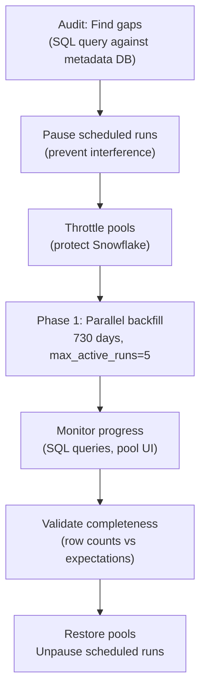

# Airflow Backfills — Real-World Scenarios

## Scenario 1: Backfilling 2 Years of Missed Data After Pipeline Failure

### Context

A retail company's daily sales aggregation pipeline failed silently for 3 days before the team noticed. More critically, the pipeline was newly deployed and had only 2 weeks of data — the team discovered it should have been running since 2 years ago. They needed to backfill 730 days of daily data into a Snowflake data warehouse.

### The Plan



### Step 1: Audit Existing State

```sql
-- Find which dates are already loaded (have data in warehouse)
WITH expected_dates AS (
    SELECT generate_series(
        '2022-01-01'::date,
        '2023-12-31'::date,
        '1 day'::interval
    )::date AS expected_date
),
loaded_dates AS (
    SELECT DISTINCT DATE(execution_date) as loaded_date
    FROM dag_run
    WHERE dag_id = 'daily_sales_aggregation'
      AND state = 'success'
)
SELECT
    expected_date AS missing_date,
    TO_CHAR(expected_date, 'Day') AS day_of_week
FROM expected_dates
LEFT JOIN loaded_dates ON expected_dates.expected_date = loaded_dates.loaded_date
WHERE loaded_dates.loaded_date IS NULL
ORDER BY missing_date;

-- Result: 730 rows (the pipeline was never run for 2022-2023)
```

### Step 2: Ensure the Pipeline Is Idempotent

```python
# daily_sales_aggregation.py — verified idempotent before backfill
def load_daily_sales(**context) -> dict:
    """
    Idempotent: uses partition DELETE + INSERT pattern.
    Safe to run multiple times for the same date.
    """
    date = context['ds']
    
    # Step 1: Delete existing data for this partition
    delete_sql = f"""
        DELETE FROM warehouse.fact_sales_daily
        WHERE sale_date = '{date}'::date;
    """
    
    # Step 2: Re-insert from staging (staging is the source of truth)
    insert_sql = f"""
        INSERT INTO warehouse.fact_sales_daily (
            sale_date, store_id, product_id,
            quantity_sold, revenue, cost_of_goods
        )
        SELECT
            '{date}'::date as sale_date,
            store_id, product_id,
            SUM(quantity) as quantity_sold,
            SUM(price * quantity) as revenue,
            SUM(cost * quantity) as cost_of_goods
        FROM staging.raw_transactions
        WHERE transaction_date = '{date}'::date
        GROUP BY store_id, product_id;
    """
    
    snowflake_hook.run(delete_sql)
    rows = snowflake_hook.run(insert_sql, handler=lambda cursor: cursor.rowcount)
    
    print(f"Loaded {rows} rows for {date}")
    return {'date': date, 'rows_loaded': rows}
```

### Step 3: Execute the Phased Backfill

```bash
#!/bin/bash
# phased_backfill.sh

DAG_ID="daily_sales_aggregation"

echo "=== Phase 0: Pre-flight ==="

# Pause the DAG so scheduled runs don't compete with backfill
airflow dags pause $DAG_ID

# Throttle Snowflake pool to 6 (normal: 10) to avoid credit burn during backfill
airflow pools set snowflake_pool 6 "Throttled: backfill in progress"

echo "=== Phase 1: Year 1 backfill (2022) ==="
airflow dags backfill \
    --dag-id $DAG_ID \
    --start-date 2022-01-01 \
    --end-date 2022-12-31 \
    --max-active-runs 5 \
    --verbose 2>&1 | tee backfill_2022.log

echo "Year 1 complete. Checking for failures..."
airflow dags list-runs --dag-id $DAG_ID --state failed | grep "2022" | wc -l

echo "=== Phase 2: Year 2 backfill (2023) ==="
airflow dags backfill \
    --dag-id $DAG_ID \
    --start-date 2023-01-01 \
    --end-date 2023-12-31 \
    --max-active-runs 5 \
    --verbose 2>&1 | tee backfill_2023.log

echo "=== Phase 3: Validation ==="
# Validate expected vs actual row counts per month
# (run validation script)

echo "=== Phase 4: Restore ==="
airflow pools set snowflake_pool 10 "Restored after backfill"
airflow dags unpause $DAG_ID
echo "Backfill complete. Normal scheduling resumed."
```

### Step 4: Validation

```sql
-- Validate completeness: every date should have data
SELECT
    DATE_TRUNC('month', sale_date) as month,
    COUNT(DISTINCT sale_date) as days_with_data,
    CASE
        WHEN DATE_TRUNC('month', sale_date) = DATE_TRUNC('month', '2024-01-01'::date)
        THEN EXTRACT(DAY FROM CURRENT_DATE)   -- current month: count up to today
        ELSE EXTRACT(DAYS IN MONTH FROM sale_date)  -- past months: full month
    END as expected_days,
    SUM(revenue) as total_revenue,
    SUM(quantity_sold) as total_units
FROM warehouse.fact_sales_daily
WHERE sale_date BETWEEN '2022-01-01' AND '2023-12-31'
GROUP BY 1, 4
ORDER BY 1;

-- Any months with missing days?
-- days_with_data should equal expected_days for all past months
```

### Results

| Metric | Value |
|--------|-------|
| Total runs created | 730 |
| Runs succeeded | 727 |
| Runs failed (retried manually) | 3 (source data gaps for holidays) |
| Total backfill duration | ~6 hours |
| Snowflake credits consumed | Within 20% of daily budget |

---

## Scenario 2: Safely Backfilling a Non-Idempotent Pipeline

### Context

A company has a legacy pipeline that uses `INSERT` without `DELETE` — it's not idempotent. A bug corrupted 5 days of data (Jan 15–19). The team needs to re-run those 5 days but the pipeline would create duplicates. They can't refactor the entire pipeline in the incident window.

### The Emergency Fix: Wrap Non-Idempotent Task with Pre-Cleanup

```python
# ORIGINAL (non-idempotent) — cannot modify without full regression test
def legacy_load(**context):
    """Legacy insert-only load. DO NOT MODIFY."""
    sql = f"""
        INSERT INTO warehouse.fact_transactions
        SELECT * FROM staging.raw_transactions
        WHERE txn_date = '{context['ds']}'
    """
    run_query(sql)

# SOLUTION: Add a pre-cleanup wrapper in the DAG without touching the core function
def pre_cleanup_load(**context):
    """
    Step 1: Delete the corrupted data for this date.
    Step 2: Signal that cleanup is done.
    """
    date = context['ds']
    
    cleanup_sql = f"""
        DELETE FROM warehouse.fact_transactions
        WHERE txn_date = '{date}'::date;
    """
    
    rows_deleted = run_query_with_count(cleanup_sql)
    print(f"Pre-cleanup: deleted {rows_deleted} potentially corrupted rows for {date}")
    
    return {'cleanup_date': date, 'rows_deleted': rows_deleted}

# Temporary recovery DAG (not modifying the production DAG)
with DAG(
    dag_id='emergency_recovery_jan15_jan19',
    start_date=datetime(2024, 1, 1),
    schedule_interval=None,   # manual trigger only — not scheduled
    catchup=False,
    tags=['emergency', 'recovery', 'temporary'],
) as recovery_dag:

    for date_str in ['2024-01-15', '2024-01-16', '2024-01-17', '2024-01-18', '2024-01-19']:

        cleanup = PythonOperator(
            task_id=f'cleanup_{date_str}',
            python_callable=pre_cleanup_load,
            op_kwargs={'ds': date_str},  # manually pass the date
        )

        reload = PythonOperator(
            task_id=f'reload_{date_str}',
            python_callable=legacy_load,
            op_kwargs={'ds': date_str},
        )

        verify = PythonOperator(
            task_id=f'verify_{date_str}',
            python_callable=verify_row_count,
            op_kwargs={'date': date_str, 'expected_min_rows': 1000},
        )

        cleanup >> reload >> verify
```

### Long-Term Fix: Make the Pipeline Idempotent

```python
# The permanent fix — replace INSERT with DELETE + INSERT pattern
def idempotent_load(**context):
    """
    Idempotent version of legacy_load.
    DELETE + INSERT pattern guarantees safe re-runs.
    """
    date = context['ds']
    
    # Atomic operation: delete existing + insert fresh
    # Use a transaction to ensure consistency
    sql = f"""
        BEGIN;
        
        DELETE FROM warehouse.fact_transactions
        WHERE txn_date = '{date}'::date;
        
        INSERT INTO warehouse.fact_transactions
        SELECT * FROM staging.raw_transactions
        WHERE txn_date = '{date}'::date;
        
        COMMIT;
    """
    run_query(sql)
```

---

## Scenario 3: Backfilling for a Date-Partitioned Table

### Context

A data team uses a Snowflake table partitioned by `sale_date` (using Snowflake's clustering). They need to backfill 6 months of data after discovering their source pipeline had been silently dropping ~5% of records.

### Challenge: Partition-Safe Backfill

For partitioned tables, the backfill strategy must:
1. Target only the specific date partition (not full table scan)
2. Handle the case where partial data exists in the partition
3. Minimize lock contention with concurrent reads

```python
from airflow import DAG
from airflow.operators.python import PythonOperator
from airflow.utils.task_group import TaskGroup
from datetime import datetime, timedelta

def validate_source_completeness(**context) -> dict:
    """Check if source has complete data for this date before loading."""
    date = context['ds']
    
    # Check if source data is complete (no more records expected)
    source_count = query_source(f"SELECT COUNT(*) FROM source.transactions WHERE date = '{date}'")
    
    # Cross-reference with expected count from a control table
    expected_count = query_warehouse(f"""
        SELECT expected_row_count FROM control.daily_expectations
        WHERE data_date = '{date}'
    """)
    
    completeness_pct = source_count / expected_count if expected_count > 0 else 0
    
    print(f"Date {date}: {source_count}/{expected_count} rows ({completeness_pct:.1%} complete)")
    
    if completeness_pct < 0.95:  # less than 95% of expected
        raise ValueError(f"Source incomplete for {date}: {completeness_pct:.1%} — aborting backfill for this date")
    
    return {'date': date, 'source_count': source_count, 'expected_count': expected_count}

def drop_and_reload_partition(**context) -> dict:
    """
    Partition-safe backfill for Snowflake clustered table.
    Uses INSERT OVERWRITE to atomically replace the date partition.
    """
    date = context['ds']
    
    # Snowflake: use INSERT OVERWRITE for atomic partition replacement
    # This is equivalent to DELETE partition + INSERT in a single operation
    sql = f"""
        INSERT OVERWRITE INTO warehouse.fact_transactions
        SELECT
            '{date}'::date as sale_date,
            transaction_id,
            store_id,
            product_id,
            quantity,
            unit_price,
            discount_pct,
            quantity * unit_price * (1 - COALESCE(discount_pct, 0)) as net_revenue,
            customer_id,
            channel,
            CURRENT_TIMESTAMP as loaded_at
        FROM source.raw_transactions
        WHERE DATE(transaction_timestamp) = '{date}'::date;
    """
    
    rows = snowflake_hook.run(sql, handler=lambda c: c.rowcount)
    print(f"Partition {date}: loaded {rows} rows via INSERT OVERWRITE")
    return {'date': date, 'rows_loaded': rows}

def verify_partition_completeness(**context) -> dict:
    """Cross-validate loaded partition against source."""
    date = context['ds']
    
    warehouse_count = query_warehouse(f"""
        SELECT COUNT(*) FROM warehouse.fact_transactions
        WHERE sale_date = '{date}'::date
    """)
    
    source_count = query_source(f"""
        SELECT COUNT(*) FROM source.raw_transactions
        WHERE DATE(transaction_timestamp) = '{date}'::date
    """)
    
    if warehouse_count != source_count:
        raise ValueError(
            f"Count mismatch for {date}: warehouse={warehouse_count}, source={source_count}"
        )
    
    print(f"Partition {date} verified: {warehouse_count} rows match source")
    return {'date': date, 'verified_count': warehouse_count}

# Production backfill DAG
with DAG(
    dag_id='transactions_backfill_q1_2024',
    start_date=datetime(2024, 1, 1),
    schedule_interval='@daily',   # runs for each date in backfill range
    catchup=True,                 # enables backfill for the date range
    max_active_runs=8,            # 8 partitions in parallel
    max_active_tasks=24,          # up to 3 tasks per active run
    tags=['backfill', 'transactions', 'q1-2024'],
) as dag:

    with TaskGroup('validation') as validate_group:
        validate_source = PythonOperator(
            task_id='validate_source',
            python_callable=validate_source_completeness,
        )

    with TaskGroup('loading') as load_group:
        load_partition = PythonOperator(
            task_id='drop_and_reload_partition',
            python_callable=drop_and_reload_partition,
            pool='snowflake_pool',
            pool_slots=2,         # INSERT OVERWRITE is a heavy operation
            retries=2,
            retry_delay=timedelta(minutes=10),
        )

    with TaskGroup('verification') as verify_group:
        verify_partition = PythonOperator(
            task_id='verify_partition',
            python_callable=verify_partition_completeness,
        )

        # Alert on verification failure
        notify_mismatch = PythonOperator(
            task_id='notify_on_mismatch',
            python_callable=send_data_quality_alert,
            trigger_rule='one_failed',
        )

        [verify_partition] >> notify_mismatch

    validate_group >> load_group >> verify_group
```

### Monitoring the Backfill Progress

```sql
-- Real-time progress dashboard query
WITH date_range AS (
    SELECT generate_series(
        '2024-01-01'::date,
        '2024-06-30'::date,
        '1 day'::interval
    )::date AS expected_date
),
run_status AS (
    SELECT
        DATE(execution_date) as run_date,
        state,
        EXTRACT(EPOCH FROM (end_date - start_date)) / 60 as duration_minutes
    FROM dag_run
    WHERE dag_id = 'transactions_backfill_q1_2024'
)
SELECT
    DATE_TRUNC('week', dr.expected_date) as week,
    COUNT(*) as total_days,
    SUM(CASE WHEN rs.state = 'success' THEN 1 ELSE 0 END) as completed,
    SUM(CASE WHEN rs.state = 'failed' THEN 1 ELSE 0 END) as failed,
    SUM(CASE WHEN rs.state = 'running' THEN 1 ELSE 0 END) as running,
    SUM(CASE WHEN rs.state IS NULL THEN 1 ELSE 0 END) as pending,
    AVG(rs.duration_minutes) as avg_run_minutes
FROM date_range dr
LEFT JOIN run_status rs ON dr.expected_date = rs.run_date
GROUP BY 1
ORDER BY 1;
```

### Backfill Results

| Metric | Value |
|--------|-------|
| Total partitions to backfill | 182 days (Jan–Jun 2024) |
| Partitions with source issues | 8 (source data gaps — skipped and alertted) |
| Total duration at max_active_runs=8 | ~4.5 hours |
| Rows reloaded | 2.3 billion |
| Data accuracy improvement | +5.2% (the previously dropped records now included) |
| Downstream dashboards requiring refresh | 12 Tableau workbooks auto-refreshed after completion |
