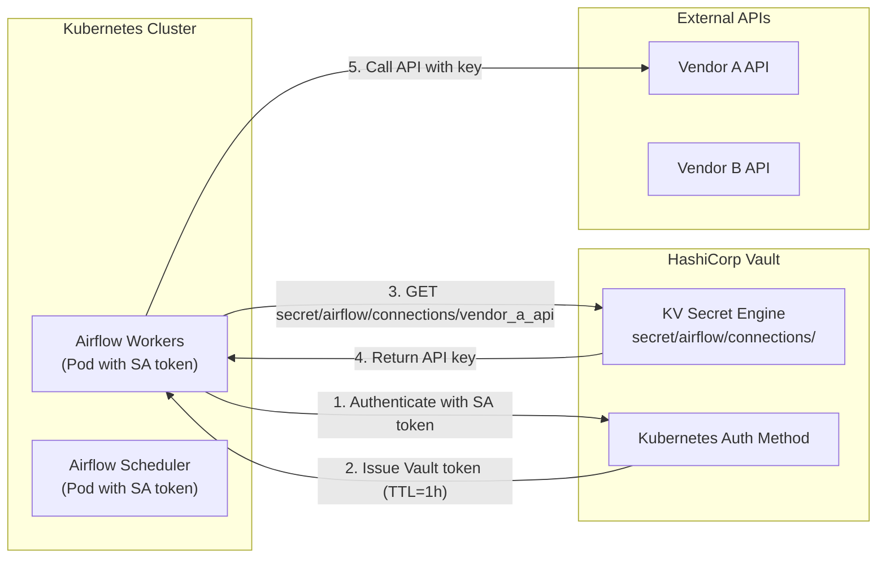

# Airflow Connections and Hooks — Real World Scenarios

## Scenario 1: Managing Snowflake Connections in Production

### Context

A company runs 50+ DAGs that connect to Snowflake. They have three Snowflake environments (dev, staging, prod) and three user roles (etl_loader, transformer, reporter). The challenge: managing 9 connections across environments, ensuring least-privilege access, and making it easy for engineers to write environment-agnostic DAG code.

### Design

The core pattern is a **parameterized connection naming convention** combined with environment variable injection at the deployment level.

```
Naming convention: snowflake_{role}_{env}

snowflake_etl_loader_dev
snowflake_etl_loader_staging
snowflake_etl_loader_prod
snowflake_transformer_dev
snowflake_transformer_staging
snowflake_transformer_prod
snowflake_reporter_dev
snowflake_reporter_staging
snowflake_reporter_prod
```

```python
# config/connections.py — shared utility for environment-aware connection lookup
import os
from airflow.hooks.base import BaseHook

ENV = os.getenv('AIRFLOW_ENV', 'dev')   # Injected by Kubernetes or Docker at deploy time

def get_snowflake_conn_id(role: str) -> str:
    """Return the environment-appropriate Snowflake connection ID."""
    return f"snowflake_{role}_{ENV}"

def get_snowflake_connection(role: str):
    """Return the Connection object for the given role in the current environment."""
    conn_id = get_snowflake_conn_id(role)
    return BaseHook.get_connection(conn_id)
```

```python
# dag_daily_sales_load.py
from airflow import DAG
from airflow.providers.snowflake.operators.snowflake import SnowflakeOperator
from airflow.operators.python import PythonOperator
from config.connections import get_snowflake_conn_id
from datetime import datetime, timedelta

with DAG(
    dag_id='daily_sales_load',
    schedule_interval='0 5 * * *',
    start_date=datetime(2024, 1, 1),
    catchup=False,
    default_args={
        'owner': 'data-engineering',
        'retries': 2,
        'retry_delay': timedelta(minutes=10),
    },
    tags=['sales', 'snowflake'],
) as dag:

    # Each task uses the least-privilege connection for its operation
    create_staging = SnowflakeOperator(
        task_id='create_staging_table',
        sql="""
            CREATE TABLE IF NOT EXISTS staging.sales_{{ ds_nodash }} (
                sale_id     VARCHAR,
                amount      DECIMAL(18, 2),
                region      VARCHAR,
                sale_date   DATE
            )
        """,
        snowflake_conn_id=get_snowflake_conn_id('etl_loader'),   # DDL privilege
        autocommit=True,
    )

    load_raw = SnowflakeOperator(
        task_id='load_raw_data',
        sql="""
            COPY INTO staging.sales_{{ ds_nodash }}
            FROM @company_stage/sales/dt={{ ds }}/
            FILE_FORMAT = (TYPE = 'PARQUET')
            ON_ERROR = 'ABORT_STATEMENT'
        """,
        snowflake_conn_id=get_snowflake_conn_id('etl_loader'),   # Load privilege
        autocommit=True,
    )

    transform = SnowflakeOperator(
        task_id='transform_to_fact',
        sql="""
            INSERT INTO analytics.fact_sales
            SELECT
                sale_id,
                amount,
                region,
                sale_date,
                CURRENT_TIMESTAMP() AS loaded_at
            FROM staging.sales_{{ ds_nodash }}
            WHERE amount > 0
        """,
        snowflake_conn_id=get_snowflake_conn_id('transformer'),   # Write to analytics
        autocommit=True,
    )

    validate = SnowflakeOperator(
        task_id='validate_row_count',
        sql="""
            SELECT
                CASE
                    WHEN COUNT(*) = 0 THEN 'ERROR: No rows loaded'
                    WHEN COUNT(*) < 100 THEN 'WARN: Low row count'
                    ELSE 'OK: ' || COUNT(*) || ' rows'
                END AS status
            FROM analytics.fact_sales
            WHERE sale_date = '{{ ds }}'
        """,
        snowflake_conn_id=get_snowflake_conn_id('reporter'),   # Read-only check
        autocommit=False,
    )

    create_staging >> load_raw >> transform >> validate
```

### AWS Secrets Manager Configuration for Snowflake

```bash
# Create one secret per connection in Secrets Manager
# Secret name matches Airflow naming convention

aws secretsmanager create-secret \
    --name "airflow/connections/snowflake_etl_loader_prod" \
    --description "Airflow ETL loader connection for Snowflake prod" \
    --secret-string '{
        "conn_type": "snowflake",
        "login": "etl_loader_svc",
        "password": "PLACEHOLDER_ROTATED_BY_LAMBDA",
        "host": "company.snowflakecomputing.com",
        "schema": "STAGING",
        "extra": {
            "account": "company",
            "warehouse": "ETL_WH",
            "role": "ETL_LOADER",
            "database": "PROD_DB",
            "insecure_mode": false
        }
    }'

# Set up automatic rotation (Lambda-based) for Snowflake passwords
aws secretsmanager rotate-secret \
    --secret-id "airflow/connections/snowflake_etl_loader_prod" \
    --rotation-lambda-arn "arn:aws:lambda:us-east-1:123456789:function:RotateSnowflakeSecret" \
    --rotation-rules AutomaticallyAfterDays=30
```

---

## Scenario 2: Rotating API Keys via HashiCorp Vault

### Context

A data platform team uses 15 external vendor APIs, each with API keys that expire every 90 days. Managing key rotation manually across all DAGs is error-prone and requires DAG restarts. The solution: store all API keys in HashiCorp Vault, configure Airflow to fetch from Vault, and set up automatic rotation.

### Architecture



### Vault Setup

```bash
# Enable KV secrets engine
vault secrets enable -path=secret kv-v2

# Create connection secrets
vault kv put secret/airflow/connections/vendor_a_api \
    conn_type="http" \
    host="api.vendora.com" \
    schema="https" \
    password="api_key_value_here" \
    extra='{"timeout": 30, "api_version": "v2"}'

vault kv put secret/airflow/connections/vendor_b_api \
    conn_type="http" \
    host="data.vendorb.io" \
    schema="https" \
    password="vendorb_secret_key" \
    extra='{"timeout": 60, "retry_on_429": true}'

# Create a policy for Airflow — read-only on connection paths
vault policy write airflow-read - <<EOF
path "secret/data/airflow/connections/*" {
    capabilities = ["read", "list"]
}
path "secret/data/airflow/variables/*" {
    capabilities = ["read", "list"]
}
EOF

# Set up Kubernetes auth role for the Airflow service account
vault write auth/kubernetes/role/airflow \
    bound_service_account_names="airflow" \
    bound_service_account_namespaces="airflow" \
    policies="airflow-read" \
    ttl="1h"
```

### Airflow Configuration for Vault

```ini
# airflow.cfg
[secrets]
backend = airflow.providers.hashicorp.secrets.vault.VaultBackend
backend_kwargs = {
    "connections_path": "airflow/connections",
    "variables_path": "airflow/variables",
    "url": "https://vault.internal.example.com:8200",
    "auth_type": "kubernetes",
    "kubernetes_role": "airflow",
    "mount_point": "secret"
}
```

### Zero-Downtime Key Rotation DAG

When an API key must be rotated urgently (security incident), this DAG automates validation:

```python
from airflow import DAG
from airflow.operators.python import PythonOperator
from airflow.hooks.base import BaseHook
from datetime import datetime, timedelta

def verify_rotated_key(conn_id: str, test_endpoint: str, **context):
    """
    After a key rotation, verify the new key works before
    the next scheduled DAG run that depends on it.
    """
    import requests

    # Airflow fetches fresh key from Vault (no caching at BaseHook level)
    conn = BaseHook.get_connection(conn_id)
    base_url = f"{conn.schema}://{conn.host}"
    new_key = conn.password

    response = requests.get(
        f"{base_url}{test_endpoint}",
        headers={'Authorization': f'Bearer {new_key}'},
        timeout=10,
    )

    if response.status_code == 200:
        print(f"✓ New API key for '{conn_id}' is valid")
        return True
    elif response.status_code == 401:
        raise ValueError(
            f"New API key for '{conn_id}' is INVALID (401 Unauthorized). "
            "Check Vault secret value."
        )
    else:
        raise ValueError(
            f"Unexpected response from {conn_id}: {response.status_code}"
        )

def notify_rotation_complete(conn_id: str, **context):
    """Notify the team that rotation was verified successfully."""
    print(f"API key rotation for '{conn_id}' verified successfully at {datetime.utcnow()}")
    # Send Slack notification, PagerDuty resolve, etc.


# Rotation verification DAG — triggered manually or by security automation
with DAG(
    dag_id='api_key_rotation_verify',
    schedule_interval=None,   # Triggered manually or via API
    start_date=datetime(2024, 1, 1),
    catchup=False,
    params={
        'conn_id': 'vendor_a_api',
        'test_endpoint': '/api/v2/health',
    },
    tags=['security', 'maintenance'],
) as dag:

    verify = PythonOperator(
        task_id='verify_new_key',
        python_callable=verify_rotated_key,
        op_kwargs={
            'conn_id': '{{ params.conn_id }}',
            'test_endpoint': '{{ params.test_endpoint }}',
        },
    )

    notify = PythonOperator(
        task_id='notify_rotation_complete',
        python_callable=notify_rotation_complete,
        op_kwargs={'conn_id': '{{ params.conn_id }}'},
    )

    verify >> notify
```

---

## Scenario 3: Building a Reusable REST API Hook

### Context

The data platform team has 8 DAGs that all integrate with the same internal data catalog API. Each DAG was written independently and has its own copy of the HTTP request logic, error handling, and retry logic — all slightly different. The team wants a single, well-tested, reusable hook.

### Reusable Hook Implementation

```python
# hooks/data_catalog_hook.py
from __future__ import annotations

from typing import Any, Iterator, Optional
import json
import logging
from datetime import datetime

from airflow.hooks.base import BaseHook
import requests
from requests.adapters import HTTPAdapter
from requests.packages.urllib3.util.retry import Retry

logger = logging.getLogger(__name__)


class DataCatalogHook(BaseHook):
    """
    Reusable hook for the internal Data Catalog API.

    Connection setup (conn_type='http'):
      host:     catalog.internal.example.com
      schema:   https
      password: <service account token>
      extra:    {"timeout": 30, "page_size": 200, "api_version": "v2"}

    Usage:
        hook = DataCatalogHook(catalog_conn_id='data_catalog')
        datasets = list(hook.list_datasets(domain='sales'))
        hook.register_dataset(name='fact_sales', schema={...})
    """

    conn_name_attr = 'catalog_conn_id'
    default_conn_name = 'data_catalog_default'
    conn_type = 'http'
    hook_name = 'Data Catalog'

    def __init__(self, catalog_conn_id: str = default_conn_name) -> None:
        super().__init__()
        self.catalog_conn_id = catalog_conn_id
        self._session: Optional[requests.Session] = None
        self._base_url: Optional[str] = None
        self._api_version: str = 'v2'
        self._page_size: int = 200
        self._timeout: int = 30

    def get_conn(self) -> requests.Session:
        """Build and cache a configured requests.Session."""
        if self._session is not None:
            return self._session

        conn = self.get_connection(self.catalog_conn_id)
        extra = conn.extra_dejson

        protocol = conn.schema or 'https'
        port = f":{conn.port}" if conn.port else ''
        self._base_url = f"{protocol}://{conn.host}{port}"
        self._api_version = extra.get('api_version', 'v2')
        self._page_size = extra.get('page_size', 200)
        self._timeout = extra.get('timeout', 30)

        session = requests.Session()

        # Retry on transient failures (429, 5xx)
        retry = Retry(
            total=3,
            backoff_factor=0.5,
            status_forcelist=[429, 500, 502, 503, 504],
            respect_retry_after_header=True,
        )
        adapter = HTTPAdapter(max_retries=retry)
        session.mount('https://', adapter)
        session.mount('http://', adapter)

        # Auth
        if conn.password:
            session.headers['Authorization'] = f'Bearer {conn.password}'

        session.headers['Accept'] = 'application/json'
        session.headers['Content-Type'] = 'application/json'
        session.headers['X-Service-Name'] = 'airflow'

        self._session = session
        logger.info("DataCatalogHook initialized for %s", self._base_url)
        return session

    def _url(self, path: str) -> str:
        return f"{self._base_url}/api/{self._api_version}/{path.lstrip('/')}"

    def _request(self, method: str, path: str, **kwargs) -> dict:
        """Execute an HTTP request with standard error handling."""
        session = self.get_conn()
        url = self._url(path)
        kwargs.setdefault('timeout', self._timeout)

        response = session.request(method, url, **kwargs)

        if response.status_code == 404:
            return None   # Caller handles 404 as "not found"

        try:
            response.raise_for_status()
        except requests.HTTPError as e:
            logger.error(
                "DataCatalog API error: %s %s → %s: %s",
                method, url, response.status_code, response.text[:500],
            )
            raise

        return response.json() if response.content else {}

    def get_dataset(self, dataset_id: str) -> Optional[dict]:
        """Get a dataset by ID. Returns None if not found."""
        return self._request('GET', f'datasets/{dataset_id}')

    def list_datasets(
        self,
        domain: str = None,
        owner_team: str = None,
        tags: list = None,
    ) -> Iterator[dict]:
        """
        Paginate through all datasets matching the filters.
        Yields individual dataset records.
        """
        params = {'page_size': self._page_size}
        if domain:
            params['domain'] = domain
        if owner_team:
            params['owner_team'] = owner_team
        if tags:
            params['tags'] = ','.join(tags)

        page = 1
        while True:
            params['page'] = page
            response = self._request('GET', 'datasets', params=params)
            results = response.get('results', [])

            for dataset in results:
                yield dataset

            if not response.get('next'):
                break
            page += 1

    def register_dataset(
        self,
        name: str,
        domain: str,
        owner_team: str,
        location: str,
        schema: dict,
        tags: list = None,
        description: str = '',
    ) -> dict:
        """Register a new dataset or update existing."""
        payload = {
            'name': name,
            'domain': domain,
            'owner_team': owner_team,
            'location': location,
            'schema': schema,
            'tags': tags or [],
            'description': description,
            'registered_at': datetime.utcnow().isoformat(),
        }
        existing = self.get_dataset(name)
        if existing:
            result = self._request('PUT', f'datasets/{name}', json=payload)
            logger.info("Updated dataset '%s' in catalog", name)
        else:
            result = self._request('POST', 'datasets', json=payload)
            logger.info("Registered new dataset '%s' in catalog", name)
        return result

    def add_lineage(self, source_dataset: str, target_dataset: str, dag_id: str):
        """Record data lineage between datasets."""
        payload = {
            'source': source_dataset,
            'target': target_dataset,
            'transform_type': 'airflow_dag',
            'transform_id': dag_id,
            'recorded_at': datetime.utcnow().isoformat(),
        }
        return self._request('POST', 'lineage', json=payload)

    def test_connection(self):
        """Test the connection — used by Airflow UI Test button."""
        try:
            result = self._request('GET', 'health')
            if result and result.get('status') == 'healthy':
                return True, f"Connected to Data Catalog {self._base_url}"
            return False, f"Unexpected health response: {result}"
        except Exception as e:
            return False, f"Connection failed: {e}"
```

### Using the Hook Across Multiple DAGs

```python
# dag_register_sales_dataset.py
from hooks.data_catalog_hook import DataCatalogHook
from airflow.operators.python import PythonOperator

def register_sales_dataset(ds: str, **context):
    hook = DataCatalogHook(catalog_conn_id='data_catalog')

    hook.register_dataset(
        name='fact_sales',
        domain='commerce',
        owner_team='data-engineering',
        location=f's3://analytics/fact_sales/dt={ds}/',
        schema={
            'fields': [
                {'name': 'sale_id', 'type': 'STRING', 'nullable': False},
                {'name': 'amount', 'type': 'DECIMAL', 'precision': 18, 'scale': 2},
                {'name': 'sale_date', 'type': 'DATE'},
            ]
        },
        tags=['sales', 'fact-table', 'daily'],
        description='Daily sales fact table aggregated from all regions',
    )

    hook.add_lineage(
        source_dataset='raw_sales_orders',
        target_dataset='fact_sales',
        dag_id=context['dag'].dag_id,
    )
    logger.info("Dataset registration complete for %s", ds)


# dag_sales_quality_check.py — separate DAG, same hook
def check_catalog_freshness(ds: str, **context):
    hook = DataCatalogHook(catalog_conn_id='data_catalog')

    datasets_missing_today = []
    for dataset in hook.list_datasets(domain='commerce', owner_team='data-engineering'):
        last_registered = dataset.get('registered_at', '')
        if last_registered[:10] < ds:
            datasets_missing_today.append(dataset['name'])

    if datasets_missing_today:
        raise ValueError(
            f"Datasets not updated today ({ds}): {datasets_missing_today}"
        )
```

**Key design principles applied:**
- Single `get_conn()` builds the session once — no reconnection overhead
- All configuration (timeout, page_size, API version) comes from the Connection `extra` field — no hardcoded values
- `_request()` centralizes error handling — all public methods benefit automatically
- `test_connection()` enables the UI Test button — reduces setup friction for engineers
- `list_datasets()` is a generator — memory-efficient for large catalogs without changing the caller interface
- Pagination is internal to the hook — callers get a simple iterator
