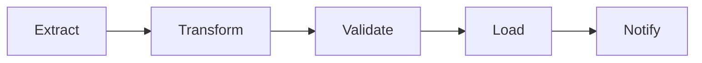
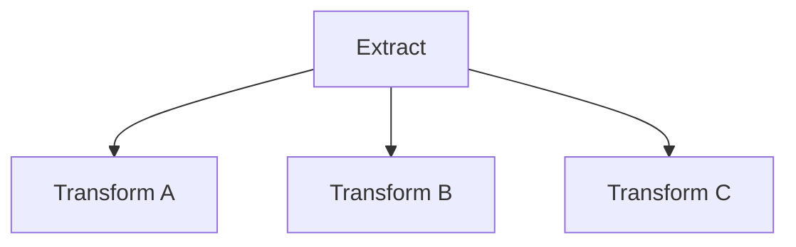
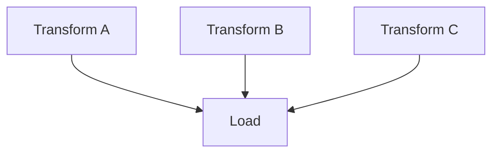
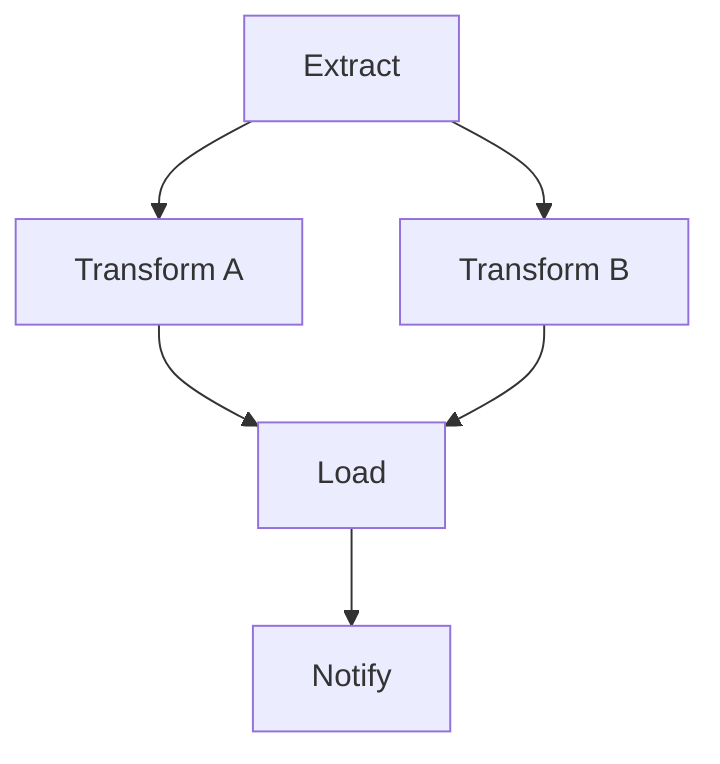

# Airflow DAG Design — Fundamentals

## What Is Apache Airflow?

Apache Airflow is a **workflow orchestration platform** — it schedules, monitors, and manages the execution of data pipelines. Think of it as the "cron on steroids" that runs your ETL jobs in the right order, handles retries, and alerts you on failures.

> **Key Insight:** Airflow doesn't process data itself. It tells OTHER systems (Spark, Python scripts, SQL queries, APIs) when to run and in what order. It's the conductor, not the orchestra.

---

## What Is a DAG?

**DAG** = **Directed Acyclic Graph**

- **Directed:** Tasks flow in one direction (A → B, not A ↔ B)
- **Acyclic:** No circular dependencies (A → B → C → A is forbidden)
- **Graph:** Collection of tasks (nodes) connected by dependencies (edges)



**What this shows:**
- 5 tasks executed in sequence
- Each task depends on the previous completing successfully
- If "Transform" fails, "Validate", "Load", and "Notify" won't run
- This is the simplest DAG pattern: a linear pipeline

---

## Your First DAG

```python
from airflow import DAG
from airflow.operators.python import PythonOperator
from airflow.operators.empty import EmptyOperator
from datetime import datetime, timedelta

# Step 1: Define the DAG (the pipeline container)
default_args = {
    'owner': 'data-engineering',
    'depends_on_past': False,
    'email_on_failure': True,
    'email': ['team@company.com'],
    'retries': 2,
    'retry_delay': timedelta(minutes=5),
}

dag = DAG(
    dag_id='daily_sales_pipeline',          # Unique identifier
    default_args=default_args,
    description='Load daily sales data into the warehouse',
    schedule_interval='0 6 * * *',          # Run at 6 AM UTC daily
    start_date=datetime(2024, 1, 1),        # When this DAG becomes active
    catchup=False,                          # Don't backfill missed runs
    tags=['sales', 'warehouse'],
)

# Step 2: Define tasks (individual units of work)
def extract_data():
    """Pull data from source system."""
    print("Extracting sales data from API...")

def transform_data():
    """Clean and transform the data."""
    print("Applying transformations...")

def load_data():
    """Load into the data warehouse."""
    print("Loading into Snowflake...")

extract = PythonOperator(
    task_id='extract',
    python_callable=extract_data,
    dag=dag,
)

transform = PythonOperator(
    task_id='transform',
    python_callable=transform_data,
    dag=dag,
)

load = PythonOperator(
    task_id='load',
    python_callable=load_data,
    dag=dag,
)

# Step 3: Define dependencies (execution order)
extract >> transform >> load
```

**Key components explained:**

| Component | Purpose |
|-----------|---------|
| `DAG()` | Container for the pipeline (metadata, schedule, settings) |
| `default_args` | Shared settings for all tasks (retries, owner, alerts) |
| `PythonOperator` | A task that runs a Python function |
| `task_id` | Unique name within the DAG |
| `>>` operator | Sets dependency (left runs before right) |
| `schedule_interval` | Cron expression or preset for when to run |

---

## Schedule Intervals

| Expression | Meaning | Preset |
|-----------|---------|--------|
| `'0 6 * * *'` | 6 AM UTC every day | `'@daily'` |
| `'0 * * * *'` | Every hour on the hour | `'@hourly'` |
| `'0 0 * * 0'` | Midnight every Sunday | `'@weekly'` |
| `'0 0 1 * *'` | Midnight on 1st of each month | `'@monthly'` |
| `None` | Only triggered manually | — |
| `'@once'` | Run exactly once | — |

> **Important:** The DAG runs AFTER the schedule interval completes. A daily DAG scheduled at midnight actually runs for the PREVIOUS day's data. The `execution_date` (now `logical_date`) represents the START of the interval, not when the DAG actually fires.

---

## Dependency Patterns

### Linear (Sequential)

```python
extract >> transform >> load
# Same as: extract.set_downstream(transform); transform.set_downstream(load)
```

### Fan-Out (One to Many)

```python
extract >> [transform_a, transform_b, transform_c]
# extract runs first, then all three transforms run IN PARALLEL
```



### Fan-In (Many to One)

```python
[transform_a, transform_b, transform_c] >> load
# All three must complete before load starts
```



### Diamond (Fan-Out + Fan-In)

```python
extract >> [transform_a, transform_b]
[transform_a, transform_b] >> load >> notify
```



**What this shows:** Extract runs first. Transform A and B run in parallel. Load waits for BOTH to finish. This is the most common ETL pattern.

---

## Task States

| State | Meaning | Icon Color |
|-------|---------|-----------|
| `queued` | Waiting for a worker slot | Gray |
| `running` | Currently executing | Lime green |
| `success` | Completed successfully | Dark green |
| `failed` | Threw an exception | Red |
| `up_for_retry` | Failed, will retry after delay | Yellow |
| `skipped` | Skipped due to branching logic | Pink |
| `upstream_failed` | A dependency failed | Orange |

> **Key behavior:** If a task fails, all downstream tasks get `upstream_failed` status automatically. They won't execute until the failed task is fixed and retried.

---

## DAG File Organization Best Practices

```
dags/
├── daily_sales_pipeline.py       # One DAG per file (recommended)
├── hourly_events_pipeline.py
├── weekly_reporting.py
└── utils/
    ├── __init__.py
    ├── sql_queries.py            # Shared SQL templates
    ├── notifications.py          # Shared alerting functions
    └── configs.py                # Shared configuration
```

**Rules:**
1. One DAG per Python file (easier to debug, deploy, and find)
2. Keep task logic in separate modules (not inline in the DAG file)
3. Use `default_args` for settings shared across all tasks
4. Name DAGs descriptively: `{frequency}_{domain}_{action}` (e.g., `daily_sales_load`)

---

## Common Operators

| Operator | Purpose | Example Use |
|----------|---------|-------------|
| `PythonOperator` | Run a Python function | Custom transformation logic |
| `BashOperator` | Run a shell command | `spark-submit`, `dbt run` |
| `SqlOperator` | Execute SQL | `INSERT INTO`, `MERGE` |
| `S3ToSnowflakeOperator` | Move data between systems | Cloud-to-warehouse transfer |
| `EmptyOperator` | No-op placeholder | Start/end markers, grouping |
| `BranchPythonOperator` | Conditional branching | Skip tasks based on logic |

```python
from airflow.operators.bash import BashOperator

run_spark = BashOperator(
    task_id='run_spark_job',
    bash_command='spark-submit --master yarn /path/to/job.py {{ ds }}',
    dag=dag,
)
```

> **`{{ ds }}`** is a Jinja template variable that resolves to the execution date (YYYY-MM-DD). This passes the date context to your job.

---

## Templating with Jinja

Airflow uses Jinja2 templates to inject runtime values:

| Variable | Example Value | Use |
|----------|-------------|-----|
| `{{ ds }}` | `2024-01-15` | Execution date (YYYY-MM-DD) |
| `{{ ds_nodash }}` | `20240115` | Date without dashes |
| `{{ prev_ds }}` | `2024-01-14` | Previous execution date |
| `{{ next_ds }}` | `2024-01-16` | Next execution date |
| `{{ execution_date }}` | Full datetime | For timestamp operations |
| `{{ params.my_param }}` | Custom value | User-defined parameters |

```python
load_sql = SqlOperator(
    task_id='load_partitioned_data',
    sql="""
        INSERT INTO warehouse.fact_sales
        SELECT * FROM staging.raw_sales
        WHERE sale_date = '{{ ds }}'
    """,
    dag=dag,
)
```

---

## Essential DAG Parameters

| Parameter | What It Does | Recommended |
|-----------|-------------|-------------|
| `catchup=False` | Don't backfill missed runs on deploy | Usually `False` for production |
| `max_active_runs=1` | Only one instance runs at a time | `1` to prevent overlap |
| `concurrency=4` | Max parallel tasks within DAG | Tune to cluster capacity |
| `dagrun_timeout` | Kill the run if it takes too long | Set based on SLA |
| `tags` | UI labels for filtering | Always use for discoverability |

---

## Interview Tips

> **Tip 1:** "What is an Airflow DAG?" — "A DAG is a collection of tasks with defined dependencies that Airflow schedules and monitors. It's a Directed Acyclic Graph — directed meaning tasks flow one way, acyclic meaning no circular dependencies. Each DAG run represents one execution of the entire pipeline for a specific logical date."

> **Tip 2:** "How do you handle task failures?" — "Default retries (2-3 with exponential backoff), email/Slack alerts on final failure, and `depends_on_past=False` so subsequent runs aren't blocked. For manual recovery, I clear the failed task in the UI to re-trigger it and all downstream tasks."

> **Tip 3:** "What's the execution_date gotcha?" — "The execution_date represents the START of the schedule interval, not when the DAG fires. A daily DAG scheduled at midnight with execution_date 2024-01-15 actually runs on 2024-01-16 at midnight — processing yesterday's data. This confuses many people but makes sense for 'process the interval that just completed.'"
