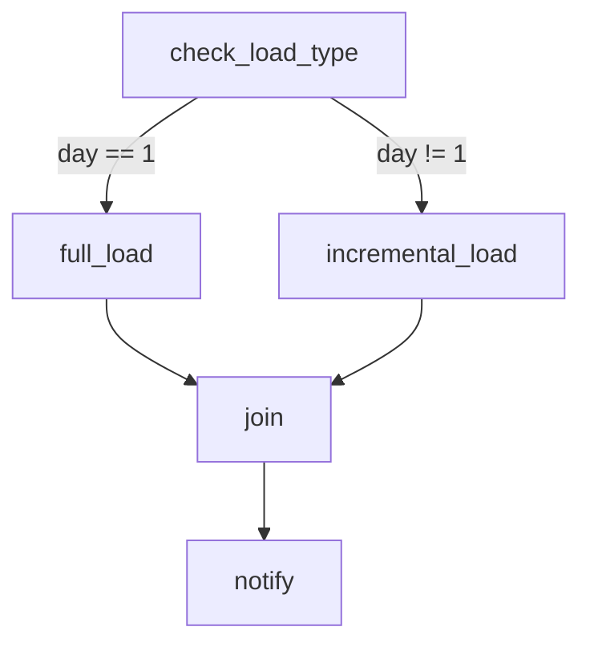

# Airflow DAG Design — Intermediate Concepts

## Idempotent DAGs — The #1 Design Principle

A DAG is **idempotent** if running it multiple times for the same date produces the same result. This is critical for reliability — if a task fails and you retry, it shouldn't create duplicates or corrupt data.

**Non-idempotent (dangerous):**

```python
# BAD: Appends every time — re-running creates duplicates
def load_data():
    db.execute("INSERT INTO target SELECT * FROM staging WHERE date = '{{ ds }}'")
```

**Idempotent (safe):**

```python
# GOOD: Overwrites the partition — re-running gives same result
def load_data():
    db.execute("""
        DELETE FROM target WHERE date = '{{ ds }}';
        INSERT INTO target SELECT * FROM staging WHERE date = '{{ ds }}';
    """)
    
# BETTER: Use MERGE/upsert for idempotent load
def load_data():
    db.execute("""
        MERGE INTO target t
        USING staging s ON t.id = s.id AND t.date = '{{ ds }}'
        WHEN MATCHED THEN UPDATE SET ...
        WHEN NOT MATCHED THEN INSERT ...
    """)
```

> **Rule:** Every task should be safe to re-run. Use DELETE+INSERT, MERGE, or overwrite-partition patterns instead of blind appends.

---

## Branching — Conditional Task Execution

Use `BranchPythonOperator` to choose which downstream path to execute:

```python
from airflow.operators.python import BranchPythonOperator
from airflow.operators.empty import EmptyOperator

def choose_path(**context):
    """Decide whether to do full or incremental load."""
    execution_date = context['logical_date']
    if execution_date.day == 1:  # First of month
        return 'full_load'       # Return task_id to execute
    else:
        return 'incremental_load'

branch = BranchPythonOperator(
    task_id='check_load_type',
    python_callable=choose_path,
)

full_load = PythonOperator(task_id='full_load', ...)
incremental_load = PythonOperator(task_id='incremental_load', ...)
join_step = EmptyOperator(task_id='join', trigger_rule='none_failed_min_one_success')

branch >> [full_load, incremental_load]
[full_load, incremental_load] >> join_step >> notify
```



**What this shows:**
- Branch decides at runtime which path to take
- The skipped path gets `skipped` status (not failed)
- The `join` task uses `trigger_rule='none_failed_min_one_success'` to proceed even when one branch was skipped

---

## Trigger Rules

Default: a task only runs if ALL upstream tasks succeed. Trigger rules override this:

| Rule | Behavior | Use Case |
|------|----------|----------|
| `all_success` (default) | All parents succeeded | Normal dependencies |
| `all_failed` | All parents failed | Error-only handler |
| `all_done` | All parents finished (any state) | Cleanup tasks |
| `one_success` | At least one parent succeeded | Racing tasks |
| `one_failed` | At least one parent failed | Early alert |
| `none_failed` | No parent failed (success or skipped) | After branching |
| `none_failed_min_one_success` | None failed + at least one succeeded | After branching (safest) |

```python
# Cleanup runs regardless of pipeline success/failure
cleanup = PythonOperator(
    task_id='cleanup_staging',
    python_callable=drop_staging_tables,
    trigger_rule='all_done',  # Runs even if upstream failed
)
```

---

## Task Groups — Organizing Complex DAGs

Group related tasks for visual clarity in the UI (Airflow 2.0+):

```python
from airflow.utils.task_group import TaskGroup

with DAG(...) as dag:
    extract = PythonOperator(task_id='extract', ...)
    
    with TaskGroup('transform', tooltip='Data transformations') as transform_group:
        clean = PythonOperator(task_id='clean_nulls', ...)
        dedupe = PythonOperator(task_id='deduplicate', ...)
        enrich = PythonOperator(task_id='enrich_dimensions', ...)
        clean >> dedupe >> enrich
    
    with TaskGroup('validate', tooltip='Quality checks') as validate_group:
        check_nulls = PythonOperator(task_id='null_check', ...)
        check_counts = PythonOperator(task_id='count_check', ...)
        [check_nulls, check_counts]  # Parallel within the group
    
    load = PythonOperator(task_id='load', ...)
    
    extract >> transform_group >> validate_group >> load
```

> **Benefit:** In the Airflow UI, task groups appear as collapsible boxes. A 50-task DAG with task groups looks clean; without them, it's an unreadable spaghetti graph.

---

## Sensors — Wait for External Conditions

Sensors are tasks that **wait** (poll) until a condition is met:

```python
from airflow.sensors.s3_key_sensor import S3KeySensor
from airflow.sensors.external_task import ExternalTaskSensor
from airflow.sensors.sql import SqlSensor

# Wait for a file to appear in S3
wait_for_file = S3KeySensor(
    task_id='wait_for_source_file',
    bucket_name='data-lake',
    bucket_key='raw/sales/{{ ds }}/data.parquet',
    timeout=3600,           # Give up after 1 hour
    poke_interval=60,       # Check every 60 seconds
    mode='reschedule',      # Release worker slot between checks (recommended)
)

# Wait for another DAG to finish
wait_for_upstream_dag = ExternalTaskSensor(
    task_id='wait_for_extract_dag',
    external_dag_id='source_extract_pipeline',
    external_task_id=None,  # Wait for entire DAG to succeed
    timeout=7200,
    mode='reschedule',
)

# Wait for data to appear in a table
wait_for_data = SqlSensor(
    task_id='wait_for_staging_data',
    conn_id='warehouse',
    sql="SELECT COUNT(*) FROM staging.sales WHERE date = '{{ ds }}' HAVING COUNT(*) > 0",
    timeout=3600,
    mode='reschedule',
)
```

> **`mode='reschedule'` vs `mode='poke'`:** Reschedule releases the worker between checks (efficient for long waits). Poke holds the worker (uses resources but no scheduling overhead). Use reschedule for waits >5 minutes.

---

## XCom — Passing Data Between Tasks

XCom (cross-communication) lets tasks share small pieces of data:

```python
def extract_data(**context):
    """Extract and push metadata to XCom."""
    row_count = run_extract_query()
    context['ti'].xcom_push(key='row_count', value=row_count)
    return {'status': 'success', 'rows': row_count}  # Return value auto-pushed

def validate_data(**context):
    """Pull metadata from previous task."""
    row_count = context['ti'].xcom_pull(task_ids='extract', key='row_count')
    if row_count == 0:
        raise ValueError("No data extracted — aborting pipeline")

extract = PythonOperator(task_id='extract', python_callable=extract_data)
validate = PythonOperator(task_id='validate', python_callable=validate_data)
extract >> validate
```

> **Warning:** XCom stores data in the Airflow metadata database. Keep values SMALL (< 48KB). Never pass entire DataFrames. Pass file paths, row counts, or status flags instead.

---

## SLA and Timeout Management

```python
dag = DAG(
    dag_id='critical_daily_load',
    dagrun_timeout=timedelta(hours=3),  # Kill entire DAG run after 3 hours
    sla_miss_callback=alert_on_sla_miss,
)

critical_task = PythonOperator(
    task_id='load_warehouse',
    python_callable=load_data,
    execution_timeout=timedelta(minutes=45),  # Kill this task after 45 min
    sla=timedelta(hours=2),  # Alert if not completed within 2 hours of dag start
)
```

---

## DAG Design Patterns Summary

| Pattern | When to Use | Example |
|---------|-------------|---------|
| Linear | Simple sequential pipeline | Extract → Transform → Load |
| Fan-out/Fan-in | Parallel independent transforms | Process 5 source tables in parallel |
| Branching | Conditional logic | Full load on day 1, incremental otherwise |
| Sensor-gated | Wait for external dependency | Wait for file, then process |
| TaskGroup | Organize large DAGs | Group related tasks visually |
| Dynamic | Generate tasks from config | One task per table in a list |

---

## Interview Tips

> **Tip 1:** "How do you make a DAG idempotent?" — "Every task must produce the same output regardless of how many times it runs for the same date. I use DELETE+INSERT or MERGE patterns instead of blind appends. Partition-level overwrites in data lakes. And I template dates with {{ ds }} so each run is scoped to its specific execution date."

> **Tip 2:** "How do you handle inter-DAG dependencies?" — "ExternalTaskSensor to wait for an upstream DAG. Or better: use a shared S3/GCS file as the signal (the upstream DAG writes a success marker file, the downstream DAG uses S3KeySensor to detect it). This decouples the DAGs from each other's schedules."

> **Tip 3:** "What's the difference between `poke` and `reschedule` mode for sensors?" — "Poke holds a worker slot the entire time it's waiting (wastes resources). Reschedule releases the slot between checks and only consumes resources during the actual poke. Use reschedule for any wait over 5 minutes."
