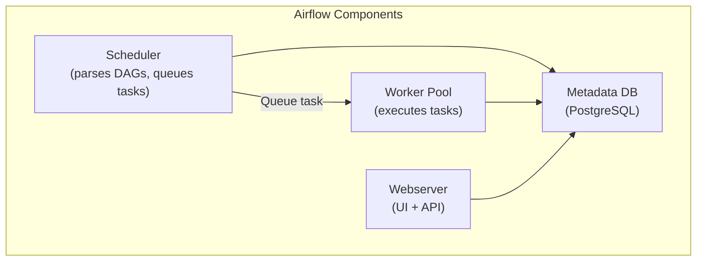

# Airflow DAG Design — Senior-Level Deep Dive

## Dynamic DAG Generation

Instead of hardcoding tasks, generate them from configuration at parse time:

```python
import yaml
from airflow import DAG
from airflow.operators.python import PythonOperator
from datetime import datetime

# Load pipeline config from YAML
# tables_config.yaml:
# tables:
#   - name: users
#     source: postgres.public.users
#     target: warehouse.raw.users
#   - name: orders
#     source: postgres.public.orders
#     target: warehouse.raw.orders

with open('/opt/airflow/config/tables_config.yaml') as f:
    config = yaml.safe_load(f)

dag = DAG('dynamic_table_sync', schedule_interval='@hourly', start_date=datetime(2024, 1, 1))

def sync_table(table_name, source, target, **context):
    """Generic sync function parameterized per table."""
    print(f"Syncing {source} → {target} for date {context['ds']}")

# Dynamically generate one task per table
for table in config['tables']:
    PythonOperator(
        task_id=f"sync_{table['name']}",
        python_callable=sync_table,
        op_kwargs={'table_name': table['name'], 'source': table['source'], 'target': table['target']},
        dag=dag,
    )
```

> **When to use:** You have 50+ tables with identical ETL patterns. Instead of 50 hardcoded tasks, define the pattern once and drive it from config. Add a new table = add one YAML line (no code change).

---

## Airflow Architecture Internals



**What this shows:**
- **Scheduler** reads DAG files, creates DAG runs, and queues tasks for execution
- **Workers** pick up queued tasks and execute them (Celery, Kubernetes, or Local)
- **Metadata DB** stores all state (DAG runs, task instances, XComs, connections)
- **Webserver** provides the UI and REST API (reads from metadata DB)

### DAG Parsing Performance

The scheduler re-parses ALL DAG files periodically (`min_file_process_interval`, default 30s). If you have 500 DAG files with heavy imports, parsing becomes a bottleneck.

**Optimization techniques:**

```python
# BAD: Heavy import at module level (slows EVERY parse)
import pandas as pd
import boto3
from pyspark.sql import SparkSession

def my_task():
    # ... uses pandas, boto3, spark
    pass

# GOOD: Defer imports to task execution time
def my_task():
    import pandas as pd
    import boto3
    # Now these only load when the task actually runs
    pass
```

| Technique | Impact |
|-----------|--------|
| Defer heavy imports to task functions | 50-80% parse time reduction |
| Use `.airflowignore` for non-DAG files | Fewer files scanned |
| Set `dag_file_processor_timeout` | Kill slow-parsing files |
| Split large DAG files (one DAG per file) | Faster per-file parsing |
| Use `@dag` decorator (Airflow 2.0+) | Slightly faster than traditional |

---

## Executor Comparison

| Executor | How Tasks Run | Scaling | Best For |
|----------|--------------|---------|----------|
| **SequentialExecutor** | One at a time (single process) | None | Local dev only |
| **LocalExecutor** | Parallel processes on one machine | Multi-core | Small deployments (<50 tasks) |
| **CeleryExecutor** | Distributed workers via message queue | Horizontal | Medium to large (100s of tasks) |
| **KubernetesExecutor** | Each task gets its own K8s pod | Infinite | Large scale, task isolation |
| **CeleryKubernetesExecutor** | Hybrid: Celery default + K8s for heavy tasks | Hybrid | Mixed workloads |

**KubernetesExecutor detail:**

```python
from airflow.providers.cncf.kubernetes.operators.pod import KubernetesPodOperator

heavy_task = KubernetesPodOperator(
    task_id='run_spark_job',
    name='spark-etl',
    image='spark-custom:3.5',
    cmds=['spark-submit'],
    arguments=['--master', 'k8s://...', '/jobs/etl.py', '{{ ds }}'],
    resources={'request_memory': '8Gi', 'request_cpu': '4'},
    is_delete_operator_pod=True,  # Clean up after completion
)
```

> **Why K8s executor is popular:** Perfect task isolation (each task runs in its own container with its own dependencies), auto-scaling (spin up pods on demand), and cost-efficiency (pods only exist during execution).

---

## Backfill and Data Reprocessing

**Backfill** = running a DAG for historical dates it missed.

```bash
# CLI: backfill the last 30 days
airflow dags backfill daily_sales_pipeline \
    --start-date 2024-01-01 \
    --end-date 2024-01-31 \
    --reset-dagruns
```

**Design for backfill-safety:**

```python
# GOOD: Task is parameterized by execution date — backfill works naturally
def extract(**context):
    date = context['ds']
    data = api.fetch(date=date)  # Only fetches this date's data
    save(data, path=f"s3://raw/sales/{date}/")

# BAD: Task uses current wall-clock time — backfill reprocesses wrong data
def extract():
    today = datetime.now().strftime('%Y-%m-%d')  # WRONG: always "today"
    data = api.fetch(date=today)
```

> **Rule:** Never use `datetime.now()` in tasks. Always use `{{ ds }}` or `context['logical_date']`. This ensures backfills process the correct historical date.

---

## Handling Failures at Scale

### Retry Strategy

```python
default_args = {
    'retries': 3,
    'retry_delay': timedelta(minutes=5),
    'retry_exponential_backoff': True,
    'max_retry_delay': timedelta(hours=1),
}
# Retry timeline: 5 min → 10 min → 20 min (exponential backoff)
```

### Callbacks for Alerting

```python
def on_failure_callback(context):
    """Send Slack alert when a task fails."""
    task = context['task_instance']
    dag_id = context['dag'].dag_id
    message = f"FAILED: {dag_id}.{task.task_id} on {context['ds']}"
    send_slack_alert(channel='#data-alerts', text=message)

def on_sla_miss_callback(dag, task_list, blocking_task_list, slas, blocking_tis):
    """Alert when SLA is breached."""
    send_pager_duty_alert(f"SLA miss on {dag.dag_id}")

dag = DAG(
    ...,
    on_failure_callback=on_failure_callback,
    sla_miss_callback=on_sla_miss_callback,
)
```

### Circuit Breaker Pattern

```python
from airflow.models import Variable

def check_system_health(**context):
    """Don't start pipeline if downstream system is degraded."""
    warehouse_status = Variable.get("warehouse_health", default_var="healthy")
    if warehouse_status == "degraded":
        raise AirflowSkipException("Warehouse is degraded — skipping this run")

health_check = PythonOperator(
    task_id='system_health_check',
    python_callable=check_system_health,
)
health_check >> extract >> transform >> load
```

---

## Testing DAGs

```python
# Unit test: verify DAG loads without errors
def test_dag_loads():
    from dags.daily_sales_pipeline import dag
    assert dag is not None
    assert len(dag.tasks) == 5
    assert dag.schedule_interval == '0 6 * * *'

# Unit test: verify task dependencies
def test_dependencies():
    from dags.daily_sales_pipeline import dag
    extract = dag.get_task('extract')
    transform = dag.get_task('transform')
    assert transform.task_id in [t.task_id for t in extract.downstream_list]

# Integration test: run a task in isolation
def test_extract_task():
    from dags.daily_sales_pipeline import dag
    task = dag.get_task('extract')
    task.execute(context={'ds': '2024-01-15', 'ti': MockTaskInstance()})
```

---

## Performance Tuning Checklist

| Setting | Default | Tuned | Impact |
|---------|---------|-------|--------|
| `parallelism` | 32 | 64-128 | Max tasks across ALL DAGs |
| `dag_concurrency` | 16 | 32 | Max tasks per DAG |
| `max_active_runs_per_dag` | 16 | 1-3 | Prevent resource explosion |
| `min_file_process_interval` | 30s | 60s | Less CPU for parsing |
| `scheduler_heartbeat_sec` | 5s | 5s | Keep default |
| `worker_concurrency` (Celery) | 16 | 8-32 | Tasks per worker |
| `pool` size | 128 | Per-resource | Limit concurrent DB connections |

---

## Interview Tips

> **Tip 1:** "How do you handle 500 tables with similar ETL?" — "Dynamic DAG generation. I define the ETL pattern once and drive it from a YAML/JSON config file. Adding a new table means adding one config entry — no code deployment needed. The scheduler generates the tasks at parse time."

> **Tip 2:** "How do you ensure a DAG is safe to re-run?" — "Idempotency at every layer: partition-level overwrite in the data lake, MERGE/upsert for warehouse loads, and templated dates ({{ ds }}) so each run is scoped. I never use datetime.now() in tasks."

> **Tip 3:** "How do you scale Airflow?" — "Three levels: (1) Optimize DAG parsing (defer imports, fewer files), (2) Use CeleryExecutor with auto-scaling workers, (3) KubernetesExecutor for task-level isolation and infinite scaling. The metadata DB (PostgreSQL) is usually the bottleneck — use connection pooling and regular cleanup of old task instances."

---

## ⚡ Cheat Sheet

### Common DAG Pitfalls

| Pitfall | Why it's bad | Fix |
|---|---|---|
| Top-level code in DAG file (e.g., DB calls, API requests) | Executes on every scheduler heartbeat (every 5–30s) — causes latency spikes and resource exhaustion | Move all I/O into task callables; keep DAG file to DAG definition only |
| Dynamic task count changing between runs | Causes task instance mismatch — Airflow can't reconcile old runs with new structure | Use static task structure; parameterize via task arguments, not task count |
| XCom for large data | XCom stored in metadata DB — large payloads bloat DB, cause slow queries | Use XCom for small values only (IDs, counts, paths); pass large data via S3/GCS |
| Not setting `retries` | Transient failures (network blip, API timeout) cause permanent DAG failure | Set `retries=3` with `retry_delay=timedelta(minutes=5)` as default |
| Using `datetime.now()` instead of `{{ ds }}` | Tasks are not idempotent — backfills and re-runs produce wrong results | Always use Jinja templated macros (`{{ ds }}`, `{{ execution_date }}`) for date logic |
| Missing `task_id` uniqueness | Duplicate task IDs within a DAG raise errors at parse time | Ensure all `task_id` values are unique per DAG |
| SLA misses not alerting | SLA callback fires but nobody configured `sla_miss_callback` | Set `sla` on tasks and configure `sla_miss_callback` to send alerts |
| Large `default_args` with missing `start_date` | DAG won't be scheduled — silently no-ops | Always set `start_date` in `default_args` or DAG constructor |

### Key Airflow Configuration Settings

| Config | Default | Tuned value | What it controls |
|---|---|---|---|
| `parallelism` | 32 | 64–128 | Max concurrent task instances across ALL DAGs |
| `max_active_runs_per_dag` | 16 | 1–3 | Prevents same DAG from queuing up many concurrent runs |
| `dagbag_import_timeout` | 30s | 60s | Time allowed to parse a DAG file before timeout |
| `dag_file_processor_timeout` | 50s | 120s | Total time for file processor per DAG file |
| `min_file_process_interval` | 30s | 60s | Min gap between re-parsing the same DAG file |
| `scheduler_heartbeat_sec` | 5s | 5s | Keep default; lower increases DB pressure |
| `worker_concurrency` (Celery) | 16 | 8–32 | Concurrent tasks per Celery worker process |
| `pool` (default pool) | 128 | Per-resource | Use pools to limit concurrent DB connections or API calls |
