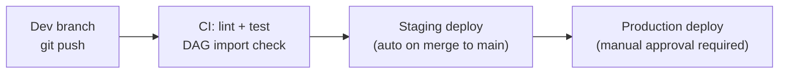

# Airflow Deployment Patterns — Intermediate

## Kubernetes with Helm (Production Standard)

The Airflow community Helm chart is the standard way to deploy Airflow on Kubernetes:

```bash
# Add the official Helm repo
helm repo add apache-airflow https://airflow.apache.org
helm repo update

# Deploy with custom values
helm install airflow apache-airflow/airflow \
  --namespace airflow \
  --create-namespace \
  --values values.yaml \
  --version 1.11.0
```

```yaml
# values.yaml — key configuration
airflowVersion: "2.8.1"
executor: KubernetesExecutor

# Scheduler
scheduler:
  replicas: 2   # HA — two schedulers
  resources:
    requests:
      memory: "2Gi"
      cpu: "500m"
    limits:
      memory: "4Gi"
      cpu: "2000m"

# Workers (for KubernetesExecutor — these are task pod templates)
workers:
  resources:
    requests:
      memory: "1Gi"
      cpu: "500m"
    limits:
      memory: "4Gi"
      cpu: "2000m"

# Webserver
webserver:
  replicas: 2
  service:
    type: LoadBalancer

# Git-sync DAG deployment
dags:
  gitSync:
    enabled: true
    repo: https://github.com/company/airflow-dags
    branch: main
    subPath: dags/
    period: 60s
    credentialsSecret: git-credentials

# External PostgreSQL (never use the bundled dev DB in production)
postgresql:
  enabled: false   # Disable bundled Postgres

data:
  metadataConnection:
    user: airflow
    pass: ${AIRFLOW_DB_PASSWORD}
    host: postgres.internal
    db: airflow

# External Redis for CeleryExecutor
redis:
  enabled: false
brokerUrl: redis://:password@redis.internal:6379/0
```

---

## Multi-Environment CI/CD Pipeline



### GitHub Actions Workflow

```yaml
# .github/workflows/deploy.yml
name: Airflow DAG Deployment

on:
  push:
    branches: [main, 'release/**']
  pull_request:
    branches: [main]

jobs:
  test:
    runs-on: ubuntu-latest
    steps:
      - uses: actions/checkout@v4

      - name: Set up Python
        uses: actions/setup-python@v5
        with:
          python-version: '3.11'

      - name: Install dependencies
        run: pip install apache-airflow==2.8.1 pytest

      - name: Lint DAG files
        run: |
          python -m py_compile dags/*.py
          ruff check dags/

      - name: Check DAG import errors
        run: |
          airflow db migrate
          airflow dags list-import-errors | tee /tmp/import_errors.txt
          if grep -q "ERROR" /tmp/import_errors.txt; then
            echo "DAG import errors found!" && exit 1
          fi

      - name: Run DAG unit tests
        run: pytest tests/ -v

  deploy-staging:
    needs: test
    if: github.ref == 'refs/heads/main'
    runs-on: ubuntu-latest
    environment: staging
    steps:
      - name: Sync DAGs to staging git-sync repo
        run: |
          git config user.email "ci@company.com"
          git add dags/
          git commit -m "Deploy: ${{ github.sha }}"
          git push origin staging

  deploy-production:
    needs: deploy-staging
    if: github.ref == 'refs/heads/main'
    runs-on: ubuntu-latest
    environment: production   # Requires manual approval in GitHub
    steps:
      - name: Sync DAGs to production
        run: |
          git push origin main
          # git-sync on production picks up within 60s
```

---

## DAG Versioning and Backward Compatibility

Changing a running DAG can break active DAG runs. Key rules:

```python
# ✅ Safe changes (backward compatible)
# - Adding new tasks downstream
# - Changing retry count, timeout
# - Changing schedule for future runs

# ❌ Unsafe changes (require dag_id change or careful migration)
# - Removing or renaming tasks that have open runs
# - Changing the dag_id
# - Changing start_date (can cause duplicate or missing runs)

# Pattern: Version DAGs with a suffix for breaking changes
with DAG(
    dag_id='customer_pipeline_v2',    # New dag_id for breaking changes
    start_date=datetime(2024, 6, 1),  # New start date
    catchup=False,
) as dag:
    # New structure
    pass

# Keep old dag paused during transition
# Airflow UI: Pause 'customer_pipeline_v1' when ready
```

---

## Secrets Management

**Never put credentials in DAG files or docker-compose.**

### Option 1: Airflow Variables and Connections (Simple)

```bash
# CLI to set encrypted connections
airflow connections add snowflake_prod \
  --conn-type snowflake \
  --conn-login myuser \
  --conn-password $SNOWFLAKE_PASSWORD \
  --conn-host account.snowflake.com

airflow variables set slack_webhook_url $SLACK_URL
```

### Option 2: AWS Secrets Manager Backend (Production)

```ini
# airflow.cfg
[secrets]
backend = airflow.providers.amazon.aws.secrets.secrets_manager.SecretsManagerBackend
backend_kwargs = {
  "connections_prefix": "airflow/connections",
  "variables_prefix": "airflow/variables"
}
```

```bash
# Store in AWS Secrets Manager
aws secretsmanager create-secret \
  --name "airflow/connections/snowflake_prod" \
  --secret-string '{"conn_type":"snowflake","login":"myuser","password":"secret","host":"account.snowflake.com"}'
```

### Option 3: HashiCorp Vault

```ini
[secrets]
backend = airflow.providers.hashicorp.secrets.vault.VaultBackend
backend_kwargs = {
  "connections_path": "airflow/connections",
  "variables_path": "airflow/variables",
  "url": "http://vault.internal:8200",
  "auth_type": "kubernetes"
}
```

---

## Custom Docker Images

The official Airflow image plus your dependencies:

```dockerfile
FROM apache/airflow:2.8.1-python3.11

# Install provider packages
RUN pip install --no-cache-dir \
    apache-airflow-providers-snowflake==4.4.2 \
    apache-airflow-providers-amazon==8.12.0 \
    apache-airflow-providers-google==10.13.1 \
    dbt-core==1.7.4 \
    dbt-snowflake==1.7.4

# Install company internal packages
COPY company_airflow_providers/ /opt/airflow/company_airflow_providers/
RUN pip install /opt/airflow/company_airflow_providers/
```

```bash
# Build and push to ECR/GCR
docker build -t company/airflow:2.8.1-$(git rev-parse --short HEAD) .
docker push company/airflow:2.8.1-$(git rev-parse --short HEAD)

# Reference specific image hash in Helm values — never use :latest
airflow:
  image:
    repository: company/airflow
    tag: "2.8.1-a3b2c1d"
```

---

## Interview Tips

> **Tip 1:** In production, always use an external managed PostgreSQL for the metadata DB. The bundled PostgreSQL in Docker Compose or Helm is for development only. Explain why: metadata DB is the source of truth for all task state, and an unmanaged DB is a reliability risk.

> **Tip 2:** Git-sync is the recommended DAG deployment pattern for Kubernetes. It gives you version control, PR review, audit trail, and instant rollback (revert the commit). The alternative — copying files to a shared volume — has none of these properties.

> **Tip 3:** When a DAG change breaks active runs, the right response is usually to create a new `dag_id` (e.g., `pipeline_v2`) rather than modifying the running one. Modifying a live DAG with open runs can cause orphaned task instances, confusing state, and scheduling errors.
