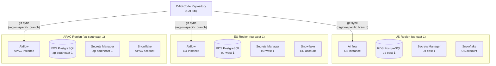

# Scenario Questions — Airflow Deployment Patterns

<article data-difficulty="junior">

## 🟢 Junior: Choose the Right Executor

**Scenario:** You're setting up Airflow for a startup data team of 3 engineers. You have a single EC2 instance (8 vCPU, 32GB RAM). Your pipelines run 10–20 tasks concurrently at most. Which executor should you use, and why? What would change if you scaled to 200 concurrent tasks?

<details>
<summary>💡 Hint</summary>

Think about what each executor requires: LocalExecutor needs only the one machine. CeleryExecutor needs a broker (Redis/RabbitMQ) and separate worker machines. KubernetesExecutor needs a Kubernetes cluster. Match the complexity to the actual scale requirement.

</details>

<details>
<summary>✅ Solution</summary>

**For 10–20 concurrent tasks on one EC2 instance: `LocalExecutor`**

```ini
# airflow.cfg
[core]
executor = LocalExecutor
parallelism = 20    # Match to your max concurrent task count
```

**Why LocalExecutor is right here:**
- No extra infrastructure (no Redis, no Kubernetes)
- All tasks run as subprocesses on the same machine — fast startup
- 8 vCPU / 32GB RAM easily handles 20 concurrent tasks
- Simple to operate — one machine to monitor, one process to manage

**Scaling to 200 concurrent tasks — switch to CeleryExecutor:**

```ini
[core]
executor = CeleryExecutor
parallelism = 200

[celery]
broker_url = redis://redis:6379/0
result_backend = db+postgresql://airflow:pw@postgres/airflow
worker_concurrency = 32    # Per worker machine
```

```bash
# Scale by adding worker machines
# Machine 1: scheduler + webserver
# Machine 2-5: celery workers (32 tasks each = 128 concurrent)
airflow celery worker --concurrency 32
```

**Decision framework:**

| Scale | Recommendation |
|-------|---------------|
| < 50 concurrent tasks, 1 machine | LocalExecutor |
| 50–500 concurrent tasks, multi-machine | CeleryExecutor |
| 500+ tasks, cloud-native, need isolation | KubernetesExecutor |
| Need simplicity, on AWS/GCP | Managed service (MWAA, Cloud Composer) |

</details>

</article>

<article data-difficulty="junior">

## 🟢 Junior: DAG Not Picking Up After Deployment

**Scenario:** You updated a DAG file and pushed to your Git repository. The git-sync sidecar is configured with `period: 60s`. It's been 5 minutes and the Airflow UI still shows the old version of the DAG. What do you check?

<details>
<summary>💡 Hint</summary>

There are multiple places this can break: git-sync itself might be failing, the file might be parsed but show a syntax error, or the serialized DAG in the DB might not have been refreshed. Check each layer.

</details>

<details>
<summary>✅ Solution</summary>

**Step 1: Check git-sync container logs**

```bash
kubectl logs deployment/airflow-scheduler -c git-sync -n airflow --tail=50

# Look for:
# - "syncing" messages (should appear every 60s)
# - authentication errors (bad credentials)
# - "no change" vs "updated" status
```

**Step 2: Verify the file is on the scheduler pod**

```bash
kubectl exec -it deployment/airflow-scheduler -n airflow -- \
  ls -la /opt/airflow/dags/my_dag.py

# Check the file content matches what you expect
kubectl exec -it deployment/airflow-scheduler -n airflow -- \
  head -20 /opt/airflow/dags/my_dag.py
```

**Step 3: Check for DAG import errors**

```bash
# Check UI: Browse → DAG Import Errors
# Or via CLI:
kubectl exec -it deployment/airflow-scheduler -n airflow -- \
  airflow dags list-import-errors

# Or test the file directly
kubectl exec -it deployment/airflow-scheduler -n airflow -- \
  python /opt/airflow/dags/my_dag.py
```

**Step 4: Force re-serialization**

```bash
kubectl exec -it deployment/airflow-scheduler -n airflow -- \
  airflow dags reserialize
```

**Step 5: Check `min_file_process_interval`**

```bash
# If set to 300s, file won't be re-parsed for 5 minutes after last parse
kubectl exec -it deployment/airflow-scheduler -n airflow -- \
  airflow config get-value scheduler min_file_process_interval
```

**Most common root cause:** syntax error in the DAG file — Python imports fail silently from the UI perspective, but appear in `list-import-errors`.

</details>

</article>

<article data-difficulty="mid-level">

## 🟡 Mid-Level: Secrets Management Strategy

**Scenario:** Your team is deploying Airflow on Kubernetes. You have 40+ database connections (Snowflake, PostgreSQL, Redis) and 20 variables (API keys, tokens). Currently, credentials are stored directly in the Airflow UI. A security audit flags this as a risk. Design a secrets management approach.

<details>
<summary>💡 Hint</summary>

Airflow supports pluggable secrets backends. The built-in store uses Fernet encryption in the metadata DB — it's encrypted, but secrets are in the DB which is a larger attack surface. External backends like AWS Secrets Manager, HashiCorp Vault, or GCP Secret Manager are preferred for production.

</details>

<details>
<summary>✅ Solution</summary>

**Recommended: AWS Secrets Manager backend (if on AWS)**

```ini
# airflow.cfg
[secrets]
backend = airflow.providers.amazon.aws.secrets.secrets_manager.SecretsManagerBackend
backend_kwargs = {
  "connections_prefix": "airflow/connections",
  "variables_prefix": "airflow/variables",
  "region_name": "us-east-1"
}
```

```bash
# Store connections in Secrets Manager (not Airflow UI)
aws secretsmanager create-secret \
  --name "airflow/connections/snowflake_prod" \
  --secret-string '{
    "conn_type": "snowflake",
    "login": "svc_airflow",
    "password": "ACTUAL_SECRET_HERE",
    "host": "myaccount.snowflakecomputing.com",
    "extra": "{\"warehouse\": \"TRANSFORM_WH\", \"database\": \"ANALYTICS\"}"
  }'

aws secretsmanager create-secret \
  --name "airflow/variables/slack_webhook_url" \
  --secret-string "https://hooks.slack.com/services/T00/B00/XXXXX"
```

```hcl
# IAM policy: Airflow can only read from its prefix
resource "aws_iam_role_policy" "airflow_secrets" {
  policy = jsonencode({
    Statement = [{
      Effect = "Allow"
      Action = ["secretsmanager:GetSecretValue"]
      Resource = "arn:aws:secretsmanager:us-east-1:123456789:secret:airflow/*"
      # "airflow/*" — scoped to Airflow secrets only, not all account secrets
    }]
  })
}
```

**Security improvements achieved:**

| Before | After |
|--------|-------|
| Secrets in Airflow metadata DB | Secrets in AWS Secrets Manager |
| DB backup contains credentials | Credentials not in DB backup |
| Fernet key rotated manually | Secrets Manager handles rotation |
| All DB users can read metadata | IAM controls access per secret |
| No audit trail | CloudTrail logs every secret access |

**Key Kubernetes integration:**

```yaml
# Helm values — inject AWS credentials via IRSA (IAM Roles for Service Accounts)
serviceAccount:
  annotations:
    eks.amazonaws.com/role-arn: arn:aws:iam::123456789:role/airflow-role
# No static AWS credentials needed in pods
```

</details>

</article>

<article data-difficulty="mid-level">

## 🟡 Mid-Level: DAG CI/CD Pipeline Design

**Scenario:** Your team has 50 engineers contributing to a monorepo containing 300 Airflow DAGs. Currently, DAGs are deployed by manually copying files to an S3 bucket (for MWAA). This causes issues: broken DAGs deployed to production, no review process, accidental overwrites. Design a proper CI/CD pipeline.

<details>
<summary>💡 Hint</summary>

A DAG CI/CD pipeline has stages: lint, test, validate imports, deploy to staging, manual approval, deploy to production. The key Airflow-specific check is import validation — a DAG file that fails to import will silently break that DAG in production.

</details>

<details>
<summary>✅ Solution</summary>

```yaml
# .github/workflows/airflow-dags.yml
name: DAG CI/CD

on:
  pull_request:
    paths: ['dags/**', 'plugins/**', 'requirements.txt']
  push:
    branches: [main]

jobs:
  # Stage 1: Fast validation (runs on every PR)
  validate:
    runs-on: ubuntu-latest
    steps:
      - uses: actions/checkout@v4

      - name: Set up Python
        uses: actions/setup-python@v5
        with:
          python-version: '3.11'

      - name: Install Airflow + providers (matches production)
        run: |
          pip install "apache-airflow==2.8.1" $(cat requirements.txt)

      - name: Lint Python files
        run: |
          pip install ruff
          ruff check dags/ plugins/

      - name: Check DAG parse time (must be < 5s per file)
        run: |
          python << 'EOF'
          import time, importlib.util, sys
          from pathlib import Path

          failures = []
          for dag_file in Path('dags').glob('*.py'):
              start = time.time()
              spec = importlib.util.spec_from_file_location('dag', dag_file)
              mod = importlib.util.module_from_spec(spec)
              try:
                  spec.loader.exec_module(mod)
              except Exception as e:
                  failures.append(f"{dag_file}: IMPORT ERROR: {e}")
                  continue
              duration = time.time() - start
              if duration > 5:
                  failures.append(f"{dag_file}: TOO SLOW ({duration:.1f}s > 5s limit)")

          if failures:
              print('\n'.join(failures))
              sys.exit(1)
          print(f"All DAG files parse OK")
          EOF

      - name: Run unit tests
        run: pytest tests/ -v --tb=short

  # Stage 2: Deploy to staging (on merge to main)
  deploy-staging:
    needs: validate
    if: github.ref == 'refs/heads/main'
    runs-on: ubuntu-latest
    environment: staging
    steps:
      - uses: actions/checkout@v4

      - name: Deploy to staging MWAA
        run: |
          aws s3 sync dags/ s3://company-airflow-staging/dags/ \
            --delete --exclude "__pycache__/*" --exclude "*.pyc"
        env:
          AWS_ROLE_ARN: ${{ secrets.AWS_STAGING_ROLE }}

      - name: Wait for MWAA to pick up DAGs
        run: sleep 90

      - name: Validate no import errors in staging
        run: |
          errors=$(aws mwaa create-cli-token --name company-airflow-staging \
            | python3 -c "import sys,json; print(json.load(sys.stdin)['CliToken'])")
          # Call MWAA CLI to check errors
          # (simplified — actual implementation uses MWAA CLI endpoint)

  # Stage 3: Production (manual approval required)
  deploy-production:
    needs: deploy-staging
    if: github.ref == 'refs/heads/main'
    runs-on: ubuntu-latest
    environment: production   # GitHub environment requires manual approval
    steps:
      - uses: actions/checkout@v4

      - name: Deploy to production MWAA
        run: |
          aws s3 sync dags/ s3://company-airflow-prod/dags/ \
            --delete --exclude "__pycache__/*" --exclude "*.pyc"

      - name: Tag deployment in git
        run: |
          git tag "deploy/prod/$(date +%Y%m%d-%H%M%S)"
          git push --tags
```

</details>

</article>

<article data-difficulty="senior">

## 🔴 Senior: Multi-Region Airflow for Global Data Pipelines

**Scenario:** A global e-commerce company runs data pipelines for three regions (US, EU, APAC) with strict data residency requirements — EU data must never leave the EU. Currently, a single Airflow instance in us-east-1 orchestrates everything. The legal team flags this as a compliance violation. Design a compliant multi-region Airflow architecture.

<details>
<summary>💡 Hint</summary>

Data residency compliance typically requires the orchestration control plane to also reside in the same region as the data — not just the compute. Consider whether you need completely separate Airflow instances per region, or whether there's a way to use a single control plane with region-specific worker pools. Think about how DAG code is shared, how secrets are managed per-region, and how you handle cross-region dependencies.

</details>

<details>
<summary>✅ Solution</summary>

**Architecture: Three independent Airflow instances, shared DAG code**



**DAG code sharing with region-specific configuration:**

```python
# dags/orders_pipeline.py — shared code, region-aware config
import os
from airflow import DAG
from airflow.models import Variable
from datetime import datetime

# Region is injected as an environment variable per deployment
REGION = os.environ.get('AIRFLOW_REGION', 'us')

# Region-specific connection IDs (stored in each region's Secrets Manager)
SNOWFLAKE_CONN = f'snowflake_{REGION}'    # snowflake_us, snowflake_eu, snowflake_apac
S3_CONN        = f's3_{REGION}'

with DAG(
    dag_id='orders_pipeline',
    schedule='@daily',
    start_date=datetime(2024, 1, 1),
    tags=[f'region:{REGION}'],
    catchup=False,
) as dag:

    load = SnowflakeOperator(
        task_id='load_orders',
        snowflake_conn_id=SNOWFLAKE_CONN,   # Region-specific connection
        sql="INSERT INTO orders SELECT * FROM staging.orders WHERE region = '{{ var.value.region }}'",
        warehouse='TRANSFORM_WH',
    )
```

**Per-region Helm values:**

```yaml
# values-eu.yaml — EU-specific configuration
env:
  - name: AIRFLOW_REGION
    value: "eu"

# Git-sync points to EU-specific branch (or same branch with env var)
dags:
  gitSync:
    repo: https://github.com/company/airflow-dags
    branch: main
    credentialsSecret: github-secret-eu    # Stored in EU

# EU secrets manager
extraEnv:
  - name: AIRFLOW__SECRETS__BACKEND
    value: "airflow.providers.amazon.aws.secrets.secrets_manager.SecretsManagerBackend"
  - name: AIRFLOW__SECRETS__BACKEND_KWARGS
    value: '{"region_name": "eu-west-1", "connections_prefix": "airflow/connections"}'
```

**Cross-region dependencies handled with ExternalTaskSensor:**

```python
# EU pipeline that depends on US pipeline (acceptable cross-region read)
# Only reads completion STATUS from US — no data crosses the border
from airflow.sensors.external_task import ExternalTaskSensor

wait_for_us_rates = ExternalTaskSensor(
    task_id='wait_for_fx_rates_from_us',
    external_dag_id='fx_rates_pipeline',       # Runs in US Airflow
    external_task_id='publish_rates',
    # For cross-instance: use an ExternalTaskSensor pointed at shared DB view
    # OR use a custom sensor that polls an S3 status file written by US pipeline
    allowed_states=['success'],
    mode='reschedule',
    timeout=3600,
)

# Better alternative: US pipeline writes a completion marker to an S3 path
# accessible from EU (only a flag file, not the actual data)
wait_for_marker = S3KeySensor(
    task_id='wait_for_us_completion_marker',
    bucket_name='company-pipeline-status',    # Global bucket, markers only
    bucket_key='us/fx_rates/{{ ds }}/DONE',  # Just a flag, no sensitive data
    aws_conn_id='s3_global_status',
    mode='reschedule',
)
```

**Compliance controls:**

| Control | Implementation |
|---------|---------------|
| Data residency | Tasks in EU Airflow → Snowflake EU account only |
| Secrets isolation | Separate AWS Secrets Manager per region |
| Audit logging | CloudTrail per region, separate log aggregation |
| Worker isolation | Worker pods in eu-west-1 only (Kubernetes region affinity) |
| DAG code review | All regions use same code → single security review |
| Cross-region signal | Only status markers (no data) cross region boundaries |

</details>

</article>
