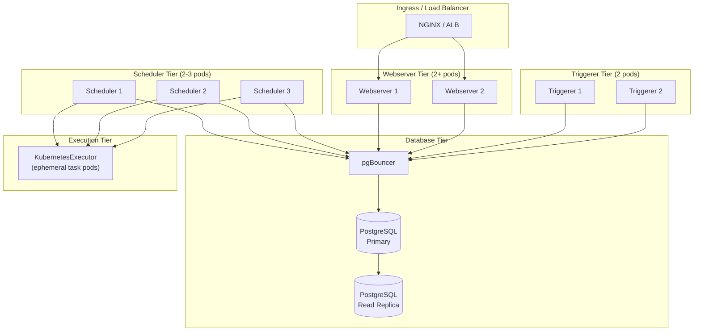

# Airflow Deployment Patterns — Senior Deep Dive

## High-Availability Architecture

A production-grade HA Airflow deployment runs every component with redundancy:



**How multiple schedulers avoid conflicts:**

Airflow 2.x uses `SELECT FOR UPDATE SKIP LOCKED` on the `dag_run` and `task_instance` tables. When Scheduler 1 is processing a DAG run, it locks that row. Scheduler 2 skips locked rows and processes different DAG runs. This enables true horizontal scaling with no coordination overhead.

---

## Multi-Tenancy Patterns

### Option 1: Namespace Isolation (Per-Team)

```yaml
# values-team-a.yaml
airflowVersion: "2.8.1"
executor: KubernetesExecutor

dags:
  gitSync:
    repo: https://github.com/company/team-a-dags
    branch: main

# Each team gets their own metadata DB
data:
  metadataConnection:
    host: team-a-postgres.internal
    db: airflow_team_a

# Worker pods run in team namespace with team-specific RBAC
workers:
  serviceAccountName: team-a-airflow-worker
  nodeSelector:
    team: team-a    # Team-specific node pool
```

```bash
# Deploy separate Airflow per team
helm install airflow-team-a apache-airflow/airflow -n team-a --values values-team-a.yaml
helm install airflow-team-b apache-airflow/airflow -n team-b --values values-team-b.yaml
```

**Pros:** Strong isolation, independent upgrades, per-team resource quotas  
**Cons:** Higher infrastructure cost, multiple UIs to manage

### Option 2: Shared Cluster with RBAC (Single Instance)

```python
# Airflow 2.x supports role-based access control
# Team members see only their DAGs

# roles configured in Airflow UI or via:
airflow roles create team_a_viewer
airflow roles create team_a_operator

# Users assigned to roles that filter by DAG tags
# DAGs tagged with team owner:
with DAG(
    dag_id='team_a_pipeline',
    tags=['team:team-a', 'environment:production'],   # Used for RBAC filtering
    ...
) as dag:
    pass
```

**Pros:** Single UI, shared resources, simpler operations  
**Cons:** Blast radius — one team's bad DAG affects others

---

## Zero-Downtime DAG Deployment

Deploying DAG changes without disrupting running pipelines:

```python
# Pattern 1: Feature flags via Airflow Variables
from airflow.models import Variable

def load_with_feature_flag(**context):
    use_new_logic = Variable.get('use_new_load_logic', default_var='false') == 'true'
    if use_new_logic:
        return new_load_function(context)
    return old_load_function(context)
```

```python
# Pattern 2: Parallel DAG with traffic splitting
# Run old and new DAG simultaneously, compare results

with DAG('orders_pipeline_v1', schedule='@daily', ...) as dag_v1:
    # Old implementation — still running
    pass

with DAG('orders_pipeline_v2', schedule='@daily', ...) as dag_v2:
    # New implementation — run in parallel for validation
    pass
```

```python
# Pattern 3: Blue-green DAG deployment
# 1. Deploy new DAG (paused)
# 2. Test on a specific date via manual trigger
# 3. Unpause new, pause old atomically

import subprocess

def promote_dag(old_dag_id: str, new_dag_id: str):
    """Atomically switch from old to new DAG."""
    subprocess.run(['airflow', 'dags', 'unpause', new_dag_id], check=True)
    subprocess.run(['airflow', 'dags', 'pause', old_dag_id], check=True)
```

---

## Observability Stack

Production Airflow needs comprehensive observability:

```yaml
# Prometheus + Grafana via StatsD exporter
statsd:
  enabled: true
  extraMappings:
    - match: "airflow.scheduler.*"
      name: "airflow_scheduler"
      labels:
        metric: "$1"
    - match: "airflow.task_instance.*.*.*"
      name: "airflow_task_instance"
      labels:
        dag_id: "$1"
        task_id: "$2"
        state: "$3"
```

```python
# Key Grafana dashboard panels for Airflow health:
# 1. scheduler_heartbeat — should be regular, low latency
# 2. dag_processing.total_parse_time — parsing throughput
# 3. task_instance state breakdown — success/failed/running/queued counts
# 4. critical_section_duration — time the scheduler holds the DB lock
# 5. executor.open_slots — available executor capacity
# 6. pool.open_slots per pool — pool utilisation
```

**Alert rules:**

```yaml
# Prometheus alert rules
groups:
  - name: airflow
    rules:
      - alert: AirflowSchedulerHeartbeatMissed
        expr: time() - airflow_scheduler_heartbeat > 30
        severity: critical
        summary: "Airflow scheduler heartbeat missing for >30s"

      - alert: AirflowHighTaskFailureRate
        expr: |
          rate(airflow_task_instance{state="failed"}[5m]) /
          rate(airflow_task_instance{state="success"}[5m]) > 0.1
        severity: warning
        summary: "Task failure rate >10% in last 5 minutes"

      - alert: AirflowExecutorSaturated
        expr: airflow_executor_open_slots < 5
        severity: warning
        summary: "Executor nearly full — fewer than 5 open slots"
```

---

## Database Migration Strategy

Upgrading Airflow versions safely:

```bash
# Step 1: Backup metadata DB
pg_dump -h postgres.internal -U airflow airflow > airflow_backup_$(date +%Y%m%d).sql

# Step 2: Run DB migration on new version
# (safe to run multiple times — idempotent)
docker run --rm \
  -e AIRFLOW__DATABASE__SQL_ALCHEMY_CONN=postgresql://airflow:pw@postgres.internal/airflow \
  apache/airflow:2.8.1 \
  airflow db migrate

# Step 3: Verify migration
docker run --rm \
  -e AIRFLOW__DATABASE__SQL_ALCHEMY_CONN=postgresql://airflow:pw@postgres.internal/airflow \
  apache/airflow:2.8.1 \
  airflow db check

# Step 4: Rolling restart of all Airflow pods
kubectl rollout restart deployment/airflow-scheduler -n airflow
kubectl rollout restart deployment/airflow-webserver -n airflow
kubectl rollout status deployment/airflow-scheduler -n airflow
```

---

## Security Hardening

```yaml
# Network policies — restrict pod-to-pod communication
apiVersion: networking.k8s.io/v1
kind: NetworkPolicy
metadata:
  name: airflow-scheduler-egress
spec:
  podSelector:
    matchLabels:
      component: scheduler
  policyTypes: [Egress]
  egress:
    - to:
        - podSelector:
            matchLabels:
              app: postgresql    # Only talk to DB and Redis
        - podSelector:
            matchLabels:
              app: redis
```

```python
# Fernet key rotation — re-encrypt all connections and variables
# 1. Generate new key
new_key = Fernet.generate_key()

# 2. Rotate in Airflow (in multi-key format: new,old)
# airflow.cfg: fernet_key = new_key,old_key
# Airflow decrypts with old, re-encrypts with new on next read

# 3. After all secrets are re-encrypted, remove old key
# airflow.cfg: fernet_key = new_key
```

---

## Interview Tips

> **Tip 1:** HA Airflow on Kubernetes is a multi-layered topic. When asked "how do you make Airflow production-ready?", structure your answer in layers: (1) HA schedulers, (2) managed PostgreSQL with pgBouncer, (3) KubernetesExecutor for task isolation, (4) git-sync for DAG deployment, (5) Prometheus + Grafana for observability, (6) secrets via Vault or cloud secrets manager. This shows systems thinking.

> **Tip 2:** Multi-tenancy is a common question at large companies. Know the two main patterns: separate Airflow instances per team (strong isolation, higher cost) vs. shared instance with RBAC (lower cost, shared blast radius). The right answer depends on team maturity, regulatory requirements, and the cost of incidents.

> **Tip 3:** Fernet key management is often overlooked but critical. If you lose the Fernet key, all encrypted connections and variables are permanently unrecoverable. Key rotation should be part of your security posture, and keys should be stored in a secrets manager (not in airflow.cfg on disk).
