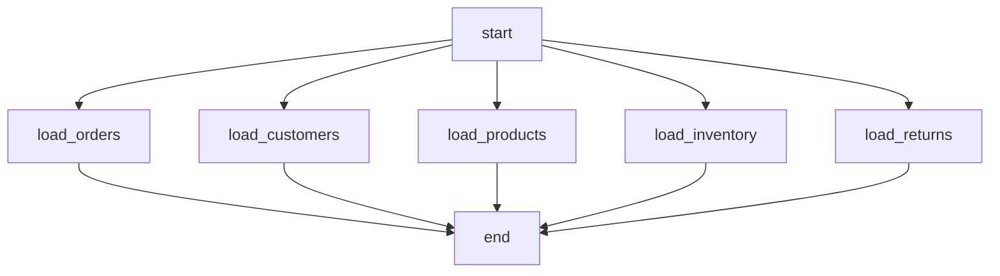

# Airflow Dynamic DAGs — Fundamentals


## 🎯 Analogy

Think of dynamic DAGs like a template letter with mail-merge: one template, many instantiated DAGs — one per customer, per region, or per config entry.

---
## What Are Dynamic DAGs?

A **dynamic DAG** is one where the tasks — their number, names, or configuration — are determined at runtime based on external data, rather than being hardcoded at write time.

**Analogy:** A static DAG is like a printed train schedule — fixed routes, fixed stops, printed in advance. A dynamic DAG is like a ride-sharing dispatch system — it generates the routes based on what passengers (data) show up.

**Two approaches:**

| Approach | How Tasks Are Generated | When Structure Is Known |
|----------|------------------------|------------------------|
| **Loop-based generation** | Python loop at DAG parse time | At DAG parse time (static count from config) |
| **Dynamic Task Mapping** | Airflow 2.3+ `expand()` API | At task runtime (count from upstream output) |

---

## Approach 1: Generating Tasks in a Loop

The simplest approach: iterate over a list at DAG file parse time and create one task per item.

```python
from airflow import DAG
from airflow.operators.python import PythonOperator
from airflow.operators.empty import EmptyOperator
from datetime import datetime

# Config defined in the DAG file (simple case)
TABLES = ['orders', 'customers', 'products', 'inventory', 'returns']

def load_table(table_name: str, **context):
    print(f"Loading table: {table_name} for {context['ds']}")

with DAG(
    dag_id='load_all_tables',
    start_date=datetime(2024, 1, 1),
    schedule_interval='@daily',
    catchup=False,
) as dag:

    start = EmptyOperator(task_id='start')
    end = EmptyOperator(task_id='end')

    load_tasks = []

    for table in TABLES:
        task = PythonOperator(
            task_id=f'load_{table}',          # unique task_id per iteration
            python_callable=load_table,
            op_kwargs={'table_name': table},   # pass table name as argument
        )
        load_tasks.append(task)

    # All loads run in parallel after start, end waits for all
    start >> load_tasks >> end
```



**What this generates:** 5 tasks with IDs `load_orders`, `load_customers`, etc. If you add a table to `TABLES`, a new task appears in the next DAG parse. The DAG structure is generated at parse time.

---

## Approach 2: Config-Driven DAGs

Instead of hardcoding the list in the DAG file, read it from an external source:

### From a JSON/YAML File

```python
import json
import yaml
from pathlib import Path

# Load from JSON config file
config_path = Path('/opt/airflow/dags/config/tables.json')
with open(config_path) as f:
    config = json.load(f)

TABLES = config['tables']

# Or from YAML
with open('/opt/airflow/dags/config/pipeline.yaml') as f:
    config = yaml.safe_load(f)
TABLES = config['tables']
```

```json
// config/tables.json
{
  "tables": [
    {"name": "orders", "priority": "high", "schedule": "hourly"},
    {"name": "customers", "priority": "medium", "schedule": "daily"},
    {"name": "products", "priority": "low", "schedule": "weekly"}
  ]
}
```

```python
with DAG('config_driven_etl', start_date=datetime(2024, 1, 1), catchup=False) as dag:

    for table_config in config['tables']:
        PythonOperator(
            task_id=f"load_{table_config['name']}",
            python_callable=load_table,
            op_kwargs={
                'table_name': table_config['name'],
                'priority': table_config['priority'],
            },
            pool=f"{table_config['priority']}_priority_pool",
        )
```

### From Airflow Variables

```python
from airflow.models import Variable
import json

# Set via: airflow variables set tables_config '["orders","customers","products"]'
tables_json = Variable.get('tables_config', default_var='["orders"]')
TABLES = json.loads(tables_json)
```

> **Caution:** Reading from Airflow Variables at DAG parse time creates a database call on every parse cycle (every 30 seconds by default). This can slow down the scheduler under heavy load. Cache the variable or use a file-based config for better parse performance.

---

## Approach 3: Dynamic Task Mapping (Airflow 2.3+)

The modern approach — tasks are generated based on the **output of an upstream task**, evaluated at runtime. The number of mapped tasks is not known at DAG parse time.

```python
from airflow import DAG
from airflow.operators.python import PythonOperator
from datetime import datetime

def get_tables_to_process(**context) -> list[str]:
    """Returns list of tables that have new data today."""
    # This runs at task runtime, not DAG parse time
    new_data_tables = query_metadata_for_changed_tables(context['ds'])
    return new_data_tables  # e.g., ['orders', 'customers'] (varies by day)

def process_table(table_name: str, **context):
    print(f"Processing: {table_name}")

with DAG('dynamic_task_mapping', start_date=datetime(2024, 1, 1), catchup=False) as dag:

    # Step 1: Determine what to process (returns a list)
    get_tables = PythonOperator(
        task_id='get_tables_to_process',
        python_callable=get_tables_to_process,
    )

    # Step 2: Create one task instance per item in the list
    process = PythonOperator.partial(
        task_id='process_table',
        python_callable=process_table,
    ).expand(
        op_kwargs=get_tables.output.map(lambda t: {'table_name': t})
    )

    get_tables >> process
```

**What makes this different:**
- The list of tables is determined by `get_tables` at runtime
- On day 1: `['orders', 'customers']` → 2 mapped instances
- On day 2: `['orders', 'products', 'returns']` → 3 mapped instances
- The DAG handles varying workloads without code changes

---

## Risks and Pitfalls of Dynamic DAGs

### 1. DAG Parse Time Performance

Every time the Airflow scheduler parses a DAG file, it executes the Python code. If your dynamic DAG reads from a database or makes API calls, this happens frequently.

```python
# BAD: DB call on every parse cycle (~every 30 seconds)
tables = fetch_tables_from_database()  # Top-level code in DAG file!

# GOOD: Read from a file (fast filesystem read)
with open('/opt/airflow/dags/config/tables.json') as f:
    tables = json.load(f)

# ACCEPTABLE: Airflow Variables (cached by scheduler after first read)
tables = Variable.get('tables_list', deserialize_json=True)
```

### 2. Task ID Uniqueness

Every task within a DAG must have a unique `task_id`. When generating tasks in a loop, ensure uniqueness:

```python
# GOOD: unique task IDs
for table in tables:
    PythonOperator(task_id=f'load_{table}', ...)

# BAD: non-unique IDs — Airflow will raise an error
for table in tables:
    PythonOperator(task_id='load_table', ...)  # duplicate!
```

### 3. Too Many Tasks

Generating hundreds or thousands of tasks degrades scheduler performance and makes the UI unusable.

```python
# RISKY: generating 1000 tasks
for i in range(1000):
    PythonOperator(task_id=f'process_{i}', ...)

# BETTER: batch tasks or use dynamic task mapping with max_map_length limit
```

**Rule of thumb:** Keep task count per DAG under 250 for good scheduler performance. Use dynamic task mapping's `max_map_length` to limit mapped task instances.

### 4. DAG ID Stability

If the DAG ID itself is generated dynamically, it can change between deploys, causing orphaned DAG runs in the metadata database.

```python
# RISKY: dynamic DAG ID
dag_id = f'etl_{datetime.now().strftime("%Y%m")}'  # changes every month!

# STABLE: fixed DAG ID
dag_id = 'monthly_etl'  # always the same
```

---

## When to Use Each Approach

| Situation | Recommended Approach |
|-----------|---------------------|
| Fixed list of similar tasks | Loop-based generation |
| Config changes infrequently | File-based config + loop |
| Config changes frequently | Airflow Variables + loop |
| Task count depends on upstream data | Dynamic Task Mapping |
| Processing same operation on N items | Dynamic Task Mapping with `expand()` |
| < 50 tasks expected | Any approach |
| 50–250 tasks | Dynamic Task Mapping (more efficient in UI) |
| > 250 tasks | Reconsider the approach; batch tasks |

---

## Common Patterns

### Pattern: One Task Per Table

```python
TABLES = ['orders', 'customers', 'products']

for table in TABLES:
    PythonOperator(
        task_id=f'validate_{table}',
        python_callable=validate_table,
        op_kwargs={'table': table},
    )
```

### Pattern: Sequential Per Table

```python
for table in TABLES:
    extract = PythonOperator(task_id=f'extract_{table}', ...)
    load = PythonOperator(task_id=f'load_{table}', ...)
    extract >> load  # sequential within each table
    # tables process in parallel with each other
```

### Pattern: Chain Across Tables

```python
prev_task = start
for table in TABLES:
    task = PythonOperator(task_id=f'process_{table}', ...)
    prev_task >> task
    prev_task = task
# results in: start → table1 → table2 → table3 (sequential)
```

---


## ▶️ Try It Yourself

```python
from airflow import DAG
from airflow.operators.python import PythonOperator
from datetime import datetime

# Generate one DAG per region dynamically
for region in ["us", "eu", "apac"]:
    with DAG(
        dag_id=f"etl_{region}",
        start_date=datetime(2024, 1, 1),
        schedule="@daily",
        catchup=False,
        tags=[region],
    ) as dag:
        PythonOperator(
            task_id="process",
            python_callable=lambda r=region: print(f"Processing {r}")
        )
    globals()[f"etl_{region}"] = dag  # Register in Airflow
```

> **Run it:** Copy the snippet into a REPL or file and run it — no external services needed for the basic example.

---
## Interview Tips

> **Tip 1:** "What's the difference between a loop-based dynamic DAG and dynamic task mapping?" — "Loop-based: tasks are generated at DAG parse time from a static source (config file, list). The structure is fixed once parsed. Dynamic task mapping (Airflow 2.3+): the number of task instances is determined at runtime from an upstream task's output. Use mapping when you don't know how many tasks you'll need until the pipeline starts running."

> **Tip 2:** "What's the main risk of reading from a database in a DAG file?" — "DAG files are parsed frequently — every 30 seconds by default. Any top-level code (outside of task functions) runs on every parse cycle. A database call at parse time means potentially thousands of queries per day, which can slow down the scheduler and even crash the metadata DB under load. Always read config from files or use Airflow Variables, which are cached."

> **Tip 3:** "How many tasks should a single DAG have?" — "There's no hard limit, but I try to keep it under 250 tasks for good UI and scheduler performance. Beyond that, the graph view becomes unusable and scheduler latency increases. For operations over many items (hundreds of tables, thousands of files), I'd use dynamic task mapping with `max_map_length` limits, or batch the work into fewer tasks that each handle multiple items."
