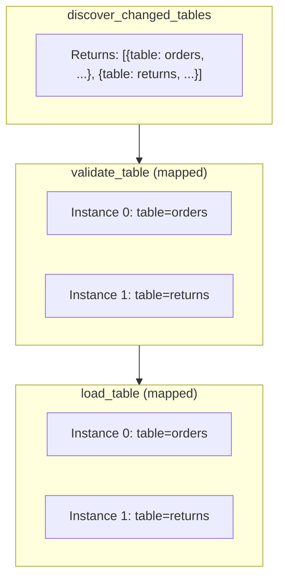

# Airflow Dynamic DAGs — Intermediate

## TaskGroup for Organizing Dynamic Tasks

When you generate many dynamic tasks, grouping them with `TaskGroup` keeps the DAG Graph view readable and allows you to collapse groups.

```python
from airflow import DAG
from airflow.operators.python import PythonOperator
from airflow.operators.empty import EmptyOperator
from airflow.utils.task_group import TaskGroup
from datetime import datetime

DOMAINS = {
    'sales': ['orders', 'returns', 'refunds'],
    'marketing': ['campaigns', 'leads', 'conversions'],
    'finance': ['invoices', 'payments', 'ledger'],
}

with DAG('grouped_dynamic_dag', start_date=datetime(2024, 1, 1), catchup=False) as dag:

    start = EmptyOperator(task_id='start')
    end = EmptyOperator(task_id='end')

    domain_groups = []

    for domain, tables in DOMAINS.items():

        # TaskGroup for each domain
        with TaskGroup(group_id=domain, tooltip=f'{domain} tables ETL') as domain_group:

            load_tasks = []
            for table in tables:
                task = PythonOperator(
                    task_id=f'load_{table}',    # unique within group; full ID: domain.load_table
                    python_callable=load_table_fn,
                    op_kwargs={'table': table, 'domain': domain},
                )
                load_tasks.append(task)

            # Within each domain: all tables in parallel (default)
            # Or make them sequential:
            # for i in range(1, len(load_tasks)):
            #     load_tasks[i-1] >> load_tasks[i]

        domain_groups.append(domain_group)

    # All domain groups run in parallel
    start >> domain_groups >> end
```

**Task ID naming:** Inside a TaskGroup, task IDs are prefixed: `sales.load_orders`, `marketing.load_campaigns`. This prevents name collisions between groups.

---

## The expand() / partial() API (Airflow 2.3+)

The core of dynamic task mapping. Two methods work together:

- `partial()`: Sets arguments that are the SAME for all mapped instances
- `expand()`: Sets the argument that VARIES per mapped instance (the list to iterate over)

```python
from airflow import DAG
from airflow.operators.python import PythonOperator
from datetime import datetime

def process_table(table_name: str, schema: str, dry_run: bool, **context) -> dict:
    print(f"Processing {schema}.{table_name} (dry_run={dry_run})")
    return {'table': table_name, 'rows': 1000}

with DAG('expand_partial_demo', start_date=datetime(2024, 1, 1), catchup=False) as dag:

    # partial() sets shared args; expand() provides the varying arg
    process = PythonOperator.partial(
        task_id='process_table',
        python_callable=process_table,
        op_kwargs={
            'schema': 'public',     # same for all instances
            'dry_run': False,       # same for all instances
        },
    ).expand(
        op_kwargs=[
            {'table_name': 'orders'},      # instance 0
            {'table_name': 'customers'},   # instance 1
            {'table_name': 'products'},    # instance 2
        ]
    )
```

> **Merging op_kwargs:** When using both `partial(op_kwargs={...})` and `expand(op_kwargs=[...])`, the expanded kwargs are **merged** with the partial kwargs. Each instance gets both `schema`/`dry_run` from partial AND `table_name` from expand.

---

## Cross-Product Mapping (expand_kwargs)

Map over multiple independent lists, generating a task for each combination:

```python
from airflow.operators.python import PythonOperator

def run_report(region: str, product_line: str, **context):
    print(f"Report for {region} / {product_line}")

# Creates 3 × 4 = 12 task instances
report = PythonOperator.partial(
    task_id='generate_report',
    python_callable=run_report,
).expand_kwargs([
    {'region': r, 'product_line': p}
    for r in ['US', 'EU', 'APAC']
    for p in ['electronics', 'clothing', 'food', 'automotive']
])
```

Alternatively, use `expand()` with multiple keyword arguments (Airflow 2.5+):

```python
# expand() with multiple args = cross-product
report = PythonOperator.partial(
    task_id='generate_report',
    python_callable=run_report,
).expand(
    op_kwargs=XComArg(get_regions_task).zip(XComArg(get_products_task))
)
```

---

## Dynamic Task Mapping with XCom Output

The most powerful pattern: upstream task returns a list, downstream generates one task per item.

```python
from airflow import DAG
from airflow.operators.python import PythonOperator
from airflow.utils.task_group import TaskGroup
from datetime import datetime

def discover_changed_tables(**context) -> list[dict]:
    """Query metadata store to find tables with new data since last run."""
    # Returns a list of dicts — one per table needing processing
    return [
        {'table': 'orders', 'partition': '2024-01-15', 'row_count': 50000},
        {'table': 'returns', 'partition': '2024-01-15', 'row_count': 3000},
        # ... varies by day
    ]

def validate_table(table: str, partition: str, row_count: int, **context) -> bool:
    """Validate a single table partition."""
    print(f"Validating {table}/{partition} ({row_count} rows)")
    return row_count > 0

def load_table(table: str, partition: str, **context):
    """Load a single validated table partition to warehouse."""
    print(f"Loading {table}/{partition}")

with DAG(
    dag_id='incremental_etl',
    start_date=datetime(2024, 1, 1),
    schedule_interval='@hourly',
    catchup=False,
) as dag:

    # Step 1: Discover what changed (returns a list)
    discover = PythonOperator(
        task_id='discover_changed_tables',
        python_callable=discover_changed_tables,
    )

    # Step 2: Validate each changed table (one task instance per table)
    validate = PythonOperator.partial(
        task_id='validate_table',
        python_callable=validate_table,
    ).expand(
        op_kwargs=discover.output  # XCom from discover task
        # discover.output is the list of dicts returned by discover_changed_tables
    )

    # Step 3: Load each validated table (one task instance per table)
    load = PythonOperator.partial(
        task_id='load_table',
        python_callable=load_table,
    ).expand(
        op_kwargs=discover.output  # same XCom — parallel pipeline per table
    )

    discover >> validate >> load
```

### How XCom Output Flows



---

## Limiting Parallelism on Mapped Tasks

By default, all mapped task instances can run simultaneously. Use `max_active_tis_per_dag` to limit:

```python
from airflow import DAG
from airflow.operators.python import PythonOperator

def process_partition(table: str, **context):
    pass

with DAG('limited_mapping', start_date=datetime(2024, 1, 1), catchup=False) as dag:

    get_partitions = PythonOperator(
        task_id='get_partitions',
        python_callable=lambda: [f'p{i}' for i in range(100)],
    )

    # Without limit: up to 100 tasks run simultaneously
    # With limit: at most 10 run at a time within this DAG
    process = PythonOperator.partial(
        task_id='process_partition',
        python_callable=process_partition,
        max_active_tis_per_dag=10,    # limit concurrent mapped instances for this task
    ).expand(
        op_kwargs=get_partitions.output.map(lambda p: {'table': p})
    )

    get_partitions >> process
```

**Also use a pool for cross-DAG concurrency control:**

```python
process = PythonOperator.partial(
    task_id='process_partition',
    python_callable=process_partition,
    max_active_tis_per_dag=10,    # within-DAG limit
    pool='snowflake_pool',        # cross-DAG limit
    pool_slots=1,
).expand(op_kwargs=get_partitions.output.map(lambda p: {'table': p}))
```

---

## Mapping with Transformation (map())

XCom outputs can be transformed before being passed to expand:

```python
def get_s3_files(**context) -> list[str]:
    """Return list of S3 URIs to process."""
    return [
        's3://bucket/data/file_001.parquet',
        's3://bucket/data/file_002.parquet',
        's3://bucket/data/file_003.parquet',
    ]

def process_file(bucket: str, key: str, **context):
    print(f"Processing s3://{bucket}/{key}")

with DAG('file_processing', start_date=datetime(2024, 1, 1), catchup=False) as dag:

    list_files = PythonOperator(
        task_id='list_s3_files',
        python_callable=get_s3_files,
    )

    # Transform: split URI into bucket + key components
    def parse_uri(uri: str) -> dict:
        parts = uri.replace('s3://', '').split('/', 1)
        return {'bucket': parts[0], 'key': parts[1]}

    process = PythonOperator.partial(
        task_id='process_file',
        python_callable=process_file,
    ).expand(
        op_kwargs=list_files.output.map(parse_uri)  # transform each item before expand
    )

    list_files >> process
```

---

## TaskGroup Inside Dynamic Loops

Combine TaskGroups with loops for structured grouped processing:

```python
PIPELINES = ['sales', 'marketing', 'ops']
STAGES = ['extract', 'transform', 'load']

with DAG('structured_dynamic', start_date=datetime(2024, 1, 1), catchup=False) as dag:

    all_pipeline_groups = []

    for pipeline in PIPELINES:
        with TaskGroup(group_id=f'pipeline_{pipeline}') as pipeline_group:

            prev_stage = None
            for stage in STAGES:
                stage_task = PythonOperator(
                    task_id=f'{stage}',           # full ID: pipeline_sales.extract
                    python_callable=run_stage,
                    op_kwargs={'pipeline': pipeline, 'stage': stage},
                )
                if prev_stage:
                    prev_stage >> stage_task      # sequential within pipeline
                prev_stage = stage_task

        all_pipeline_groups.append(pipeline_group)

    # All pipelines run in parallel
    all_pipeline_groups
```

---

## Interview Tips

> **Tip 1:** "Explain `partial()` and `expand()` in dynamic task mapping." — "`partial()` sets the static arguments shared across all mapped instances — things like the function reference, pool, retries. `expand()` provides the list to map over — each item in the list creates one task instance. The framework merges partial and expand kwargs before passing them to each instance."

> **Tip 2:** "How do you limit concurrency for mapped tasks?" — "Two mechanisms: `max_active_tis_per_dag` on the task limits how many mapped instances of that specific task run simultaneously within the DAG. A pool (via `pool='my_pool'`) limits concurrency across the whole Airflow instance. Use both together: `max_active_tis_per_dag` for local control, pool for cross-DAG resource protection."

> **Tip 3:** "How does XCom work with dynamic task mapping?" — "When an upstream task returns a list, dynamic task mapping treats each item as a separate mapped instance's input. The XCom key is `return_value`, and Airflow's `expand()` knows to iterate over it. The downstream task receives one item per instance, not the whole list. For complex transformations, use `.map(fn)` on the XCom reference to transform each item before expand."
