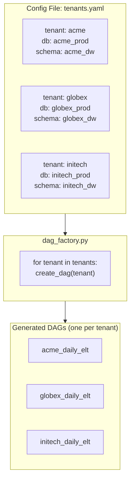

# Airflow Dynamic DAGs — Real-World Scenarios

## Scenario 1: Config-File-Driven Multi-Tenant ELT

### Context

A data platform team supports 15 client tenants, each requiring a daily ELT pipeline that extracts from their source databases, transforms with a standard set of SQL models, and loads to their isolated Snowflake schema. Tenant onboarding happens monthly. Instead of writing a new DAG per tenant, the team uses a single config-driven DAG factory.

### Architecture



### Implementation

```yaml
# dags/config/tenants.yaml
tenants:
  - id: acme
    display_name: "ACME Corp"
    source_db: acme_production
    source_schema: public
    target_schema: acme_dw
    schedule: "0 5 * * *"    # 5 AM UTC
    sla_hours: 3
    tables:
      - orders
      - customers
      - products
    enabled: true

  - id: globex
    display_name: "Globex Inc"
    source_db: globex_production
    source_schema: app_data
    target_schema: globex_dw
    schedule: "0 6 * * *"    # 6 AM UTC
    sla_hours: 2
    tables:
      - transactions
      - accounts
      - users
    enabled: true

  - id: initech
    display_name: "Initech LLC"
    source_db: initech_production
    source_schema: public
    target_schema: initech_dw
    schedule: "0 7 * * *"    # 7 AM UTC
    sla_hours: 4
    tables:
      - sales
      - inventory
    enabled: false   # onboarding in progress — not yet scheduled
```

```python
# dags/tenant_elt_factory.py
import yaml
from pathlib import Path
from datetime import datetime, timedelta
from airflow import DAG
from airflow.operators.python import PythonOperator
from airflow.operators.empty import EmptyOperator
from airflow.utils.task_group import TaskGroup

# Load config at parse time — YAML file read is fast
CONFIG_PATH = Path('/opt/airflow/dags/config/tenants.yaml')
with open(CONFIG_PATH) as f:
    tenant_config = yaml.safe_load(f)

def extract_table(tenant_id: str, source_db: str, source_schema: str,
                  table: str, **context) -> dict:
    """Extract a single table from tenant's source database."""
    print(f"Extracting {source_schema}.{table} from {source_db} for {tenant_id}")
    # Implementation: use postgres hook with tenant-specific connection
    return {'tenant': tenant_id, 'table': table, 'rows_extracted': 5000}

def load_to_warehouse(tenant_id: str, target_schema: str,
                      table: str, **context):
    """Load extracted data to tenant's Snowflake schema."""
    print(f"Loading {table} to {target_schema} for {tenant_id}")

def run_data_quality_checks(tenant_id: str, target_schema: str, **context):
    """Run DQ checks after all tables loaded."""
    print(f"Running DQ checks for {tenant_id}")

def send_completion_notification(tenant_id: str, display_name: str, **context):
    """Notify tenant's data contact that pipeline completed."""
    print(f"Notifying {display_name} ({tenant_id}) of pipeline completion")

def create_tenant_dag(tenant: dict) -> DAG:
    """Factory function that creates a fully configured DAG for one tenant."""

    default_args = {
        'owner': f"data-platform/{tenant['id']}",
        'retries': 2,
        'retry_delay': timedelta(minutes=5),
        'email_on_failure': True,
    }

    dag = DAG(
        dag_id=f"{tenant['id']}_daily_elt",
        default_args=default_args,
        description=f"Daily ELT pipeline for {tenant['display_name']}",
        start_date=datetime(2024, 1, 1),
        schedule_interval=tenant['schedule'],
        catchup=False,
        max_active_runs=1,
        dagrun_timeout=timedelta(hours=tenant['sla_hours'] + 1),
        tags=['tenant-elt', tenant['id'], 'automated'],
    )

    with dag:
        start = EmptyOperator(task_id='start')
        end = EmptyOperator(task_id='end')

        # TaskGroup for extraction — all tables in parallel
        with TaskGroup('extraction', tooltip='Parallel table extraction') as extraction_group:
            extract_tasks = []
            for table in tenant['tables']:
                task = PythonOperator(
                    task_id=f'extract_{table}',
                    python_callable=extract_table,
                    op_kwargs={
                        'tenant_id': tenant['id'],
                        'source_db': tenant['source_db'],
                        'source_schema': tenant['source_schema'],
                        'table': table,
                    },
                    pool='source_db_pool',          # shared pool for all source DB connections
                    pool_slots=1,
                )
                extract_tasks.append(task)

        # TaskGroup for loading
        with TaskGroup('loading', tooltip='Parallel table loading') as loading_group:
            load_tasks = []
            for table in tenant['tables']:
                task = PythonOperator(
                    task_id=f'load_{table}',
                    python_callable=load_to_warehouse,
                    op_kwargs={
                        'tenant_id': tenant['id'],
                        'target_schema': tenant['target_schema'],
                        'table': table,
                    },
                    pool='snowflake_pool',
                )
                load_tasks.append(task)

        dq_checks = PythonOperator(
            task_id='data_quality_checks',
            python_callable=run_data_quality_checks,
            op_kwargs={
                'tenant_id': tenant['id'],
                'target_schema': tenant['target_schema'],
            },
            sla=timedelta(hours=tenant['sla_hours']),
        )

        notify = PythonOperator(
            task_id='notify_completion',
            python_callable=send_completion_notification,
            op_kwargs={
                'tenant_id': tenant['id'],
                'display_name': tenant['display_name'],
            },
        )

        start >> extraction_group >> loading_group >> dq_checks >> notify >> end

    return dag

# Register all enabled tenant DAGs into the global namespace
# Airflow discovers DAGs by scanning for DAG objects in the module's global scope
for tenant in tenant_config['tenants']:
    if tenant['enabled']:
        dag_obj = create_tenant_dag(tenant)
        globals()[dag_obj.dag_id] = dag_obj  # register in module globals
```

**Adding a new tenant:** Add an entry to `tenants.yaml` with `enabled: true` and deploy the config file. No DAG code changes needed. The factory generates the new DAG on next parse.

---

## Scenario 2: Dynamic Task Mapping for Parallel dbt Model Runs

### Context

A dbt project with 80 models across 4 domains (sales, marketing, finance, ops). Historically, a single `dbt run` ran all models sequentially. The team wants to parallelize by domain while respecting dbt's inter-model dependencies.

### Solution: Domain-Partitioned dbt Runs with Dynamic Mapping

```python
# dags/dbt_parallel_pipeline.py
from airflow import DAG
from airflow.operators.python import PythonOperator
from airflow.operators.bash import BashOperator
from airflow.operators.empty import EmptyOperator
from airflow.utils.task_group import TaskGroup
from datetime import datetime, timedelta
import subprocess
import json

def get_dbt_manifest() -> dict:
    """Parse dbt manifest.json to get model metadata."""
    with open('/opt/airflow/dbt_project/target/manifest.json') as f:
        return json.load(f)

def discover_models_by_domain(**context) -> list[dict]:
    """
    Return list of domain configs for dynamic task mapping.
    Each domain is run independently.
    """
    manifest = get_dbt_manifest()

    domains = {}
    for node_name, node in manifest['nodes'].items():
        if node['resource_type'] != 'model':
            continue

        # Extract domain from model path (e.g., models/sales/orders.sql → sales)
        path_parts = node['original_file_path'].split('/')
        domain = path_parts[1] if len(path_parts) > 1 else 'other'

        if domain not in domains:
            domains[domain] = []
        domains[domain].append(node_name.split('.')[-1])  # just model name

    return [
        {'domain': domain, 'models': models}
        for domain, models in domains.items()
    ]

def run_dbt_domain(domain: str, models: list[str], **context) -> dict:
    """
    Run dbt for all models in a domain.
    Uses dbt's --select to target specific models.
    """
    ds = context['ds']
    model_selector = ' '.join(models)

    cmd = [
        'dbt', 'run',
        '--target', 'prod',
        '--select', model_selector,
        '--vars', f'{{execution_date: {ds}}}',
    ]

    print(f"Running dbt for domain '{domain}': {' '.join(cmd)}")
    result = subprocess.run(cmd, capture_output=True, text=True,
                           cwd='/opt/airflow/dbt_project')

    if result.returncode != 0:
        raise RuntimeError(f"dbt failed for domain {domain}:\n{result.stderr}")

    return {
        'domain': domain,
        'models_run': len(models),
        'status': 'success',
    }

def run_dbt_tests(domain: str, models: list[str], **context):
    """Run dbt tests for a specific domain's models."""
    model_selector = ' '.join(models)
    result = subprocess.run(
        ['dbt', 'test', '--select', model_selector],
        capture_output=True, text=True, cwd='/opt/airflow/dbt_project'
    )
    if result.returncode != 0:
        raise RuntimeError(f"dbt tests failed for {domain}:\n{result.stderr}")

with DAG(
    dag_id='dbt_parallel_by_domain',
    start_date=datetime(2024, 1, 1),
    schedule_interval='0 8 * * *',
    catchup=False,
    max_active_runs=1,
    tags=['dbt', 'transformation', 'parallel'],
) as dag:

    # Step 1: Compile dbt project and discover domains
    compile_dbt = BashOperator(
        task_id='compile_dbt',
        bash_command='cd /opt/airflow/dbt_project && dbt compile --target prod',
    )

    # Step 2: Discover which models belong to which domain
    discover = PythonOperator(
        task_id='discover_domains',
        python_callable=discover_models_by_domain,
    )

    # Step 3: Run each domain in parallel (dynamic task mapping)
    run_domain = PythonOperator.partial(
        task_id='run_dbt_domain',
        python_callable=run_dbt_domain,
        pool='dbt_pool',
        pool_slots=1,
        max_active_tis_per_dag=4,   # max 4 domains run simultaneously
        execution_timeout=timedelta(hours=1),
    ).expand(
        op_kwargs=discover.output   # one task instance per domain dict
    )

    # Step 4: Test each domain in parallel
    test_domain = PythonOperator.partial(
        task_id='test_dbt_domain',
        python_callable=run_dbt_tests,
        pool='dbt_pool',
        pool_slots=1,
        max_active_tis_per_dag=4,
    ).expand(
        op_kwargs=discover.output
    )

    # Step 5: Refresh BI layer after all domains complete
    refresh_bi = BashOperator(
        task_id='refresh_metabase',
        bash_command='python /scripts/refresh_metabase_models.py',
    )

    compile_dbt >> discover >> run_domain >> test_domain >> refresh_bi
```

**Result:** 80 models previously ran in ~45 minutes sequentially. With domain-based parallelism (4 domains in parallel), total runtime dropped to ~12 minutes.

---

## Scenario 3: Generating One DAG Per Database Table from a Config

### Context

An analytics team has 50 source tables. Each table requires: (a) incremental extraction, (b) schema validation, (c) transformation, (d) load to warehouse. The tables have different schedules, incremental keys, and transformation logic. The team wants one DAG per table for isolated monitoring, retry, and SLA tracking.

### Implementation: DAG-per-Table Factory

```python
# dags/table_dag_factory.py
import json
from pathlib import Path
from datetime import datetime, timedelta
from airflow import DAG
from airflow.operators.python import PythonOperator

# Fast file read at parse time
TABLE_CONFIGS_PATH = Path('/opt/airflow/dags/config/table_configs.json')
with open(TABLE_CONFIGS_PATH) as f:
    TABLE_CONFIGS = json.load(f)

def make_extract_fn(table_config: dict):
    """Create a closure that captures the table config."""
    def extract(**context):
        incremental_key = table_config['incremental_key']
        ds = context['ds']
        print(f"Extracting {table_config['table_name']} WHERE {incremental_key} >= {ds}")
    return extract

def make_validate_fn(table_config: dict):
    def validate(**context):
        required_cols = table_config.get('required_columns', [])
        print(f"Validating schema: columns {required_cols} must exist")
    return validate

def make_transform_fn(table_config: dict):
    def transform(**context):
        transform_sql = table_config.get('transform_sql', 'SELECT * FROM staging')
        print(f"Applying transform: {transform_sql[:50]}...")
    return transform

def create_table_dag(table_config: dict) -> DAG:
    table_name = table_config['table_name']
    dag_id = f"table__{table_name}"  # double underscore for namespace clarity

    dag = DAG(
        dag_id=dag_id,
        start_date=datetime(2024, 1, 1),
        schedule_interval=table_config.get('schedule', '@daily'),
        catchup=False,
        max_active_runs=1,
        tags=['table-factory', table_name, table_config.get('domain', 'unknown')],
        default_args={
            'retries': table_config.get('retries', 2),
            'retry_delay': timedelta(minutes=5),
        },
    )

    with dag:
        extract = PythonOperator(
            task_id='extract',
            python_callable=make_extract_fn(table_config),
            pool='source_pool',
        )
        validate = PythonOperator(
            task_id='validate_schema',
            python_callable=make_validate_fn(table_config),
        )
        transform = PythonOperator(
            task_id='transform',
            python_callable=make_transform_fn(table_config),
            pool='compute_pool',
        )
        load = PythonOperator(
            task_id='load',
            python_callable=lambda **ctx: print(f"Loading {table_name} to warehouse"),
            pool='snowflake_pool',
        )

        extract >> validate >> transform >> load

    return dag

# Generate one DAG per table config
# Register each in globals() so Airflow's DagBag discovers them
for config in TABLE_CONFIGS:
    dag_instance = create_table_dag(config)
    globals()[dag_instance.dag_id] = dag_instance
```

```json
// config/table_configs.json (excerpt)
[
  {
    "table_name": "orders",
    "domain": "sales",
    "schedule": "0 * * * *",
    "incremental_key": "updated_at",
    "required_columns": ["order_id", "customer_id", "amount", "created_at"],
    "transform_sql": "SELECT *, amount * 1.1 as amount_with_tax FROM staging.orders",
    "retries": 3
  },
  {
    "table_name": "customers",
    "domain": "sales",
    "schedule": "@daily",
    "incremental_key": "updated_at",
    "required_columns": ["customer_id", "email", "country"],
    "transform_sql": "SELECT *, UPPER(country) as country_code FROM staging.customers",
    "retries": 2
  }
]
```

### Monitoring Pattern: DAG Group View

With 50 table DAGs, the Airflow UI can become cluttered. Use tags for filtering:
- Filter by `table-factory` → see all generated DAGs
- Filter by `sales` → see only sales-domain tables
- Each table DAG has isolated SLA tracking, retry configuration, and failure alerts

### Parse Performance

```python
# This factory creates 50 DAG objects per parse cycle
# Parse time scales linearly with table count
# At 50 tables with ~10ms per DAG setup:
#   50 × 10ms = 0.5 seconds per parse cycle — acceptable
# At 500 tables:
#   500 × 10ms = 5 seconds per parse — concerning
# At 5000 tables:
#   Use dynamic task mapping instead (2 tasks regardless of count)
```

**Rule:** DAG-per-entity factory is appropriate for < 200 entities. Beyond that, switch to a single DAG with dynamic task mapping.
