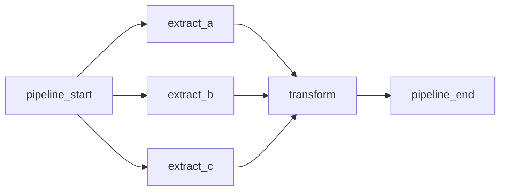
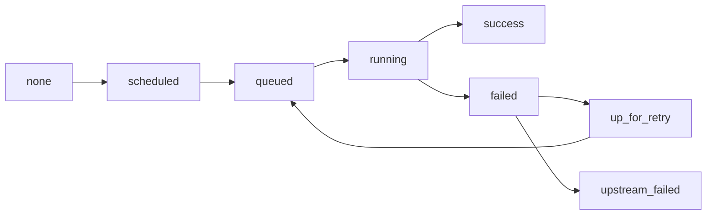

# Airflow Operators — Fundamentals


## 🎯 Analogy

Think of Airflow operators like power tools — each designed for a specific job. The PythonOperator is a swiss army knife, BashOperator is a terminal, and cloud operators (S3CopyOperator, BigQueryOperator) are purpose-built for their service.

---
## What Is an Operator?

An **operator** is a template that defines a single unit of work in a DAG. Each task in an Airflow DAG is an instance of an operator. The operator determines *what* that task does — run a Python function, execute a Bash command, submit a Spark job, query a database, etc.

> **Analogy:** If a DAG is a recipe, operators are the cooking techniques (sauté, bake, chop). You pick the right technique for each step, and Airflow applies it with your specific ingredients (arguments).

---

## The Three Categories of Operators

| Category | Purpose | Examples |
|----------|---------|---------|
| **Action Operators** | Execute something | `PythonOperator`, `BashOperator`, `SparkSubmitOperator` |
| **Transfer Operators** | Move data between systems | `S3ToRedshiftOperator`, `MySQLToGCSOperator` |
| **Sensor Operators** | Wait for a condition | `FileSensor`, `ExternalTaskSensor`, `HttpSensor` |

---

## PythonOperator — Most Common Operator

Runs any Python callable (function, lambda, class method).

```python
from airflow import DAG
from airflow.operators.python import PythonOperator
from datetime import datetime

def extract_sales(**context):
    """Pull yesterday's sales from the API."""
    execution_date = context['ds']          # e.g. '2024-03-15'
    print(f"Extracting sales for {execution_date}")
    # ... your actual logic here
    return {"rows_extracted": 15000}

def transform_sales(**context):
    """Clean and normalise sales data."""
    ti = context['ti']
    result = ti.xcom_pull(task_ids='extract_task')
    print(f"Transforming {result['rows_extracted']} rows")

with DAG(
    dag_id='sales_pipeline',
    start_date=datetime(2024, 1, 1),
    schedule='@daily',
    catchup=False,
) as dag:

    extract_task = PythonOperator(
        task_id='extract_task',
        python_callable=extract_sales,
    )

    transform_task = PythonOperator(
        task_id='transform_task',
        python_callable=transform_sales,
    )

    extract_task >> transform_task
```

**Key `PythonOperator` parameters:**

| Parameter | Description |
|-----------|-------------|
| `task_id` | Unique name within the DAG |
| `python_callable` | The function to run |
| `op_args` | Positional arguments to the function |
| `op_kwargs` | Keyword arguments to the function |
| `provide_context` | (Airflow 1.x) Pass context dict — automatic in Airflow 2.x if function uses `**context` |

---

## BashOperator — Run Shell Commands

```python
from airflow.operators.bash import BashOperator

run_dbt = BashOperator(
    task_id='run_dbt_models',
    bash_command='cd /opt/dbt && dbt run --profiles-dir /opt/dbt --models staging.*',
    env={'DBT_PROFILES_DIR': '/opt/dbt'},   # environment variables
    cwd='/opt/dbt',                          # working directory
)

check_file = BashOperator(
    task_id='check_file_exists',
    bash_command='test -f /data/input/{{ ds }}/orders.csv',
    # {{ ds }} is a Jinja template — resolves to the execution date
)
```

**Jinja templating in BashOperator:**
- `{{ ds }}` → `2024-03-15` (execution date as YYYY-MM-DD)
- `{{ ds_nodash }}` → `20240315`
- `{{ execution_date }}` → full datetime object
- `{{ params.my_param }}` → DAG-level parameter

---

## EmptyOperator — Structural Placeholder

Used to create logical grouping points, not to do work:

```python
from airflow.operators.empty import EmptyOperator

start = EmptyOperator(task_id='pipeline_start')
end   = EmptyOperator(task_id='pipeline_end')

start >> [extract_a, extract_b, extract_c]
[extract_a, extract_b, extract_c] >> transform
transform >> end
```



---

## Task Dependencies — Setting Execution Order

```python
# Method 1: Bitshift operators (most readable)
extract >> transform >> load >> notify

# Method 2: set_downstream / set_upstream
extract.set_downstream(transform)
transform.set_upstream(extract)

# Fan-out: one task feeds multiple parallel tasks
extract >> [transform_sales, transform_returns, transform_refunds]

# Fan-in: multiple tasks converge into one
[transform_sales, transform_returns] >> load

# Mix: complex DAG structure
start >> [extract_a, extract_b]
extract_a >> [transform_x, transform_y]
extract_b >> transform_z
[transform_x, transform_y, transform_z] >> load >> end
```

---

## Task Lifecycle States



| State | Meaning |
|-------|---------|
| `none` | Not yet scheduled |
| `scheduled` | Ready to run, waiting for a worker slot |
| `queued` | Picked up by executor, waiting for a worker |
| `running` | Currently executing |
| `success` | Completed without error |
| `failed` | Raised an exception |
| `up_for_retry` | Failed but retries remain |
| `upstream_failed` | A dependency failed, so this task is skipped |
| `skipped` | Task was intentionally skipped (e.g., branching) |

---

## Common Built-in Operators

```python
# EmailOperator — send notification
from airflow.operators.email import EmailOperator

notify = EmailOperator(
    task_id='send_success_email',
    to=['team@company.com'],
    subject='Pipeline {{ ds }} completed',
    html_content='<h3>Daily pipeline finished successfully.</h3>',
)

# BranchPythonOperator — conditional logic
from airflow.operators.python import BranchPythonOperator

def choose_branch(**context):
    if context['ds'] == '2024-01-01':
        return 'full_refresh_task'
    return 'incremental_task'

branch = BranchPythonOperator(
    task_id='choose_load_strategy',
    python_callable=choose_branch,
)

# TriggerDagRunOperator — trigger another DAG
from airflow.operators.trigger_dagrun import TriggerDagRunOperator

trigger_downstream = TriggerDagRunOperator(
    task_id='trigger_reporting_dag',
    trigger_dag_id='reporting_pipeline',
    wait_for_completion=True,
    poke_interval=60,
)
```

---

## op_args and op_kwargs

Pass static data into your Python function:

```python
def load_to_table(schema, table, truncate=False, **context):
    print(f"Loading to {schema}.{table}, truncate={truncate}")

load_task = PythonOperator(
    task_id='load_orders',
    python_callable=load_to_table,
    op_args=['warehouse', 'orders'],     # positional: schema, table
    op_kwargs={'truncate': True},        # keyword: truncate
)
```

---


## ▶️ Try It Yourself

```python
from airflow import DAG
from airflow.operators.python import PythonOperator
from airflow.operators.bash import BashOperator
from datetime import datetime

with DAG("operators_demo", start_date=datetime(2024,1,1), schedule=None, catchup=False) as dag:
    bash_task = BashOperator(task_id="check_disk", bash_command="df -h /tmp")
    python_task = PythonOperator(
        task_id="process",
        python_callable=lambda: print("Processing with Python")
    )
    bash_task >> python_task
```

> **Run it:** Copy the snippet into a REPL or file and run it — no external services needed for the basic example.

---
## Interview Tips

> **Tip 1:** "What's the difference between an operator and a task?" — An **operator** is the class/template (the definition). A **task** is an instance of an operator in a specific DAG (the execution). `PythonOperator` is the operator; `extract_task = PythonOperator(...)` is the task.

> **Tip 2:** Prefer `PythonOperator` for custom logic. For well-known systems (S3, BigQuery, Redshift, Snowflake), use the purpose-built provider operators from `apache-airflow-providers-*` packages — they handle connections, retries, and logging out of the box.

> **Tip 3:** Never put heavyweight computation inside the Airflow worker via `PythonOperator`. The operator should *trigger* the work (submit a Spark job, call an API, kick off a dbt run) and poll for completion — not run the ETL itself. Airflow is an orchestrator, not a compute engine.
