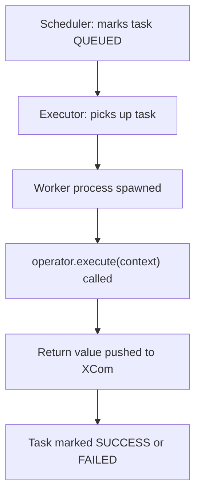

# Airflow Operators — Senior Deep Dive

## How Operators Execute — Internals

When the scheduler triggers a task, this is what happens:



1. **Scheduler** sets task state to `queued` in the metadata DB
2. **Executor** (CeleryExecutor, KubernetesExecutor, etc.) picks up the queued task
3. **Worker** spawns a new process and imports the DAG file
4. `operator.pre_execute(context)` → `operator.execute(context)` → `operator.post_execute(context)`
5. Return value from `execute()` is serialised and pushed to XCom
6. Task state updated to `success` or `failed`

**Critical implication:** Every task is a full Python process. Heavy imports (Spark, ML libraries) happen on every task invocation. Keep operator `__init__` lightweight — do expensive setup inside `execute()`.

---

## Deferrable Operators — Async Polling Without Holding a Worker

Traditional sensors and long-running operators hold a worker slot while polling. **Deferrable operators** suspend themselves and free the worker:

```python
from airflow.sensors.base import BaseSensorOperator
from airflow.triggers.base import BaseTrigger, TensorEventTrigger, TriggerEvent
from airflow.exceptions import TaskDeferred
import asyncio

class AsyncSnowflakeOperator(BaseOperator):
    """Submits a Snowflake query and defers until it completes."""

    def execute(self, context):
        query_id = self._submit_query()          # Submit async
        raise TaskDeferred(                      # Free the worker slot
            trigger=SnowflakeQueryTrigger(query_id=query_id),
            method_name='execute_complete',
        )

    def execute_complete(self, context, event=None):
        # Called when the trigger fires — worker is re-acquired only here
        if event['status'] == 'error':
            raise AirflowException(event['message'])
        return event['result']


class SnowflakeQueryTrigger(BaseTrigger):
    def __init__(self, query_id: str):
        super().__init__()
        self.query_id = query_id

    def serialize(self):
        return ('my_module.SnowflakeQueryTrigger', {'query_id': self.query_id})

    async def run(self):
        while True:
            status = await self._check_status_async(self.query_id)
            if status in ('SUCCESS', 'FAILED'):
                yield TriggerEvent({'status': status, 'query_id': self.query_id})
                return
            await asyncio.sleep(10)
```

**Why it matters at scale:**

| Pattern | Worker during polling |
|---------|----------------------|
| Traditional sensor (poke mode) | Held for full duration |
| Traditional sensor (reschedule mode) | Released between polls, re-acquired each poll |
| Deferrable operator | Released immediately, re-acquired only on completion |

With 500 long-running Snowflake queries, deferrable operators need just 1 triggerer process rather than 500 worker slots.

---

## Operator Templating — Deep Control

Every field listed in `template_fields` is Jinja-rendered before `execute()`:

```python
class MyOperator(BaseOperator):
    template_fields = ('sql', 's3_key', 'execution_date_str')
    template_ext = ('.sql',)   # files with this extension are also rendered

    def __init__(self, sql, s3_key, **kwargs):
        super().__init__(**kwargs)
        self.sql = sql
        self.s3_key = s3_key
        self.execution_date_str = '{{ ds }}'   # auto-rendered

    def execute(self, context):
        # By this point, self.sql and self.s3_key are already rendered
        print(self.sql)     # e.g. "SELECT * FROM orders WHERE dt = '2024-03-15'"
```

**Templating best practices:**

```python
# Use macros for date arithmetic
BashOperator(
    bash_command="echo {{ macros.ds_add(ds, -7) }}",  # 7 days ago
)

# Use params for DAG-level configuration
PythonOperator(
    python_callable=my_func,
    op_kwargs={'env': '{{ params.environment }}'},
    params={'environment': 'prod'},   # override at trigger time
)

# Template from file (useful for long SQL)
SnowflakeOperator(
    sql='sql/merge_orders.sql',   # rendered as Jinja template
    template_searchpath='/opt/airflow/dags/sql/',
)
```

---

## Operator Hooks — Reusable Connection Logic

Operators use **hooks** to manage connections to external systems. The hook handles auth, pooling, and retry logic:

```python
from airflow.hooks.base import BaseHook
from airflow.models import BaseOperator
import snowflake.connector

class SnowflakeHook(BaseHook):
    """Manages a Snowflake connection using Airflow's connection store."""

    def __init__(self, snowflake_conn_id='snowflake_default'):
        self.snowflake_conn_id = snowflake_conn_id

    def get_conn(self):
        conn = self.get_connection(self.snowflake_conn_id)
        return snowflake.connector.connect(
            user=conn.login,
            password=conn.password,
            account=conn.host,
            warehouse=conn.extra_dejson.get('warehouse'),
            database=conn.schema,
        )

    def run(self, sql, autocommit=True):
        with self.get_conn() as conn:
            with conn.cursor() as cursor:
                cursor.execute(sql)
                return cursor.fetchall()


class MySnowflakeOperator(BaseOperator):
    def __init__(self, sql, snowflake_conn_id='snowflake_default', **kwargs):
        super().__init__(**kwargs)
        self.sql = sql
        self.snowflake_conn_id = snowflake_conn_id

    def execute(self, context):
        hook = SnowflakeHook(self.snowflake_conn_id)
        return hook.run(self.sql)
```

**Pattern:** Operators are thin wrappers. Put all connection logic in a hook. This makes the hook independently testable and reusable across multiple operators.

---

## Operator Callbacks and SLAs

```python
def on_failure_alert(context):
    dag_id = context['dag'].dag_id
    task_id = context['task_instance'].task_id
    execution_date = context['execution_date']
    # Post to Slack, PagerDuty, etc.
    send_slack_alert(f"FAILED: {dag_id}.{task_id} for {execution_date}")

def on_sla_miss(dag, task_list, blocking_task_list, slas, blocking_tis):
    send_slack_alert(f"SLA MISSED: {dag.dag_id} — tasks: {task_list}")

with DAG(
    dag_id='critical_pipeline',
    sla_miss_callback=on_sla_miss,
    default_args={
        'on_failure_callback': on_failure_alert,
        'on_retry_callback': lambda ctx: log_retry(ctx),
    }
) as dag:

    critical_task = PythonOperator(
        task_id='load_to_warehouse',
        python_callable=load_fn,
        sla=timedelta(hours=2),   # Alert if task hasn't succeeded within 2h of DAG start
    )
```

---

## Testing Operators in Isolation

```python
import pytest
from unittest.mock import patch, MagicMock
from airflow.models import DagBag, TaskInstance
from airflow.utils.state import State
from datetime import datetime

def test_my_operator_execute():
    """Test that the operator calls the hook with correct SQL."""
    from my_operators import MySnowflakeOperator

    op = MySnowflakeOperator(
        task_id='test_task',
        sql='SELECT 1',
        snowflake_conn_id='test_conn',
    )

    with patch('my_operators.SnowflakeHook') as mock_hook_cls:
        mock_hook = MagicMock()
        mock_hook.run.return_value = [(1,)]
        mock_hook_cls.return_value = mock_hook

        result = op.execute(context={})

        mock_hook.run.assert_called_once_with('SELECT 1')
        assert result == [(1,)]


def test_dag_integrity():
    """Validate the DAG loads without import errors and has correct structure."""
    dagbag = DagBag(dag_folder='dags/', include_examples=False)
    assert 'my_dag' in dagbag.dags
    assert len(dagbag.import_errors) == 0
    dag = dagbag.dags['my_dag']
    assert dag.schedule_interval == '@daily'
```

---

## Interview Tips

> **Tip 1:** Understand deferrable operators deeply — they're the answer to "how do you scale Airflow to run thousands of concurrent long-running tasks without running out of worker slots." The triggerer process is a lightweight asyncio event loop separate from workers.

> **Tip 2:** Operators should be idempotent — running the same operator twice with the same context should produce the same result. This enables safe retries and backfills. If your operator can't be made idempotent (e.g., sending an email), wrap it in a guard: check if the action already happened before doing it again.

> **Tip 3:** The separation between Hook (connection/auth) and Operator (orchestration logic) is a core Airflow design principle. In interviews, describe this when asked "how do you build a custom operator" — it shows architectural thinking, not just coding.

## ⚡ Cheat Sheet

**Operator Execution Flow**
1. Scheduler: set state `queued` in metadata DB
2. Executor: pick up queued task
3. Worker: spawn process, import DAG file
4. `pre_execute()` → `execute()` → `post_execute()`
5. Return value serialized → XCom (key `return_value`)
6. State → `success` or `failed`
- Heavy imports (Spark, ML) happen on every task spawn → keep `__init__` lightweight

**Deferrable vs Traditional — Slots Comparison**
| Pattern | Slots During Wait |
|---|---|
| Standard operator | 1 slot held entire duration |
| Sensor poke mode | 1 slot held entire duration |
| Sensor reschedule | Released between polls |
| Deferrable operator | ~0 (re-acquired only at completion) |
- 500 concurrent Snowflake queries: deferrable → 1 triggerer process, not 500 worker slots

**`template_fields` — Must-Know Rule**
- Fields not listed → no Jinja rendering (silent fail, `{{ ds }}` stays as literal)
- `template_ext = ('.sql',)` → render file contents as Jinja template
- Always document which fields support templating in docstring

**Templating Gotchas**
```python
# Date arithmetic
BashOperator(bash_command="echo {{ macros.ds_add(ds, -7) }}")
# Params override at trigger time
PythonOperator(op_kwargs={'env': '{{ params.environment }}'}, params={'environment': 'prod'})
# SQL from file (Jinja-rendered)
SnowflakeOperator(sql='sql/merge.sql', template_searchpath='/dags/sql/')
```

**Hook + Operator Design Principle**
- Hook: all connection/auth/retry logic → independently testable
- Operator: thin wrapper calling hook → `hook = MyHook(conn_id); hook.run(sql)`
- Never put connection logic in `execute()` directly

**Callbacks and SLA**
```python
# Task-level callbacks
default_args = {'on_failure_callback': alert_fn, 'on_retry_callback': log_fn}
# DAG-level SLA
DAG(..., sla_miss_callback=on_sla_miss)
# Task-level SLA
PythonOperator(..., sla=timedelta(hours=2))  # alert if not done within 2h of DAG start
```

**Idempotency Rule for Operators**
- Same `context` (same `execution_date`) → same result regardless of how many times run
- For non-idempotent side effects (email, SMS): guard with `ti.xcom_pull()` check before acting
