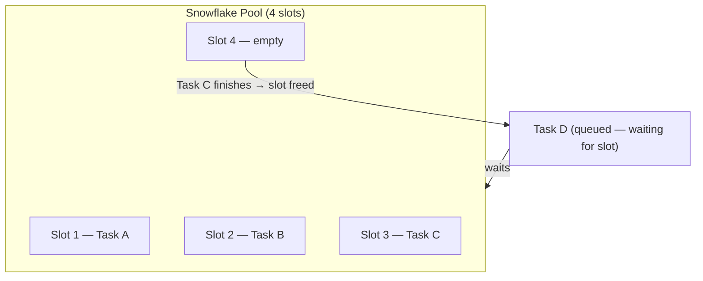
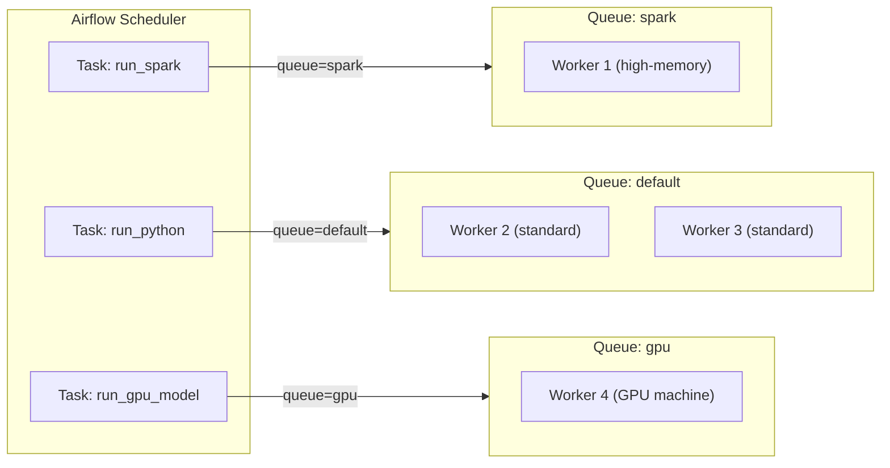

# Airflow Pools and Queues — Fundamentals

## The Problem: Unbounded Concurrency

Imagine 50 DAG tasks all running at the exact same moment — each opening a connection to your Snowflake warehouse, or hammering an external API with parallel requests. Without limits, you'll saturate your database connection pool, trigger rate-limit errors, or bring down a downstream service.

Airflow's **pools** and **queues** solve this problem by letting you control *how many tasks can run simultaneously* and *which workers are allowed to run which tasks*.

> **Key Insight:** Airflow's global `parallelism` setting caps total concurrent tasks across the entire cluster, but pools give you *fine-grained*, resource-specific concurrency limits. They're the circuit breakers for your pipelines.

---

## What Is a Pool?

A **pool** is a named bucket of **slots**. Each slot represents one unit of concurrency. When a task wants to run, it tries to acquire a slot from its assigned pool. If no slots are free, the task stays in the `queued` state until a slot opens.

**Analogy:** A pool is like a parking lot with a fixed number of spaces. If all spaces are full, cars (tasks) wait in a queue outside. When a car leaves, the next waiting car gets a space. You can have separate parking lots for different types of cars — one for delivery trucks (warehouse jobs), one for regular cars (API calls).



**What this shows:** Tasks A, B, and C currently hold slots. Task D is queued waiting. When any of the running tasks finishes and releases its slot, Task D acquires it and starts running.

---

## The Default Pool

Airflow ships with a built-in pool called `default_pool`. Every task that doesn't explicitly specify a pool gets its slot from `default_pool`.

- Default slot count: **128** (configurable)
- You can edit the default pool's slot count in the UI or via CLI
- You **cannot delete** the default pool

> **Gotcha:** If you reduce `default_pool` slots to 10 and have 50 tasks with no pool assigned, only 10 run at once. This is a blunt instrument — use named pools for precision.

---

## Creating Pools

### Via the Airflow UI

1. Go to **Admin → Pools**
2. Click **+** (Add Pool)
3. Enter a name (e.g., `snowflake_pool`), set slot count, add a description
4. Save

### Via the CLI

```bash
# Create a pool with 5 slots
airflow pools set snowflake_pool 5 "Limits concurrent Snowflake queries"

# List all pools
airflow pools list

# Get details for a specific pool
airflow pools get snowflake_pool

# Delete a pool
airflow pools delete my_old_pool

# Export pools to JSON
airflow pools export pools.json

# Import pools from JSON
airflow pools import pools.json
```

### Via Python (in DAG code — Airflow 2.x)

```python
from airflow.models import Pool
from airflow.utils.db import create_session

# This runs at parse time — use carefully in production
with create_session() as session:
    pool = Pool(pool='snowflake_pool', slots=5, description='Snowflake concurrency limit')
    session.merge(pool)  # merge = create or update
```

> **Best Practice:** Manage pools via CLI or Terraform (the Airflow provider has pool resources). Avoid creating pools inside DAG files as it runs at parse time.

---

## Assigning Tasks to Pools

Use the `pool` parameter on any operator:

```python
from airflow import DAG
from airflow.operators.python import PythonOperator
from datetime import datetime

def query_snowflake(table_name: str):
    """Run a Snowflake query."""
    print(f"Querying {table_name}...")

with DAG(
    dag_id='warehouse_etl',
    start_date=datetime(2024, 1, 1),
    schedule_interval='@daily',
    catchup=False,
) as dag:

    load_sales = PythonOperator(
        task_id='load_sales',
        python_callable=query_snowflake,
        op_args=['sales'],
        pool='snowflake_pool',         # ← assigns this task to the pool
        pool_slots=1,                  # ← how many slots this task consumes (default: 1)
    )

    load_orders = PythonOperator(
        task_id='load_orders',
        python_callable=query_snowflake,
        op_args=['orders'],
        pool='snowflake_pool',         # ← also in the same pool
        pool_slots=1,
    )

    load_returns = PythonOperator(
        task_id='load_returns',
        python_callable=query_snowflake,
        op_args=['returns'],
        pool='snowflake_pool',
        pool_slots=2,                  # ← heavy query, takes 2 slots
    )
```

**pool_slots explained:** A task can consume more than 1 slot. Use `pool_slots=2` for expensive queries to further limit their concurrency within the pool. With a 5-slot pool and `pool_slots=2`, only 2 such tasks run simultaneously (using 4 slots), with 1 slot spare for lighter tasks.

---

## When to Use Pools

| Use Case | Pool Name | Slot Count | Why |
|----------|-----------|------------|-----|
| Snowflake concurrent query limit | `snowflake_pool` | 5–10 | Snowflake charges by concurrency |
| External API rate limiting | `salesforce_api_pool` | 3 | API allows 3 req/sec |
| Heavy Spark jobs (resource-hungry) | `spark_heavy_pool` | 2 | Cluster can't handle more |
| File system operations | `sftp_pool` | 4 | Server limits concurrent connections |
| Downstream DB write operations | `postgres_write_pool` | 8 | Avoid lock contention |
| Low-priority background tasks | `low_priority_pool` | 10 | Don't starve critical pipelines |

---

## What Is a Queue?

A **queue** is a named channel that routes tasks to specific **workers**. This is only relevant when using the **CeleryExecutor** or **KubernetesExecutor**.

**Analogy:** Queues are like different checkout lanes at a supermarket. The "express lane" (queue) only accepts certain types of tasks. The store manager can assign specific cashiers (workers) to specific lanes.

With `LocalExecutor` (single-machine), queues have no effect — there's only one worker. With `CeleryExecutor`, you can have multiple workers, each listening to different queues.



**What this shows:** The scheduler sends tasks to named queues. Workers subscribe to specific queues. A task with `queue='gpu'` only runs on Worker 4 (the GPU machine). Standard Python tasks go to the default queue and run on Workers 2 or 3.

---

## Assigning Tasks to Queues

```python
from airflow.operators.bash import BashOperator

run_spark_job = BashOperator(
    task_id='run_spark_job',
    bash_command='spark-submit /jobs/heavy_job.py',
    queue='spark',        # ← route to high-memory Spark workers
)

run_python_task = BashOperator(
    task_id='run_python_task',
    bash_command='python /jobs/light_job.py',
    queue='default',      # ← run on any standard worker
)
```

### Configuring a Celery Worker to Listen to a Queue

```bash
# Start a worker that only listens to the 'spark' queue
airflow celery worker --queues spark

# Start a worker listening to multiple queues
airflow celery worker --queues spark,default

# Start a worker listening to the default queue
airflow celery worker
```

---

## Pools vs Queues — Key Differences

| Aspect | Pool | Queue |
|--------|------|-------|
| **Purpose** | Limit *how many* tasks run concurrently | Control *which worker* runs a task |
| **Works with** | All executors | CeleryExecutor, KubernetesExecutor |
| **Controls** | Concurrency (slot count) | Task routing (worker selection) |
| **Primary use** | Rate-limiting DB/API access | Directing tasks to specialized hardware |
| **Set in task** | `pool='my_pool'` | `queue='my_queue'` |
| **Configured in** | Airflow DB (via UI/CLI) | Worker startup command |

> **They complement each other:** Use a pool to limit concurrent Snowflake queries to 5, AND use a queue to ensure those queries run only on workers with the Snowflake Python connector installed.

---

## Viewing Pool Usage in the UI

Navigate to **Admin → Pools** to see:
- Pool name and description
- Total slots
- **Running slots** — currently occupied
- **Queued slots** — tasks waiting for a slot
- **Open slots** — available slots

This is your real-time resource dashboard. If `queued slots` is consistently high, increase the pool size or optimize your tasks.

---

## Common Pitfalls

### Pitfall 1: Forgetting to Assign a Pool

If you don't assign a pool, tasks go to `default_pool`. This means your "critical" pipeline competes for slots with every other DAG in the system.

```python
# BAD: competes with everything for default_pool slots
load_task = PythonOperator(task_id='load', python_callable=load_fn)

# GOOD: isolated in its own pool
load_task = PythonOperator(
    task_id='load',
    python_callable=load_fn,
    pool='warehouse_pool'
)
```

### Pitfall 2: Pool With Zero Slots

Setting a pool's slots to 0 effectively **pauses all tasks in that pool**. Tasks queue up but never run. This can be used intentionally as an emergency brake.

### Pitfall 3: Pool Slots Exceed Worker Capacity

A pool with 100 slots doesn't help if you only have 5 Celery workers. The actual concurrency is `min(pool_slots, available_workers, parallelism_setting)`.

---

## Quick Reference

```python
# Task using a pool with 1 slot (default)
task = PythonOperator(
    task_id='my_task',
    python_callable=my_fn,
    pool='my_pool',
)

# Task using a pool with multiple slots (heavyweight task)
task = PythonOperator(
    task_id='heavy_task',
    python_callable=heavy_fn,
    pool='my_pool',
    pool_slots=3,
)

# Task routed to a specific queue (CeleryExecutor only)
task = PythonOperator(
    task_id='gpu_task',
    python_callable=gpu_fn,
    queue='gpu_workers',
)

# Both pool AND queue
task = PythonOperator(
    task_id='complex_task',
    python_callable=complex_fn,
    pool='snowflake_pool',
    queue='high_memory_workers',
)
```

---

## Interview Tips

> **Tip 1:** "What's the difference between a pool and the `parallelism` setting?" — "`parallelism` (in `airflow.cfg`) is a global cap on total concurrent tasks across the entire Airflow instance. Pools are per-resource limits — you use pools when you want to say 'no more than 5 concurrent tasks touching Snowflake specifically,' regardless of what else is running."

> **Tip 2:** "How would you prevent an external API from being rate-limited by Airflow?" — "I'd create a pool named after the API with slots equal to the API's rate limit. All tasks calling that API would use `pool='api_name_pool'`. This guarantees Airflow never fires more simultaneous requests than the API tolerates."

> **Tip 3:** "What happens to a task if its pool has no open slots?" — "The task stays in the `queued` state. It's not a failure — the scheduler knows the task is ready to run but is waiting for a slot. Once a running task finishes and releases its slot, the queued task acquires it and transitions to `running`."
