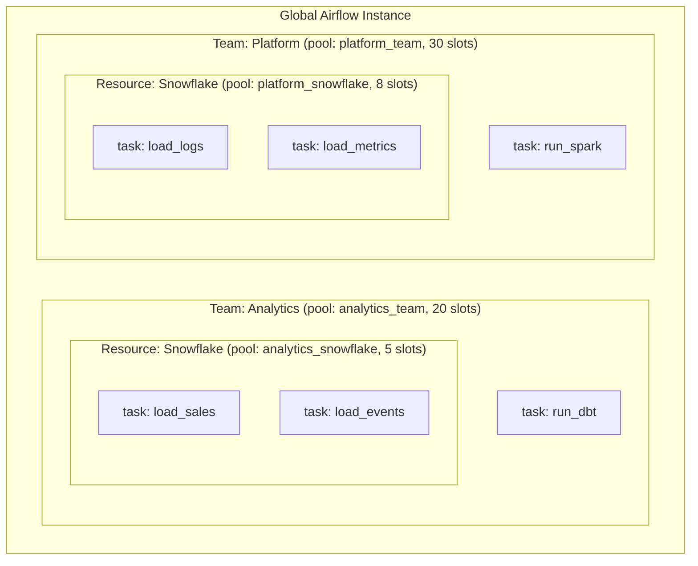
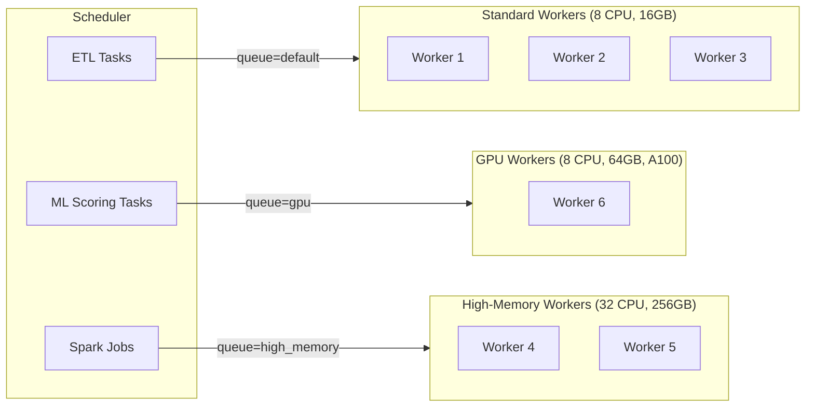

# Airflow Pools and Queues — Intermediate

## Multi-Tenant Pool Strategy

In organizations where multiple teams share a single Airflow instance, pools become a primary tool for **resource governance**. Without a strategy, one team's heavy backfill can starve another team's critical SLA pipeline.

**The two-tier pool model:**

```
Tier 1: Team-level pools   → isolate teams from each other
Tier 2: Resource pools     → protect downstream systems within each team
```



**What this shows:** Each team has its own pool capping their total concurrency. Within each team, resource-specific pools protect shared infrastructure. Analytics team tasks use `analytics_snowflake` pool; Platform team uses `platform_snowflake`. Both teams share Snowflake, but their pools prevent either from monopolizing it.

> **Implementation note:** A task is assigned to ONE pool. To implement the two-tier model, use the resource pool (the more restrictive one). Team accounting is handled separately via DAG tags and ownership metadata.

---

## Priority Weights

When multiple tasks compete for the same pool slots, Airflow uses **priority weights** to decide which task runs first. Higher weight = higher priority = runs first when slots become available.

```python
from airflow import DAG
from airflow.operators.python import PythonOperator
from datetime import datetime

with DAG('priority_demo', start_date=datetime(2024, 1, 1), catchup=False) as dag:

    # Critical SLA task — runs first when slots are available
    critical_load = PythonOperator(
        task_id='load_critical_data',
        python_callable=load_fn,
        pool='snowflake_pool',
        priority_weight=100,        # ← highest priority
        weight_rule='absolute',     # ← use exact value, don't add upstream weights
    )

    # Normal task
    standard_load = PythonOperator(
        task_id='load_standard_data',
        python_callable=load_fn,
        pool='snowflake_pool',
        priority_weight=50,
    )

    # Background backfill task — runs only when nothing else is waiting
    backfill_load = PythonOperator(
        task_id='load_historical_data',
        python_callable=load_fn,
        pool='snowflake_pool',
        priority_weight=1,          # ← lowest priority, runs last
    )
```

### Weight Rules

| Rule | Behavior | Use When |
|------|----------|----------|
| `downstream` (default) | Task weight = own weight + sum of all downstream task weights | Want critical final tasks to bubble up urgency |
| `upstream` | Task weight = own weight + sum of all upstream task weights | Want to prioritize tasks that have done the most preparation |
| `absolute` | Task weight = exactly the value you set | Want explicit, predictable priority control |

> **Recommendation:** Use `weight_rule='absolute'` when you explicitly control priorities. The `downstream` default causes unintuitive priority inflation in fan-out DAGs.

---

## Worker Queues with CeleryExecutor

CeleryExecutor distributes tasks across multiple worker processes, potentially on different machines. Queues let you control **which worker executes which task**.

### Why Route Tasks to Specific Workers?

| Scenario | Queue Strategy |
|----------|---------------|
| Tasks need GPU hardware | `queue='gpu'` → workers on GPU machines |
| Tasks need extra memory (Spark, Pandas on large data) | `queue='high_memory'` → workers with 64GB+ RAM |
| Tasks need a specific Python library (e.g., Oracle client) | `queue='oracle_workers'` → workers with Oracle installed |
| Tasks are I/O-bound and CPU-light | `queue='io_workers'` → many lightweight workers |
| Tasks are CPU-bound | `queue='cpu_workers'` → fewer, powerful workers |

### Setting Up a Multi-Queue Celery Architecture

**Step 1: Configure workers for specific queues**

```bash
# Worker on high-memory machine — listens to high_memory AND default queues
airflow celery worker --queues high_memory,default --concurrency 4

# Worker on GPU machine — only listens to gpu queue
airflow celery worker --queues gpu --concurrency 2

# Standard worker — only default queue
airflow celery worker --queues default --concurrency 8
```

**Step 2: Assign tasks to appropriate queues in DAG code**

```python
from airflow import DAG
from airflow.operators.python import PythonOperator
from airflow.operators.bash import BashOperator
from datetime import datetime

with DAG('multi_queue_pipeline', start_date=datetime(2024, 1, 1), catchup=False) as dag:

    # Runs on any default worker — lightweight
    extract = PythonOperator(
        task_id='extract_from_api',
        python_callable=extract_fn,
        queue='default',
    )

    # Runs only on high-memory workers — large Pandas operation
    transform = PythonOperator(
        task_id='transform_large_dataset',
        python_callable=transform_fn,
        queue='high_memory',
        pool='memory_pool',    # also limit concurrency
    )

    # Runs only on GPU workers — ML inference
    score = PythonOperator(
        task_id='run_model_inference',
        python_callable=score_fn,
        queue='gpu',
        pool='gpu_pool',
    )

    # Back to default — lightweight load
    load = PythonOperator(
        task_id='load_results',
        python_callable=load_fn,
        queue='default',
    )

    extract >> transform >> score >> load
```

---

## Queue-Based Resource Isolation

Queues give you **hardware-level isolation** that pools cannot provide. A pool can limit concurrency but can't prevent a task from running on an under-resourced worker. Queues solve this.



---

## Dynamic Pool Slot Allocation by DAG Run Type

A common pattern is adjusting pool behavior based on run context — for example, giving backfill runs fewer slots than regular scheduled runs:

```python
from airflow import DAG
from airflow.operators.python import PythonOperator
from airflow.models import Variable
from datetime import datetime

def get_pool_slots(**context):
    """Use fewer slots for backfill runs to avoid starving live pipelines."""
    run_type = context['dag_run'].run_type  # 'scheduled', 'manual', 'backfill'
    if run_type == 'backfill':
        return 1  # conservative
    return 3      # normal operation

def run_etl(pool_slots, **context):
    print(f"Running ETL with {pool_slots} pool slots")

with DAG('adaptive_pool_dag', start_date=datetime(2024, 1, 1), catchup=False) as dag:

    # In practice, pool_slots is set at DAG parse time, not runtime
    # Use Airflow Variables to allow runtime adjustment without code deploy
    pool_size = int(Variable.get('etl_pool_slots', default_var=3))

    load_task = PythonOperator(
        task_id='load_data',
        python_callable=run_etl,
        op_kwargs={'pool_slots': pool_size},
        pool='snowflake_pool',
        pool_slots=pool_size,
    )
```

> **Pattern:** Use `airflow variables set etl_pool_slots 1` to throttle a DAG during backfill without modifying code. The next scheduled run picks up the new value.

---

## Combining Pools and Queues Effectively

```python
# Production pattern: pool for concurrency control + queue for hardware routing

heavy_transform = PythonOperator(
    task_id='heavy_transform',
    python_callable=transform_fn,
    # Pool: limit to 3 concurrent executions of this type
    pool='heavy_transform_pool',
    pool_slots=1,
    # Queue: must run on a high-memory worker
    queue='high_memory',
    # Priority: runs before standard tasks when competing
    priority_weight=75,
    weight_rule='absolute',
)
```

| Layer | Mechanism | Controls |
|-------|-----------|---------|
| 1st | `queue` | Which physical worker |
| 2nd | `pool` | How many can run simultaneously |
| 3rd | `priority_weight` | Which queued task gets the next slot |
| 4th | `pool_slots` | How many slots this single task consumes |

---

## Monitoring Pool Health

**Key metrics to watch:**

| Metric | Healthy | Warning Sign |
|--------|---------|--------------|
| Queued slots / Total slots | < 50% | > 80%: pool too small or tasks too slow |
| Running slots | Close to total | All slots full = potential bottleneck |
| Open slots | > 0 | Consistently 0 = throughput ceiling hit |
| Task wait time (queued → running) | < 2 min | > 10 min: pool starvation |

**SQL to check pool usage directly from metadata DB:**

```sql
-- Tasks currently queued or running per pool
SELECT
    pool,
    state,
    COUNT(*) as task_count
FROM task_instance
WHERE state IN ('queued', 'running')
GROUP BY pool, state
ORDER BY pool, state;
```

---

## Practical Pool Sizing Formula

```
pool_slots = (target_concurrency) × (safety_factor)

where:
  target_concurrency = max simultaneous tasks the resource can handle
  safety_factor      = 0.7–0.8 (leave headroom for bursts)

Example — Snowflake with 10-query limit:
  pool_slots = 10 × 0.7 = 7 slots
```

For API rate limits:
```
pool_slots = floor(rate_limit_per_second × avg_task_duration_seconds × 0.8)

Example — API allows 5 req/sec, avg task takes 3s:
  pool_slots = floor(5 × 3 × 0.8) = floor(12) = 12 slots
```

---

## Interview Tips

> **Tip 1:** "How do you isolate teams in a shared Airflow instance?" — "I'd create team-level pools to cap each team's total task concurrency, and resource-level pools to protect shared infrastructure like Snowflake. Combined with DAG ownership tags and RBAC roles, this gives each team clear resource boundaries without needing separate Airflow deployments."

> **Tip 2:** "When would you use a queue instead of a pool?" — "Queues are for routing — when a task requires specific hardware (GPU, high memory) or a specific software installation (Oracle client, CUDA). Pools are for rate-limiting — when you need to cap concurrent access to a shared resource. They're complementary: use a pool for 'how many' and a queue for 'where.'"

> **Tip 3:** "How does priority_weight work in practice?" — "When multiple tasks compete for a pool slot, Airflow picks the task with the highest `priority_weight`. With `weight_rule='absolute'`, the exact number you set is used. The default `downstream` rule adds the weights of all downstream tasks, which can create unexpected priority ordering in complex DAGs. I prefer `absolute` for clarity."
