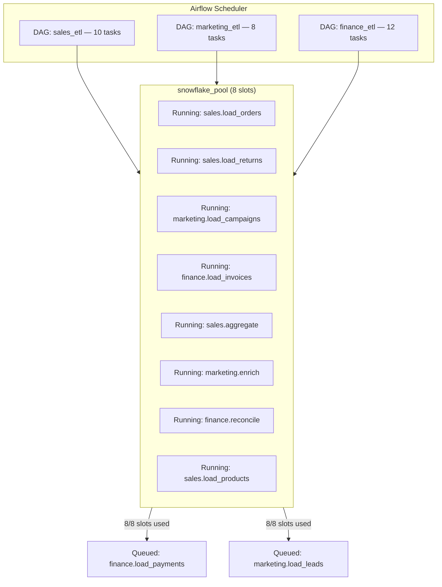
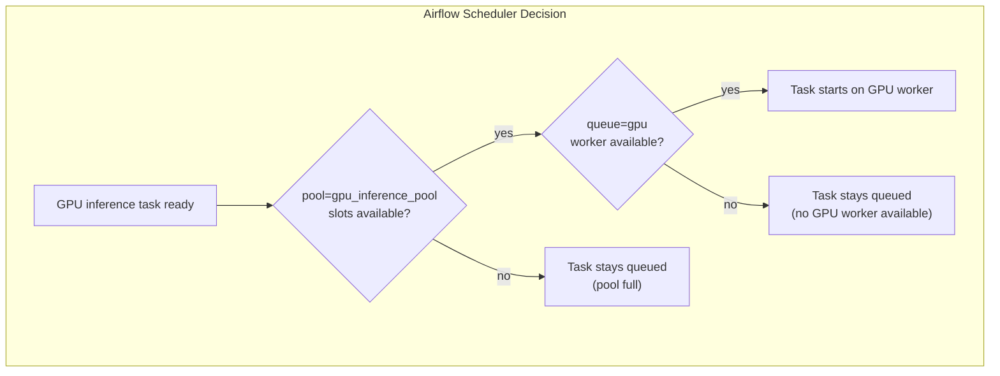

# Airflow Pools and Queues — Real-World Scenarios

## Scenario 1: Pool-Based Snowflake Query Concurrency Control

### Context

A data platform team runs 30+ DAGs that all query Snowflake. Their XL warehouse (cost center) was running at full throttle at peak hours — 60+ concurrent queries — causing warehouse credit burn and query queueing inside Snowflake itself. The platform team needed to limit Airflow to no more than 8 concurrent Snowflake operations.

### Solution Architecture



### Full Implementation

```python
# airflow/dags/utils/snowflake_base.py
"""Base class ensuring all Snowflake tasks use the shared pool."""

from airflow.providers.snowflake.operators.snowflake import SnowflakeOperator
from functools import partial

SNOWFLAKE_POOL = 'snowflake_prod_pool'
SNOWFLAKE_CONN_ID = 'snowflake_prod'

def snowflake_task(task_id: str, sql: str, priority: int = 50, **kwargs):
    """
    Factory function for Snowflake tasks that enforces pool usage.
    All Snowflake tasks MUST use this function — enforced via code review.
    """
    return SnowflakeOperator(
        task_id=task_id,
        sql=sql,
        snowflake_conn_id=SNOWFLAKE_CONN_ID,
        pool=SNOWFLAKE_POOL,
        pool_slots=1,
        priority_weight=priority,
        weight_rule='absolute',
        **kwargs,
    )
```

```python
# airflow/dags/sales_etl.py
from airflow import DAG
from datetime import datetime, timedelta
from utils.snowflake_base import snowflake_task
from airflow.operators.empty import EmptyOperator

default_args = {
    'owner': 'data-engineering',
    'retries': 2,
    'retry_delay': timedelta(minutes=5),
    'email_on_failure': True,
}

with DAG(
    dag_id='sales_etl_daily',
    default_args=default_args,
    start_date=datetime(2024, 1, 1),
    schedule_interval='0 6 * * *',
    catchup=False,
    max_active_runs=1,
    tags=['sales', 'snowflake', 'daily'],
) as dag:

    start = EmptyOperator(task_id='start')
    end = EmptyOperator(task_id='end')

    # High-priority SLA task — gets slot preference
    load_orders = snowflake_task(
        task_id='load_orders',
        sql="CALL sp_load_orders('{{ ds }}')",
        priority=100,  # SLA-critical: highest priority
    )

    load_returns = snowflake_task(
        task_id='load_returns',
        sql="CALL sp_load_returns('{{ ds }}')",
        priority=80,
    )

    load_products = snowflake_task(
        task_id='load_products',
        sql="""
            MERGE INTO warehouse.dim_products AS target
            USING staging.stg_products AS source
            ON target.product_id = source.product_id
            WHEN MATCHED THEN UPDATE SET
                target.name = source.name,
                target.price = source.price,
                target.updated_at = source.updated_at
            WHEN NOT MATCHED THEN INSERT (product_id, name, price, created_at, updated_at)
            VALUES (source.product_id, source.name, source.price, source.created_at, source.updated_at);
        """,
        priority=70,
    )

    # Heavy aggregation — uses 2 slots (counts as 2 concurrent queries)
    aggregate_daily = SnowflakeOperator(
        task_id='aggregate_daily_metrics',
        sql="CALL sp_aggregate_daily_sales('{{ ds }}')",
        snowflake_conn_id='snowflake_prod',
        pool='snowflake_prod_pool',
        pool_slots=2,  # heavy query — counts as 2 slots
        priority_weight=60,
        weight_rule='absolute',
    )

    start >> [load_orders, load_returns, load_products]
    [load_orders, load_returns, load_products] >> aggregate_daily
    aggregate_daily >> end
```

```bash
# Pool setup (done once, managed via Terraform or CI/CD)
airflow pools set snowflake_prod_pool 8 \
    "Production Snowflake XL warehouse — max 8 concurrent queries to control credit burn"

airflow pools set snowflake_dev_pool 3 \
    "Dev Snowflake — throttled to prevent dev workload impacting prod credits"
```

### Results

| Metric | Before Pools | After Pools |
|--------|-------------|-------------|
| Peak concurrent Snowflake queries | 60+ | ≤ 8 |
| Snowflake credit burn (daily) | $2,400 | $800 |
| Query queueing inside Snowflake | Frequent | Eliminated |
| Pipeline SLA breaches | 12/month | 1/month |

---

## Scenario 2: Critical vs. Non-Critical Pipeline Isolation

### Context

A retail company's Airflow instance ran both SLA-bound customer-facing pipelines (order status updates, inventory sync) and non-critical background jobs (historical reports, ML training data prep). During peak season, background jobs consumed all worker slots, causing SLA breaches on the critical pipelines.

### Solution: Two-Pool Architecture with Priority

```python
# Pool design:
# critical_pool: 20 slots, priority 100 — SLA-bound pipelines
# background_pool: 10 slots, priority 1 — non-SLA work
# shared_compute_pool: 5 slots — expensive compute shared by both

# airflow/dags/order_status_sync.py — CRITICAL pipeline
from airflow import DAG
from airflow.operators.python import PythonOperator
from datetime import datetime, timedelta

def sync_orders_to_api():
    """Push order status updates to customer-facing API."""
    # ... implementation
    pass

def validate_sync():
    """Confirm all orders synced successfully."""
    pass

with DAG(
    dag_id='order_status_sync',
    start_date=datetime(2024, 1, 1),
    schedule_interval='*/15 * * * *',  # every 15 minutes
    catchup=False,
    max_active_runs=2,
    sla_miss_callback=alert_on_sla_miss,  # custom SLA alerting
    tags=['critical', 'sla', 'orders'],
) as dag:

    sync = PythonOperator(
        task_id='sync_orders',
        python_callable=sync_orders_to_api,
        pool='critical_pool',           # dedicated critical pool
        priority_weight=100,
        weight_rule='absolute',
        sla=timedelta(minutes=10),      # must complete within 10 minutes
        retries=3,
        retry_delay=timedelta(minutes=1),
    )

    validate = PythonOperator(
        task_id='validate_sync',
        python_callable=validate_sync,
        pool='critical_pool',
        priority_weight=100,
        weight_rule='absolute',
    )

    sync >> validate
```

```python
# airflow/dags/ml_training_prep.py — NON-CRITICAL pipeline
from airflow import DAG
from airflow.operators.python import PythonOperator
from datetime import datetime, timedelta

with DAG(
    dag_id='ml_training_data_prep',
    start_date=datetime(2024, 1, 1),
    schedule_interval='0 2 * * *',   # 2 AM daily
    catchup=False,
    max_active_runs=1,
    tags=['ml', 'background', 'non-sla'],
) as dag:

    # All tasks use background_pool — cannot compete with critical tasks
    extract_features = PythonOperator(
        task_id='extract_features',
        python_callable=extract_fn,
        pool='background_pool',
        priority_weight=1,          # lowest priority
        weight_rule='absolute',
    )

    generate_training_set = PythonOperator(
        task_id='generate_training_set',
        python_callable=generate_fn,
        pool='background_pool',
        priority_weight=1,
    )

    extract_features >> generate_training_set
```

```bash
# Pool configuration
airflow pools set critical_pool     20 "SLA-critical tasks — order sync, inventory, customer data"
airflow pools set background_pool   10 "Non-SLA background work — ML prep, historical reports"
airflow pools set shared_compute    5  "Heavy compute shared by both tiers — strictly capacity-limited"
```

### Monitoring Dashboard Query

```sql
-- Daily SLA compliance per pool
SELECT
    DATE_TRUNC('day', start_date) as run_date,
    pool,
    COUNT(*) as total_tasks,
    SUM(CASE WHEN state = 'success' THEN 1 ELSE 0 END) as succeeded,
    SUM(CASE WHEN duration > sla_seconds THEN 1 ELSE 0 END) as sla_breaches,
    AVG(EXTRACT(EPOCH FROM (NOW() - queued_dttm))) as avg_wait_seconds
FROM task_instance ti
LEFT JOIN (
    SELECT task_id, dag_id, MAX(sla) as sla_seconds FROM sla_miss GROUP BY task_id, dag_id
) sla ON ti.task_id = sla.task_id AND ti.dag_id = sla.dag_id
WHERE start_date >= NOW() - INTERVAL '7 days'
GROUP BY 1, 2
ORDER BY 1 DESC, 2;
```

---

## Scenario 3: GPU Worker Queue Routing for ML Inference

### Context

A media company runs nightly ML inference pipelines (content recommendations, ad targeting) alongside standard ETL jobs. Inference tasks require GPU workers; running them on standard CPU workers causes failures. The team needed reliable routing of ML tasks to GPU-equipped machines.

### Infrastructure

```
Workers:
  - 6x Standard workers (16 CPU, 32GB RAM) → queues: default, io_heavy
  - 2x High-memory workers (32 CPU, 256GB RAM) → queues: high_memory, default
  - 2x GPU workers (8 CPU, 64GB RAM, 2× A100 GPUs) → queues: gpu

Pools:
  - gpu_inference_pool: 4 slots (2 GPUs × 2 parallel jobs each)
  - high_memory_pool: 6 slots
  - default_pool: 64 slots (shared)
```

```python
# airflow/dags/recommendation_pipeline.py
from airflow import DAG
from airflow.operators.python import PythonOperator
from airflow.providers.amazon.aws.operators.s3 import S3CreateObjectOperator
from datetime import datetime, timedelta

def extract_user_events():
    """Pull user interaction data from Redshift."""
    pass

def preprocess_for_inference():
    """Feature engineering — memory-intensive."""
    pass

def run_recommendation_inference():
    """Load model from S3, run batch inference on GPU."""
    import torch
    import boto3
    # ... GPU inference implementation
    pass

def postprocess_and_store():
    """Format recommendations, write to DynamoDB."""
    pass

def trigger_ab_test_update():
    """Update A/B test routing with new recommendations."""
    pass

with DAG(
    dag_id='recommendation_pipeline_nightly',
    start_date=datetime(2024, 1, 1),
    schedule_interval='0 1 * * *',   # 1 AM daily
    catchup=False,
    max_active_runs=1,
    tags=['ml', 'recommendations', 'gpu'],
) as dag:

    # Standard worker: lightweight extraction
    extract = PythonOperator(
        task_id='extract_user_events',
        python_callable=extract_user_events,
        queue='default',
        pool='default_pool',
    )

    # High-memory worker: large Pandas/Polars preprocessing
    preprocess = PythonOperator(
        task_id='preprocess_for_inference',
        python_callable=preprocess_for_inference,
        queue='high_memory',        # route to memory-rich workers
        pool='high_memory_pool',    # cap concurrency too
        pool_slots=2,               # heavy operation
    )

    # GPU worker: actual model inference
    inference = PythonOperator(
        task_id='run_recommendation_inference',
        python_callable=run_recommendation_inference,
        queue='gpu',                # MUST run on GPU worker
        pool='gpu_inference_pool',  # limits to 4 concurrent GPU jobs
        pool_slots=1,
        priority_weight=90,
        weight_rule='absolute',
        execution_timeout=timedelta(hours=2),
    )

    # GPU worker: second inference model (different slot)
    targeting_inference = PythonOperator(
        task_id='run_ad_targeting_inference',
        python_callable=run_ad_targeting_fn,
        queue='gpu',
        pool='gpu_inference_pool',
        pool_slots=1,
        priority_weight=80,
        weight_rule='absolute',
    )

    # Standard worker: write results
    postprocess = PythonOperator(
        task_id='postprocess_and_store',
        python_callable=postprocess_and_store,
        queue='default',
        pool='default_pool',
    )

    update_ab = PythonOperator(
        task_id='update_ab_test',
        python_callable=trigger_ab_test_update,
        queue='default',
    )

    extract >> preprocess >> [inference, targeting_inference]
    [inference, targeting_inference] >> postprocess >> update_ab
```

```bash
# Worker startup commands (in supervisor/systemd/kubernetes)

# Standard workers
airflow celery worker --queues default,io_heavy --concurrency 8 \
    --hostname standard-worker-{hostname}

# High-memory workers
airflow celery worker --queues high_memory,default --concurrency 4 \
    --hostname highmem-worker-{hostname}

# GPU workers — only gpu queue, limited concurrency
airflow celery worker --queues gpu --concurrency 2 \
    --hostname gpu-worker-{hostname}

# Pool setup
airflow pools set gpu_inference_pool 4 \
    "GPU inference: 2 workers × 2 concurrent jobs each"
airflow pools set high_memory_pool   6 \
    "High-memory preprocessing: 2 workers × 4 threads, 6 max concurrent"
```

### Ensuring GPU Workers Are Available

```python
# Health check DAG — alerts if GPU workers are offline
from airflow import DAG
from airflow.operators.python import PythonOperator
from datetime import datetime
import subprocess

def check_gpu_workers():
    """Verify GPU queue has active workers."""
    result = subprocess.run(
        ['airflow', 'celery', 'inspect', 'active_queues', '--destination', 'gpu-worker@*'],
        capture_output=True, text=True, timeout=30
    )
    if 'gpu' not in result.stdout:
        raise RuntimeError("No GPU workers are listening to the 'gpu' queue! Inference will not run.")
    print("GPU workers confirmed active.")

with DAG(
    dag_id='infrastructure_health_check',
    start_date=datetime(2024, 1, 1),
    schedule_interval='*/10 * * * *',
    catchup=False,
) as dag:

    check_gpu = PythonOperator(
        task_id='verify_gpu_workers',
        python_callable=check_gpu_workers,
        queue='default',        # run on standard worker
        retries=0,              # alert immediately, don't retry
        email_on_failure=True,
    )
```

### Queue + Pool Interaction Summary



Both conditions must be met: pool must have a free slot AND a worker subscribed to the task's queue must be available. If either condition fails, the task remains queued.
