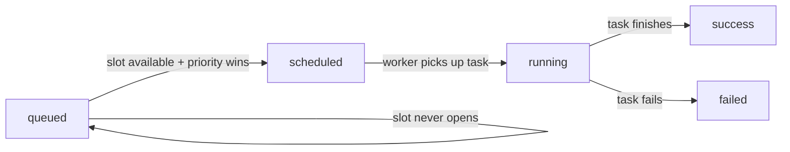

# Airflow Pools and Queues — Senior Deep Dive

## Pool Implementation Internals

Pools are stored in the Airflow **metadata database**, not in memory or config files. This is a critical design choice: it means pool configuration persists across scheduler restarts, is shared across all scheduler instances (in HA mode), and can be updated at runtime without redeployment.

### Metadata Database Schema

```sql
-- The pools table (simplified from Airflow source)
CREATE TABLE slot_pool (
    id          SERIAL PRIMARY KEY,
    pool        VARCHAR(256) UNIQUE NOT NULL,
    slots       INTEGER NOT NULL,
    description TEXT
);

-- Task instances track which pool slot they're using
-- in the task_instance table:
-- pool        VARCHAR(256) → which pool this task is assigned to
-- pool_slots  INTEGER      → how many slots this task consumes
-- state       VARCHAR(20)  → queued/running/success/failed/...
```

The scheduler queries these tables constantly to make scheduling decisions. Understanding this explains several behaviors:

1. **Pool changes take effect within the next scheduler heartbeat** (default: 5s)
2. **Reducing slots below currently running count doesn't kill tasks** — running tasks keep their slots; the count just limits new acquisitions
3. **Pool data is consistent across HA schedulers** because they share the same DB

---

## Slot Acquisition Mechanics

The scheduler uses an **optimistic locking** approach when acquiring pool slots:

```
Scheduler loop (every heartbeat):
1. SELECT tasks WHERE state='queued' ORDER BY priority_weight DESC
2. FOR each candidate task:
   a. SELECT SUM(pool_slots) FROM task_instance 
      WHERE pool = task.pool AND state IN ('queued', 'running')
   b. IF sum + task.pool_slots <= pool.slots:
      UPDATE task_instance SET state='scheduled' WHERE task_id = X
      (Worker picks up 'scheduled' tasks, not 'queued')
3. Commit transaction
```

**Key subtlety:** The scheduler transitions tasks from `queued` → `scheduled` → `running`. A task in `scheduled` state has been allocated a slot but hasn't started executing yet. This brief intermediate state prevents double-counting during the scheduler loop.



---

## Deadlock Risk: Pool-Induced Deadlock

This is one of the most insidious production failure modes in Airflow. It occurs when **tasks that depend on each other compete for the same pool slots**, and all slots are held by tasks waiting for downstream tasks that are also queued.

### Classic Deadlock Scenario

```
Pool: etl_pool with 2 slots

DAG A (Run 1):
  extract_A (slot 1) → transform_A (needs slot, but pool full)

DAG B (Run 2):
  extract_B (slot 2) → transform_B (needs slot, but pool full)

State:
  extract_A: running (holds slot 1)  ← waiting for nothing, but...
  extract_B: running (holds slot 2)  ← same situation
  transform_A: queued (needs slot 1 or 2)
  transform_B: queued (needs slot 1 or 2)

But extract_A and extract_B are ALSO waiting on something:
  They both call time.sleep(300) OR they're waiting on sensors
  that depend on transform tasks from a previous step.
```

The true deadlock happens with **`depends_on_past=True` + limited pool**:

```
Scenario:
- Pool has 3 slots
- DAG has 5 parallel tasks all in the same pool
- Previous DAG run's tasks hold 3 slots (still running/stuck)
- Today's run's tasks are all queued — can't get slots
- Today's tasks have depends_on_past=True — won't run until yesterday's finish
- Yesterday's tasks are stuck because... resource contention elsewhere
```

### Detecting Deadlock

```sql
-- Find pools where all slots are occupied by long-running tasks
SELECT 
    ti.pool,
    sp.slots as total_slots,
    SUM(ti.pool_slots) as used_slots,
    sp.slots - SUM(ti.pool_slots) as available_slots,
    COUNT(*) as running_tasks,
    MAX(EXTRACT(EPOCH FROM (NOW() - ti.start_date))/3600) as max_running_hours
FROM task_instance ti
JOIN slot_pool sp ON ti.pool = sp.pool
WHERE ti.state = 'running'
GROUP BY ti.pool, sp.slots
HAVING SUM(ti.pool_slots) >= sp.slots
   AND MAX(EXTRACT(EPOCH FROM (NOW() - ti.start_date))/3600) > 2;

-- Find tasks queued longer than 30 minutes (potential deadlock victims)
SELECT dag_id, task_id, pool, queued_dttm,
       EXTRACT(EPOCH FROM (NOW() - queued_dttm))/60 as queued_minutes
FROM task_instance
WHERE state = 'queued'
  AND queued_dttm < NOW() - INTERVAL '30 minutes'
ORDER BY queued_minutes DESC;
```

### Deadlock Prevention Strategies

```python
# Strategy 1: Separate pools for sequential task stages
# Don't put upstream and downstream tasks in the same pool

extract = PythonOperator(
    task_id='extract',
    pool='extract_pool',    # separate pool for extraction tasks
    pool_slots=1,
)
transform = PythonOperator(
    task_id='transform',
    pool='transform_pool',  # separate pool for transform tasks
    pool_slots=1,
)

# Strategy 2: Use pool_slots > 1 for tasks that spawn downstream work
# This reserves space for downstream tasks at task creation time
# (Not native Airflow, but a design principle)

# Strategy 3: Set dagrun_timeout to break deadlocks automatically
dag = DAG(
    dag_id='safe_pipeline',
    dagrun_timeout=timedelta(hours=4),  # kills stuck runs
)

# Strategy 4: Emergency brake — set pool to 0 slots via CLI
# airflow pools set etl_pool 0 "Emergency: clearing deadlock"
# Then clear stuck tasks, then restore slots
# airflow pools set etl_pool 5 "Restored after clearing deadlock"
```

---

## Dynamic Pool Slot Adjustment

Production systems often need to adjust pool sizes at runtime — during maintenance windows, load tests, or incident response. There are three approaches:

### 1. CLI-Based Manual Adjustment

```bash
# Increase pool for a planned data migration
airflow pools set snowflake_pool 15 "Temporary increase for Q4 migration"

# Reduce pool during Snowflake maintenance
airflow pools set snowflake_pool 0 "Snowflake maintenance window"

# Restore
airflow pools set snowflake_pool 8 "Restored after maintenance"
```

### 2. Automated Pool Adjustment via DAG

```python
from airflow import DAG
from airflow.operators.python import PythonOperator
from airflow.models import Pool
from airflow.utils.session import provide_session
from datetime import datetime

@provide_session
def scale_pool(pool_name: str, new_slots: int, session=None, **context):
    """Dynamically resize a pool — useful for maintenance windows."""
    pool = session.query(Pool).filter(Pool.pool == pool_name).first()
    if pool:
        old_slots = pool.slots
        pool.slots = new_slots
        session.commit()
        print(f"Resized {pool_name}: {old_slots} → {new_slots} slots")
    else:
        raise ValueError(f"Pool '{pool_name}' not found")

with DAG('pool_manager', start_date=datetime(2024, 1, 1),
         schedule_interval=None, catchup=False) as dag:

    scale_up = PythonOperator(
        task_id='scale_up_for_migration',
        python_callable=scale_pool,
        op_kwargs={'pool_name': 'snowflake_pool', 'new_slots': 20},
    )

    run_migration = PythonOperator(
        task_id='run_migration',
        python_callable=run_heavy_migration,
        pool='snowflake_pool',
    )

    scale_down = PythonOperator(
        task_id='restore_pool_size',
        python_callable=scale_pool,
        op_kwargs={'pool_name': 'snowflake_pool', 'new_slots': 8},
    )

    scale_up >> run_migration >> scale_down
```

### 3. Infrastructure-as-Code (Terraform)

```hcl
# Using the Airflow Terraform provider
resource "airflow_pool" "snowflake_pool" {
  name        = "snowflake_pool"
  slots       = 8
  description = "Limits concurrent Snowflake warehouse queries"
}

resource "airflow_pool" "snowflake_pool_high_load" {
  name        = "snowflake_pool"
  slots       = 20
  description = "High-load configuration for data migrations"
}
```

---

## Production Capacity Planning

### Framework for Pool Sizing

```
For database connection pools:
  pool_slots = min(
    db_connection_limit × 0.7,    # 70% of actual DB limit
    worker_count × worker_concurrency × 0.5  # don't use all worker threads for one resource
  )

For API pools:
  pool_slots = floor(
    api_rate_limit_per_minute / (60 / avg_task_duration_seconds)
  )

For compute-bound jobs (Spark, heavy Python):
  pool_slots = floor(
    total_vcpus / vcpus_per_job × 0.8
  )
```

### Production Pool Configuration Example

```bash
# Data warehouse layer
airflow pools set snowflake_prod_pool    8  "Production Snowflake — max 8 concurrent WH queries"
airflow pools set snowflake_dev_pool     3  "Dev Snowflake — intentionally throttled"

# External APIs
airflow pools set salesforce_api_pool    5  "Salesforce API — 5 req/sec limit"
airflow pools set hubspot_api_pool       3  "HubSpot API — burst limit"
airflow pools set stripe_api_pool       10  "Stripe API — higher rate limit"

# Compute resources
airflow pools set spark_heavy_pool       2  "Heavy Spark jobs — cluster can handle 2 large jobs"
airflow pools set dbt_pool              12  "dbt runs — many lightweight, can parallelize"

# Priority separation
airflow pools set critical_sla_pool     20  "SLA-bound tasks — generous slots"
airflow pools set background_pool        5  "Non-SLA tasks — intentionally limited"
```

### SLA-Aware Pool Design

```python
# Pattern: Reserve pool slots for SLA tasks by priority
# SLA tasks get priority_weight=100, background tasks get priority_weight=1
# Even in the same pool, SLA tasks will claim slots first

sla_task = PythonOperator(
    task_id='sla_critical_load',
    python_callable=load_fn,
    pool='shared_pool',
    priority_weight=100,
    weight_rule='absolute',
    sla=timedelta(hours=2),  # actual SLA monitoring
)

background_task = PythonOperator(
    task_id='historical_backfill',
    python_callable=backfill_fn,
    pool='shared_pool',
    priority_weight=1,
    weight_rule='absolute',
)
```

---

## Queue Internals (Celery)

With CeleryExecutor, queues are implemented as **message queues** in the broker (Redis or RabbitMQ). The scheduler publishes task execution requests as messages; workers consume from their subscribed queues.

```
Scheduler → publishes to Redis/RabbitMQ queue → Worker consumes and executes

Key behaviors:
- If no worker listens to a queue, tasks queue up in the broker indefinitely
- Message TTL: tasks can expire in the broker if not consumed (configurable)
- Worker crashes: unacked messages return to the queue after visibility timeout
- Queue depth monitoring: use broker metrics, not Airflow UI
```

**Monitoring Celery queues:**

```bash
# Check queue depths in Redis
redis-cli LLEN airflow.default
redis-cli LLEN airflow.high_memory

# Celery flower (web UI for Celery monitoring)
airflow celery flower

# Check active workers and their queues
airflow celery inspect active_queues
```

---

## Interview Tips

> **Tip 1:** "Explain pool-induced deadlock in Airflow." — "Deadlock occurs when tasks in a DAG share a pool, and upstream tasks hold all slots while waiting for downstream tasks that are queued waiting for those same slots. The classic scenario: a pool has N slots, N upstream tasks are running (holding all slots), and they're waiting on external resources that require their downstream tasks to have already run. The solution is to use separate pools for each stage of a pipeline and set `dagrun_timeout` as a safety net."

> **Tip 2:** "How does the scheduler determine which queued task to schedule next?" — "The scheduler queries task instances in `queued` state ordered by `priority_weight` descending. For each candidate, it checks whether the pool has enough open slots. The first task that fits gets transitioned to `scheduled`, which signals to a worker to start executing it. This happens in a single DB transaction to prevent double-scheduling in HA mode."

> **Tip 3:** "How would you handle a Snowflake maintenance window operationally?" — "I'd use a maintenance DAG or a CI/CD pipeline step that runs `airflow pools set snowflake_pool 0` before the window, which queues all Snowflake-pool tasks without failing them. After maintenance, restore the slot count. Tasks drain naturally — running tasks finish, new tasks queue. No manual intervention needed per-task."
