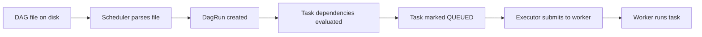

# Airflow Scheduler Tuning — Fundamentals


## 🎯 Analogy

Think of the Airflow scheduler like a restaurant kitchen manager — if the manager is slow at assigning tickets to chefs, the whole kitchen backs up even if chefs are idle. Scheduler tuning reduces that assignment lag.

---
## What Does the Scheduler Do?

The **scheduler** is the brain of Airflow. Every few seconds it:

1. Parses all DAG files to detect new or changed DAGs
2. Checks for DAG runs that are due based on schedule
3. Evaluates task dependencies for each active DAG run
4. Marks eligible tasks as `queued` and hands them to the executor

> **Mental model:** The scheduler is a loop that continuously scans "what work is ready?" and submits it. If the scheduler is slow, tasks sit in `scheduled` state even though their dependencies are met.

---

## Key Scheduler Configuration Parameters

```ini
# airflow.cfg — [scheduler] section

# How many seconds between scheduler heartbeats (DAG state checks)
scheduler_heartbeat_sec = 5

# How many DAG runs can the scheduler process per heartbeat
max_dagruns_per_loop_to_schedule = 20

# How many tasks can be submitted to the executor per scheduler loop
max_tis_per_query = 512

# How often DAG files are re-parsed (seconds)
dag_dir_list_interval = 300

# Min seconds between two parses of the same DAG file
min_file_process_interval = 30

# Number of processes that parse DAG files in parallel
parsing_processes = 2
```

**What to tune first:**

| Symptom | Likely cause | Fix |
|---------|-------------|-----|
| Tasks stuck in `scheduled` for minutes | `max_tis_per_query` too low | Increase to 1024+ |
| High CPU on scheduler | Too many DAGs, too-frequent parsing | Increase `min_file_process_interval` |
| New DAGs not appearing | `dag_dir_list_interval` too high | Lower to 60s |
| Scheduler restarting | OOM from loading too many DAGs | Reduce `parsing_processes` |

---

## DAG File Parsing — The Hidden Cost

Every DAG file is **imported as a Python module** on every parse cycle. If your DAG file has:
- Network calls at module level → network timeout on every parse
- Heavy imports (pandas, tensorflow) at module level → slow parse
- Database queries at module level → DB overload from parsing

```python
# ❌ BAD — runs on every DAG parse
import pandas as pd                     # slow import
conn = get_db_connection()              # network call at import time
TABLE_LIST = fetch_tables_from_db()     # DB query at import time

# ✅ GOOD — defer to inside functions
def get_tables():
    return fetch_tables_from_db()       # runs only when task executes

def my_task(**context):
    import pandas as pd                 # imported only when task runs
    tables = get_tables()
```

---

## Understanding Scheduler Lag

**Scheduler lag** = time from when a task *should* run to when it actually starts.

Causes:
1. **Parsing bottleneck** — scheduler too busy re-parsing DAGs to schedule tasks
2. **Executor backlog** — workers are full; tasks queue behind running ones  
3. **DB query slowness** — metadata DB is slow to respond
4. **Single-scheduler bottleneck** — Airflow 2.0+ supports HA schedulers



Lag can occur between any of these steps.

---

## Parallelism Settings

Three knobs control how many tasks run at once:

```ini
# Global cap: total tasks running across all DAGs
parallelism = 32

# Per-DAG cap: max concurrent tasks within one DAG
dag_concurrency = 16

# Per-DAG-run cap: max tasks in a single DAG run
max_active_tasks_per_dag = 16

# Max concurrent DAG runs per DAG
max_active_runs_per_dag = 16
```

**Hierarchy:** `parallelism` is the hard ceiling. `max_active_tasks_per_dag` limits within a single DAG. Individual task `pool` slots limit within a resource group.

---


## ▶️ Try It Yourself

```bash
# Key scheduler config (airflow.cfg or environment variables)
# AIRFLOW__SCHEDULER__SCHEDULER_HEARTBEAT_SEC=5      # How often scheduler loops
# AIRFLOW__SCHEDULER__MAX_THREADS=4                  # Parallel DAG parsing threads
# AIRFLOW__CORE__PARALLELISM=32                      # Max total running task instances
# AIRFLOW__CORE__MAX_ACTIVE_TASKS_PER_DAG=16         # Per-DAG task concurrency
# AIRFLOW__CORE__DAG_FILE_PROCESSOR_TIMEOUT=50       # Abandon slow DAG parsers

# Check scheduler health
airflow jobs check --job-type SchedulerJob --hostname $(hostname)

# List currently running tasks
airflow tasks states-for-dag-run my_dag <run_id>
```

> **Run it:** Copy the snippet into a REPL or file and run it — no external services needed for the basic example.

---
## Interview Tips

> **Tip 1:** When asked "why are your tasks slow to start?", the answer is almost always one of: (1) scheduler parsing bottleneck, (2) executor worker pool full, (3) pool slots exhausted. Check the Airflow UI's "Clusters" tab and the scheduler logs before assuming it's a code issue.

> **Tip 2:** DAG file import time directly affects scheduler throughput. `python -c "import time; t=time.time(); import my_dag; print(time.time()-t)"` is a quick way to measure it. Target under 1 second per DAG file.

> **Tip 3:** `min_file_process_interval` is the single most impactful tuning parameter for high-DAG-count environments. Setting it to 30s on 1000 DAGs = 1 parse every 30ms = constant scheduler CPU usage. Scale this up proportionally to your DAG count.
