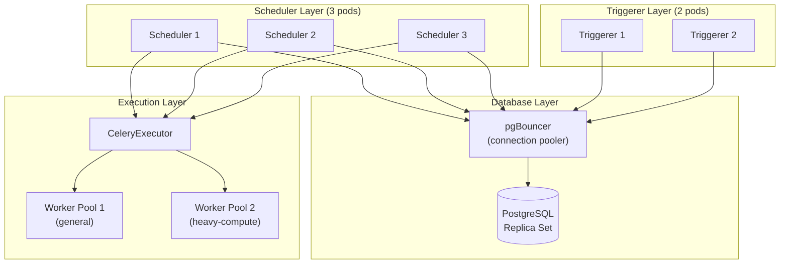

# Scenario Questions — Airflow Scheduler Tuning

<article data-difficulty="junior">

## 🟢 Junior: Tasks Stuck in "Scheduled" State

**Scenario:** Your Airflow DAG runs daily and its tasks are appearing in the `scheduled` state for 5+ minutes before moving to `queued`. Workers are idle (you can see no tasks running). What are the most likely causes, and what would you check first?

<details>
<summary>💡 Hint</summary>

"Scheduled" → "Queued" is the scheduler's job. If workers are idle but tasks aren't moving, the bottleneck is in the scheduler itself — not the executor or workers. Check what's consuming the scheduler's time.

</details>

<details>
<summary>✅ Solution</summary>

**Most likely causes (in order of frequency):**

1. **Scheduler is overwhelmed parsing DAG files** — if you have many DAGs and `min_file_process_interval` is low, the scheduler spends most of its time parsing instead of scheduling.

2. **`max_tis_per_query` is too low** — the scheduler only processes N tasks per loop. If your DAG fans out to many tasks and this is set too low, tasks queue slowly.

3. **Metadata DB is slow** — the scheduler runs DB queries every heartbeat. A slow DB response directly adds scheduling lag.

**What to check:**

```bash
# Check how long DAG files take to parse
airflow dags report

# Check scheduler logs for timing
grep "dag_processing.total_parse_time\|critical_section" \
  /opt/airflow/logs/scheduler/latest/*.log

# Check if metadata DB is slow
time psql $AIRFLOW_DB -c "SELECT COUNT(*) FROM task_instance WHERE state='scheduled'"
```

**Quick fixes:**
```ini
[scheduler]
min_file_process_interval = 120   # Parse each file at most every 2 min
max_tis_per_query = 1024          # Schedule more tasks per loop
parsing_processes = 4             # More parallel DAG parsers
```

</details>

</article>

<article data-difficulty="junior">

## 🟢 Junior: New DAG Not Appearing in the UI

**Scenario:** You created a new DAG file in the `dags/` folder 10 minutes ago. It's not showing up in the Airflow UI. There are no import errors when you run the file manually with Python. What should you check?

<details>
<summary>💡 Hint</summary>

The scheduler discovers new DAG files by scanning the DAG folder. There's a configuration parameter that controls how often this scan happens. Also check if there's a `.airflowignore` file.

</details>

<details>
<summary>✅ Solution</summary>

**Step 1: Check `dag_dir_list_interval`**

```ini
[scheduler]
# How often the scheduler scans the dags folder for new/changed files
dag_dir_list_interval = 300   # 5 minutes — this is the default!
```

If this is set to 300s, a new DAG file might take up to 5 minutes to be discovered. After the file is discovered, it also needs to be parsed (`min_file_process_interval` delays this further).

**Step 2: Check `.airflowignore`**

```bash
cat /opt/airflow/dags/.airflowignore
# Is your new file matched by any pattern here?
```

**Step 3: Check for import errors**

```bash
# This is the definitive check
python /opt/airflow/dags/my_new_dag.py
# OR
airflow dags list-import-errors
```

**Step 4: Force a rescan**

```bash
# Trigger immediate parse
airflow dags reserialize

# Or check if DAG appeared after full rescan interval
airflow dags list | grep my_new_dag
```

**Prevention:** In development, set `dag_dir_list_interval = 5` so new files appear within seconds. In production, 60–300s is appropriate.

</details>

</article>

<article data-difficulty="mid-level">

## 🟡 Mid-Level: Midnight Scheduling Stampede

**Scenario:** Your company runs 200 daily DAGs, all scheduled at `0 0 * * *` (midnight). Every night at midnight, the scheduler is overwhelmed, task lag spikes to 20 minutes, and sometimes worker pods crash from memory pressure. How would you address this?

<details>
<summary>💡 Hint</summary>

This is a "thundering herd" problem — all 200 DAGs try to schedule at exactly the same moment. The solutions are: (1) spread the schedules across time, (2) rate-limit task execution with pools, (3) scale the executor. Consider which teams/pipelines have strict midnight requirements and which are flexible.

</details>

<details>
<summary>✅ Solution</summary>

**Strategy 1: Stagger schedules**

```python
# Spread 200 DAGs across a 3-hour window (midnight to 3 AM)
# 200 DAGs × 0.9 min apart = 180 minutes = 3 hours

from airflow import DAG
from datetime import datetime

for i, dag_config in enumerate(DAG_CONFIGS):
    offset_minutes = int(i * 0.9)   # 0 to 179 minutes
    hour = offset_minutes // 60
    minute = offset_minutes % 60

    with DAG(
        dag_id=dag_config['id'],
        schedule=f'{minute} {hour} * * *',
        start_date=datetime(2024, 1, 1),
        catchup=False,
    ) as dag:
        # ... tasks
```

**Strategy 2: Pool-based concurrency limit**

```bash
# Create a pool that caps total concurrent midnight tasks
airflow pools set midnight_etl 30 "Midnight ETL concurrency cap"
```

```python
# Apply pool to all midnight tasks
task = PythonOperator(
    task_id='etl_load',
    python_callable=load_fn,
    pool='midnight_etl',      # Max 30 across all 200 DAGs
)
```

**Strategy 3: Increase scheduler and executor capacity**

```ini
[scheduler]
parsing_processes = 8
max_tis_per_query = 2048
max_dagruns_per_loop_to_schedule = 100

[celery]
worker_concurrency = 32      # More tasks per worker

[core]
parallelism = 500            # Higher global cap
```

**Strategy 4: HA schedulers**

```bash
# Run 3 schedulers to distribute the midnight scheduling load
# All 3 share the same metadata DB
airflow scheduler  # Pod 1
airflow scheduler  # Pod 2
airflow scheduler  # Pod 3
```

</details>

</article>

<article data-difficulty="mid-level">

## 🟡 Mid-Level: Scheduler Using 100% CPU

**Scenario:** The Airflow scheduler process is pegged at 100% CPU continuously, even when no tasks are running. The system has 300 DAG files. What's the most likely cause and how do you fix it?

<details>
<summary>💡 Hint</summary>

300 DAGs being parsed constantly = a lot of Python subprocess work. Look at `min_file_process_interval` — if it's set too low, the scheduler immediately starts re-parsing DAG files as soon as it finishes the previous cycle, creating continuous CPU load.

</details>

<details>
<summary>✅ Solution</summary>

**Root cause: `min_file_process_interval` too low**

With 300 DAGs and `min_file_process_interval = 5` (5 seconds):
- Parse cycle takes 60 seconds for 300 files
- Files parsed in the first 55 seconds are immediately eligible for re-parsing
- Scheduler starts another parse cycle before finishing the first
- Result: continuous parsing = continuous CPU

**Fix:**

```ini
[scheduler]
# Wait at least 5 minutes before re-parsing the same file
min_file_process_interval = 300

# Only scan for new files every 5 minutes
dag_dir_list_interval = 300

# Allow only 4 concurrent parse processes (not 8)
parsing_processes = 4
```

**Verify the fix worked:**

```bash
# CPU should drop after config reload
top -p $(pgrep -f "airflow scheduler")

# Parse time should show meaningful idle time between cycles
grep "DagFileProcessorManager" /opt/airflow/logs/scheduler/latest/*.log \
  | grep "total_parse_time"
```

**Additional optimisations:**

```python
# Move slow imports inside task functions
# This directly reduces parse time per file

# Before:
import boto3  # slow at module level
import pandas

# After:
def my_task(**ctx):
    import boto3  # imported only when task runs
    import pandas
```

Use `.airflowignore` to exclude non-DAG Python files:

```text
# .airflowignore
utils/
tests/
__pycache__/
```

</details>

</article>

<article data-difficulty="senior">

## 🔴 Senior: Design a Scheduler Architecture for 2000 DAGs

**Scenario:** You're joining a company with 2000 DAGs across 50 data engineering teams. The current setup is a single Airflow scheduler on a VM. Teams report 10–15 minute scheduling lag, scheduler OOMKills weekly, and the metadata DB is hitting 95% CPU. Design a production-grade scheduler architecture that scales to this load.

<details>
<summary>💡 Hint</summary>

This requires a holistic architectural approach: multiple HA schedulers, metadata DB tuning/separation, DAG file governance, and potentially DAG namespace separation. Think about the bottlenecks at each layer: parse, schedule, execute, and DB.

</details>

<details>
<summary>✅ Solution</summary>

**Architecture: Kubernetes-native, HA, multi-scheduler**



**Layer 1: Scheduler tuning**

```ini
[scheduler]
# 3 HA schedulers share load via DB row locking
# Each handles ~667 DAGs

# Reduce parse load — most DAGs are stable
min_file_process_interval = 300
dag_dir_list_interval = 600

# Higher throughput per scheduler
parsing_processes = 4           # 4 parse processes per scheduler = 12 total
max_tis_per_query = 2048
max_dagruns_per_loop_to_schedule = 100
```

**Layer 2: DAG file governance**

```python
# Enforce in CI: DAG parse time < 2s, memory < 50MB
import subprocess, sys

def check_dag_parse(dag_file):
    result = subprocess.run(
        ['python', '-c', f'import time; t=time.time(); import importlib.util; '
         f'spec=importlib.util.spec_from_file_location("d","{dag_file}"); '
         f'mod=importlib.util.module_from_spec(spec); spec.loader.exec_module(mod); '
         f'print(f"Parse time: {{time.time()-t:.2f}}s")'],
        capture_output=True, text=True, timeout=10
    )
    if result.returncode != 0:
        print(f"FAIL: {dag_file} has import error")
        sys.exit(1)

# Run in GitHub Actions on PR
```

**Layer 3: Database — pgBouncer + read replicas**

```ini
# Airflow → pgBouncer (transaction pooling)
sql_alchemy_conn = postgresql+psycopg2://airflow:pw@pgbouncer:6432/airflow
sql_alchemy_pool_size = 5       # per scheduler = 15 total connections through pgBouncer
sql_alchemy_max_overflow = 10

# pgBouncer config
[pgbouncer]
max_client_conn = 500
default_pool_size = 25
pool_mode = transaction
```

**Layer 4: Multi-queue worker pools**

```bash
# General ETL tasks
airflow celery worker --queues default --concurrency 16

# Heavy compute tasks (Spark, ML)
airflow celery worker --queues heavy_compute --concurrency 4 --hostname heavy@%h
```

```python
# Route tasks to appropriate worker queues
SparkSubmitOperator(
    task_id='run_spark',
    queue='heavy_compute',      # Goes to heavy-compute worker pool
    ...
)
PythonOperator(
    task_id='validate',
    queue='default',            # Goes to general worker pool
    ...
)
```

**Key metrics to monitor post-implementation:**
- `scheduler.critical_section_duration` < 100ms
- `scheduler.dag_processing.total_parse_time` < 30s per cycle
- `scheduler.tasks.starving` = 0 (no tasks waiting due to pool/parallelism caps)
- DB query `p99 < 50ms`
- Scheduling lag < 30s

</details>

</article>
