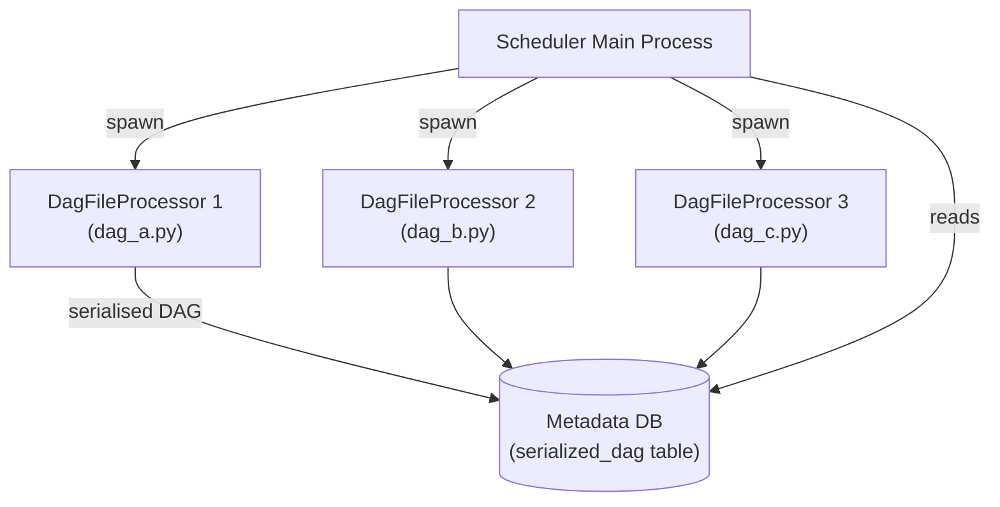
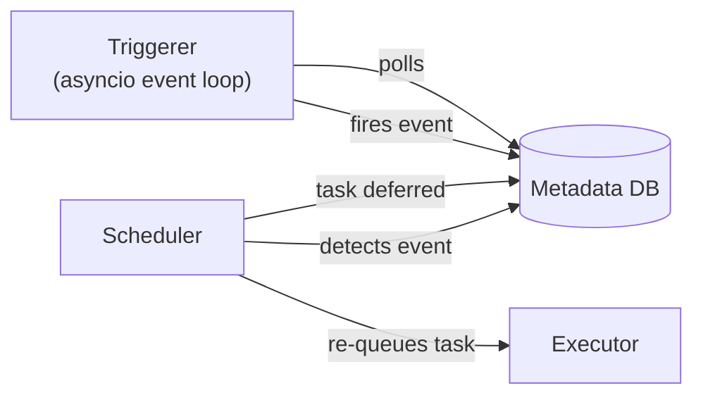

# Airflow Scheduler Tuning — Senior Deep Dive

## Scheduler Internals — The Scheduling Loop

The scheduler runs a tight loop with three main phases:

```python
# Simplified pseudocode of the scheduler loop
while True:
    # Phase 1: Parse DAG files (in separate processes)
    for dag_file in get_dag_files():
        if time_since_last_parse(dag_file) > min_file_process_interval:
            submit_to_parse_process(dag_file)

    # Phase 2: Critical section — schedule tasks
    with database_lock():
        active_runs = get_active_dag_runs()
        for dag_run in active_runs[:max_dagruns_per_loop]:
            eligible_tasks = get_schedulable_tasks(dag_run)
            for task in eligible_tasks[:max_tis_per_query]:
                mark_as_queued(task)
                submit_to_executor(task)

    # Phase 3: Sync executor state
    executor.sync()

    sleep(scheduler_heartbeat_sec)
```

The **critical section** (Phase 2) holds a database lock. If it's slow, nothing else can progress. This is why `max_dagruns_per_loop_to_schedule` and `max_tis_per_query` exist — they bound the critical section duration.

---

## DAG Processor Architecture

DAG files are parsed in **separate processes** to isolate crashes and limit memory usage:



**Key parameters:**
```ini
[scheduler]
# Max concurrent DAG file processors
parsing_processes = 4

# Kill a processor if it takes longer than this (seconds)
dag_file_processor_timeout = 50

# How often the scheduler checks for new/changed files
dag_dir_list_interval = 300
```

**Memory limit:** each DagFileProcessor is a full Python process. With 1000 DAG files and `parsing_processes = 16`, you can have 16 full Python processes running simultaneously, each importing all the libraries used in that DAG.

---

## Zombie Detection and Resolution

The scheduler detects **zombie tasks** — tasks that are marked `running` in the DB but whose worker process has died:

```python
# Zombie detection logic (simplified)
def find_zombie_tasks():
    # Tasks marked running but worker hasn't sent a heartbeat recently
    return db.query("""
        SELECT *
        FROM task_instance ti
        WHERE ti.state = 'running'
          AND ti.last_heartbeat_at < NOW() - INTERVAL '5 minutes'
          AND ti.job_id NOT IN (SELECT id FROM job WHERE latest_heartbeat > NOW() - INTERVAL '5 minutes')
    """)

def handle_zombie(task_instance):
    if task_instance.retries_remaining > 0:
        task_instance.state = 'up_for_retry'
    else:
        task_instance.state = 'failed'
```

```ini
[scheduler]
# How often to check for zombies (seconds)
zombie_detection_interval = 10.0

# How long a task can go without a heartbeat before it's considered zombie
scheduler_zombie_task_threshold = 300
```

---

## Task Dependency Resolution Internals

For each DAG run, the scheduler evaluates which tasks are ready:

```python
# Simplified dependency check
def is_task_ready(task_instance, dag_run):
    upstream_tis = get_upstream_task_instances(task_instance, dag_run)

    # Check trigger rule
    if task_instance.task.trigger_rule == 'all_success':
        return all(ti.state == 'success' for ti in upstream_tis)
    elif task_instance.task.trigger_rule == 'all_done':
        return all(ti.state in TERMINAL_STATES for ti in upstream_tis)
    elif task_instance.task.trigger_rule == 'one_success':
        return any(ti.state == 'success' for ti in upstream_tis)
    # ... etc

    # Check concurrency limits
    if running_tasks_for_dag >= dag.max_active_tasks:
        return False

    # Check pool slots
    if pool_slots_used >= pool.slots:
        return False

    return True
```

**Performance implication:** for a DAG with 1000 tasks, this check runs for every task on every scheduler heartbeat. Deeply nested DAGs with complex trigger rules are expensive to evaluate.

---

## Metadata Database Query Optimisation

The scheduler's performance is directly coupled to metadata DB response time:

```sql
-- Most frequent scheduler query: find schedulable tasks
-- This must be fast (< 100ms)
EXPLAIN ANALYZE
SELECT ti.*
FROM task_instance ti
JOIN dag_run dr ON ti.run_id = dr.run_id AND ti.dag_id = dr.dag_id
WHERE dr.state = 'running'
  AND ti.state IN ('none', 'scheduled')
  AND ti.pool_slots <= (
    SELECT open_slots FROM slot_pool WHERE pool = ti.pool
  )
ORDER BY ti.priority_weight DESC
LIMIT 512;

-- Ensure this index exists
CREATE INDEX CONCURRENTLY IF NOT EXISTS
    idx_ti_dag_run_state ON task_instance (dag_id, run_id, state);
```

**Connection pooling is critical:**
```ini
# Scheduler creates many concurrent DB connections
# Use pgBouncer in transaction pooling mode
sql_alchemy_pool_size = 5
sql_alchemy_max_overflow = 20
sql_alchemy_pool_pre_ping = True

# The underlying pool should be sized for:
# num_schedulers × (pool_size + max_overflow) connections
```

---

## Triggerer Process (Deferrable Operators)

The triggerer is a **separate process** from the scheduler that runs async triggers for deferrable operators:



```ini
[triggerer]
# How many triggers can the triggerer handle simultaneously
default_capacity = 1000

# Triggerer health check interval
health_check_threshold = 30
```

The triggerer is an asyncio event loop — it can handle thousands of concurrent triggers with a single process. Scale by running multiple triggerer processes if needed.

---

## Advanced Tuning: Priority Weights and Fair Scheduling

```python
# Priority weight propagates upstream by default
with DAG('priority_demo', ...) as dag:
    # Higher priority_weight = scheduled first when executor is busy
    critical_task = PythonOperator(
        task_id='critical',
        python_callable=fn,
        priority_weight=10,
        weight_rule='absolute',   # Use this task's weight only
    )
    normal_task = PythonOperator(
        task_id='normal',
        python_callable=fn,
        priority_weight=1,
    )

# In airflow.cfg: control fair-share vs. priority scheduling
# default_queue = default
# [celery]
# worker_prefetch_multiplier = 1  # Critical for fair scheduling
```

---

## Interview Tips

> **Tip 1:** Know the three-phase scheduler loop: (1) parse DAG files in subprocesses, (2) evaluate dependencies and queue tasks in the critical section, (3) sync executor state. Each phase has its own bottleneck profile. Parsing bottlenecks show up as "new DAGs take minutes to appear." Critical section bottlenecks show up as scheduling lag even when workers are idle.

> **Tip 2:** The HA scheduler (Airflow 2.0+) uses `SELECT FOR UPDATE SKIP LOCKED` — a PostgreSQL and MySQL feature. This means HA schedulers require a database that supports row-level locking. SQLite (used in dev) cannot run HA mode. Always ask about the metadata DB when discussing scheduler performance in interviews.

> **Tip 3:** Zombie detection is a common source of unexpected task failures in production. If your cluster is under high load, tasks can miss their heartbeat window even though the worker is still alive. Tune `scheduler_zombie_task_threshold` to be significantly higher than `execution_timeout` to avoid false-positive zombie detection.
