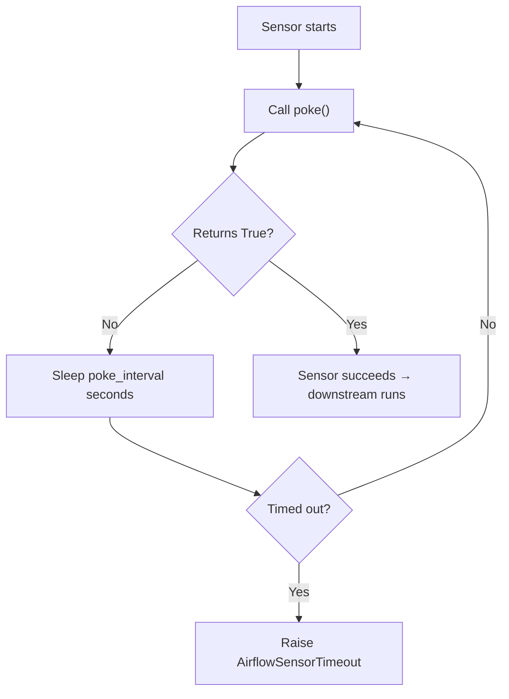

# Airflow Sensors — Fundamentals

## What Is a Sensor?

A **sensor** is a special type of Airflow operator that **waits for a condition to be true** before allowing downstream tasks to proceed. Instead of performing an action (like running a query or launching a Spark job), a sensor repeatedly checks whether something has happened — a file arrived, an API responded, an external DAG finished — and only succeeds once the condition is met.

> **Analogy:** Think of a sensor like a security guard at a venue door. The guard doesn't let guests in until the event starts. Every few minutes they check the clock (or a signal), and when the condition is met ("the show has started"), they open the doors and everyone proceeds. If the show never starts, the guard eventually gives up (timeout).

Sensors are the glue between external systems and your Airflow pipeline. They let you express **data-driven dependencies** — "don't start processing until the upstream data has landed."

---

## How Sensors Work

Every sensor inherits from `BaseSensorOperator` and implements a single method: `poke()`. Airflow calls `poke()` repeatedly at a configurable interval until it returns `True` (success) or the sensor times out.



**What this shows:** The sensor loops — poke, sleep, poke, sleep — until either the condition is met or the timeout expires. If the timeout expires, the task fails (and may retry depending on retry settings).

---

## Poke Mode vs Reschedule Mode

This is one of the most important sensor concepts for interviews. There are two fundamentally different ways a sensor can wait:

### Poke Mode (default)

The sensor **holds a worker slot** for its entire duration. A worker process is allocated, it calls `poke()`, sleeps, calls `poke()` again — all while occupying that slot.

```python
from airflow.sensors.filesystem import FileSensor

wait_for_file = FileSensor(
    task_id='wait_for_daily_export',
    filepath='/data/exports/sales_{{ ds }}.csv',
    mode='poke',               # default — holds a worker slot
    poke_interval=60,          # check every 60 seconds
    timeout=3600,              # fail after 1 hour
    dag=dag,
)
```

**Problem:** If you have 10 sensors all waiting in poke mode and your worker pool has 10 slots, your workers are all occupied by idle sensors and no real work can happen. This is **sensor deadlock**.

### Reschedule Mode

The sensor **releases its worker slot** between pokes. It schedules itself to be re-queued after `poke_interval` seconds, freeing the slot for other tasks.

```python
wait_for_file = FileSensor(
    task_id='wait_for_daily_export',
    filepath='/data/exports/sales_{{ ds }}.csv',
    mode='reschedule',         # releases worker slot between pokes
    poke_interval=300,         # check every 5 minutes
    timeout=7200,              # fail after 2 hours
    dag=dag,
)
```

**Benefit:** A reschedule-mode sensor uses a worker slot only for the brief moment it runs `poke()`, then frees it. You can have hundreds of sensors waiting simultaneously without exhausting your worker pool.

### Mode Comparison

| Aspect | Poke Mode | Reschedule Mode |
|--------|-----------|-----------------|
| Worker slot held? | Yes, continuously | No, only during poke |
| Best for | Short waits (< 5 min) | Long waits (minutes to hours) |
| poke_interval | Seconds (30–300) | Minutes (60–600) |
| Overhead | Low (no rescheduling) | Slight (scheduler overhead) |
| Deadlock risk | High | None |
| DB rows created | None | One per poke cycle |

> **Rule of thumb:** Use `mode='reschedule'` for anything that might wait more than a few minutes. It's almost always the right default for production sensors.

---

## Key Sensor Parameters

| Parameter | Default | Description |
|-----------|---------|-------------|
| `poke_interval` | 60 | Seconds between `poke()` calls |
| `timeout` | 604800 (7 days!) | Seconds before sensor times out |
| `mode` | `'poke'` | `'poke'` or `'reschedule'` |
| `soft_fail` | `False` | If `True`, timeout marks task as **skipped** instead of **failed** |
| `exponential_backoff` | `False` | Increase poke_interval exponentially on each retry |
| `silent_fail` | `False` | Suppress exceptions during poke |

> **Warning:** The default timeout is 7 days. Always set an explicit `timeout` appropriate to your SLA. A sensor that runs indefinitely will eventually exhaust resources or block DAG run slots.

---

## FileSensor

`FileSensor` waits for a file or directory to exist on the filesystem accessible to the Airflow worker.

```python
from airflow.sensors.filesystem import FileSensor

wait_for_csv = FileSensor(
    task_id='wait_for_csv',
    filepath='/mnt/data/inbound/orders_{{ ds_nodash }}.csv',
    fs_conn_id='fs_default',   # connection to the filesystem
    mode='reschedule',
    poke_interval=120,
    timeout=14400,             # 4 hours
    dag=dag,
)
```

**Use cases:**
- Waiting for an SFTP drop from a vendor
- Waiting for a batch export file to land on NFS
- Detecting completion marker files (e.g., `_SUCCESS`, `_DONE`)

> **Tip:** Many teams use a small "marker file" (a zero-byte `_SUCCESS` file) to signal that a directory of files is fully written. Waiting for the marker is safer than waiting for specific files because the producer writes the marker last, after all data files are complete.

---

## HttpSensor

`HttpSensor` polls an HTTP endpoint and checks the response. It succeeds when the response meets your criteria.

```python
from airflow.sensors.http import HttpSensor

wait_for_api = HttpSensor(
    task_id='wait_for_upstream_api',
    http_conn_id='upstream_api',    # Connection with base URL, auth
    endpoint='/api/v1/status',
    request_params={'date': '{{ ds }}'},
    response_check=lambda response: response.json()['status'] == 'ready',
    mode='reschedule',
    poke_interval=180,
    timeout=10800,
    dag=dag,
)
```

**`response_check`** is a callable that receives the full `requests.Response` object. Return `True` to signal the condition is met, `False` to keep waiting.

```python
# More complex response check
def check_job_complete(response):
    data = response.json()
    return data.get('state') == 'SUCCEEDED' and data.get('record_count', 0) > 0

wait_for_api = HttpSensor(
    task_id='wait_for_job',
    http_conn_id='etl_api',
    endpoint='/jobs/{{ run_id }}',
    response_check=check_job_complete,
    mode='reschedule',
    poke_interval=300,
    dag=dag,
)
```

---

## ExternalTaskSensor

`ExternalTaskSensor` waits for a task (or entire DAG) in a **different DAG** to reach a target state. This is how you implement cross-DAG dependencies.

```python
from airflow.sensors.external_task import ExternalTaskSensor

wait_for_upstream = ExternalTaskSensor(
    task_id='wait_for_sales_dag',
    external_dag_id='daily_sales_pipeline',    # The other DAG
    external_task_id='load_to_warehouse',      # Specific task (or None for whole DAG)
    allowed_states=['success'],                # Wait for this state
    failed_states=['failed', 'skipped'],       # Fail immediately if these states occur
    execution_delta=timedelta(hours=0),        # Time offset between DAG schedules
    mode='reschedule',
    poke_interval=300,
    timeout=7200,
    dag=dag,
)
```

**`execution_delta`:** If your upstream DAG runs at a different schedule, use `execution_delta` to align logical dates. For example, if the upstream DAG runs at 5 AM and yours at 6 AM, `execution_delta=timedelta(hours=1)` tells the sensor to wait for the upstream run that started 1 hour earlier.

```python
# Wait for the entire upstream DAG (not just one task)
wait_for_dag = ExternalTaskSensor(
    task_id='wait_for_upstream_dag',
    external_dag_id='daily_sales_pipeline',
    external_task_id=None,        # None = wait for the entire DAG run
    mode='reschedule',
    poke_interval=120,
    dag=dag,
)
```

---

## S3KeySensor

`S3KeySensor` waits for one or more keys (objects) to appear in an S3 bucket.

```python
from airflow.providers.amazon.aws.sensors.s3 import S3KeySensor

wait_for_s3 = S3KeySensor(
    task_id='wait_for_s3_export',
    bucket_name='company-data-lake',
    bucket_key='exports/sales/{{ ds_nodash }}/data.parquet',
    aws_conn_id='aws_default',
    mode='reschedule',
    poke_interval=300,
    timeout=14400,
    dag=dag,
)
```

**Wildcard support** — wait for any file matching a pattern:

```python
wait_for_partition = S3KeySensor(
    task_id='wait_for_partition',
    bucket_name='company-data-lake',
    bucket_key='raw/events/date={{ ds }}/part-*.parquet',
    wildcard_match=True,           # Enables glob-style matching
    aws_conn_id='aws_default',
    mode='reschedule',
    poke_interval=300,
    dag=dag,
)
```

**Multiple keys** — wait for all specified keys to exist:

```python
wait_for_all_regions = S3KeySensor(
    task_id='wait_for_all_regions',
    bucket_name='company-data-lake',
    bucket_key=[
        'exports/us-east/{{ ds_nodash }}/data.csv',
        'exports/eu-west/{{ ds_nodash }}/data.csv',
        'exports/ap-south/{{ ds_nodash }}/data.csv',
    ],
    aws_conn_id='aws_default',
    mode='reschedule',
    poke_interval=600,
    dag=dag,
)
```

---

## When to Use Sensors

Use a sensor when your pipeline has an **external dependency that isn't managed by Airflow**:

| Situation | Sensor to Use |
|-----------|---------------|
| Waiting for a vendor file on SFTP/NFS | `FileSensor` |
| Waiting for data to land in S3 | `S3KeySensor` |
| Polling an external API for job completion | `HttpSensor` |
| Waiting for another DAG/task to finish | `ExternalTaskSensor` |
| Waiting for a database row/query | `SqlSensor` |
| Waiting for a GCS file | `GCSObjectExistenceSensor` |

**When NOT to use sensors:**
- When you control both producer and consumer pipelines — use `TriggerDagRunOperator` instead for tighter coupling
- For very short waits (< 30 seconds) — just add a retry to the downstream task
- When you need complex multi-condition logic — use a `PythonOperator` with custom polling logic

---

## Sensor Timeout and Soft Fail

```python
# soft_fail=True: timeout marks the task SKIPPED instead of FAILED
# useful for optional data sources
wait_for_optional_feed = S3KeySensor(
    task_id='wait_for_optional_feed',
    bucket_name='external-feeds',
    bucket_key='optional/partner_data_{{ ds }}.json',
    soft_fail=True,            # Skip downstream if data doesn't arrive
    mode='reschedule',
    poke_interval=600,
    timeout=3600,
    dag=dag,
)
```

**When to use `soft_fail=True`:** When the data is optional or best-effort. If the feed doesn't arrive, downstream tasks will be skipped (not failed), and the DAG run can still succeed overall.

---

## Complete Example: Data Landing Pipeline

```python
from airflow import DAG
from airflow.providers.amazon.aws.sensors.s3 import S3KeySensor
from airflow.operators.python import PythonOperator
from datetime import datetime, timedelta

default_args = {
    'owner': 'data-engineering',
    'retries': 1,
    'retry_delay': timedelta(minutes=10),
}

with DAG(
    dag_id='process_daily_sales',
    default_args=default_args,
    schedule_interval='0 7 * * *',    # Run at 7 AM
    start_date=datetime(2024, 1, 1),
    catchup=False,
    tags=['sales', 'etl'],
) as dag:

    # Wait for upstream data to land in S3
    wait_for_data = S3KeySensor(
        task_id='wait_for_sales_export',
        bucket_name='company-data-lake',
        bucket_key='raw/sales/dt={{ ds }}/sales_export.parquet',
        aws_conn_id='aws_default',
        mode='reschedule',
        poke_interval=300,       # Check every 5 min
        timeout=10800,           # Fail after 3 hours
    )

    # Process once data has arrived
    process = PythonOperator(
        task_id='process_sales',
        python_callable=lambda: print("Processing sales data..."),
    )

    notify = PythonOperator(
        task_id='notify_success',
        python_callable=lambda: print("Pipeline complete!"),
    )

    wait_for_data >> process >> notify
```

---

## Interview Tips

> **Tip 1:** "What is the difference between poke and reschedule mode?" — "Poke mode holds a worker slot continuously, which can cause deadlock if many sensors wait simultaneously. Reschedule mode releases the worker slot between checks, allowing the slot to be used by other tasks. For any sensor that might wait more than a few minutes, reschedule mode is strongly preferred."

> **Tip 2:** "What's the default sensor timeout?" — "Seven days, which surprises many people. Always set an explicit timeout tied to your SLA. A sensor with no timeout can block DAG run slots indefinitely."

> **Tip 3:** "How do you handle cross-DAG dependencies?" — "ExternalTaskSensor is the standard approach. You point it at the upstream DAG and task ID. For the logical date alignment, use execution_delta if the two DAGs run on different schedules. The sensor checks the Airflow metadata database for the task state."

> **Tip 4:** "When would a sensor cause problems?" — "Sensor deadlock: all worker slots occupied by sensors waiting in poke mode, no slots left for actual work. Mitigated by using reschedule mode and setting appropriate worker pool sizing."
