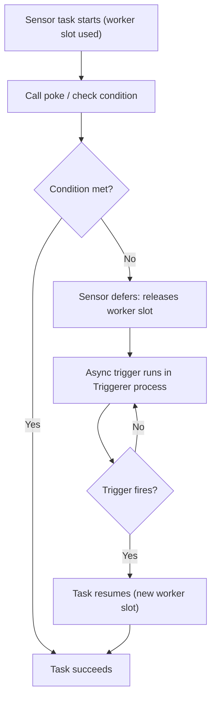
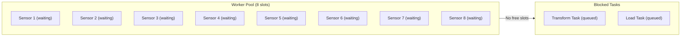

# Airflow Sensors — Intermediate

## SqlSensor

`SqlSensor` runs a SQL query and succeeds when the query returns at least one row (or a non-zero/non-null value in the first column of the first row).

```python
from airflow.sensors.sql import SqlSensor

wait_for_data = SqlSensor(
    task_id='wait_for_partition_populated',
    conn_id='snowflake_default',
    sql="""
        SELECT COUNT(*)
        FROM analytics.fact_sales
        WHERE sale_date = '{{ ds }}'
        HAVING COUNT(*) > 0
    """,
    mode='reschedule',
    poke_interval=300,
    timeout=10800,
    dag=dag,
)
```

**How SqlSensor evaluates the result:**
- If the query returns no rows → `False` (keep waiting)
- If the first cell is `0`, `None`, or empty string → `False` (keep waiting)
- If the first cell is any other truthy value → `True` (success)

```python
# More precise: check for a specific value
wait_for_flag = SqlSensor(
    task_id='wait_for_etl_flag',
    conn_id='postgres_default',
    sql="""
        SELECT status
        FROM pipeline_control
        WHERE pipeline_name = 'daily_sales'
          AND run_date = '{{ ds }}'
          AND status = 'COMPLETE'
    """,
    success=lambda x: x == 'COMPLETE',   # Custom success condition
    mode='reschedule',
    poke_interval=180,
    timeout=7200,
    dag=dag,
)
```

---

## Building a Custom Sensor with BaseSensorOperator

When built-in sensors don't cover your use case, subclass `BaseSensorOperator` and implement `poke()`.

```python
from airflow.sensors.base import BaseSensorOperator
from airflow.utils.decorators import apply_defaults
import requests

class RestApiJobSensor(BaseSensorOperator):
    """
    Polls a REST API until a job reaches a terminal state.

    :param api_conn_id: Airflow connection with base_url and credentials
    :param job_id: The job ID to monitor (supports Jinja templating)
    :param success_states: States that indicate completion
    :param failure_states: States that should fail the sensor immediately
    """

    # Mark fields that support Jinja templating
    template_fields = ['job_id']

    def __init__(
        self,
        api_conn_id: str,
        job_id: str,
        success_states: list = None,
        failure_states: list = None,
        **kwargs,
    ):
        super().__init__(**kwargs)
        self.api_conn_id = api_conn_id
        self.job_id = job_id
        self.success_states = success_states or ['SUCCEEDED', 'COMPLETE']
        self.failure_states = failure_states or ['FAILED', 'CANCELLED', 'ERROR']

    def poke(self, context):
        from airflow.hooks.http import HttpHook

        hook = HttpHook(method='GET', http_conn_id=self.api_conn_id)
        response = hook.run(f'/api/v1/jobs/{self.job_id}')
        data = response.json()

        state = data.get('state', 'UNKNOWN')
        self.log.info("Job %s is in state: %s", self.job_id, state)

        if state in self.failure_states:
            raise Exception(
                f"Job {self.job_id} reached failure state: {state}. "
                f"Error: {data.get('error_message', 'No details')}"
            )

        return state in self.success_states
```

**Usage:**

```python
monitor_etl_job = RestApiJobSensor(
    task_id='monitor_etl_job',
    api_conn_id='etl_platform_api',
    job_id='{{ ti.xcom_pull(task_ids="submit_job", key="job_id") }}',
    mode='reschedule',
    poke_interval=120,
    timeout=14400,
    dag=dag,
)
```

**Key design decisions in custom sensors:**
1. **`template_fields`** — list fields that should support Jinja so they can accept dynamic values like `{{ ds }}`
2. **Raise on failure states** — don't return `False` for terminal failure states; raise an exception to immediately fail the task instead of waiting for timeout
3. **Use hooks** — use Airflow Hooks for connectivity rather than `requests` directly; hooks handle connection credentials transparently

---

## SmartSensor (Airflow 2.0–2.3, deprecated in 2.4)

SmartSensor was Airflow's early approach to solving the worker slot problem. Instead of each sensor running as an independent task, a single SmartSensor process would manage multiple sensors centrally.

```python
# SmartSensor usage (2.0–2.3)
wait_for_file = FileSensor(
    task_id='wait_for_file',
    filepath='/data/export.csv',
    smart_sensor_compatible=True,   # Opt in to SmartSensor management
    poke_interval=60,
    dag=dag,
)
```

**Why SmartSensor was deprecated:** Deferrable operators (Airflow 2.2+) solve the same problem more elegantly with an async trigger system. SmartSensor required centralized management and had scaling limitations. Deferrable sensors are the modern replacement.

---

## Deferrable Sensors (Airflow 2.2+)

Deferrable sensors are the modern solution to the worker slot problem. They use **async triggers** — when a sensor defers, it suspends itself completely (no worker slot, no process), schedules a lightweight async trigger to watch for the condition, and resumes only when the trigger fires.



**What this shows:** Between deferral and resumption, the sensor uses **zero worker slots** and **zero worker processes**. All waiting happens in the lightweight `triggerer` process.

```python
# Using a deferrable sensor (drop-in replacement)
from airflow.providers.amazon.aws.sensors.s3 import S3KeySensorAsync

wait_for_s3 = S3KeySensorAsync(
    task_id='wait_for_s3',
    bucket_name='my-bucket',
    bucket_key='data/{{ ds }}/export.parquet',
    aws_conn_id='aws_default',
    # No mode= parameter; deferrable sensors handle this differently
    poke_interval=60,
    timeout=7200,
    dag=dag,
)
```

**Requirements for deferrable sensors:**
- Airflow 2.2+ with a running `triggerer` component
- Provider packages with `*Async` / `*Deferrable` variants
- `asyncio`-compatible trigger code

**Provider availability for deferrable sensors:**

| Sensor | Deferrable Version |
|--------|-------------------|
| `S3KeySensor` | `S3KeySensorAsync` |
| `HttpSensor` | `HttpSensorAsync` |
| `ExternalTaskSensor` | `ExternalTaskSensorAsync` |
| `GCSObjectExistenceSensor` | `GCSObjectExistenceSensorAsync` |
| `DateTimeSensor` | `DateTimeSensorAsync` |

---

## Avoiding Zombie Tasks

**Zombie tasks** are tasks that are marked as running in the metadata database but whose worker process has died (OOM kill, worker restart, network partition). Sensors are especially prone to zombie states because they run for long periods.

**How Airflow detects zombies:**
- The scheduler periodically checks for tasks marked `running` whose heartbeat is stale (> `scheduler_zombie_task_threshold` seconds, default 300s)
- Detected zombies are marked `failed` automatically

**How sensors create zombie-like conditions:**
```python
# ANTI-PATTERN: poke_interval > zombie_task_threshold
wait_for_data = S3KeySensor(
    task_id='wait_for_data',
    bucket_name='my-bucket',
    bucket_key='data.csv',
    mode='poke',
    poke_interval=600,    # 10 min poke interval
    # Default zombie threshold is 5 min — worker appears dead between pokes!
)
```

**Fix:** Use `reschedule` mode (which restarts the task cleanly between pokes) or ensure `poke_interval` < `scheduler_zombie_task_threshold`.

---

## Sensor Deadlock Pattern

Understanding how deadlock happens is critical for production Airflow:

```
Scenario:
- Worker pool: 8 slots
- 8 sensors running in poke mode, all waiting for data
- Result: 0 slots available for any actual work
- All 8 sensors are blocking the pipeline they're meant to serve
```



**Prevention strategies:**

| Strategy | Implementation |
|----------|---------------|
| Use reschedule mode | `mode='reschedule'` on all sensors |
| Use deferrable sensors | `S3KeySensorAsync`, etc. |
| Sensor pools | Assign sensors to a dedicated pool with limited slots |
| Separate sensor DAGs | Run sensors in separate DAGs from compute tasks |

```python
# Sensor pool: limit sensors to their own slot pool
wait_for_data = S3KeySensor(
    task_id='wait_for_data',
    bucket_name='my-bucket',
    bucket_key='data.csv',
    mode='reschedule',
    pool='sensor_pool',   # Dedicated pool for sensors, separate from workers
    pool_slots=1,
    dag=dag,
)
```

---

## Sensor with `exponential_backoff`

For sensors that might wait a long time and where you want to reduce API call frequency over time:

```python
from airflow.sensors.http import HttpSensor

wait_for_report = HttpSensor(
    task_id='wait_for_report_generation',
    http_conn_id='reporting_api',
    endpoint='/reports/{{ params.report_id }}/status',
    response_check=lambda r: r.json()['status'] == 'COMPLETE',
    mode='reschedule',
    poke_interval=60,          # Start checking every 1 min
    exponential_backoff=True,  # 1min, 2min, 4min, 8min, ...
    timeout=86400,             # 24 hour max wait
    max_wait=timedelta(hours=1),  # Cap backoff at 1 hour intervals
    dag=dag,
)
```

**When to use exponential_backoff:** When the external system takes a variable amount of time (seconds to hours) and you don't want to hammer the API with constant requests. Start frequent, then back off.

---

## Testing Custom Sensors Locally

```python
# Test your poke() method without running Airflow
import unittest
from unittest.mock import patch, MagicMock
from myproject.sensors import RestApiJobSensor

class TestRestApiJobSensor(unittest.TestCase):

    def _make_sensor(self, **kwargs):
        return RestApiJobSensor(
            task_id='test_sensor',
            api_conn_id='test_conn',
            job_id='job-123',
            **kwargs,
        )

    @patch('myproject.sensors.HttpHook')
    def test_poke_returns_false_when_running(self, mock_hook_class):
        mock_response = MagicMock()
        mock_response.json.return_value = {'state': 'RUNNING'}
        mock_hook_class.return_value.run.return_value = mock_response

        sensor = self._make_sensor()
        result = sensor.poke(context={})
        self.assertFalse(result)

    @patch('myproject.sensors.HttpHook')
    def test_poke_returns_true_when_succeeded(self, mock_hook_class):
        mock_response = MagicMock()
        mock_response.json.return_value = {'state': 'SUCCEEDED'}
        mock_hook_class.return_value.run.return_value = mock_response

        sensor = self._make_sensor()
        result = sensor.poke(context={})
        self.assertTrue(result)

    @patch('myproject.sensors.HttpHook')
    def test_poke_raises_on_failure_state(self, mock_hook_class):
        mock_response = MagicMock()
        mock_response.json.return_value = {'state': 'FAILED', 'error_message': 'OOM'}
        mock_hook_class.return_value.run.return_value = mock_response

        sensor = self._make_sensor()
        with self.assertRaises(Exception) as ctx:
            sensor.poke(context={})
        self.assertIn('FAILED', str(ctx.exception))
```

---

## Interview Tips

> **Tip 1:** "What's the difference between SmartSensor and deferrable sensors?" — "SmartSensor (deprecated in 2.4) centralized sensor polling in a single process to reduce worker slot usage. Deferrable sensors (2.2+) are the modern replacement — they completely release the worker slot by suspending the task and delegating waiting to an async triggerer process. Deferrable sensors are more scalable and composable."

> **Tip 2:** "How would you build a sensor for a system Airflow doesn't support natively?" — "Subclass BaseSensorOperator, implement poke() to check the condition, use template_fields for dynamic values, and use Airflow Hooks for connectivity. Raise an exception immediately for terminal failure states rather than returning False."

> **Tip 3:** "How do you prevent sensor deadlock?" — "Use reschedule mode for all sensors that wait more than a few minutes. For maximum efficiency, use deferrable sensor variants. You can also assign sensors to a dedicated pool to prevent them from consuming all general worker slots."
