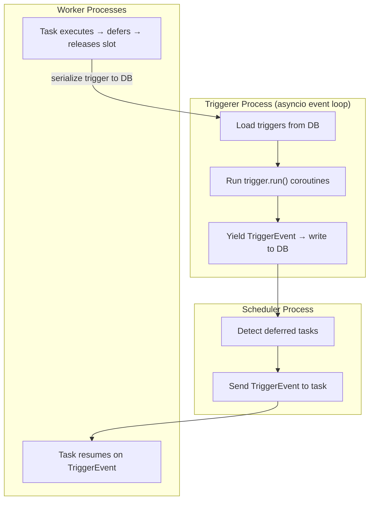

# Airflow Sensors — Senior Deep Dive

## Sensor Internals: How Poke Mode Holds a Worker Slot

Understanding what actually happens at the OS/process level when a sensor runs in poke mode is essential for debugging production issues.

### The Worker Execution Model

Airflow workers (Celery, Kubernetes, LocalExecutor) execute tasks by spawning a **process** per task. That process:
1. Loads the DAG file
2. Instantiates the operator
3. Calls `operator.execute(context)`
4. For sensors: `BaseSensorOperator.execute()` loops calling `poke()` with `time.sleep(poke_interval)` between calls

```python
# Simplified BaseSensorOperator.execute() — the actual loop
def execute(self, context: Context) -> Any:
    started_at = timezone.utcnow()
    
    while True:
        try:
            if self.poke(context):
                break
        except (AirflowSensorTimeout, AirflowTaskTimeout):
            raise
        except Exception as e:
            if self.soft_fail:
                raise AirflowSkipException("Sensor failed softly") from e
            raise
        
        if (timezone.utcnow() - started_at).total_seconds() > self.timeout:
            if self.soft_fail:
                raise AirflowSkipException(f"Sensor timed out after {self.timeout}s")
            raise AirflowSensorTimeout(f"Sensor timed out after {self.timeout}s")
        
        if self.mode == 'reschedule':
            # Write reschedule record to DB, then raise special exception
            # to terminate the worker process. Scheduler will re-queue.
            reschedule_date = timezone.utcnow() + timedelta(seconds=self.poke_interval)
            self._write_sensor_reschedule_record(context, reschedule_date)
            raise AirflowRescheduleException(reschedule_date)
        else:
            # poke mode: sleep in-process, holding the worker slot
            time.sleep(self.poke_interval)
```

### Reschedule Mode — What Actually Happens

In reschedule mode, the sensor raises `AirflowRescheduleException` after each failed poke. This exception:
1. Is caught by the task runner
2. Writes a `TaskReschedule` row to the metadata DB (stores next reschedule time)
3. Marks the task instance as `up_for_reschedule`
4. Terminates the worker process — freeing the slot

The scheduler's main loop then watches for `up_for_reschedule` task instances whose `reschedule_date` has passed and re-queues them.

```sql
-- TaskReschedule table schema (simplified)
CREATE TABLE task_reschedule (
    id              SERIAL PRIMARY KEY,
    task_id         VARCHAR NOT NULL,
    dag_id          VARCHAR NOT NULL,
    run_id          VARCHAR NOT NULL,
    try_number      INTEGER NOT NULL,
    start_date      TIMESTAMP NOT NULL,
    end_date        TIMESTAMP NOT NULL,
    duration        FLOAT NOT NULL,
    reschedule_date TIMESTAMP NOT NULL    -- When to re-queue
);
```

**Performance implication:** Each reschedule cycle creates a row in `task_reschedule`. A sensor that waits 8 hours with a 5-minute `poke_interval` creates 96 reschedule records. For 100 concurrent sensors, that's 9,600 rows. This is manageable but warrants periodic cleanup.

---

## Implementing a Deferrable Sensor with BaseTrigger

Deferrable sensors require two classes: the **sensor** (operator) and the **trigger** (async watcher).

### The Trigger Class

```python
import asyncio
from typing import AsyncIterator, Tuple, Any
from airflow.triggers.base import BaseTrigger, TriggerEvent

class S3ObjectTrigger(BaseTrigger):
    """
    Async trigger that polls S3 until a key exists.
    Runs in the triggerer process using asyncio.
    """

    def __init__(self, bucket: str, key: str, aws_conn_id: str, poll_interval: float = 30.0):
        super().__init__()
        self.bucket = bucket
        self.key = key
        self.aws_conn_id = aws_conn_id
        self.poll_interval = poll_interval

    def serialize(self) -> Tuple[str, dict]:
        """
        Must be serializable — stored in DB when task defers.
        Returns (trigger_class_path, kwargs_dict).
        """
        return (
            "myproject.triggers.S3ObjectTrigger",
            {
                "bucket": self.bucket,
                "key": self.key,
                "aws_conn_id": self.aws_conn_id,
                "poll_interval": self.poll_interval,
            }
        )

    async def run(self) -> AsyncIterator[TriggerEvent]:
        """
        Core async loop. Yields TriggerEvent when condition is met.
        This method runs in the triggerer process, NOT a worker.
        """
        import aiobotocore.session

        session = aiobotocore.session.get_session()

        while True:
            async with session.create_client('s3') as client:
                try:
                    await client.head_object(Bucket=self.bucket, Key=self.key)
                    # Key exists — fire the trigger
                    yield TriggerEvent({"status": "found", "bucket": self.bucket, "key": self.key})
                    return
                except client.exceptions.ClientError as e:
                    if e.response['Error']['Code'] == '404':
                        # Key doesn't exist yet — wait and retry
                        self.log.info("Key %s/%s not found, waiting %ss", self.bucket, self.key, self.poll_interval)
                        await asyncio.sleep(self.poll_interval)
                    else:
                        yield TriggerEvent({"status": "error", "message": str(e)})
                        return
```

### The Deferrable Sensor Operator

```python
from airflow.sensors.base import BaseSensorOperator
from airflow.exceptions import AirflowException

class DeferrableS3KeySensor(BaseSensorOperator):
    """
    Sensor that defers to S3ObjectTrigger instead of holding a worker slot.
    """

    template_fields = ['bucket_key']

    def __init__(self, bucket_name: str, bucket_key: str, aws_conn_id: str = 'aws_default', **kwargs):
        # deferrable=True by convention; actual deferral is in execute()
        super().__init__(**kwargs)
        self.bucket_name = bucket_name
        self.bucket_key = bucket_key
        self.aws_conn_id = aws_conn_id

    def poke(self, context):
        # For non-deferrable fallback, implement standard check
        import boto3
        s3 = boto3.client('s3')
        try:
            s3.head_object(Bucket=self.bucket_name, Key=self.bucket_key)
            return True
        except s3.exceptions.ClientError:
            return False

    def execute(self, context):
        """Override execute to defer instead of polling."""
        # First check if already available (avoid unnecessary deferral)
        if self.poke(context):
            return

        # Defer: release worker slot, hand off to trigger
        self.defer(
            trigger=S3ObjectTrigger(
                bucket=self.bucket_name,
                key=self.bucket_key,
                aws_conn_id=self.aws_conn_id,
                poll_interval=self.poke_interval,
            ),
            method_name='execute_complete',   # Called when trigger fires
            timeout=timedelta(seconds=self.timeout),
        )

    def execute_complete(self, context, event: dict):
        """Called by the triggerer when S3ObjectTrigger fires."""
        if event.get('status') == 'error':
            raise AirflowException(f"S3 sensor failed: {event.get('message')}")
        
        self.log.info(
            "S3 key %s/%s found. Sensor complete.",
            event['bucket'], event['key']
        )
        return event['key']
```

---

## Sensor Fleet Management

In production, you may have dozens to hundreds of sensors running simultaneously. Managing them at fleet scale requires deliberate architecture.

### Sensor-Specific Pools

```python
# airflow/pools.py (or configured via UI/CLI)
# Create a sensor pool with a slot limit independent of the main worker pool

# CLI: airflow pools set sensor_pool 20 "Dedicated pool for long-running sensors"

sensors_in_fleet = [
    S3KeySensor(
        task_id=f'wait_for_region_{region}',
        bucket_name='data-lake',
        bucket_key=f'raw/{region}/{{{{ ds }}}}/data.parquet',
        mode='reschedule',
        pool='sensor_pool',     # Won't compete with compute tasks
        pool_slots=1,
        poke_interval=300,
        timeout=14400,
        dag=dag,
    )
    for region in ['us-east', 'eu-west', 'ap-south']
]
```

### Monitoring Sensor Health

```python
# Custom monitoring: detect stuck sensors before they cause pipeline delays
from airflow.models import TaskInstance
from airflow.utils.state import TaskInstanceState
from sqlalchemy import create_engine, text
from datetime import datetime, timedelta

def alert_on_long_running_sensors(engine, threshold_hours=2):
    """Query for sensors running longer than threshold."""
    query = text("""
        SELECT dag_id, task_id, run_id, start_date,
               EXTRACT(EPOCH FROM (NOW() - start_date)) / 3600 AS hours_running
        FROM task_instance
        WHERE state = 'running'
          AND operator LIKE '%Sensor%'
          AND start_date < NOW() - INTERVAL ':hours hours'
        ORDER BY hours_running DESC
    """)
    
    with engine.connect() as conn:
        result = conn.execute(query, {'hours': threshold_hours})
        stuck = result.fetchall()
    
    if stuck:
        # Send alert
        for row in stuck:
            print(f"ALERT: {row.dag_id}.{row.task_id} has been running {row.hours_running:.1f}h")
```

---

## Production Anti-Patterns

### Anti-Pattern 1: Sensors in the Critical Path Without Timeouts

```python
# BAD: No timeout, runs indefinitely
wait = ExternalTaskSensor(
    task_id='wait',
    external_dag_id='upstream',
    external_task_id='load',
    # timeout not set — default 7 days!
    mode='poke',
)

# GOOD: Explicit timeout, reschedule mode
wait = ExternalTaskSensor(
    task_id='wait',
    external_dag_id='upstream',
    external_task_id='load',
    mode='reschedule',
    poke_interval=300,
    timeout=10800,           # 3 hours — fail if upstream is this late
    failed_states=['failed'],
)
```

### Anti-Pattern 2: Using FileSensor on Remote Storage

```python
# BAD: FileSensor accesses local filesystem; on Kubernetes, each pod has different
# local filesystem. The file may exist on one node but not another.
FileSensor(filepath='/shared/data/export.csv')   # What "local" filesystem?

# GOOD: Use provider-specific sensor for remote storage
S3KeySensor(bucket_name='...', bucket_key='...')
GCSObjectExistenceSensor(bucket='...', object='...')
```

### Anti-Pattern 3: Sensor Timeout Shorter Than poke_interval

```python
# BAD: Sensor will time out before it even gets to poke!
S3KeySensor(
    poke_interval=3600,   # Poke every hour
    timeout=1800,         # Time out after 30 minutes — NEVER RUNS!
)

# timeout must be > poke_interval + time to poke
```

### Anti-Pattern 4: ExternalTaskSensor Without `failed_states`

```python
# BAD: If upstream fails, ExternalTaskSensor waits forever
# (it only checks for 'success' by default)
wait = ExternalTaskSensor(
    external_dag_id='upstream',
    external_task_id='load',
    allowed_states=['success'],
    # No failed_states — will keep waiting if upstream fails!
)

# GOOD: Fail fast if upstream fails
wait = ExternalTaskSensor(
    external_dag_id='upstream',
    external_task_id='load',
    allowed_states=['success'],
    failed_states=['failed', 'skipped'],   # Propagate failures
)
```

### Anti-Pattern 5: poke() With Side Effects

```python
# BAD: poke() modifies state — if it's called N times, N side effects
class BadSensor(BaseSensorOperator):
    def poke(self, context):
        # DON'T DO THIS — poke() is called repeatedly!
        db.execute("INSERT INTO sensor_log VALUES (...)")
        return check_condition()

# GOOD: poke() is idempotent; side effects go in execute() after success
class GoodSensor(BaseSensorOperator):
    def poke(self, context):
        return check_condition()   # Pure check, no side effects

    def execute(self, context):
        super().execute(context)    # Runs poke loop
        # Post-success side effects here, called exactly once
        db.execute("INSERT INTO sensor_log VALUES (...)")
```

---

## Triggerer Process Architecture

The triggerer is a separate Airflow component introduced in 2.2:



**Triggerer capacity:** A single triggerer can manage thousands of concurrent triggers (limited by I/O and asyncio overhead, not OS threads). The triggerer is horizontally scalable — run multiple triggerer instances for high availability.

**Trigger serialization:** When a task defers, its trigger is serialized (via `trigger.serialize()`) and stored in the `trigger` table in the metadata DB. When the triggerer starts or a trigger completes, it reads/writes this table.

```sql
-- Trigger table
CREATE TABLE trigger (
    id            SERIAL PRIMARY KEY,
    classpath     VARCHAR NOT NULL,    -- "myproject.triggers.S3ObjectTrigger"
    kwargs        JSON NOT NULL,       -- Deserialization arguments
    created_date  TIMESTAMP NOT NULL,
    triggerer_id  INTEGER             -- Which triggerer process owns this
);
```

---

## Interview Tips

> **Tip 1:** "Walk me through what happens when a sensor uses reschedule mode." — "The sensor's poke() is called. If it returns False, the sensor writes a TaskReschedule record to the metadata DB with the next wake-up time, then raises AirflowRescheduleException. The worker process terminates, freeing the slot. The scheduler detects the reschedule_date has passed and re-queues the task as a fresh task instance, which picks up where it left off."

> **Tip 2:** "How does a deferrable sensor differ from reschedule mode?" — "Reschedule mode still uses a worker process during each poke call. Deferrable sensors release the worker entirely — the waiting is handled by an async trigger in the triggerer process, which can manage thousands of concurrent triggers with a tiny footprint. Deferrable sensors also support true async I/O, making them much more efficient for I/O-bound waiting."

> **Tip 3:** "What are production anti-patterns with sensors?" — "The big ones: no timeout (default 7 days blocks slots), poke mode for long waits (deadlock risk), FileSensor on remote storage (doesn't work on Kubernetes), not setting failed_states on ExternalTaskSensor (waits forever if upstream fails), and poke() methods with side effects (called N times, creates N side effects)."

## ⚡ Cheat Sheet

**Sensor Mode Comparison**
| Mode | Slots During Wait | When to Use |
|---|---|---|
| `poke` | Held entire duration | Short waits (< 5 min) |
| `reschedule` | Released between polls | Long waits (minutes–hours) |
| Deferrable | ~0 (async trigger) | Anything; most efficient |

**Reschedule Mode Mechanics**
1. `poke()` returns False → write `TaskReschedule` row to DB with `reschedule_date`
2. Raise `AirflowRescheduleException` → worker process terminates, slot freed
3. Scheduler watches for `up_for_reschedule` tasks past their `reschedule_date` → re-queue
- Each reschedule = 1 DB row; 8h wait × 5min interval = 96 rows per sensor instance

**Deferrable Sensor vs Reschedule Mode**
- Reschedule: worker process still used during each poke call
- Deferrable: NO worker during wait; triggerer process (asyncio) handles polling
- Deferrable supports true async I/O (`aiobotocore`, async DB clients)

**Trigger Class Requirements**
```python
def serialize(self) -> tuple:
    return ('myproject.triggers.MyTrigger', {'key': self.key, ...})
    # Must be JSON-serializable — stored in metadata DB

async def run(self) -> AsyncIterator[TriggerEvent]:
    while True:
        if await self._check(): yield TriggerEvent({...}); return
        await asyncio.sleep(self.poll_interval)  # non-blocking
```

**Production Anti-Patterns Checklist**
- ❌ No timeout: default 7 days → blocks slots, never fails
- ❌ `poke` mode for > 5 min waits → deadlock risk under load
- ❌ `FileSensor` on remote storage in Kubernetes → each pod has different local FS
- ❌ No `failed_states` on `ExternalTaskSensor` → waits forever if upstream fails
- ❌ `poke()` with side effects → called N times → N side effects

**Correct ExternalTaskSensor**
```python
ExternalTaskSensor(
    mode='reschedule', poke_interval=300, timeout=10800,
    allowed_states=['success'],
    failed_states=['failed', 'skipped'],  # required!
)
```

**Triggerer Architecture**
- Single asyncio event loop; scales to 1000s of concurrent triggers
- `default_capacity = 1000`; run multiple triggerer pods for HA
- Trigger stored in `trigger` table; `classpath` + `kwargs` columns for deserialization

**`poke_interval` vs `timeout` Rule**
- `timeout` MUST be > `poke_interval` + single poke duration
- If `poke_interval=3600` and `timeout=1800` → sensor times out before first poke
